<!-- markdownlint-capture -->
<!-- markdownlint-disable -->

# Code Metrics

This file is dynamically maintained by a bot, *please do not* edit this by hand. It represents various [code metrics](https://aka.ms/dotnet/code-metrics), such as cyclomatic complexity, maintainability index, and so on.

<div id='myjetwallet-fireblocks-client'></div>

## MyJetWallet.Fireblocks.Client :exploding_head:

The *MyJetWallet.Fireblocks.Client.csproj* project file contains:

- 6 namespaces.
- 161 named types.
- 11,893 total lines of source code.
- Approximately 5,316 lines of executable code.
- The highest cyclomatic complexity is 21 :exploding_head:.

<details>
<summary>
  <strong id="myjetwallet-fireblocks-client-auth">
    MyJetWallet.Fireblocks.Client.Auth :warning:
  </strong>
</summary>
<br>

The `MyJetWallet.Fireblocks.Client.Auth` namespace contains 5 named types.

- 5 named types.
- 196 total lines of source code.
- Approximately 68 lines of executable code.
- The highest cyclomatic complexity is 8 :warning:.

<details>
<summary>
  <strong id="apikeyheadergenerator">
    ApiKeyHeaderGenerator :heavy_check_mark:
  </strong>
</summary>
<br>

- The `ApiKeyHeaderGenerator` contains 11 members.
- 46 total lines of source code.
- Approximately 17 lines of executable code.
- The highest cyclomatic complexity is 2 :heavy_check_mark:.

| Member kind | Line number | Maintainability index | Cyclomatic complexity | Depth of inheritance | Class coupling | Lines of source / executable code |
| :-: | :-: | :-: | :-: | :-: | :-: | :-: |
| Field | <a href='https://github.com/MyJetWallet/MyJetWallet.Fireblocks.Client/blob/master/src/MyJetWallet.Fireblocks.Client/Auth/ApiKeyHeaderGenerator.cs#L14' title='ClientConfigurator ApiKeyHeaderGenerator._configuration'>14</a> | 100 | 0 :heavy_check_mark: | 0 | 1 | 1 / 0 |
| Field | <a href='https://github.com/MyJetWallet/MyJetWallet.Fireblocks.Client/blob/master/src/MyJetWallet.Fireblocks.Client/Auth/ApiKeyHeaderGenerator.cs#L15' title='JwtTokenGenerator ApiKeyHeaderGenerator._jwtTokenGenerator'>15</a> | 100 | 0 :heavy_check_mark: | 0 | 1 | 1 / 0 |
| Field | <a href='https://github.com/MyJetWallet/MyJetWallet.Fireblocks.Client/blob/master/src/MyJetWallet.Fireblocks.Client/Auth/ApiKeyHeaderGenerator.cs#L16' title='KeyActivator ApiKeyHeaderGenerator._keyActivator'>16</a> | 100 | 0 :heavy_check_mark: | 0 | 1 | 1 / 0 |
| Field | <a href='https://github.com/MyJetWallet/MyJetWallet.Fireblocks.Client/blob/master/src/MyJetWallet.Fireblocks.Client/Auth/ApiKeyHeaderGenerator.cs#L17' title='CancellationTokenSource ApiKeyHeaderGenerator._tokenSource'>17</a> | 100 | 0 :heavy_check_mark: | 0 | 1 | 1 / 0 |
| Method | <a href='https://github.com/MyJetWallet/MyJetWallet.Fireblocks.Client/blob/master/src/MyJetWallet.Fireblocks.Client/Auth/ApiKeyHeaderGenerator.cs#L19' title='ApiKeyHeaderGenerator.ApiKeyHeaderGenerator(ClientConfigurator configuration, JwtTokenGenerator jwtTokenGenerator, KeyActivator keyActivator)'>19</a> | 75 | 1 :heavy_check_mark: | 0 | 4 | 7 / 4 |
| Method | <a href='https://github.com/MyJetWallet/MyJetWallet.Fireblocks.Client/blob/master/src/MyJetWallet.Fireblocks.Client/Auth/ApiKeyHeaderGenerator.cs#L27' title='void ApiKeyHeaderGenerator.AddCredentials(HttpRequestMessage msg)'>27</a> | 73 | 2 :heavy_check_mark: | 0 | 8 | 8 / 4 |
| Method | <a href='https://github.com/MyJetWallet/MyJetWallet.Fireblocks.Client/blob/master/src/MyJetWallet.Fireblocks.Client/Auth/ApiKeyHeaderGenerator.cs#L36' title='Task ApiKeyHeaderGenerator.AddCredentialsAsync(HttpRequestMessage msg)'>36</a> | 93 | 1 :heavy_check_mark: | 0 | 3 | 5 / 2 |
| Field | <a href='https://github.com/MyJetWallet/MyJetWallet.Fireblocks.Client/blob/master/src/MyJetWallet.Fireblocks.Client/Auth/ApiKeyHeaderGenerator.cs#L11' title='string ApiKeyHeaderGenerator.ApiKeyHeader'>11</a> | 93 | 0 :heavy_check_mark: | 0 | 0 | 1 / 1 |
| Method | <a href='https://github.com/MyJetWallet/MyJetWallet.Fireblocks.Client/blob/master/src/MyJetWallet.Fireblocks.Client/Auth/ApiKeyHeaderGenerator.cs#L42' title='void ApiKeyHeaderGenerator.Dispose(bool disposing)'>42</a> | 84 | 2 :heavy_check_mark: | 0 | 2 | 6 / 3 |
| Method | <a href='https://github.com/MyJetWallet/MyJetWallet.Fireblocks.Client/blob/master/src/MyJetWallet.Fireblocks.Client/Auth/ApiKeyHeaderGenerator.cs#L49' title='void ApiKeyHeaderGenerator.Dispose()'>49</a> | 93 | 1 :heavy_check_mark: | 0 | 1 | 5 / 2 |
| Field | <a href='https://github.com/MyJetWallet/MyJetWallet.Fireblocks.Client/blob/master/src/MyJetWallet.Fireblocks.Client/Auth/ApiKeyHeaderGenerator.cs#L12' title='string ApiKeyHeaderGenerator.JwtScheme'>12</a> | 93 | 0 :heavy_check_mark: | 0 | 0 | 1 / 1 |

<a href="#ApiKeyHeaderGenerator-class-diagram">:link: to `ApiKeyHeaderGenerator` class diagram</a>

<a href="#myjetwallet-fireblocks-client-auth">:top: back to MyJetWallet.Fireblocks.Client.Auth</a>

</details>

<details>
<summary>
  <strong id="hexextensions">
    HexExtensions :warning:
  </strong>
</summary>
<br>

- The `HexExtensions` contains 2 members.
- 41 total lines of source code.
- Approximately 17 lines of executable code.
- The highest cyclomatic complexity is 8 :warning:.

| Member kind | Line number | Maintainability index | Cyclomatic complexity | Depth of inheritance | Class coupling | Lines of source / executable code |
| :-: | :-: | :-: | :-: | :-: | :-: | :-: |
| Method | <a href='https://github.com/MyJetWallet/MyJetWallet.Fireblocks.Client/blob/master/src/MyJetWallet.Fireblocks.Client/Auth/HexExtensions.cs#L23' title='byte[] HexExtensions.HexToBytes(string str)'>23</a> | 58 | 8 :warning: | 0 | 1 | 20 / 10 |
| Method | <a href='https://github.com/MyJetWallet/MyJetWallet.Fireblocks.Client/blob/master/src/MyJetWallet.Fireblocks.Client/Auth/HexExtensions.cs#L5' title='string HexExtensions.ToHex(byte[] bytes)'>5</a> | 63 | 4 :heavy_check_mark: | 0 | 1 | 17 / 7 |

<a href="#HexExtensions-class-diagram">:link: to `HexExtensions` class diagram</a>

<a href="#myjetwallet-fireblocks-client-auth">:top: back to MyJetWallet.Fireblocks.Client.Auth</a>

</details>

<details>
<summary>
  <strong id="jwttokengenerator">
    JwtTokenGenerator :heavy_check_mark:
  </strong>
</summary>
<br>

- The `JwtTokenGenerator` contains 10 members.
- 80 total lines of source code.
- Approximately 31 lines of executable code.
- The highest cyclomatic complexity is 3 :heavy_check_mark:.

| Member kind | Line number | Maintainability index | Cyclomatic complexity | Depth of inheritance | Class coupling | Lines of source / executable code |
| :-: | :-: | :-: | :-: | :-: | :-: | :-: |
| Field | <a href='https://github.com/MyJetWallet/MyJetWallet.Fireblocks.Client/blob/master/src/MyJetWallet.Fireblocks.Client/Auth/JwtTokenGenerator.cs#L13' title='ClientConfigurator JwtTokenGenerator._fireblocksConfiguration'>13</a> | 100 | 0 :heavy_check_mark: | 0 | 1 | 1 / 0 |
| Field | <a href='https://github.com/MyJetWallet/MyJetWallet.Fireblocks.Client/blob/master/src/MyJetWallet.Fireblocks.Client/Auth/JwtTokenGenerator.cs#L14' title='KeyActivator JwtTokenGenerator._keyActivator'>14</a> | 100 | 0 :heavy_check_mark: | 0 | 1 | 1 / 0 |
| Field | <a href='https://github.com/MyJetWallet/MyJetWallet.Fireblocks.Client/blob/master/src/MyJetWallet.Fireblocks.Client/Auth/JwtTokenGenerator.cs#L16' title='RSA JwtTokenGenerator._rsa'>16</a> | 100 | 0 :heavy_check_mark: | 0 | 1 | 1 / 0 |
| Field | <a href='https://github.com/MyJetWallet/MyJetWallet.Fireblocks.Client/blob/master/src/MyJetWallet.Fireblocks.Client/Auth/JwtTokenGenerator.cs#L15' title='SigningCredentials JwtTokenGenerator._signingCredentials'>15</a> | 100 | 0 :heavy_check_mark: | 0 | 1 | 1 / 0 |
| Method | <a href='https://github.com/MyJetWallet/MyJetWallet.Fireblocks.Client/blob/master/src/MyJetWallet.Fireblocks.Client/Auth/JwtTokenGenerator.cs#L18' title='JwtTokenGenerator.JwtTokenGenerator(ClientConfigurator configuration, KeyActivator keyActivator)'>18</a> | 71 | 2 :heavy_check_mark: | 0 | 4 | 11 / 5 |
| Method | <a href='https://github.com/MyJetWallet/MyJetWallet.Fireblocks.Client/blob/master/src/MyJetWallet.Fireblocks.Client/Auth/JwtTokenGenerator.cs#L49' title='void JwtTokenGenerator.Activate(object sender, string apiKey, string privateKey)'>49</a> | 63 | 2 :heavy_check_mark: | 0 | 8 | 18 / 10 |
| Method | <a href='https://github.com/MyJetWallet/MyJetWallet.Fireblocks.Client/blob/master/src/MyJetWallet.Fireblocks.Client/Auth/JwtTokenGenerator.cs#L85' title='void JwtTokenGenerator.Dispose()'>85</a> | 85 | 1 :heavy_check_mark: | 0 | 4 | 5 / 2 |
| Method | <a href='https://github.com/MyJetWallet/MyJetWallet.Fireblocks.Client/blob/master/src/MyJetWallet.Fireblocks.Client/Auth/JwtTokenGenerator.cs#L68' title='string JwtTokenGenerator.GenerateJwtToken(HttpRequestMessage msg)'>68</a> | 72 | 2 :heavy_check_mark: | 0 | 10 | 10 / 5 |
| Method | <a href='https://github.com/MyJetWallet/MyJetWallet.Fireblocks.Client/blob/master/src/MyJetWallet.Fireblocks.Client/Auth/JwtTokenGenerator.cs#L30' title='JwtPayload JwtTokenGenerator.GetPayload(HttpRequestMessage msg)'>30</a> | 66 | 3 :heavy_check_mark: | 0 | 4 | 18 / 7 |
| Method | <a href='https://github.com/MyJetWallet/MyJetWallet.Fireblocks.Client/blob/master/src/MyJetWallet.Fireblocks.Client/Auth/JwtTokenGenerator.cs#L79' title='string JwtTokenGenerator.GetSignature(string preHash)'>79</a> | 88 | 1 :heavy_check_mark: | 0 | 1 | 5 / 2 |

<a href="#JwtTokenGenerator-class-diagram">:link: to `JwtTokenGenerator` class diagram</a>

<a href="#myjetwallet-fireblocks-client-auth">:top: back to MyJetWallet.Fireblocks.Client.Auth</a>

</details>

<details>
<summary>
  <strong id="keyactivator-keyactivationeventnthandler">
    KeyActivator.KeyActivationEventntHandler :question:
  </strong>
</summary>
<br>

- The `KeyActivator.KeyActivationEventntHandler` contains 0 members.
- 1 total lines of source code.
- Approximately 0 lines of executable code.
- The highest cyclomatic complexity is 0 :question:.

| Member kind | Line number | Maintainability index | Cyclomatic complexity | Depth of inheritance | Class coupling | Lines of source / executable code |
| :-: | :-: | :-: | :-: | :-: | :-: | :-: |

<a href="#KeyActivator.KeyActivationEventntHandler-class-diagram">:link: to `KeyActivator.KeyActivationEventntHandler` class diagram</a>

<a href="#myjetwallet-fireblocks-client-auth">:top: back to MyJetWallet.Fireblocks.Client.Auth</a>

</details>

<details>
<summary>
  <strong id="keyactivator">
    KeyActivator :heavy_check_mark:
  </strong>
</summary>
<br>

- The `KeyActivator` contains 4 members.
- 17 total lines of source code.
- Approximately 3 lines of executable code.
- The highest cyclomatic complexity is 2 :heavy_check_mark:.

| Member kind | Line number | Maintainability index | Cyclomatic complexity | Depth of inheritance | Class coupling | Lines of source / executable code |
| :-: | :-: | :-: | :-: | :-: | :-: | :-: |
| Method | <a href='https://github.com/MyJetWallet/MyJetWallet.Fireblocks.Client/blob/master/src/MyJetWallet.Fireblocks.Client/Auth/KeyActivator.cs#L12' title='KeyActivator.KeyActivator()'>12</a> | 100 | 1 :heavy_check_mark: | 0 | 0 | 3 / 0 |
| Method | <a href='https://github.com/MyJetWallet/MyJetWallet.Fireblocks.Client/blob/master/src/MyJetWallet.Fireblocks.Client/Auth/KeyActivator.cs#L16' title='void KeyActivator.ActivateKeys(string apiKey, string privateKey)'>16</a> | 84 | 1 :heavy_check_mark: | 0 | 1 | 5 / 2 |
| Property | <a href='https://github.com/MyJetWallet/MyJetWallet.Fireblocks.Client/blob/master/src/MyJetWallet.Fireblocks.Client/Auth/KeyActivator.cs#L11' title='bool KeyActivator.IsActivated'>11</a> | 100 | 2 :heavy_check_mark: | 0 | 0 | 1 / 1 |
| Event | <a href='https://github.com/MyJetWallet/MyJetWallet.Fireblocks.Client/blob/master/src/MyJetWallet.Fireblocks.Client/Auth/KeyActivator.cs#L24' title='event KeyActivationEventntHandler KeyActivator.KeyActivatedEvent'>24</a> | 100 | 0 :heavy_check_mark: | 0 | 1 | 1 / 0 |

<a href="#KeyActivator-class-diagram">:link: to `KeyActivator` class diagram</a>

<a href="#myjetwallet-fireblocks-client-auth">:top: back to MyJetWallet.Fireblocks.Client.Auth</a>

</details>

</details>

<details>
<summary>
  <strong id="myjetwallet-fireblocks-client-autofac">
    MyJetWallet.Fireblocks.Client.Autofac :heavy_check_mark:
  </strong>
</summary>
<br>

The `MyJetWallet.Fireblocks.Client.Autofac` namespace contains 1 named types.

- 1 named types.
- 106 total lines of source code.
- Approximately 21 lines of executable code.
- The highest cyclomatic complexity is 5 :heavy_check_mark:.

<details>
<summary>
  <strong id="autofachelper">
    AutofacHelper :heavy_check_mark:
  </strong>
</summary>
<br>

- The `AutofacHelper` contains 1 members.
- 103 total lines of source code.
- Approximately 21 lines of executable code.
- The highest cyclomatic complexity is 5 :heavy_check_mark:.

| Member kind | Line number | Maintainability index | Cyclomatic complexity | Depth of inheritance | Class coupling | Lines of source / executable code |
| :-: | :-: | :-: | :-: | :-: | :-: | :-: |
| Method | <a href='https://github.com/MyJetWallet/MyJetWallet.Fireblocks.Client/blob/master/src/MyJetWallet.Fireblocks.Client/Autofac/AutofacHelper.cs#L12' title='void AutofacHelper.RegisterFireblocksClient(ContainerBuilder builder, ClientConfigurator clientConfigurator, params DelegatingHandler[] handlers)'>12</a> | 53 | 5 :heavy_check_mark: | 0 | 22 | 100 / 21 |

<a href="#AutofacHelper-class-diagram">:link: to `AutofacHelper` class diagram</a>

<a href="#myjetwallet-fireblocks-client-autofac">:top: back to MyJetWallet.Fireblocks.Client.Autofac</a>

</details>

</details>

<details>
<summary>
  <strong id="myjetwallet-fireblocks-client">
    MyJetWallet.Fireblocks.Client :exploding_head:
  </strong>
</summary>
<br>

The `MyJetWallet.Fireblocks.Client` namespace contains 151 named types.

- 151 named types.
- 11,509 total lines of source code.
- Approximately 5,211 lines of executable code.
- The highest cyclomatic complexity is 21 :exploding_head:.

<details>
<summary>
  <strong id="accountsclient">
    AccountsClient :exploding_head:
  </strong>
</summary>
<br>

- The `AccountsClient` contains 23 members.
- 1,025 total lines of source code.
- Approximately 473 lines of executable code.
- The highest cyclomatic complexity is 15 :exploding_head:.

| Member kind | Line number | Maintainability index | Cyclomatic complexity | Depth of inheritance | Class coupling | Lines of source / executable code |
| :-: | :-: | :-: | :-: | :-: | :-: | :-: |
| Field | <a href='https://github.com/MyJetWallet/MyJetWallet.Fireblocks.Client/blob/master/src/MyJetWallet.Fireblocks.Client/ApiClients.cs#L1043' title='HttpClient AccountsClient._httpClient'>1,043</a> | 100 | 0 :heavy_check_mark: | 0 | 1 | 1 / 0 |
| Field | <a href='https://github.com/MyJetWallet/MyJetWallet.Fireblocks.Client/blob/master/src/MyJetWallet.Fireblocks.Client/ApiClients.cs#L1044' title='Lazy<JsonSerializerSettings> AccountsClient._settings'>1,044</a> | 100 | 0 :heavy_check_mark: | 0 | 2 | 1 / 0 |
| Method | <a href='https://github.com/MyJetWallet/MyJetWallet.Fireblocks.Client/blob/master/src/MyJetWallet.Fireblocks.Client/ApiClients.cs#L1046' title='AccountsClient.AccountsClient(ClientConfigurator configuration, HttpClient httpClient)'>1,046</a> | 85 | 1 :heavy_check_mark: | 0 | 8 | 5 / 2 |
| Method | <a href='https://github.com/MyJetWallet/MyJetWallet.Fireblocks.Client/blob/master/src/MyJetWallet.Fireblocks.Client/ApiClients.cs#L1541' title='Task<Response<List<VaultWalletAddress>>> AccountsClient.AddressesGetAsync(string vaultAccountId, string assetId, CancellationToken cancellationToken = null)'>1,541</a> | 44 | 12 :x: | 0 | 20 | 81 / 38 |
| Method | <a href='https://github.com/MyJetWallet/MyJetWallet.Fireblocks.Client/blob/master/src/MyJetWallet.Fireblocks.Client/ApiClients.cs#L1623' title='Task<Response<CreateAddressResponse>> AccountsClient.AddressesPostAsync(string idempotencyKey, string vaultAccountId, string assetId, Body6 body = null, CancellationToken cancellationToken = null)'>1,623</a> | 42 | 12 :x: | 0 | 23 | 86 / 43 |
| Method | <a href='https://github.com/MyJetWallet/MyJetWallet.Fireblocks.Client/blob/master/src/MyJetWallet.Fireblocks.Client/ApiClients.cs#L1711' title='Task<Response> AccountsClient.AddressesPutAsync(string vaultAccountId, string assetId, string addressId, Body7 body = null, CancellationToken cancellationToken = null)'>1,711</a> | 43 | 12 :x: | 0 | 22 | 83 / 40 |
| Method | <a href='https://github.com/MyJetWallet/MyJetWallet.Fireblocks.Client/blob/master/src/MyJetWallet.Fireblocks.Client/ApiClients.cs#L2020' title='string AccountsClient.ConvertToString(object value, CultureInfo cultureInfo)'>2,020</a> | 52 | 12 :x: | 0 | 7 | 44 / 22 |
| Method | <a href='https://github.com/MyJetWallet/MyJetWallet.Fireblocks.Client/blob/master/src/MyJetWallet.Fireblocks.Client/ApiClients.cs#L1052' title='JsonSerializerSettings AccountsClient.CreateSerializerSettings()'>1,052</a> | 89 | 1 :heavy_check_mark: | 0 | 1 | 6 / 3 |
| Method | <a href='https://github.com/MyJetWallet/MyJetWallet.Fireblocks.Client/blob/master/src/MyJetWallet.Fireblocks.Client/ApiClients.cs#L1072' title='Task<Response> AccountsClient.HideAsync(string vaultAccountId, CancellationToken cancellationToken = null)'>1,072</a> | 46 | 10 :radioactive: | 0 | 19 | 71 / 33 |
| Property | <a href='https://github.com/MyJetWallet/MyJetWallet.Fireblocks.Client/blob/master/src/MyJetWallet.Fireblocks.Client/ApiClients.cs#L1059' title='JsonSerializerSettings AccountsClient.JsonSerializerSettings'>1,059</a> | 100 | 1 :heavy_check_mark: | 0 | 5 | 1 / 1 |
| Method | <a href='https://github.com/MyJetWallet/MyJetWallet.Fireblocks.Client/blob/master/src/MyJetWallet.Fireblocks.Client/ApiClients.cs#L1217' title='Task<Response<CreateTransactionResponse>> AccountsClient.Lock_allocationAsync(string vaultAccountId, string assetId, AllocateFundsRequest body = null, CancellationToken cancellationToken = null)'>1,217</a> | 42 | 12 :x: | 0 | 23 | 84 / 42 |
| Method | <a href='https://github.com/MyJetWallet/MyJetWallet.Fireblocks.Client/blob/master/src/MyJetWallet.Fireblocks.Client/ApiClients.cs#L1064' title='void AccountsClient.PrepareRequest(HttpClient client, HttpRequestMessage request, string url)'>1,064</a> | 100 | 1 :heavy_check_mark: | 0 | 5 | 1 / 0 |
| Method | <a href='https://github.com/MyJetWallet/MyJetWallet.Fireblocks.Client/blob/master/src/MyJetWallet.Fireblocks.Client/ApiClients.cs#L1065' title='void AccountsClient.PrepareRequest(HttpClient client, HttpRequestMessage request, StringBuilder urlBuilder)'>1,065</a> | 100 | 1 :heavy_check_mark: | 0 | 7 | 1 / 0 |
| Method | <a href='https://github.com/MyJetWallet/MyJetWallet.Fireblocks.Client/blob/master/src/MyJetWallet.Fireblocks.Client/ApiClients.cs#L1066' title='void AccountsClient.ProcessResponse(HttpClient client, HttpResponseMessage response)'>1,066</a> | 100 | 1 :heavy_check_mark: | 0 | 5 | 1 / 0 |
| Method | <a href='https://github.com/MyJetWallet/MyJetWallet.Fireblocks.Client/blob/master/src/MyJetWallet.Fireblocks.Client/ApiClients.cs#L1874' title='Task<Response<PublicKeyInformation>> AccountsClient.Public_key_infoAsync(string vaultAccountId, string assetId, decimal change, decimal addressIndex, bool? compressed = null, CancellationToken cancellationToken = null)'>1,874</a> | 40 | 15 :exploding_head: | 0 | 21 | 92 / 46 |
| Method | <a href='https://github.com/MyJetWallet/MyJetWallet.Fireblocks.Client/blob/master/src/MyJetWallet.Fireblocks.Client/ApiClients.cs#L1978' title='Task<ObjectResponseResult<T>> AccountsClient.ReadObjectResponseAsync<T>(HttpResponseMessage response, IReadOnlyDictionary<string, IEnumerable<string>> headers, CancellationToken cancellationToken)'>1,978</a> | 55 | 4 :heavy_check_mark: | 0 | 20 | 41 / 16 |
| Property | <a href='https://github.com/MyJetWallet/MyJetWallet.Fireblocks.Client/blob/master/src/MyJetWallet.Fireblocks.Client/ApiClients.cs#L1976' title='bool AccountsClient.ReadResponseAsString'>1,976</a> | 100 | 2 :heavy_check_mark: | 0 | 0 | 1 / 0 |
| Method | <a href='https://github.com/MyJetWallet/MyJetWallet.Fireblocks.Client/blob/master/src/MyJetWallet.Fireblocks.Client/ApiClients.cs#L1302' title='Task<Response<CreateTransactionResponse>> AccountsClient.Release_allocationAsync(string vaultAccountId, string assetId, DeallocateFundsRequest body = null, CancellationToken cancellationToken = null)'>1,302</a> | 42 | 12 :x: | 0 | 23 | 84 / 42 |
| Method | <a href='https://github.com/MyJetWallet/MyJetWallet.Fireblocks.Client/blob/master/src/MyJetWallet.Fireblocks.Client/ApiClients.cs#L1463' title='Task<Response> AccountsClient.Set_auto_fuelAsync(string vaultAccountId, Body4 body, CancellationToken cancellationToken = null)'>1,463</a> | 44 | 11 :radioactive: | 0 | 22 | 76 / 36 |
| Method | <a href='https://github.com/MyJetWallet/MyJetWallet.Fireblocks.Client/blob/master/src/MyJetWallet.Fireblocks.Client/ApiClients.cs#L1386' title='Task<Response> AccountsClient.Set_customer_ref_idAsync(string vaultAccountId, Body3 body, CancellationToken cancellationToken = null)'>1,386</a> | 44 | 11 :radioactive: | 0 | 22 | 76 / 36 |
| Method | <a href='https://github.com/MyJetWallet/MyJetWallet.Fireblocks.Client/blob/master/src/MyJetWallet.Fireblocks.Client/ApiClients.cs#L1144' title='Task<Response> AccountsClient.UnhideAsync(string vaultAccountId, CancellationToken cancellationToken = null)'>1,144</a> | 46 | 10 :radioactive: | 0 | 19 | 71 / 33 |
| Method | <a href='https://github.com/MyJetWallet/MyJetWallet.Fireblocks.Client/blob/master/src/MyJetWallet.Fireblocks.Client/ApiClients.cs#L1794' title='Task<Response<List<UnspentInputsData>>> AccountsClient.Unspent_inputsAsync(string vaultAccountId, string assetId, CancellationToken cancellationToken = null)'>1,794</a> | 44 | 12 :x: | 0 | 20 | 81 / 38 |
| Method | <a href='https://github.com/MyJetWallet/MyJetWallet.Fireblocks.Client/blob/master/src/MyJetWallet.Fireblocks.Client/ApiClients.cs#L1061' title='void AccountsClient.UpdateJsonSerializerSettings(JsonSerializerSettings settings)'>1,061</a> | 100 | 1 :heavy_check_mark: | 0 | 3 | 1 / 0 |

<a href="#AccountsClient-class-diagram">:link: to `AccountsClient` class diagram</a>

<a href="#myjetwallet-fireblocks-client">:top: back to MyJetWallet.Fireblocks.Client</a>

</details>

<details>
<summary>
  <strong id="addressesclient">
    AddressesClient :x:
  </strong>
</summary>
<br>

- The `AddressesClient` contains 14 members.
- 304 total lines of source code.
- Approximately 127 lines of executable code.
- The highest cyclomatic complexity is 13 :x:.

| Member kind | Line number | Maintainability index | Cyclomatic complexity | Depth of inheritance | Class coupling | Lines of source / executable code |
| :-: | :-: | :-: | :-: | :-: | :-: | :-: |
| Field | <a href='https://github.com/MyJetWallet/MyJetWallet.Fireblocks.Client/blob/master/src/MyJetWallet.Fireblocks.Client/ApiClients.cs#L2092' title='HttpClient AddressesClient._httpClient'>2,092</a> | 100 | 0 :heavy_check_mark: | 0 | 1 | 1 / 0 |
| Field | <a href='https://github.com/MyJetWallet/MyJetWallet.Fireblocks.Client/blob/master/src/MyJetWallet.Fireblocks.Client/ApiClients.cs#L2093' title='Lazy<JsonSerializerSettings> AddressesClient._settings'>2,093</a> | 100 | 0 :heavy_check_mark: | 0 | 2 | 1 / 0 |
| Method | <a href='https://github.com/MyJetWallet/MyJetWallet.Fireblocks.Client/blob/master/src/MyJetWallet.Fireblocks.Client/ApiClients.cs#L2095' title='AddressesClient.AddressesClient(ClientConfigurator configuration, HttpClient httpClient)'>2,095</a> | 85 | 1 :heavy_check_mark: | 0 | 8 | 5 / 2 |
| Method | <a href='https://github.com/MyJetWallet/MyJetWallet.Fireblocks.Client/blob/master/src/MyJetWallet.Fireblocks.Client/ApiClients.cs#L2348' title='string AddressesClient.ConvertToString(object value, CultureInfo cultureInfo)'>2,348</a> | 52 | 12 :x: | 0 | 7 | 44 / 22 |
| Method | <a href='https://github.com/MyJetWallet/MyJetWallet.Fireblocks.Client/blob/master/src/MyJetWallet.Fireblocks.Client/ApiClients.cs#L2210' title='Task<Response<CreateAddressResponse>> AddressesClient.Create_legacyAsync(string vaultAccountId, string assetId, string addressId, CancellationToken cancellationToken = null)'>2,210</a> | 42 | 13 :x: | 0 | 20 | 87 / 41 |
| Method | <a href='https://github.com/MyJetWallet/MyJetWallet.Fireblocks.Client/blob/master/src/MyJetWallet.Fireblocks.Client/ApiClients.cs#L2101' title='JsonSerializerSettings AddressesClient.CreateSerializerSettings()'>2,101</a> | 89 | 1 :heavy_check_mark: | 0 | 1 | 6 / 3 |
| Property | <a href='https://github.com/MyJetWallet/MyJetWallet.Fireblocks.Client/blob/master/src/MyJetWallet.Fireblocks.Client/ApiClients.cs#L2108' title='JsonSerializerSettings AddressesClient.JsonSerializerSettings'>2,108</a> | 100 | 1 :heavy_check_mark: | 0 | 5 | 1 / 1 |
| Method | <a href='https://github.com/MyJetWallet/MyJetWallet.Fireblocks.Client/blob/master/src/MyJetWallet.Fireblocks.Client/ApiClients.cs#L2113' title='void AddressesClient.PrepareRequest(HttpClient client, HttpRequestMessage request, string url)'>2,113</a> | 100 | 1 :heavy_check_mark: | 0 | 5 | 1 / 0 |
| Method | <a href='https://github.com/MyJetWallet/MyJetWallet.Fireblocks.Client/blob/master/src/MyJetWallet.Fireblocks.Client/ApiClients.cs#L2114' title='void AddressesClient.PrepareRequest(HttpClient client, HttpRequestMessage request, StringBuilder urlBuilder)'>2,114</a> | 100 | 1 :heavy_check_mark: | 0 | 7 | 1 / 0 |
| Method | <a href='https://github.com/MyJetWallet/MyJetWallet.Fireblocks.Client/blob/master/src/MyJetWallet.Fireblocks.Client/ApiClients.cs#L2115' title='void AddressesClient.ProcessResponse(HttpClient client, HttpResponseMessage response)'>2,115</a> | 100 | 1 :heavy_check_mark: | 0 | 5 | 1 / 0 |
| Method | <a href='https://github.com/MyJetWallet/MyJetWallet.Fireblocks.Client/blob/master/src/MyJetWallet.Fireblocks.Client/ApiClients.cs#L2306' title='Task<ObjectResponseResult<T>> AddressesClient.ReadObjectResponseAsync<T>(HttpResponseMessage response, IReadOnlyDictionary<string, IEnumerable<string>> headers, CancellationToken cancellationToken)'>2,306</a> | 55 | 4 :heavy_check_mark: | 0 | 20 | 41 / 16 |
| Property | <a href='https://github.com/MyJetWallet/MyJetWallet.Fireblocks.Client/blob/master/src/MyJetWallet.Fireblocks.Client/ApiClients.cs#L2304' title='bool AddressesClient.ReadResponseAsString'>2,304</a> | 100 | 2 :heavy_check_mark: | 0 | 0 | 1 / 0 |
| Method | <a href='https://github.com/MyJetWallet/MyJetWallet.Fireblocks.Client/blob/master/src/MyJetWallet.Fireblocks.Client/ApiClients.cs#L2123' title='Task<Response> AddressesClient.Set_customer_ref_idAsync(string vaultAccountId, string assetId, string addressId, Body8 body, CancellationToken cancellationToken = null)'>2,123</a> | 43 | 13 :x: | 0 | 22 | 86 / 40 |
| Method | <a href='https://github.com/MyJetWallet/MyJetWallet.Fireblocks.Client/blob/master/src/MyJetWallet.Fireblocks.Client/ApiClients.cs#L2110' title='void AddressesClient.UpdateJsonSerializerSettings(JsonSerializerSettings settings)'>2,110</a> | 100 | 1 :heavy_check_mark: | 0 | 3 | 1 / 0 |

<a href="#AddressesClient-class-diagram">:link: to `AddressesClient` class diagram</a>

<a href="#myjetwallet-fireblocks-client">:top: back to MyJetWallet.Fireblocks.Client</a>

</details>

<details>
<summary>
  <strong id="allocatedbalance">
    AllocatedBalance :heavy_check_mark:
  </strong>
</summary>
<br>

- The `AllocatedBalance` contains 12 members.
- 44 total lines of source code.
- Approximately 25 lines of executable code.
- The highest cyclomatic complexity is 2 :heavy_check_mark:.

| Member kind | Line number | Maintainability index | Cyclomatic complexity | Depth of inheritance | Class coupling | Lines of source / executable code |
| :-: | :-: | :-: | :-: | :-: | :-: | :-: |
| Field | <a href='https://github.com/MyJetWallet/MyJetWallet.Fireblocks.Client/blob/master/src/MyJetWallet.Fireblocks.Client/ApiClients.cs#L8551' title='IDictionary<string, object> AllocatedBalance._additionalProperties'>8,551</a> | 93 | 0 :heavy_check_mark: | 0 | 2 | 1 / 1 |
| Property | <a href='https://github.com/MyJetWallet/MyJetWallet.Fireblocks.Client/blob/master/src/MyJetWallet.Fireblocks.Client/ApiClients.cs#L8554' title='IDictionary<string, object> AllocatedBalance.AdditionalProperties'>8,554</a> | 98 | 2 :heavy_check_mark: | 0 | 5 | 6 / 2 |
| Property | <a href='https://github.com/MyJetWallet/MyJetWallet.Fireblocks.Client/blob/master/src/MyJetWallet.Fireblocks.Client/ApiClients.cs#L8528' title='string AllocatedBalance.Affiliation'>8,528</a> | 100 | 2 :heavy_check_mark: | 0 | 2 | 2 / 2 |
| Property | <a href='https://github.com/MyJetWallet/MyJetWallet.Fireblocks.Client/blob/master/src/MyJetWallet.Fireblocks.Client/ApiClients.cs#L8522' title='string AllocatedBalance.AllocationId'>8,522</a> | 100 | 2 :heavy_check_mark: | 0 | 2 | 2 / 2 |
| Property | <a href='https://github.com/MyJetWallet/MyJetWallet.Fireblocks.Client/blob/master/src/MyJetWallet.Fireblocks.Client/ApiClients.cs#L8537' title='string AllocatedBalance.Available'>8,537</a> | 100 | 2 :heavy_check_mark: | 0 | 2 | 2 / 2 |
| Property | <a href='https://github.com/MyJetWallet/MyJetWallet.Fireblocks.Client/blob/master/src/MyJetWallet.Fireblocks.Client/ApiClients.cs#L8543' title='string AllocatedBalance.Frozen'>8,543</a> | 100 | 2 :heavy_check_mark: | 0 | 2 | 2 / 2 |
| Property | <a href='https://github.com/MyJetWallet/MyJetWallet.Fireblocks.Client/blob/master/src/MyJetWallet.Fireblocks.Client/ApiClients.cs#L8546' title='string AllocatedBalance.Locked'>8,546</a> | 100 | 2 :heavy_check_mark: | 0 | 2 | 2 / 2 |
| Property | <a href='https://github.com/MyJetWallet/MyJetWallet.Fireblocks.Client/blob/master/src/MyJetWallet.Fireblocks.Client/ApiClients.cs#L8540' title='string AllocatedBalance.Pending'>8,540</a> | 100 | 2 :heavy_check_mark: | 0 | 2 | 2 / 2 |
| Property | <a href='https://github.com/MyJetWallet/MyJetWallet.Fireblocks.Client/blob/master/src/MyJetWallet.Fireblocks.Client/ApiClients.cs#L8549' title='string AllocatedBalance.Staked'>8,549</a> | 100 | 2 :heavy_check_mark: | 0 | 2 | 2 / 2 |
| Property | <a href='https://github.com/MyJetWallet/MyJetWallet.Fireblocks.Client/blob/master/src/MyJetWallet.Fireblocks.Client/ApiClients.cs#L8525' title='string AllocatedBalance.ThirdPartyAccountId'>8,525</a> | 100 | 2 :heavy_check_mark: | 0 | 2 | 2 / 2 |
| Property | <a href='https://github.com/MyJetWallet/MyJetWallet.Fireblocks.Client/blob/master/src/MyJetWallet.Fireblocks.Client/ApiClients.cs#L8534' title='string AllocatedBalance.Total'>8,534</a> | 100 | 2 :heavy_check_mark: | 0 | 2 | 2 / 2 |
| Property | <a href='https://github.com/MyJetWallet/MyJetWallet.Fireblocks.Client/blob/master/src/MyJetWallet.Fireblocks.Client/ApiClients.cs#L8531' title='string AllocatedBalance.VirtualType'>8,531</a> | 100 | 2 :heavy_check_mark: | 0 | 2 | 2 / 2 |

<a href="#AllocatedBalance-class-diagram">:link: to `AllocatedBalance` class diagram</a>

<a href="#myjetwallet-fireblocks-client">:top: back to MyJetWallet.Fireblocks.Client</a>

</details>

<details>
<summary>
  <strong id="allocatefundsrequest">
    AllocateFundsRequest :heavy_check_mark:
  </strong>
</summary>
<br>

- The `AllocateFundsRequest` contains 4 members.
- 20 total lines of source code.
- Approximately 9 lines of executable code.
- The highest cyclomatic complexity is 2 :heavy_check_mark:.

| Member kind | Line number | Maintainability index | Cyclomatic complexity | Depth of inheritance | Class coupling | Lines of source / executable code |
| :-: | :-: | :-: | :-: | :-: | :-: | :-: |
| Field | <a href='https://github.com/MyJetWallet/MyJetWallet.Fireblocks.Client/blob/master/src/MyJetWallet.Fireblocks.Client/ApiClients.cs#L10486' title='IDictionary<string, object> AllocateFundsRequest._additionalProperties'>10,486</a> | 93 | 0 :heavy_check_mark: | 0 | 2 | 1 / 1 |
| Property | <a href='https://github.com/MyJetWallet/MyJetWallet.Fireblocks.Client/blob/master/src/MyJetWallet.Fireblocks.Client/ApiClients.cs#L10489' title='IDictionary<string, object> AllocateFundsRequest.AdditionalProperties'>10,489</a> | 98 | 2 :heavy_check_mark: | 0 | 5 | 6 / 2 |
| Property | <a href='https://github.com/MyJetWallet/MyJetWallet.Fireblocks.Client/blob/master/src/MyJetWallet.Fireblocks.Client/ApiClients.cs#L10481' title='string AllocateFundsRequest.AllocationId'>10,481</a> | 100 | 2 :heavy_check_mark: | 0 | 2 | 2 / 2 |
| Property | <a href='https://github.com/MyJetWallet/MyJetWallet.Fireblocks.Client/blob/master/src/MyJetWallet.Fireblocks.Client/ApiClients.cs#L10484' title='string AllocateFundsRequest.Amount'>10,484</a> | 100 | 2 :heavy_check_mark: | 0 | 2 | 2 / 2 |

<a href="#AllocateFundsRequest-class-diagram">:link: to `AllocateFundsRequest` class diagram</a>

<a href="#myjetwallet-fireblocks-client">:top: back to MyJetWallet.Fireblocks.Client</a>

</details>

<details>
<summary>
  <strong id="amlscreeningresult">
    AmlScreeningResult :heavy_check_mark:
  </strong>
</summary>
<br>

- The `AmlScreeningResult` contains 4 members.
- 20 total lines of source code.
- Approximately 9 lines of executable code.
- The highest cyclomatic complexity is 2 :heavy_check_mark:.

| Member kind | Line number | Maintainability index | Cyclomatic complexity | Depth of inheritance | Class coupling | Lines of source / executable code |
| :-: | :-: | :-: | :-: | :-: | :-: | :-: |
| Field | <a href='https://github.com/MyJetWallet/MyJetWallet.Fireblocks.Client/blob/master/src/MyJetWallet.Fireblocks.Client/ApiClients.cs#L8994' title='IDictionary<string, object> AmlScreeningResult._additionalProperties'>8,994</a> | 93 | 0 :heavy_check_mark: | 0 | 2 | 1 / 1 |
| Property | <a href='https://github.com/MyJetWallet/MyJetWallet.Fireblocks.Client/blob/master/src/MyJetWallet.Fireblocks.Client/ApiClients.cs#L8997' title='IDictionary<string, object> AmlScreeningResult.AdditionalProperties'>8,997</a> | 98 | 2 :heavy_check_mark: | 0 | 5 | 6 / 2 |
| Property | <a href='https://github.com/MyJetWallet/MyJetWallet.Fireblocks.Client/blob/master/src/MyJetWallet.Fireblocks.Client/ApiClients.cs#L8992' title='object AmlScreeningResult.Payload'>8,992</a> | 100 | 2 :heavy_check_mark: | 0 | 2 | 2 / 2 |
| Property | <a href='https://github.com/MyJetWallet/MyJetWallet.Fireblocks.Client/blob/master/src/MyJetWallet.Fireblocks.Client/ApiClients.cs#L8989' title='string AmlScreeningResult.Provider'>8,989</a> | 100 | 2 :heavy_check_mark: | 0 | 2 | 2 / 2 |

<a href="#AmlScreeningResult-class-diagram">:link: to `AmlScreeningResult` class diagram</a>

<a href="#myjetwallet-fireblocks-client">:top: back to MyJetWallet.Fireblocks.Client</a>

</details>

<details>
<summary>
  <strong id="amountinfo">
    AmountInfo :heavy_check_mark:
  </strong>
</summary>
<br>

- The `AmountInfo` contains 6 members.
- 26 total lines of source code.
- Approximately 13 lines of executable code.
- The highest cyclomatic complexity is 2 :heavy_check_mark:.

| Member kind | Line number | Maintainability index | Cyclomatic complexity | Depth of inheritance | Class coupling | Lines of source / executable code |
| :-: | :-: | :-: | :-: | :-: | :-: | :-: |
| Field | <a href='https://github.com/MyJetWallet/MyJetWallet.Fireblocks.Client/blob/master/src/MyJetWallet.Fireblocks.Client/ApiClients.cs#L9109' title='IDictionary<string, object> AmountInfo._additionalProperties'>9,109</a> | 93 | 0 :heavy_check_mark: | 0 | 2 | 1 / 1 |
| Property | <a href='https://github.com/MyJetWallet/MyJetWallet.Fireblocks.Client/blob/master/src/MyJetWallet.Fireblocks.Client/ApiClients.cs#L9112' title='IDictionary<string, object> AmountInfo.AdditionalProperties'>9,112</a> | 98 | 2 :heavy_check_mark: | 0 | 5 | 6 / 2 |
| Property | <a href='https://github.com/MyJetWallet/MyJetWallet.Fireblocks.Client/blob/master/src/MyJetWallet.Fireblocks.Client/ApiClients.cs#L9098' title='string AmountInfo.Amount'>9,098</a> | 100 | 2 :heavy_check_mark: | 0 | 2 | 2 / 2 |
| Property | <a href='https://github.com/MyJetWallet/MyJetWallet.Fireblocks.Client/blob/master/src/MyJetWallet.Fireblocks.Client/ApiClients.cs#L9107' title='string AmountInfo.AmountUSD'>9,107</a> | 100 | 2 :heavy_check_mark: | 0 | 2 | 2 / 2 |
| Property | <a href='https://github.com/MyJetWallet/MyJetWallet.Fireblocks.Client/blob/master/src/MyJetWallet.Fireblocks.Client/ApiClients.cs#L9104' title='string AmountInfo.NetAmount'>9,104</a> | 100 | 2 :heavy_check_mark: | 0 | 2 | 2 / 2 |
| Property | <a href='https://github.com/MyJetWallet/MyJetWallet.Fireblocks.Client/blob/master/src/MyJetWallet.Fireblocks.Client/ApiClients.cs#L9101' title='string AmountInfo.RequestedAmount'>9,101</a> | 100 | 2 :heavy_check_mark: | 0 | 2 | 2 / 2 |

<a href="#AmountInfo-class-diagram">:link: to `AmountInfo` class diagram</a>

<a href="#myjetwallet-fireblocks-client">:top: back to MyJetWallet.Fireblocks.Client</a>

</details>

<details>
<summary>
  <strong id="anonymous">
    Anonymous :heavy_check_mark:
  </strong>
</summary>
<br>

- The `Anonymous` contains 4 members.
- 16 total lines of source code.
- Approximately 14 lines of executable code.
- The highest cyclomatic complexity is 0 :heavy_check_mark:.

| Member kind | Line number | Maintainability index | Cyclomatic complexity | Depth of inheritance | Class coupling | Lines of source / executable code |
| :-: | :-: | :-: | :-: | :-: | :-: | :-: |
| Field | <a href='https://github.com/MyJetWallet/MyJetWallet.Fireblocks.Client/blob/master/src/MyJetWallet.Fireblocks.Client/ApiClients.cs#L11198' title='Anonymous.APPROVED'>11,198</a> | 82 | 0 :heavy_check_mark: | 0 | 2 | 2 / 3 |
| Field | <a href='https://github.com/MyJetWallet/MyJetWallet.Fireblocks.Client/blob/master/src/MyJetWallet.Fireblocks.Client/ApiClients.cs#L11204' title='Anonymous.NA'>11,204</a> | 82 | 0 :heavy_check_mark: | 0 | 2 | 2 / 3 |
| Field | <a href='https://github.com/MyJetWallet/MyJetWallet.Fireblocks.Client/blob/master/src/MyJetWallet.Fireblocks.Client/ApiClients.cs#L11195' title='Anonymous.PENDING_AUTHORIZATION'>11,195</a> | 82 | 0 :heavy_check_mark: | 0 | 2 | 1 / 3 |
| Field | <a href='https://github.com/MyJetWallet/MyJetWallet.Fireblocks.Client/blob/master/src/MyJetWallet.Fireblocks.Client/ApiClients.cs#L11201' title='Anonymous.REJECTED'>11,201</a> | 82 | 0 :heavy_check_mark: | 0 | 2 | 2 / 3 |

<a href="#Anonymous-class-diagram">:link: to `Anonymous` class diagram</a>

<a href="#myjetwallet-fireblocks-client">:top: back to MyJetWallet.Fireblocks.Client</a>

</details>

<details>
<summary>
  <strong id="anonymous2">
    Anonymous2 :heavy_check_mark:
  </strong>
</summary>
<br>

- The `Anonymous2` contains 6 members.
- 26 total lines of source code.
- Approximately 13 lines of executable code.
- The highest cyclomatic complexity is 2 :heavy_check_mark:.

| Member kind | Line number | Maintainability index | Cyclomatic complexity | Depth of inheritance | Class coupling | Lines of source / executable code |
| :-: | :-: | :-: | :-: | :-: | :-: | :-: |
| Field | <a href='https://github.com/MyJetWallet/MyJetWallet.Fireblocks.Client/blob/master/src/MyJetWallet.Fireblocks.Client/ApiClients.cs#L11419' title='IDictionary<string, object> Anonymous2._additionalProperties'>11,419</a> | 93 | 0 :heavy_check_mark: | 0 | 2 | 1 / 1 |
| Property | <a href='https://github.com/MyJetWallet/MyJetWallet.Fireblocks.Client/blob/master/src/MyJetWallet.Fireblocks.Client/ApiClients.cs#L11422' title='IDictionary<string, object> Anonymous2.AdditionalProperties'>11,422</a> | 98 | 2 :heavy_check_mark: | 0 | 5 | 6 / 2 |
| Property | <a href='https://github.com/MyJetWallet/MyJetWallet.Fireblocks.Client/blob/master/src/MyJetWallet.Fireblocks.Client/ApiClients.cs#L11417' title='string Anonymous2.Frozen'>11,417</a> | 100 | 2 :heavy_check_mark: | 0 | 2 | 2 / 2 |
| Property | <a href='https://github.com/MyJetWallet/MyJetWallet.Fireblocks.Client/blob/master/src/MyJetWallet.Fireblocks.Client/ApiClients.cs#L11411' title='string Anonymous2.Locked'>11,411</a> | 100 | 2 :heavy_check_mark: | 0 | 2 | 2 / 2 |
| Property | <a href='https://github.com/MyJetWallet/MyJetWallet.Fireblocks.Client/blob/master/src/MyJetWallet.Fireblocks.Client/ApiClients.cs#L11414' title='string Anonymous2.Pending'>11,414</a> | 100 | 2 :heavy_check_mark: | 0 | 2 | 2 / 2 |
| Property | <a href='https://github.com/MyJetWallet/MyJetWallet.Fireblocks.Client/blob/master/src/MyJetWallet.Fireblocks.Client/ApiClients.cs#L11408' title='string Anonymous2.Total'>11,408</a> | 100 | 2 :heavy_check_mark: | 0 | 2 | 2 / 2 |

<a href="#Anonymous2-class-diagram">:link: to `Anonymous2` class diagram</a>

<a href="#myjetwallet-fireblocks-client">:top: back to MyJetWallet.Fireblocks.Client</a>

</details>

<details>
<summary>
  <strong id="apiexception">
    ApiException :heavy_check_mark:
  </strong>
</summary>
<br>

- The `ApiException` contains 5 members.
- 22 total lines of source code.
- Approximately 6 lines of executable code.
- The highest cyclomatic complexity is 3 :heavy_check_mark:.

| Member kind | Line number | Maintainability index | Cyclomatic complexity | Depth of inheritance | Class coupling | Lines of source / executable code |
| :-: | :-: | :-: | :-: | :-: | :-: | :-: |
| Method | <a href='https://github.com/MyJetWallet/MyJetWallet.Fireblocks.Client/blob/master/src/MyJetWallet.Fireblocks.Client/ApiClients.cs#L11466' title='ApiException.ApiException(string message, int statusCode, string response, IReadOnlyDictionary<string, IEnumerable<string>> headers, Exception innerException)'>11,466</a> | 74 | 3 :heavy_check_mark: | 0 | 7 | 7 / 3 |
| Property | <a href='https://github.com/MyJetWallet/MyJetWallet.Fireblocks.Client/blob/master/src/MyJetWallet.Fireblocks.Client/ApiClients.cs#L11464' title='IReadOnlyDictionary<string, IEnumerable<string>> ApiException.Headers'>11,464</a> | 100 | 2 :heavy_check_mark: | 0 | 5 | 1 / 0 |
| Property | <a href='https://github.com/MyJetWallet/MyJetWallet.Fireblocks.Client/blob/master/src/MyJetWallet.Fireblocks.Client/ApiClients.cs#L11462' title='string ApiException.Response'>11,462</a> | 100 | 2 :heavy_check_mark: | 0 | 0 | 1 / 0 |
| Property | <a href='https://github.com/MyJetWallet/MyJetWallet.Fireblocks.Client/blob/master/src/MyJetWallet.Fireblocks.Client/ApiClients.cs#L11460' title='int ApiException.StatusCode'>11,460</a> | 100 | 2 :heavy_check_mark: | 0 | 0 | 1 / 0 |
| Method | <a href='https://github.com/MyJetWallet/MyJetWallet.Fireblocks.Client/blob/master/src/MyJetWallet.Fireblocks.Client/ApiClients.cs#L11474' title='string ApiException.ToString()'>11,474</a> | 96 | 1 :heavy_check_mark: | 0 | 2 | 4 / 1 |

<a href="#ApiException-class-diagram">:link: to `ApiException` class diagram</a>

<a href="#myjetwallet-fireblocks-client">:top: back to MyJetWallet.Fireblocks.Client</a>

</details>

<details>
<summary>
  <strong id="apiexceptiontresult">
    ApiException&lt;TResult&gt; :heavy_check_mark:
  </strong>
</summary>
<br>

- The `ApiException<TResult>` contains 2 members.
- 11 total lines of source code.
- Approximately 3 lines of executable code.
- The highest cyclomatic complexity is 2 :heavy_check_mark:.

| Member kind | Line number | Maintainability index | Cyclomatic complexity | Depth of inheritance | Class coupling | Lines of source / executable code |
| :-: | :-: | :-: | :-: | :-: | :-: | :-: |
| Method | <a href='https://github.com/MyJetWallet/MyJetWallet.Fireblocks.Client/blob/master/src/MyJetWallet.Fireblocks.Client/ApiClients.cs#L11485' title='ApiException<TResult>.ApiException(string message, int statusCode, string response, IReadOnlyDictionary<string, IEnumerable<string>> headers, TResult result, Exception innerException)'>11,485</a> | 90 | 1 :heavy_check_mark: | 0 | 7 | 5 / 1 |
| Property | <a href='https://github.com/MyJetWallet/MyJetWallet.Fireblocks.Client/blob/master/src/MyJetWallet.Fireblocks.Client/ApiClients.cs#L11483' title='TResult ApiException<TResult>.Result'>11,483</a> | 100 | 2 :heavy_check_mark: | 0 | 0 | 1 / 0 |

<a href="#ApiException&lt;TResult&gt;-class-diagram">:link: to `ApiException&lt;TResult&gt;` class diagram</a>

<a href="#myjetwallet-fireblocks-client">:top: back to MyJetWallet.Fireblocks.Client</a>

</details>

<details>
<summary>
  <strong id="assettyperesponse">
    AssetTypeResponse :heavy_check_mark:
  </strong>
</summary>
<br>

- The `AssetTypeResponse` contains 8 members.
- 36 total lines of source code.
- Approximately 25 lines of executable code.
- The highest cyclomatic complexity is 2 :heavy_check_mark:.

| Member kind | Line number | Maintainability index | Cyclomatic complexity | Depth of inheritance | Class coupling | Lines of source / executable code |
| :-: | :-: | :-: | :-: | :-: | :-: | :-: |
| Field | <a href='https://github.com/MyJetWallet/MyJetWallet.Fireblocks.Client/blob/master/src/MyJetWallet.Fireblocks.Client/ApiClients.cs#L9410' title='IDictionary<string, object> AssetTypeResponse._additionalProperties'>9,410</a> | 93 | 0 :heavy_check_mark: | 0 | 2 | 1 / 1 |
| Property | <a href='https://github.com/MyJetWallet/MyJetWallet.Fireblocks.Client/blob/master/src/MyJetWallet.Fireblocks.Client/ApiClients.cs#L9413' title='IDictionary<string, object> AssetTypeResponse.AdditionalProperties'>9,413</a> | 98 | 2 :heavy_check_mark: | 0 | 5 | 6 / 2 |
| Property | <a href='https://github.com/MyJetWallet/MyJetWallet.Fireblocks.Client/blob/master/src/MyJetWallet.Fireblocks.Client/ApiClients.cs#L9402' title='string AssetTypeResponse.ContractAddress'>9,402</a> | 100 | 2 :heavy_check_mark: | 0 | 2 | 2 / 2 |
| Property | <a href='https://github.com/MyJetWallet/MyJetWallet.Fireblocks.Client/blob/master/src/MyJetWallet.Fireblocks.Client/ApiClients.cs#L9408' title='decimal AssetTypeResponse.Decimals'>9,408</a> | 100 | 2 :heavy_check_mark: | 0 | 3 | 2 / 2 |
| Property | <a href='https://github.com/MyJetWallet/MyJetWallet.Fireblocks.Client/blob/master/src/MyJetWallet.Fireblocks.Client/ApiClients.cs#L9390' title='string AssetTypeResponse.Id'>9,390</a> | 100 | 2 :heavy_check_mark: | 0 | 3 | 3 / 4 |
| Property | <a href='https://github.com/MyJetWallet/MyJetWallet.Fireblocks.Client/blob/master/src/MyJetWallet.Fireblocks.Client/ApiClients.cs#L9394' title='string AssetTypeResponse.Name'>9,394</a> | 100 | 2 :heavy_check_mark: | 0 | 3 | 3 / 4 |
| Property | <a href='https://github.com/MyJetWallet/MyJetWallet.Fireblocks.Client/blob/master/src/MyJetWallet.Fireblocks.Client/ApiClients.cs#L9405' title='string AssetTypeResponse.NativeAsset'>9,405</a> | 100 | 2 :heavy_check_mark: | 0 | 2 | 2 / 2 |
| Property | <a href='https://github.com/MyJetWallet/MyJetWallet.Fireblocks.Client/blob/master/src/MyJetWallet.Fireblocks.Client/ApiClients.cs#L9399' title='AssetTypeResponseType AssetTypeResponse.Type'>9,399</a> | 100 | 2 :heavy_check_mark: | 0 | 6 | 4 / 6 |

<a href="#AssetTypeResponse-class-diagram">:link: to `AssetTypeResponse` class diagram</a>

<a href="#myjetwallet-fireblocks-client">:top: back to MyJetWallet.Fireblocks.Client</a>

</details>

<details>
<summary>
  <strong id="assettyperesponsetype">
    AssetTypeResponseType :heavy_check_mark:
  </strong>
</summary>
<br>

- The `AssetTypeResponseType` contains 11 members.
- 36 total lines of source code.
- Approximately 17 lines of executable code.
- The highest cyclomatic complexity is 0 :heavy_check_mark:.

| Member kind | Line number | Maintainability index | Cyclomatic complexity | Depth of inheritance | Class coupling | Lines of source / executable code |
| :-: | :-: | :-: | :-: | :-: | :-: | :-: |
| Field | <a href='https://github.com/MyJetWallet/MyJetWallet.Fireblocks.Client/blob/master/src/MyJetWallet.Fireblocks.Client/ApiClients.cs#L11306' title='AssetTypeResponseType.ALGO_ASSET'>11,306</a> | 82 | 0 :heavy_check_mark: | 0 | 2 | 2 / 3 |
| Field | <a href='https://github.com/MyJetWallet/MyJetWallet.Fireblocks.Client/blob/master/src/MyJetWallet.Fireblocks.Client/ApiClients.cs#L11285' title='AssetTypeResponseType.BASE_ASSET'>11,285</a> | 82 | 0 :heavy_check_mark: | 0 | 2 | 1 / 3 |
| Field | <a href='https://github.com/MyJetWallet/MyJetWallet.Fireblocks.Client/blob/master/src/MyJetWallet.Fireblocks.Client/ApiClients.cs#L11297' title='AssetTypeResponseType.BEP20'>11,297</a> | 82 | 0 :heavy_check_mark: | 0 | 2 | 2 / 3 |
| Field | <a href='https://github.com/MyJetWallet/MyJetWallet.Fireblocks.Client/blob/master/src/MyJetWallet.Fireblocks.Client/ApiClients.cs#L11300' title='AssetTypeResponseType.COMPOUND'>11,300</a> | 82 | 0 :heavy_check_mark: | 0 | 2 | 2 / 3 |
| Field | <a href='https://github.com/MyJetWallet/MyJetWallet.Fireblocks.Client/blob/master/src/MyJetWallet.Fireblocks.Client/ApiClients.cs#L11294' title='AssetTypeResponseType.ERC20'>11,294</a> | 82 | 0 :heavy_check_mark: | 0 | 2 | 2 / 3 |
| Field | <a href='https://github.com/MyJetWallet/MyJetWallet.Fireblocks.Client/blob/master/src/MyJetWallet.Fireblocks.Client/ApiClients.cs#L11288' title='AssetTypeResponseType.ETH_CONTRACT'>11,288</a> | 82 | 0 :heavy_check_mark: | 0 | 2 | 2 / 3 |
| Field | <a href='https://github.com/MyJetWallet/MyJetWallet.Fireblocks.Client/blob/master/src/MyJetWallet.Fireblocks.Client/ApiClients.cs#L11291' title='AssetTypeResponseType.FIAT'>11,291</a> | 82 | 0 :heavy_check_mark: | 0 | 2 | 2 / 3 |
| Field | <a href='https://github.com/MyJetWallet/MyJetWallet.Fireblocks.Client/blob/master/src/MyJetWallet.Fireblocks.Client/ApiClients.cs#L11309' title='AssetTypeResponseType.SOL_ASSET'>11,309</a> | 82 | 0 :heavy_check_mark: | 0 | 2 | 2 / 3 |
| Field | <a href='https://github.com/MyJetWallet/MyJetWallet.Fireblocks.Client/blob/master/src/MyJetWallet.Fireblocks.Client/ApiClients.cs#L11312' title='AssetTypeResponseType.TRON_TRC20'>11,312</a> | 82 | 0 :heavy_check_mark: | 0 | 2 | 2 / 3 |
| Field | <a href='https://github.com/MyJetWallet/MyJetWallet.Fireblocks.Client/blob/master/src/MyJetWallet.Fireblocks.Client/ApiClients.cs#L11315' title='AssetTypeResponseType.XDB_ASSET'>11,315</a> | 82 | 0 :heavy_check_mark: | 0 | 2 | 2 / 3 |
| Field | <a href='https://github.com/MyJetWallet/MyJetWallet.Fireblocks.Client/blob/master/src/MyJetWallet.Fireblocks.Client/ApiClients.cs#L11303' title='AssetTypeResponseType.XLM_ASSET'>11,303</a> | 82 | 0 :heavy_check_mark: | 0 | 2 | 2 / 3 |

<a href="#AssetTypeResponseType-class-diagram">:link: to `AssetTypeResponseType` class diagram</a>

<a href="#myjetwallet-fireblocks-client">:top: back to MyJetWallet.Fireblocks.Client</a>

</details>

<details>
<summary>
  <strong id="authorizationgroups">
    AuthorizationGroups :heavy_check_mark:
  </strong>
</summary>
<br>

- The `AuthorizationGroups` contains 4 members.
- 20 total lines of source code.
- Approximately 9 lines of executable code.
- The highest cyclomatic complexity is 2 :heavy_check_mark:.

| Member kind | Line number | Maintainability index | Cyclomatic complexity | Depth of inheritance | Class coupling | Lines of source / executable code |
| :-: | :-: | :-: | :-: | :-: | :-: | :-: |
| Field | <a href='https://github.com/MyJetWallet/MyJetWallet.Fireblocks.Client/blob/master/src/MyJetWallet.Fireblocks.Client/ApiClients.cs#L9082' title='IDictionary<string, object> AuthorizationGroups._additionalProperties'>9,082</a> | 93 | 0 :heavy_check_mark: | 0 | 2 | 1 / 1 |
| Property | <a href='https://github.com/MyJetWallet/MyJetWallet.Fireblocks.Client/blob/master/src/MyJetWallet.Fireblocks.Client/ApiClients.cs#L9085' title='IDictionary<string, object> AuthorizationGroups.AdditionalProperties'>9,085</a> | 98 | 2 :heavy_check_mark: | 0 | 5 | 6 / 2 |
| Property | <a href='https://github.com/MyJetWallet/MyJetWallet.Fireblocks.Client/blob/master/src/MyJetWallet.Fireblocks.Client/ApiClients.cs#L9077' title='decimal AuthorizationGroups.Th'>9,077</a> | 100 | 2 :heavy_check_mark: | 0 | 3 | 2 / 2 |
| Property | <a href='https://github.com/MyJetWallet/MyJetWallet.Fireblocks.Client/blob/master/src/MyJetWallet.Fireblocks.Client/ApiClients.cs#L9080' title='IDictionary<string, Anonymous> AuthorizationGroups.Users'>9,080</a> | 100 | 1 :heavy_check_mark: | 0 | 7 | 2 / 2 |

<a href="#AuthorizationGroups-class-diagram">:link: to `AuthorizationGroups` class diagram</a>

<a href="#myjetwallet-fireblocks-client">:top: back to MyJetWallet.Fireblocks.Client</a>

</details>

<details>
<summary>
  <strong id="authorizationinfo">
    AuthorizationInfo :heavy_check_mark:
  </strong>
</summary>
<br>

- The `AuthorizationInfo` contains 5 members.
- 24 total lines of source code.
- Approximately 13 lines of executable code.
- The highest cyclomatic complexity is 2 :heavy_check_mark:.

| Member kind | Line number | Maintainability index | Cyclomatic complexity | Depth of inheritance | Class coupling | Lines of source / executable code |
| :-: | :-: | :-: | :-: | :-: | :-: | :-: |
| Field | <a href='https://github.com/MyJetWallet/MyJetWallet.Fireblocks.Client/blob/master/src/MyJetWallet.Fireblocks.Client/ApiClients.cs#L9061' title='IDictionary<string, object> AuthorizationInfo._additionalProperties'>9,061</a> | 93 | 0 :heavy_check_mark: | 0 | 2 | 1 / 1 |
| Property | <a href='https://github.com/MyJetWallet/MyJetWallet.Fireblocks.Client/blob/master/src/MyJetWallet.Fireblocks.Client/ApiClients.cs#L9064' title='IDictionary<string, object> AuthorizationInfo.AdditionalProperties'>9,064</a> | 98 | 2 :heavy_check_mark: | 0 | 5 | 6 / 2 |
| Property | <a href='https://github.com/MyJetWallet/MyJetWallet.Fireblocks.Client/blob/master/src/MyJetWallet.Fireblocks.Client/ApiClients.cs#L9052' title='bool AuthorizationInfo.AllowOperatorAsAuthorizer'>9,052</a> | 100 | 2 :heavy_check_mark: | 0 | 2 | 2 / 2 |
| Property | <a href='https://github.com/MyJetWallet/MyJetWallet.Fireblocks.Client/blob/master/src/MyJetWallet.Fireblocks.Client/ApiClients.cs#L9059' title='List<AuthorizationGroups> AuthorizationInfo.Groups'>9,059</a> | 100 | 2 :heavy_check_mark: | 0 | 7 | 2 / 2 |
| Property | <a href='https://github.com/MyJetWallet/MyJetWallet.Fireblocks.Client/blob/master/src/MyJetWallet.Fireblocks.Client/ApiClients.cs#L9056' title='AuthorizationInfoLogic AuthorizationInfo.Logic'>9,056</a> | 100 | 2 :heavy_check_mark: | 0 | 5 | 3 / 4 |

<a href="#AuthorizationInfo-class-diagram">:link: to `AuthorizationInfo` class diagram</a>

<a href="#myjetwallet-fireblocks-client">:top: back to MyJetWallet.Fireblocks.Client</a>

</details>

<details>
<summary>
  <strong id="authorizationinfologic">
    AuthorizationInfoLogic :heavy_check_mark:
  </strong>
</summary>
<br>

- The `AuthorizationInfoLogic` contains 2 members.
- 10 total lines of source code.
- Approximately 8 lines of executable code.
- The highest cyclomatic complexity is 0 :heavy_check_mark:.

| Member kind | Line number | Maintainability index | Cyclomatic complexity | Depth of inheritance | Class coupling | Lines of source / executable code |
| :-: | :-: | :-: | :-: | :-: | :-: | :-: |
| Field | <a href='https://github.com/MyJetWallet/MyJetWallet.Fireblocks.Client/blob/master/src/MyJetWallet.Fireblocks.Client/ApiClients.cs#L11184' title='AuthorizationInfoLogic.AND'>11,184</a> | 82 | 0 :heavy_check_mark: | 0 | 2 | 1 / 3 |
| Field | <a href='https://github.com/MyJetWallet/MyJetWallet.Fireblocks.Client/blob/master/src/MyJetWallet.Fireblocks.Client/ApiClients.cs#L11187' title='AuthorizationInfoLogic.OR'>11,187</a> | 82 | 0 :heavy_check_mark: | 0 | 2 | 2 / 3 |

<a href="#AuthorizationInfoLogic-class-diagram">:link: to `AuthorizationInfoLogic` class diagram</a>

<a href="#myjetwallet-fireblocks-client">:top: back to MyJetWallet.Fireblocks.Client</a>

</details>

<details>
<summary>
  <strong id="baseclient">
    BaseClient :heavy_check_mark:
  </strong>
</summary>
<br>

- The `BaseClient` contains 3 members.
- 11 total lines of source code.
- Approximately 3 lines of executable code.
- The highest cyclomatic complexity is 2 :heavy_check_mark:.

| Member kind | Line number | Maintainability index | Cyclomatic complexity | Depth of inheritance | Class coupling | Lines of source / executable code |
| :-: | :-: | :-: | :-: | :-: | :-: | :-: |
| Field | <a href='https://github.com/MyJetWallet/MyJetWallet.Fireblocks.Client/blob/master/src/MyJetWallet.Fireblocks.Client/BaseClient.cs#L11' title='ClientConfigurator BaseClient._clientConfigurator'>11</a> | 100 | 0 :heavy_check_mark: | 0 | 1 | 1 / 0 |
| Method | <a href='https://github.com/MyJetWallet/MyJetWallet.Fireblocks.Client/blob/master/src/MyJetWallet.Fireblocks.Client/BaseClient.cs#L13' title='BaseClient.BaseClient(ClientConfigurator clientConfigurator)'>13</a> | 96 | 1 :heavy_check_mark: | 0 | 1 | 4 / 1 |
| Property | <a href='https://github.com/MyJetWallet/MyJetWallet.Fireblocks.Client/blob/master/src/MyJetWallet.Fireblocks.Client/BaseClient.cs#L18' title='string BaseClient.BaseUrl'>18</a> | 96 | 2 :heavy_check_mark: | 0 | 1 | 1 / 2 |

<a href="#BaseClient-class-diagram">:link: to `BaseClient` class diagram</a>

<a href="#myjetwallet-fireblocks-client">:top: back to MyJetWallet.Fireblocks.Client</a>

</details>

<details>
<summary>
  <strong id="blockinfo">
    BlockInfo :heavy_check_mark:
  </strong>
</summary>
<br>

- The `BlockInfo` contains 4 members.
- 20 total lines of source code.
- Approximately 9 lines of executable code.
- The highest cyclomatic complexity is 2 :heavy_check_mark:.

| Member kind | Line number | Maintainability index | Cyclomatic complexity | Depth of inheritance | Class coupling | Lines of source / executable code |
| :-: | :-: | :-: | :-: | :-: | :-: | :-: |
| Field | <a href='https://github.com/MyJetWallet/MyJetWallet.Fireblocks.Client/blob/master/src/MyJetWallet.Fireblocks.Client/ApiClients.cs#L9036' title='IDictionary<string, object> BlockInfo._additionalProperties'>9,036</a> | 93 | 0 :heavy_check_mark: | 0 | 2 | 1 / 1 |
| Property | <a href='https://github.com/MyJetWallet/MyJetWallet.Fireblocks.Client/blob/master/src/MyJetWallet.Fireblocks.Client/ApiClients.cs#L9039' title='IDictionary<string, object> BlockInfo.AdditionalProperties'>9,039</a> | 98 | 2 :heavy_check_mark: | 0 | 5 | 6 / 2 |
| Property | <a href='https://github.com/MyJetWallet/MyJetWallet.Fireblocks.Client/blob/master/src/MyJetWallet.Fireblocks.Client/ApiClients.cs#L9034' title='string BlockInfo.BlockHash'>9,034</a> | 100 | 2 :heavy_check_mark: | 0 | 2 | 2 / 2 |
| Property | <a href='https://github.com/MyJetWallet/MyJetWallet.Fireblocks.Client/blob/master/src/MyJetWallet.Fireblocks.Client/ApiClients.cs#L9031' title='string BlockInfo.BlockHeight'>9,031</a> | 100 | 2 :heavy_check_mark: | 0 | 2 | 2 / 2 |

<a href="#BlockInfo-class-diagram">:link: to `BlockInfo` class diagram</a>

<a href="#myjetwallet-fireblocks-client">:top: back to MyJetWallet.Fireblocks.Client</a>

</details>

<details>
<summary>
  <strong id="body">
    Body :heavy_check_mark:
  </strong>
</summary>
<br>

- The `Body` contains 6 members.
- 30 total lines of source code.
- Approximately 13 lines of executable code.
- The highest cyclomatic complexity is 2 :heavy_check_mark:.

| Member kind | Line number | Maintainability index | Cyclomatic complexity | Depth of inheritance | Class coupling | Lines of source / executable code |
| :-: | :-: | :-: | :-: | :-: | :-: | :-: |
| Field | <a href='https://github.com/MyJetWallet/MyJetWallet.Fireblocks.Client/blob/master/src/MyJetWallet.Fireblocks.Client/ApiClients.cs#L10664' title='IDictionary<string, object> Body._additionalProperties'>10,664</a> | 93 | 0 :heavy_check_mark: | 0 | 2 | 1 / 1 |
| Property | <a href='https://github.com/MyJetWallet/MyJetWallet.Fireblocks.Client/blob/master/src/MyJetWallet.Fireblocks.Client/ApiClients.cs#L10667' title='IDictionary<string, object> Body.AdditionalProperties'>10,667</a> | 98 | 2 :heavy_check_mark: | 0 | 5 | 6 / 2 |
| Property | <a href='https://github.com/MyJetWallet/MyJetWallet.Fireblocks.Client/blob/master/src/MyJetWallet.Fireblocks.Client/ApiClients.cs#L10662' title='bool Body.AutoFuel'>10,662</a> | 100 | 2 :heavy_check_mark: | 0 | 2 | 3 / 2 |
| Property | <a href='https://github.com/MyJetWallet/MyJetWallet.Fireblocks.Client/blob/master/src/MyJetWallet.Fireblocks.Client/ApiClients.cs#L10658' title='string Body.CustomerRefId'>10,658</a> | 100 | 2 :heavy_check_mark: | 0 | 2 | 3 / 2 |
| Property | <a href='https://github.com/MyJetWallet/MyJetWallet.Fireblocks.Client/blob/master/src/MyJetWallet.Fireblocks.Client/ApiClients.cs#L10654' title='bool Body.HiddenOnUI'>10,654</a> | 100 | 2 :heavy_check_mark: | 0 | 2 | 3 / 2 |
| Property | <a href='https://github.com/MyJetWallet/MyJetWallet.Fireblocks.Client/blob/master/src/MyJetWallet.Fireblocks.Client/ApiClients.cs#L10650' title='string Body.Name'>10,650</a> | 100 | 2 :heavy_check_mark: | 0 | 2 | 3 / 2 |

<a href="#Body-class-diagram">:link: to `Body` class diagram</a>

<a href="#myjetwallet-fireblocks-client">:top: back to MyJetWallet.Fireblocks.Client</a>

</details>

<details>
<summary>
  <strong id="body10">
    Body10 :heavy_check_mark:
  </strong>
</summary>
<br>

- The `Body10` contains 3 members.
- 18 total lines of source code.
- Approximately 7 lines of executable code.
- The highest cyclomatic complexity is 2 :heavy_check_mark:.

| Member kind | Line number | Maintainability index | Cyclomatic complexity | Depth of inheritance | Class coupling | Lines of source / executable code |
| :-: | :-: | :-: | :-: | :-: | :-: | :-: |
| Field | <a href='https://github.com/MyJetWallet/MyJetWallet.Fireblocks.Client/blob/master/src/MyJetWallet.Fireblocks.Client/ApiClients.cs#L10843' title='IDictionary<string, object> Body10._additionalProperties'>10,843</a> | 93 | 0 :heavy_check_mark: | 0 | 2 | 1 / 1 |
| Property | <a href='https://github.com/MyJetWallet/MyJetWallet.Fireblocks.Client/blob/master/src/MyJetWallet.Fireblocks.Client/ApiClients.cs#L10846' title='IDictionary<string, object> Body10.AdditionalProperties'>10,846</a> | 98 | 2 :heavy_check_mark: | 0 | 5 | 6 / 2 |
| Property | <a href='https://github.com/MyJetWallet/MyJetWallet.Fireblocks.Client/blob/master/src/MyJetWallet.Fireblocks.Client/ApiClients.cs#L10841' title='string Body10.CustomerRefId'>10,841</a> | 100 | 2 :heavy_check_mark: | 0 | 2 | 3 / 2 |

<a href="#Body10-class-diagram">:link: to `Body10` class diagram</a>

<a href="#myjetwallet-fireblocks-client">:top: back to MyJetWallet.Fireblocks.Client</a>

</details>

<details>
<summary>
  <strong id="body11">
    Body11 :heavy_check_mark:
  </strong>
</summary>
<br>

- The `Body11` contains 4 members.
- 23 total lines of source code.
- Approximately 11 lines of executable code.
- The highest cyclomatic complexity is 2 :heavy_check_mark:.

| Member kind | Line number | Maintainability index | Cyclomatic complexity | Depth of inheritance | Class coupling | Lines of source / executable code |
| :-: | :-: | :-: | :-: | :-: | :-: | :-: |
| Field | <a href='https://github.com/MyJetWallet/MyJetWallet.Fireblocks.Client/blob/master/src/MyJetWallet.Fireblocks.Client/ApiClients.cs#L10867' title='IDictionary<string, object> Body11._additionalProperties'>10,867</a> | 93 | 0 :heavy_check_mark: | 0 | 2 | 1 / 1 |
| Property | <a href='https://github.com/MyJetWallet/MyJetWallet.Fireblocks.Client/blob/master/src/MyJetWallet.Fireblocks.Client/ApiClients.cs#L10870' title='IDictionary<string, object> Body11.AdditionalProperties'>10,870</a> | 98 | 2 :heavy_check_mark: | 0 | 5 | 6 / 2 |
| Property | <a href='https://github.com/MyJetWallet/MyJetWallet.Fireblocks.Client/blob/master/src/MyJetWallet.Fireblocks.Client/ApiClients.cs#L10861' title='string Body11.Address'>10,861</a> | 100 | 2 :heavy_check_mark: | 0 | 3 | 4 / 4 |
| Property | <a href='https://github.com/MyJetWallet/MyJetWallet.Fireblocks.Client/blob/master/src/MyJetWallet.Fireblocks.Client/ApiClients.cs#L10865' title='string Body11.Tag'>10,865</a> | 100 | 2 :heavy_check_mark: | 0 | 2 | 3 / 2 |

<a href="#Body11-class-diagram">:link: to `Body11` class diagram</a>

<a href="#myjetwallet-fireblocks-client">:top: back to MyJetWallet.Fireblocks.Client</a>

</details>

<details>
<summary>
  <strong id="body12">
    Body12 :heavy_check_mark:
  </strong>
</summary>
<br>

- The `Body12` contains 4 members.
- 22 total lines of source code.
- Approximately 9 lines of executable code.
- The highest cyclomatic complexity is 2 :heavy_check_mark:.

| Member kind | Line number | Maintainability index | Cyclomatic complexity | Depth of inheritance | Class coupling | Lines of source / executable code |
| :-: | :-: | :-: | :-: | :-: | :-: | :-: |
| Field | <a href='https://github.com/MyJetWallet/MyJetWallet.Fireblocks.Client/blob/master/src/MyJetWallet.Fireblocks.Client/ApiClients.cs#L10890' title='IDictionary<string, object> Body12._additionalProperties'>10,890</a> | 93 | 0 :heavy_check_mark: | 0 | 2 | 1 / 1 |
| Property | <a href='https://github.com/MyJetWallet/MyJetWallet.Fireblocks.Client/blob/master/src/MyJetWallet.Fireblocks.Client/ApiClients.cs#L10893' title='IDictionary<string, object> Body12.AdditionalProperties'>10,893</a> | 98 | 2 :heavy_check_mark: | 0 | 5 | 6 / 2 |
| Property | <a href='https://github.com/MyJetWallet/MyJetWallet.Fireblocks.Client/blob/master/src/MyJetWallet.Fireblocks.Client/ApiClients.cs#L10888' title='string Body12.CustomerRefId'>10,888</a> | 100 | 2 :heavy_check_mark: | 0 | 2 | 3 / 2 |
| Property | <a href='https://github.com/MyJetWallet/MyJetWallet.Fireblocks.Client/blob/master/src/MyJetWallet.Fireblocks.Client/ApiClients.cs#L10884' title='string Body12.Name'>10,884</a> | 100 | 2 :heavy_check_mark: | 0 | 2 | 3 / 2 |

<a href="#Body12-class-diagram">:link: to `Body12` class diagram</a>

<a href="#myjetwallet-fireblocks-client">:top: back to MyJetWallet.Fireblocks.Client</a>

</details>

<details>
<summary>
  <strong id="body13">
    Body13 :heavy_check_mark:
  </strong>
</summary>
<br>

- The `Body13` contains 3 members.
- 18 total lines of source code.
- Approximately 7 lines of executable code.
- The highest cyclomatic complexity is 2 :heavy_check_mark:.

| Member kind | Line number | Maintainability index | Cyclomatic complexity | Depth of inheritance | Class coupling | Lines of source / executable code |
| :-: | :-: | :-: | :-: | :-: | :-: | :-: |
| Field | <a href='https://github.com/MyJetWallet/MyJetWallet.Fireblocks.Client/blob/master/src/MyJetWallet.Fireblocks.Client/ApiClients.cs#L10909' title='IDictionary<string, object> Body13._additionalProperties'>10,909</a> | 93 | 0 :heavy_check_mark: | 0 | 2 | 1 / 1 |
| Property | <a href='https://github.com/MyJetWallet/MyJetWallet.Fireblocks.Client/blob/master/src/MyJetWallet.Fireblocks.Client/ApiClients.cs#L10912' title='IDictionary<string, object> Body13.AdditionalProperties'>10,912</a> | 98 | 2 :heavy_check_mark: | 0 | 5 | 6 / 2 |
| Property | <a href='https://github.com/MyJetWallet/MyJetWallet.Fireblocks.Client/blob/master/src/MyJetWallet.Fireblocks.Client/ApiClients.cs#L10907' title='string Body13.CustomerRefId'>10,907</a> | 100 | 2 :heavy_check_mark: | 0 | 2 | 3 / 2 |

<a href="#Body13-class-diagram">:link: to `Body13` class diagram</a>

<a href="#myjetwallet-fireblocks-client">:top: back to MyJetWallet.Fireblocks.Client</a>

</details>

<details>
<summary>
  <strong id="body14">
    Body14 :heavy_check_mark:
  </strong>
</summary>
<br>

- The `Body14` contains 4 members.
- 23 total lines of source code.
- Approximately 11 lines of executable code.
- The highest cyclomatic complexity is 2 :heavy_check_mark:.

| Member kind | Line number | Maintainability index | Cyclomatic complexity | Depth of inheritance | Class coupling | Lines of source / executable code |
| :-: | :-: | :-: | :-: | :-: | :-: | :-: |
| Field | <a href='https://github.com/MyJetWallet/MyJetWallet.Fireblocks.Client/blob/master/src/MyJetWallet.Fireblocks.Client/ApiClients.cs#L10933' title='IDictionary<string, object> Body14._additionalProperties'>10,933</a> | 93 | 0 :heavy_check_mark: | 0 | 2 | 1 / 1 |
| Property | <a href='https://github.com/MyJetWallet/MyJetWallet.Fireblocks.Client/blob/master/src/MyJetWallet.Fireblocks.Client/ApiClients.cs#L10936' title='IDictionary<string, object> Body14.AdditionalProperties'>10,936</a> | 98 | 2 :heavy_check_mark: | 0 | 5 | 6 / 2 |
| Property | <a href='https://github.com/MyJetWallet/MyJetWallet.Fireblocks.Client/blob/master/src/MyJetWallet.Fireblocks.Client/ApiClients.cs#L10927' title='string Body14.Address'>10,927</a> | 100 | 2 :heavy_check_mark: | 0 | 3 | 4 / 4 |
| Property | <a href='https://github.com/MyJetWallet/MyJetWallet.Fireblocks.Client/blob/master/src/MyJetWallet.Fireblocks.Client/ApiClients.cs#L10931' title='string Body14.Tag'>10,931</a> | 100 | 2 :heavy_check_mark: | 0 | 2 | 3 / 2 |

<a href="#Body14-class-diagram">:link: to `Body14` class diagram</a>

<a href="#myjetwallet-fireblocks-client">:top: back to MyJetWallet.Fireblocks.Client</a>

</details>

<details>
<summary>
  <strong id="body15">
    Body15 :heavy_check_mark:
  </strong>
</summary>
<br>

- The `Body15` contains 6 members.
- 28 total lines of source code.
- Approximately 17 lines of executable code.
- The highest cyclomatic complexity is 2 :heavy_check_mark:.

| Member kind | Line number | Maintainability index | Cyclomatic complexity | Depth of inheritance | Class coupling | Lines of source / executable code |
| :-: | :-: | :-: | :-: | :-: | :-: | :-: |
| Field | <a href='https://github.com/MyJetWallet/MyJetWallet.Fireblocks.Client/blob/master/src/MyJetWallet.Fireblocks.Client/ApiClients.cs#L10962' title='IDictionary<string, object> Body15._additionalProperties'>10,962</a> | 93 | 0 :heavy_check_mark: | 0 | 2 | 1 / 1 |
| Property | <a href='https://github.com/MyJetWallet/MyJetWallet.Fireblocks.Client/blob/master/src/MyJetWallet.Fireblocks.Client/ApiClients.cs#L10965' title='IDictionary<string, object> Body15.AdditionalProperties'>10,965</a> | 98 | 2 :heavy_check_mark: | 0 | 5 | 6 / 2 |
| Property | <a href='https://github.com/MyJetWallet/MyJetWallet.Fireblocks.Client/blob/master/src/MyJetWallet.Fireblocks.Client/ApiClients.cs#L10952' title='string Body15.Amount'>10,952</a> | 100 | 2 :heavy_check_mark: | 0 | 2 | 2 / 2 |
| Property | <a href='https://github.com/MyJetWallet/MyJetWallet.Fireblocks.Client/blob/master/src/MyJetWallet.Fireblocks.Client/ApiClients.cs#L10949' title='string Body15.Asset'>10,949</a> | 100 | 2 :heavy_check_mark: | 0 | 2 | 2 / 2 |
| Property | <a href='https://github.com/MyJetWallet/MyJetWallet.Fireblocks.Client/blob/master/src/MyJetWallet.Fireblocks.Client/ApiClients.cs#L10960' title='TradingAccountType Body15.DestType'>10,960</a> | 100 | 2 :heavy_check_mark: | 0 | 5 | 3 / 4 |
| Property | <a href='https://github.com/MyJetWallet/MyJetWallet.Fireblocks.Client/blob/master/src/MyJetWallet.Fireblocks.Client/ApiClients.cs#L10956' title='TradingAccountType Body15.SourceType'>10,956</a> | 100 | 2 :heavy_check_mark: | 0 | 5 | 3 / 4 |

<a href="#Body15-class-diagram">:link: to `Body15` class diagram</a>

<a href="#myjetwallet-fireblocks-client">:top: back to MyJetWallet.Fireblocks.Client</a>

</details>

<details>
<summary>
  <strong id="body16">
    Body16 :heavy_check_mark:
  </strong>
</summary>
<br>

- The `Body16` contains 3 members.
- 17 total lines of source code.
- Approximately 7 lines of executable code.
- The highest cyclomatic complexity is 2 :heavy_check_mark:.

| Member kind | Line number | Maintainability index | Cyclomatic complexity | Depth of inheritance | Class coupling | Lines of source / executable code |
| :-: | :-: | :-: | :-: | :-: | :-: | :-: |
| Field | <a href='https://github.com/MyJetWallet/MyJetWallet.Fireblocks.Client/blob/master/src/MyJetWallet.Fireblocks.Client/ApiClients.cs#L10980' title='IDictionary<string, object> Body16._additionalProperties'>10,980</a> | 93 | 0 :heavy_check_mark: | 0 | 2 | 1 / 1 |
| Property | <a href='https://github.com/MyJetWallet/MyJetWallet.Fireblocks.Client/blob/master/src/MyJetWallet.Fireblocks.Client/ApiClients.cs#L10983' title='IDictionary<string, object> Body16.AdditionalProperties'>10,983</a> | 98 | 2 :heavy_check_mark: | 0 | 5 | 6 / 2 |
| Property | <a href='https://github.com/MyJetWallet/MyJetWallet.Fireblocks.Client/blob/master/src/MyJetWallet.Fireblocks.Client/ApiClients.cs#L10978' title='decimal Body16.Amount'>10,978</a> | 100 | 2 :heavy_check_mark: | 0 | 3 | 2 / 2 |

<a href="#Body16-class-diagram">:link: to `Body16` class diagram</a>

<a href="#myjetwallet-fireblocks-client">:top: back to MyJetWallet.Fireblocks.Client</a>

</details>

<details>
<summary>
  <strong id="body17">
    Body17 :heavy_check_mark:
  </strong>
</summary>
<br>

- The `Body17` contains 3 members.
- 17 total lines of source code.
- Approximately 7 lines of executable code.
- The highest cyclomatic complexity is 2 :heavy_check_mark:.

| Member kind | Line number | Maintainability index | Cyclomatic complexity | Depth of inheritance | Class coupling | Lines of source / executable code |
| :-: | :-: | :-: | :-: | :-: | :-: | :-: |
| Field | <a href='https://github.com/MyJetWallet/MyJetWallet.Fireblocks.Client/blob/master/src/MyJetWallet.Fireblocks.Client/ApiClients.cs#L10998' title='IDictionary<string, object> Body17._additionalProperties'>10,998</a> | 93 | 0 :heavy_check_mark: | 0 | 2 | 1 / 1 |
| Property | <a href='https://github.com/MyJetWallet/MyJetWallet.Fireblocks.Client/blob/master/src/MyJetWallet.Fireblocks.Client/ApiClients.cs#L11001' title='IDictionary<string, object> Body17.AdditionalProperties'>11,001</a> | 98 | 2 :heavy_check_mark: | 0 | 5 | 6 / 2 |
| Property | <a href='https://github.com/MyJetWallet/MyJetWallet.Fireblocks.Client/blob/master/src/MyJetWallet.Fireblocks.Client/ApiClients.cs#L10996' title='decimal Body17.Amount'>10,996</a> | 100 | 2 :heavy_check_mark: | 0 | 3 | 2 / 2 |

<a href="#Body17-class-diagram">:link: to `Body17` class diagram</a>

<a href="#myjetwallet-fireblocks-client">:top: back to MyJetWallet.Fireblocks.Client</a>

</details>

<details>
<summary>
  <strong id="body18">
    Body18 :heavy_check_mark:
  </strong>
</summary>
<br>

- The `Body18` contains 5 members.
- 24 total lines of source code.
- Approximately 12 lines of executable code.
- The highest cyclomatic complexity is 2 :heavy_check_mark:.

| Member kind | Line number | Maintainability index | Cyclomatic complexity | Depth of inheritance | Class coupling | Lines of source / executable code |
| :-: | :-: | :-: | :-: | :-: | :-: | :-: |
| Field | <a href='https://github.com/MyJetWallet/MyJetWallet.Fireblocks.Client/blob/master/src/MyJetWallet.Fireblocks.Client/ApiClients.cs#L11101' title='IDictionary<string, object> Body18._additionalProperties'>11,101</a> | 93 | 0 :heavy_check_mark: | 0 | 2 | 1 / 1 |
| Property | <a href='https://github.com/MyJetWallet/MyJetWallet.Fireblocks.Client/blob/master/src/MyJetWallet.Fireblocks.Client/ApiClients.cs#L11104' title='IDictionary<string, object> Body18.AdditionalProperties'>11,104</a> | 98 | 2 :heavy_check_mark: | 0 | 5 | 6 / 2 |
| Property | <a href='https://github.com/MyJetWallet/MyJetWallet.Fireblocks.Client/blob/master/src/MyJetWallet.Fireblocks.Client/ApiClients.cs#L11099' title='string Body18.Description'>11,099</a> | 100 | 2 :heavy_check_mark: | 0 | 2 | 2 / 2 |
| Property | <a href='https://github.com/MyJetWallet/MyJetWallet.Fireblocks.Client/blob/master/src/MyJetWallet.Fireblocks.Client/ApiClients.cs#L11096' title='string Body18.ExternalTicketId'>11,096</a> | 100 | 2 :heavy_check_mark: | 0 | 2 | 2 / 2 |
| Property | <a href='https://github.com/MyJetWallet/MyJetWallet.Fireblocks.Client/blob/master/src/MyJetWallet.Fireblocks.Client/ApiClients.cs#L11093' title='List<Term> Body18.Terms'>11,093</a> | 100 | 2 :heavy_check_mark: | 0 | 8 | 3 / 3 |

<a href="#Body18-class-diagram">:link: to `Body18` class diagram</a>

<a href="#myjetwallet-fireblocks-client">:top: back to MyJetWallet.Fireblocks.Client</a>

</details>

<details>
<summary>
  <strong id="body19">
    Body19 :heavy_check_mark:
  </strong>
</summary>
<br>

- The `Body19` contains 3 members.
- 17 total lines of source code.
- Approximately 7 lines of executable code.
- The highest cyclomatic complexity is 2 :heavy_check_mark:.

| Member kind | Line number | Maintainability index | Cyclomatic complexity | Depth of inheritance | Class coupling | Lines of source / executable code |
| :-: | :-: | :-: | :-: | :-: | :-: | :-: |
| Field | <a href='https://github.com/MyJetWallet/MyJetWallet.Fireblocks.Client/blob/master/src/MyJetWallet.Fireblocks.Client/ApiClients.cs#L11119' title='IDictionary<string, object> Body19._additionalProperties'>11,119</a> | 93 | 0 :heavy_check_mark: | 0 | 2 | 1 / 1 |
| Property | <a href='https://github.com/MyJetWallet/MyJetWallet.Fireblocks.Client/blob/master/src/MyJetWallet.Fireblocks.Client/ApiClients.cs#L11122' title='IDictionary<string, object> Body19.AdditionalProperties'>11,122</a> | 98 | 2 :heavy_check_mark: | 0 | 5 | 6 / 2 |
| Property | <a href='https://github.com/MyJetWallet/MyJetWallet.Fireblocks.Client/blob/master/src/MyJetWallet.Fireblocks.Client/ApiClients.cs#L11117' title='TransferPeerPath Body19.Source'>11,117</a> | 100 | 2 :heavy_check_mark: | 0 | 3 | 2 / 2 |

<a href="#Body19-class-diagram">:link: to `Body19` class diagram</a>

<a href="#myjetwallet-fireblocks-client">:top: back to MyJetWallet.Fireblocks.Client</a>

</details>

<details>
<summary>
  <strong id="body2">
    Body2 :heavy_check_mark:
  </strong>
</summary>
<br>

- The `Body2` contains 3 members.
- 18 total lines of source code.
- Approximately 7 lines of executable code.
- The highest cyclomatic complexity is 2 :heavy_check_mark:.

| Member kind | Line number | Maintainability index | Cyclomatic complexity | Depth of inheritance | Class coupling | Lines of source / executable code |
| :-: | :-: | :-: | :-: | :-: | :-: | :-: |
| Field | <a href='https://github.com/MyJetWallet/MyJetWallet.Fireblocks.Client/blob/master/src/MyJetWallet.Fireblocks.Client/ApiClients.cs#L10683' title='IDictionary<string, object> Body2._additionalProperties'>10,683</a> | 93 | 0 :heavy_check_mark: | 0 | 2 | 1 / 1 |
| Property | <a href='https://github.com/MyJetWallet/MyJetWallet.Fireblocks.Client/blob/master/src/MyJetWallet.Fireblocks.Client/ApiClients.cs#L10686' title='IDictionary<string, object> Body2.AdditionalProperties'>10,686</a> | 98 | 2 :heavy_check_mark: | 0 | 5 | 6 / 2 |
| Property | <a href='https://github.com/MyJetWallet/MyJetWallet.Fireblocks.Client/blob/master/src/MyJetWallet.Fireblocks.Client/ApiClients.cs#L10681' title='string Body2.Name'>10,681</a> | 100 | 2 :heavy_check_mark: | 0 | 2 | 3 / 2 |

<a href="#Body2-class-diagram">:link: to `Body2` class diagram</a>

<a href="#myjetwallet-fireblocks-client">:top: back to MyJetWallet.Fireblocks.Client</a>

</details>

<details>
<summary>
  <strong id="body3">
    Body3 :heavy_check_mark:
  </strong>
</summary>
<br>

- The `Body3` contains 3 members.
- 18 total lines of source code.
- Approximately 7 lines of executable code.
- The highest cyclomatic complexity is 2 :heavy_check_mark:.

| Member kind | Line number | Maintainability index | Cyclomatic complexity | Depth of inheritance | Class coupling | Lines of source / executable code |
| :-: | :-: | :-: | :-: | :-: | :-: | :-: |
| Field | <a href='https://github.com/MyJetWallet/MyJetWallet.Fireblocks.Client/blob/master/src/MyJetWallet.Fireblocks.Client/ApiClients.cs#L10702' title='IDictionary<string, object> Body3._additionalProperties'>10,702</a> | 93 | 0 :heavy_check_mark: | 0 | 2 | 1 / 1 |
| Property | <a href='https://github.com/MyJetWallet/MyJetWallet.Fireblocks.Client/blob/master/src/MyJetWallet.Fireblocks.Client/ApiClients.cs#L10705' title='IDictionary<string, object> Body3.AdditionalProperties'>10,705</a> | 98 | 2 :heavy_check_mark: | 0 | 5 | 6 / 2 |
| Property | <a href='https://github.com/MyJetWallet/MyJetWallet.Fireblocks.Client/blob/master/src/MyJetWallet.Fireblocks.Client/ApiClients.cs#L10700' title='string Body3.CustomerRefId'>10,700</a> | 100 | 2 :heavy_check_mark: | 0 | 2 | 3 / 2 |

<a href="#Body3-class-diagram">:link: to `Body3` class diagram</a>

<a href="#myjetwallet-fireblocks-client">:top: back to MyJetWallet.Fireblocks.Client</a>

</details>

<details>
<summary>
  <strong id="body4">
    Body4 :heavy_check_mark:
  </strong>
</summary>
<br>

- The `Body4` contains 3 members.
- 18 total lines of source code.
- Approximately 7 lines of executable code.
- The highest cyclomatic complexity is 2 :heavy_check_mark:.

| Member kind | Line number | Maintainability index | Cyclomatic complexity | Depth of inheritance | Class coupling | Lines of source / executable code |
| :-: | :-: | :-: | :-: | :-: | :-: | :-: |
| Field | <a href='https://github.com/MyJetWallet/MyJetWallet.Fireblocks.Client/blob/master/src/MyJetWallet.Fireblocks.Client/ApiClients.cs#L10721' title='IDictionary<string, object> Body4._additionalProperties'>10,721</a> | 93 | 0 :heavy_check_mark: | 0 | 2 | 1 / 1 |
| Property | <a href='https://github.com/MyJetWallet/MyJetWallet.Fireblocks.Client/blob/master/src/MyJetWallet.Fireblocks.Client/ApiClients.cs#L10724' title='IDictionary<string, object> Body4.AdditionalProperties'>10,724</a> | 98 | 2 :heavy_check_mark: | 0 | 5 | 6 / 2 |
| Property | <a href='https://github.com/MyJetWallet/MyJetWallet.Fireblocks.Client/blob/master/src/MyJetWallet.Fireblocks.Client/ApiClients.cs#L10719' title='bool Body4.AutoFuel'>10,719</a> | 100 | 2 :heavy_check_mark: | 0 | 2 | 3 / 2 |

<a href="#Body4-class-diagram">:link: to `Body4` class diagram</a>

<a href="#myjetwallet-fireblocks-client">:top: back to MyJetWallet.Fireblocks.Client</a>

</details>

<details>
<summary>
  <strong id="body5">
    Body5 :heavy_check_mark:
  </strong>
</summary>
<br>

- The `Body5` contains 3 members.
- 18 total lines of source code.
- Approximately 7 lines of executable code.
- The highest cyclomatic complexity is 2 :heavy_check_mark:.

| Member kind | Line number | Maintainability index | Cyclomatic complexity | Depth of inheritance | Class coupling | Lines of source / executable code |
| :-: | :-: | :-: | :-: | :-: | :-: | :-: |
| Field | <a href='https://github.com/MyJetWallet/MyJetWallet.Fireblocks.Client/blob/master/src/MyJetWallet.Fireblocks.Client/ApiClients.cs#L10740' title='IDictionary<string, object> Body5._additionalProperties'>10,740</a> | 93 | 0 :heavy_check_mark: | 0 | 2 | 1 / 1 |
| Property | <a href='https://github.com/MyJetWallet/MyJetWallet.Fireblocks.Client/blob/master/src/MyJetWallet.Fireblocks.Client/ApiClients.cs#L10743' title='IDictionary<string, object> Body5.AdditionalProperties'>10,743</a> | 98 | 2 :heavy_check_mark: | 0 | 5 | 6 / 2 |
| Property | <a href='https://github.com/MyJetWallet/MyJetWallet.Fireblocks.Client/blob/master/src/MyJetWallet.Fireblocks.Client/ApiClients.cs#L10738' title='string Body5.EosAccountName'>10,738</a> | 100 | 2 :heavy_check_mark: | 0 | 2 | 3 / 2 |

<a href="#Body5-class-diagram">:link: to `Body5` class diagram</a>

<a href="#myjetwallet-fireblocks-client">:top: back to MyJetWallet.Fireblocks.Client</a>

</details>

<details>
<summary>
  <strong id="body6">
    Body6 :heavy_check_mark:
  </strong>
</summary>
<br>

- The `Body6` contains 4 members.
- 22 total lines of source code.
- Approximately 9 lines of executable code.
- The highest cyclomatic complexity is 2 :heavy_check_mark:.

| Member kind | Line number | Maintainability index | Cyclomatic complexity | Depth of inheritance | Class coupling | Lines of source / executable code |
| :-: | :-: | :-: | :-: | :-: | :-: | :-: |
| Field | <a href='https://github.com/MyJetWallet/MyJetWallet.Fireblocks.Client/blob/master/src/MyJetWallet.Fireblocks.Client/ApiClients.cs#L10763' title='IDictionary<string, object> Body6._additionalProperties'>10,763</a> | 93 | 0 :heavy_check_mark: | 0 | 2 | 1 / 1 |
| Property | <a href='https://github.com/MyJetWallet/MyJetWallet.Fireblocks.Client/blob/master/src/MyJetWallet.Fireblocks.Client/ApiClients.cs#L10766' title='IDictionary<string, object> Body6.AdditionalProperties'>10,766</a> | 98 | 2 :heavy_check_mark: | 0 | 5 | 6 / 2 |
| Property | <a href='https://github.com/MyJetWallet/MyJetWallet.Fireblocks.Client/blob/master/src/MyJetWallet.Fireblocks.Client/ApiClients.cs#L10761' title='string Body6.CustomerRefId'>10,761</a> | 100 | 2 :heavy_check_mark: | 0 | 2 | 3 / 2 |
| Property | <a href='https://github.com/MyJetWallet/MyJetWallet.Fireblocks.Client/blob/master/src/MyJetWallet.Fireblocks.Client/ApiClients.cs#L10757' title='string Body6.Description'>10,757</a> | 100 | 2 :heavy_check_mark: | 0 | 2 | 3 / 2 |

<a href="#Body6-class-diagram">:link: to `Body6` class diagram</a>

<a href="#myjetwallet-fireblocks-client">:top: back to MyJetWallet.Fireblocks.Client</a>

</details>

<details>
<summary>
  <strong id="body7">
    Body7 :heavy_check_mark:
  </strong>
</summary>
<br>

- The `Body7` contains 3 members.
- 18 total lines of source code.
- Approximately 7 lines of executable code.
- The highest cyclomatic complexity is 2 :heavy_check_mark:.

| Member kind | Line number | Maintainability index | Cyclomatic complexity | Depth of inheritance | Class coupling | Lines of source / executable code |
| :-: | :-: | :-: | :-: | :-: | :-: | :-: |
| Field | <a href='https://github.com/MyJetWallet/MyJetWallet.Fireblocks.Client/blob/master/src/MyJetWallet.Fireblocks.Client/ApiClients.cs#L10782' title='IDictionary<string, object> Body7._additionalProperties'>10,782</a> | 93 | 0 :heavy_check_mark: | 0 | 2 | 1 / 1 |
| Property | <a href='https://github.com/MyJetWallet/MyJetWallet.Fireblocks.Client/blob/master/src/MyJetWallet.Fireblocks.Client/ApiClients.cs#L10785' title='IDictionary<string, object> Body7.AdditionalProperties'>10,785</a> | 98 | 2 :heavy_check_mark: | 0 | 5 | 6 / 2 |
| Property | <a href='https://github.com/MyJetWallet/MyJetWallet.Fireblocks.Client/blob/master/src/MyJetWallet.Fireblocks.Client/ApiClients.cs#L10780' title='string Body7.Description'>10,780</a> | 100 | 2 :heavy_check_mark: | 0 | 2 | 3 / 2 |

<a href="#Body7-class-diagram">:link: to `Body7` class diagram</a>

<a href="#myjetwallet-fireblocks-client">:top: back to MyJetWallet.Fireblocks.Client</a>

</details>

<details>
<summary>
  <strong id="body8">
    Body8 :heavy_check_mark:
  </strong>
</summary>
<br>

- The `Body8` contains 3 members.
- 18 total lines of source code.
- Approximately 7 lines of executable code.
- The highest cyclomatic complexity is 2 :heavy_check_mark:.

| Member kind | Line number | Maintainability index | Cyclomatic complexity | Depth of inheritance | Class coupling | Lines of source / executable code |
| :-: | :-: | :-: | :-: | :-: | :-: | :-: |
| Field | <a href='https://github.com/MyJetWallet/MyJetWallet.Fireblocks.Client/blob/master/src/MyJetWallet.Fireblocks.Client/ApiClients.cs#L10801' title='IDictionary<string, object> Body8._additionalProperties'>10,801</a> | 93 | 0 :heavy_check_mark: | 0 | 2 | 1 / 1 |
| Property | <a href='https://github.com/MyJetWallet/MyJetWallet.Fireblocks.Client/blob/master/src/MyJetWallet.Fireblocks.Client/ApiClients.cs#L10804' title='IDictionary<string, object> Body8.AdditionalProperties'>10,804</a> | 98 | 2 :heavy_check_mark: | 0 | 5 | 6 / 2 |
| Property | <a href='https://github.com/MyJetWallet/MyJetWallet.Fireblocks.Client/blob/master/src/MyJetWallet.Fireblocks.Client/ApiClients.cs#L10799' title='string Body8.CustomerRefId'>10,799</a> | 100 | 2 :heavy_check_mark: | 0 | 2 | 3 / 2 |

<a href="#Body8-class-diagram">:link: to `Body8` class diagram</a>

<a href="#myjetwallet-fireblocks-client">:top: back to MyJetWallet.Fireblocks.Client</a>

</details>

<details>
<summary>
  <strong id="body9">
    Body9 :heavy_check_mark:
  </strong>
</summary>
<br>

- The `Body9` contains 4 members.
- 22 total lines of source code.
- Approximately 9 lines of executable code.
- The highest cyclomatic complexity is 2 :heavy_check_mark:.

| Member kind | Line number | Maintainability index | Cyclomatic complexity | Depth of inheritance | Class coupling | Lines of source / executable code |
| :-: | :-: | :-: | :-: | :-: | :-: | :-: |
| Field | <a href='https://github.com/MyJetWallet/MyJetWallet.Fireblocks.Client/blob/master/src/MyJetWallet.Fireblocks.Client/ApiClients.cs#L10824' title='IDictionary<string, object> Body9._additionalProperties'>10,824</a> | 93 | 0 :heavy_check_mark: | 0 | 2 | 1 / 1 |
| Property | <a href='https://github.com/MyJetWallet/MyJetWallet.Fireblocks.Client/blob/master/src/MyJetWallet.Fireblocks.Client/ApiClients.cs#L10827' title='IDictionary<string, object> Body9.AdditionalProperties'>10,827</a> | 98 | 2 :heavy_check_mark: | 0 | 5 | 6 / 2 |
| Property | <a href='https://github.com/MyJetWallet/MyJetWallet.Fireblocks.Client/blob/master/src/MyJetWallet.Fireblocks.Client/ApiClients.cs#L10822' title='string Body9.CustomerRefId'>10,822</a> | 100 | 2 :heavy_check_mark: | 0 | 2 | 3 / 2 |
| Property | <a href='https://github.com/MyJetWallet/MyJetWallet.Fireblocks.Client/blob/master/src/MyJetWallet.Fireblocks.Client/ApiClients.cs#L10818' title='string Body9.Name'>10,818</a> | 100 | 2 :heavy_check_mark: | 0 | 2 | 3 / 2 |

<a href="#Body9-class-diagram">:link: to `Body9` class diagram</a>

<a href="#myjetwallet-fireblocks-client">:top: back to MyJetWallet.Fireblocks.Client</a>

</details>

<details>
<summary>
  <strong id="canceltransactionresponse">
    CancelTransactionResponse :heavy_check_mark:
  </strong>
</summary>
<br>

- The `CancelTransactionResponse` contains 3 members.
- 17 total lines of source code.
- Approximately 7 lines of executable code.
- The highest cyclomatic complexity is 2 :heavy_check_mark:.

| Member kind | Line number | Maintainability index | Cyclomatic complexity | Depth of inheritance | Class coupling | Lines of source / executable code |
| :-: | :-: | :-: | :-: | :-: | :-: | :-: |
| Field | <a href='https://github.com/MyJetWallet/MyJetWallet.Fireblocks.Client/blob/master/src/MyJetWallet.Fireblocks.Client/ApiClients.cs#L8937' title='IDictionary<string, object> CancelTransactionResponse._additionalProperties'>8,937</a> | 93 | 0 :heavy_check_mark: | 0 | 2 | 1 / 1 |
| Property | <a href='https://github.com/MyJetWallet/MyJetWallet.Fireblocks.Client/blob/master/src/MyJetWallet.Fireblocks.Client/ApiClients.cs#L8940' title='IDictionary<string, object> CancelTransactionResponse.AdditionalProperties'>8,940</a> | 98 | 2 :heavy_check_mark: | 0 | 5 | 6 / 2 |
| Property | <a href='https://github.com/MyJetWallet/MyJetWallet.Fireblocks.Client/blob/master/src/MyJetWallet.Fireblocks.Client/ApiClients.cs#L8935' title='bool CancelTransactionResponse.Success'>8,935</a> | 100 | 2 :heavy_check_mark: | 0 | 2 | 2 / 2 |

<a href="#CancelTransactionResponse-class-diagram">:link: to `CancelTransactionResponse` class diagram</a>

<a href="#myjetwallet-fireblocks-client">:top: back to MyJetWallet.Fireblocks.Client</a>

</details>

<details>
<summary>
  <strong id="channel">
    Channel :heavy_check_mark:
  </strong>
</summary>
<br>

- The `Channel` contains 4 members.
- 20 total lines of source code.
- Approximately 9 lines of executable code.
- The highest cyclomatic complexity is 2 :heavy_check_mark:.

| Member kind | Line number | Maintainability index | Cyclomatic complexity | Depth of inheritance | Class coupling | Lines of source / executable code |
| :-: | :-: | :-: | :-: | :-: | :-: | :-: |
| Field | <a href='https://github.com/MyJetWallet/MyJetWallet.Fireblocks.Client/blob/master/src/MyJetWallet.Fireblocks.Client/ApiClients.cs#L9618' title='IDictionary<string, object> Channel._additionalProperties'>9,618</a> | 93 | 0 :heavy_check_mark: | 0 | 2 | 1 / 1 |
| Property | <a href='https://github.com/MyJetWallet/MyJetWallet.Fireblocks.Client/blob/master/src/MyJetWallet.Fireblocks.Client/ApiClients.cs#L9621' title='IDictionary<string, object> Channel.AdditionalProperties'>9,621</a> | 98 | 2 :heavy_check_mark: | 0 | 5 | 6 / 2 |
| Property | <a href='https://github.com/MyJetWallet/MyJetWallet.Fireblocks.Client/blob/master/src/MyJetWallet.Fireblocks.Client/ApiClients.cs#L9616' title='string Channel.Name'>9,616</a> | 100 | 2 :heavy_check_mark: | 0 | 2 | 2 / 2 |
| Property | <a href='https://github.com/MyJetWallet/MyJetWallet.Fireblocks.Client/blob/master/src/MyJetWallet.Fireblocks.Client/ApiClients.cs#L9613' title='string Channel.NetworkId'>9,613</a> | 100 | 2 :heavy_check_mark: | 0 | 2 | 2 / 2 |

<a href="#Channel-class-diagram">:link: to `Channel` class diagram</a>

<a href="#myjetwallet-fireblocks-client">:top: back to MyJetWallet.Fireblocks.Client</a>

</details>

<details>
<summary>
  <strong id="client">
    Client :exploding_head:
  </strong>
</summary>
<br>

- The `Client` contains 46 members.
- 2,766 total lines of source code.
- Approximately 1,300 lines of executable code.
- The highest cyclomatic complexity is 21 :exploding_head:.

| Member kind | Line number | Maintainability index | Cyclomatic complexity | Depth of inheritance | Class coupling | Lines of source / executable code |
| :-: | :-: | :-: | :-: | :-: | :-: | :-: |
| Field | <a href='https://github.com/MyJetWallet/MyJetWallet.Fireblocks.Client/blob/master/src/MyJetWallet.Fireblocks.Client/ApiClients.cs#L2644' title='HttpClient Client._httpClient'>2,644</a> | 100 | 0 :heavy_check_mark: | 0 | 1 | 1 / 0 |
| Field | <a href='https://github.com/MyJetWallet/MyJetWallet.Fireblocks.Client/blob/master/src/MyJetWallet.Fireblocks.Client/ApiClients.cs#L2645' title='Lazy<JsonSerializerSettings> Client._settings'>2,645</a> | 100 | 0 :heavy_check_mark: | 0 | 2 | 1 / 0 |
| Method | <a href='https://github.com/MyJetWallet/MyJetWallet.Fireblocks.Client/blob/master/src/MyJetWallet.Fireblocks.Client/ApiClients.cs#L2647' title='Client.Client(ClientConfigurator configuration, HttpClient httpClient)'>2,647</a> | 85 | 1 :heavy_check_mark: | 0 | 8 | 5 / 2 |
| Method | <a href='https://github.com/MyJetWallet/MyJetWallet.Fireblocks.Client/blob/master/src/MyJetWallet.Fireblocks.Client/ApiClients.cs#L5362' title='string Client.ConvertToString(object value, CultureInfo cultureInfo)'>5,362</a> | 52 | 12 :x: | 0 | 7 | 44 / 22 |
| Method | <a href='https://github.com/MyJetWallet/MyJetWallet.Fireblocks.Client/blob/master/src/MyJetWallet.Fireblocks.Client/ApiClients.cs#L2653' title='JsonSerializerSettings Client.CreateSerializerSettings()'>2,653</a> | 89 | 1 :heavy_check_mark: | 0 | 1 | 6 / 3 |
| Method | <a href='https://github.com/MyJetWallet/MyJetWallet.Fireblocks.Client/blob/master/src/MyJetWallet.Fireblocks.Client/ApiClients.cs#L4939' title='Task<Response<EstimatedNetworkFeeResponse>> Client.Estimate_network_feeAsync(string assetId, CancellationToken cancellationToken = null)'>4,939</a> | 44 | 11 :radioactive: | 0 | 19 | 77 / 37 |
| Method | <a href='https://github.com/MyJetWallet/MyJetWallet.Fireblocks.Client/blob/master/src/MyJetWallet.Fireblocks.Client/ApiClients.cs#L3748' title='Task<Response<List<ExchangeAccount>>> Client.Exchange_accountsGetAsync(CancellationToken cancellationToken = null)'>3,748</a> | 45 | 10 :radioactive: | 0 | 19 | 71 / 34 |
| Method | <a href='https://github.com/MyJetWallet/MyJetWallet.Fireblocks.Client/blob/master/src/MyJetWallet.Fireblocks.Client/ApiClients.cs#L3821' title='Task<Response<ExchangeAccount>> Client.Exchange_accountsGetAsync(string exchangeAccountId, CancellationToken cancellationToken = null)'>3,821</a> | 44 | 11 :radioactive: | 0 | 19 | 76 / 36 |
| Method | <a href='https://github.com/MyJetWallet/MyJetWallet.Fireblocks.Client/blob/master/src/MyJetWallet.Fireblocks.Client/ApiClients.cs#L3899' title='Task<Response<ExchangeAsset>> Client.Exchange_accountsGetAsync(string exchangeAccountId, string assetId, CancellationToken cancellationToken = null)'>3,899</a> | 44 | 12 :x: | 0 | 19 | 81 / 38 |
| Method | <a href='https://github.com/MyJetWallet/MyJetWallet.Fireblocks.Client/blob/master/src/MyJetWallet.Fireblocks.Client/ApiClients.cs#L3435' title='Task<Response> Client.External_walletsDeleteAsync(string walletId, CancellationToken cancellationToken = null)'>3,435</a> | 46 | 10 :radioactive: | 0 | 18 | 70 / 32 |
| Method | <a href='https://github.com/MyJetWallet/MyJetWallet.Fireblocks.Client/blob/master/src/MyJetWallet.Fireblocks.Client/ApiClients.cs#L3674' title='Task<Response> Client.External_walletsDeleteAsync(string walletId, string assetId, CancellationToken cancellationToken = null)'>3,674</a> | 45 | 11 :radioactive: | 0 | 18 | 75 / 34 |
| Method | <a href='https://github.com/MyJetWallet/MyJetWallet.Fireblocks.Client/blob/master/src/MyJetWallet.Fireblocks.Client/ApiClients.cs#L3210' title='Task<Response<List<UnmanagedWallet>>> Client.External_walletsGetAsync(CancellationToken cancellationToken = null)'>3,210</a> | 45 | 10 :radioactive: | 0 | 19 | 71 / 34 |
| Method | <a href='https://github.com/MyJetWallet/MyJetWallet.Fireblocks.Client/blob/master/src/MyJetWallet.Fireblocks.Client/ApiClients.cs#L3358' title='Task<Response<UnmanagedWallet>> Client.External_walletsGetAsync(string walletId, CancellationToken cancellationToken = null)'>3,358</a> | 44 | 11 :radioactive: | 0 | 19 | 76 / 36 |
| Method | <a href='https://github.com/MyJetWallet/MyJetWallet.Fireblocks.Client/blob/master/src/MyJetWallet.Fireblocks.Client/ApiClients.cs#L3507' title='Task<Response<ExternalWalletAsset>> Client.External_walletsGetAsync(string walletId, string assetId, CancellationToken cancellationToken = null)'>3,507</a> | 44 | 12 :x: | 0 | 19 | 81 / 38 |
| Method | <a href='https://github.com/MyJetWallet/MyJetWallet.Fireblocks.Client/blob/master/src/MyJetWallet.Fireblocks.Client/ApiClients.cs#L3282' title='Task<Response<UnmanagedWallet>> Client.External_walletsPostAsync(Body12 body = null, CancellationToken cancellationToken = null)'>3,282</a> | 44 | 10 :radioactive: | 0 | 22 | 74 / 38 |
| Method | <a href='https://github.com/MyJetWallet/MyJetWallet.Fireblocks.Client/blob/master/src/MyJetWallet.Fireblocks.Client/ApiClients.cs#L3589' title='Task<Response<ExternalWalletAsset>> Client.External_walletsPostAsync(string walletId, string assetId, Body14 body = null, CancellationToken cancellationToken = null)'>3,589</a> | 42 | 12 :x: | 0 | 23 | 84 / 42 |
| Method | <a href='https://github.com/MyJetWallet/MyJetWallet.Fireblocks.Client/blob/master/src/MyJetWallet.Fireblocks.Client/ApiClients.cs#L3979' title='Task<Response<List<FiatAccount>>> Client.Fiat_accountsGetAsync(CancellationToken cancellationToken = null)'>3,979</a> | 45 | 10 :radioactive: | 0 | 19 | 71 / 34 |
| Method | <a href='https://github.com/MyJetWallet/MyJetWallet.Fireblocks.Client/blob/master/src/MyJetWallet.Fireblocks.Client/ApiClients.cs#L4052' title='Task<Response<FiatAccount>> Client.Fiat_accountsGetAsync(string accountId, CancellationToken cancellationToken = null)'>4,052</a> | 44 | 11 :radioactive: | 0 | 19 | 76 / 36 |
| Method | <a href='https://github.com/MyJetWallet/MyJetWallet.Fireblocks.Client/blob/master/src/MyJetWallet.Fireblocks.Client/ApiClients.cs#L5016' title='Task<Response<GasStationPropertiesResponse>> Client.Gas_stationAsync(CancellationToken cancellationToken = null)'>5,016</a> | 45 | 10 :radioactive: | 0 | 18 | 71 / 34 |
| Method | <a href='https://github.com/MyJetWallet/MyJetWallet.Fireblocks.Client/blob/master/src/MyJetWallet.Fireblocks.Client/ApiClients.cs#L2897' title='Task<Response> Client.Internal_walletsDeleteAsync(string walletId, CancellationToken cancellationToken = null)'>2,897</a> | 46 | 10 :radioactive: | 0 | 18 | 70 / 32 |
| Method | <a href='https://github.com/MyJetWallet/MyJetWallet.Fireblocks.Client/blob/master/src/MyJetWallet.Fireblocks.Client/ApiClients.cs#L3136' title='Task<Response> Client.Internal_walletsDeleteAsync(string walletId, string assetId, CancellationToken cancellationToken = null)'>3,136</a> | 45 | 11 :radioactive: | 0 | 18 | 75 / 34 |
| Method | <a href='https://github.com/MyJetWallet/MyJetWallet.Fireblocks.Client/blob/master/src/MyJetWallet.Fireblocks.Client/ApiClients.cs#L2672' title='Task<Response<List<UnmanagedWallet>>> Client.Internal_walletsGetAsync(CancellationToken cancellationToken = null)'>2,672</a> | 45 | 10 :radioactive: | 0 | 19 | 71 / 34 |
| Method | <a href='https://github.com/MyJetWallet/MyJetWallet.Fireblocks.Client/blob/master/src/MyJetWallet.Fireblocks.Client/ApiClients.cs#L2820' title='Task<Response<UnmanagedWallet>> Client.Internal_walletsGetAsync(string walletId, CancellationToken cancellationToken = null)'>2,820</a> | 44 | 11 :radioactive: | 0 | 19 | 76 / 36 |
| Method | <a href='https://github.com/MyJetWallet/MyJetWallet.Fireblocks.Client/blob/master/src/MyJetWallet.Fireblocks.Client/ApiClients.cs#L2969' title='Task<Response<WalletAsset>> Client.Internal_walletsGetAsync(string walletId, string assetId, CancellationToken cancellationToken = null)'>2,969</a> | 44 | 12 :x: | 0 | 19 | 81 / 38 |
| Method | <a href='https://github.com/MyJetWallet/MyJetWallet.Fireblocks.Client/blob/master/src/MyJetWallet.Fireblocks.Client/ApiClients.cs#L2744' title='Task<Response<UnmanagedWallet>> Client.Internal_walletsPostAsync(Body9 body = null, CancellationToken cancellationToken = null)'>2,744</a> | 44 | 10 :radioactive: | 0 | 22 | 74 / 38 |
| Method | <a href='https://github.com/MyJetWallet/MyJetWallet.Fireblocks.Client/blob/master/src/MyJetWallet.Fireblocks.Client/ApiClients.cs#L3051' title='Task<Response<WalletAsset>> Client.Internal_walletsPostAsync(string walletId, string assetId, Body11 body = null, CancellationToken cancellationToken = null)'>3,051</a> | 42 | 12 :x: | 0 | 23 | 84 / 42 |
| Property | <a href='https://github.com/MyJetWallet/MyJetWallet.Fireblocks.Client/blob/master/src/MyJetWallet.Fireblocks.Client/ApiClients.cs#L2660' title='JsonSerializerSettings Client.JsonSerializerSettings'>2,660</a> | 100 | 1 :heavy_check_mark: | 0 | 5 | 1 / 1 |
| Method | <a href='https://github.com/MyJetWallet/MyJetWallet.Fireblocks.Client/blob/master/src/MyJetWallet.Fireblocks.Client/ApiClients.cs#L4483' title='Task<Response<List<NetworkConnectionResponse>>> Client.Network_connectionsGetAsync(CancellationToken cancellationToken = null)'>4,483</a> | 45 | 10 :radioactive: | 0 | 19 | 71 / 34 |
| Method | <a href='https://github.com/MyJetWallet/MyJetWallet.Fireblocks.Client/blob/master/src/MyJetWallet.Fireblocks.Client/ApiClients.cs#L4556' title='Task<Response<NetworkConnectionResponse>> Client.Network_connectionsGetAsync(string connectionId, CancellationToken cancellationToken = null)'>4,556</a> | 44 | 11 :radioactive: | 0 | 19 | 76 / 36 |
| Method | <a href='https://github.com/MyJetWallet/MyJetWallet.Fireblocks.Client/blob/master/src/MyJetWallet.Fireblocks.Client/ApiClients.cs#L5160' title='Task<Response<List<OffExchangeEntityResponse>>> Client.Off_exchange_accountsGetAsync(CancellationToken cancellationToken = null)'>5,160</a> | 45 | 10 :radioactive: | 0 | 19 | 71 / 34 |
| Method | <a href='https://github.com/MyJetWallet/MyJetWallet.Fireblocks.Client/blob/master/src/MyJetWallet.Fireblocks.Client/ApiClients.cs#L5233' title='Task<Response<OffExchangeEntityResponse>> Client.Off_exchange_accountsGetAsync(string virtualAccountId, CancellationToken cancellationToken = null)'>5,233</a> | 44 | 11 :radioactive: | 0 | 19 | 76 / 36 |
| Method | <a href='https://github.com/MyJetWallet/MyJetWallet.Fireblocks.Client/blob/master/src/MyJetWallet.Fireblocks.Client/ApiClients.cs#L2665' title='void Client.PrepareRequest(HttpClient client, HttpRequestMessage request, string url)'>2,665</a> | 100 | 1 :heavy_check_mark: | 0 | 5 | 1 / 0 |
| Method | <a href='https://github.com/MyJetWallet/MyJetWallet.Fireblocks.Client/blob/master/src/MyJetWallet.Fireblocks.Client/ApiClients.cs#L2666' title='void Client.PrepareRequest(HttpClient client, HttpRequestMessage request, StringBuilder urlBuilder)'>2,666</a> | 100 | 1 :heavy_check_mark: | 0 | 7 | 1 / 0 |
| Method | <a href='https://github.com/MyJetWallet/MyJetWallet.Fireblocks.Client/blob/master/src/MyJetWallet.Fireblocks.Client/ApiClients.cs#L2667' title='void Client.ProcessResponse(HttpClient client, HttpResponseMessage response)'>2,667</a> | 100 | 1 :heavy_check_mark: | 0 | 5 | 1 / 0 |
| Method | <a href='https://github.com/MyJetWallet/MyJetWallet.Fireblocks.Client/blob/master/src/MyJetWallet.Fireblocks.Client/ApiClients.cs#L5320' title='Task<ObjectResponseResult<T>> Client.ReadObjectResponseAsync<T>(HttpResponseMessage response, IReadOnlyDictionary<string, IEnumerable<string>> headers, CancellationToken cancellationToken)'>5,320</a> | 55 | 4 :heavy_check_mark: | 0 | 20 | 41 / 16 |
| Property | <a href='https://github.com/MyJetWallet/MyJetWallet.Fireblocks.Client/blob/master/src/MyJetWallet.Fireblocks.Client/ApiClients.cs#L5318' title='bool Client.ReadResponseAsString'>5,318</a> | 100 | 2 :heavy_check_mark: | 0 | 0 | 1 / 0 |
| Method | <a href='https://github.com/MyJetWallet/MyJetWallet.Fireblocks.Client/blob/master/src/MyJetWallet.Fireblocks.Client/ApiClients.cs#L4411' title='Task<Response<List<AssetTypeResponse>>> Client.Supported_assetsAsync(CancellationToken cancellationToken = null)'>4,411</a> | 45 | 10 :radioactive: | 0 | 19 | 71 / 34 |
| Method | <a href='https://github.com/MyJetWallet/MyJetWallet.Fireblocks.Client/blob/master/src/MyJetWallet.Fireblocks.Client/ApiClients.cs#L4139' title='Task<Response<List<TransactionResponse>>> Client.TransactionsGetAsync(string before = null, string after = null, string status = null, OrderBy? orderBy = null, int? limit = null, SourceType? sourceType = null, string sourceId = null, DestType? destType = null, string destId = null, string assets = null, string txHash = null, CancellationToken cancellationToken = null)'>4,139</a> | 34 | 21 :exploding_head: | 0 | 23 | 127 / 68 |
| Method | <a href='https://github.com/MyJetWallet/MyJetWallet.Fireblocks.Client/blob/master/src/MyJetWallet.Fireblocks.Client/ApiClients.cs#L4335' title='Task<Response<TransactionResponse>> Client.TransactionsGetAsync(string txId, CancellationToken cancellationToken = null)'>4,335</a> | 44 | 11 :radioactive: | 0 | 19 | 76 / 36 |
| Method | <a href='https://github.com/MyJetWallet/MyJetWallet.Fireblocks.Client/blob/master/src/MyJetWallet.Fireblocks.Client/ApiClients.cs#L4256' title='Task<Response<CreateTransactionResponse>> Client.TransactionsPostAsync(string idempotencyKey, TransactionRequest body = null, CancellationToken cancellationToken = null)'>4,256</a> | 43 | 10 :radioactive: | 0 | 22 | 77 / 39 |
| Method | <a href='https://github.com/MyJetWallet/MyJetWallet.Fireblocks.Client/blob/master/src/MyJetWallet.Fireblocks.Client/ApiClients.cs#L4632' title='Task<Response<List<TransferTicketResponse>>> Client.Transfer_ticketsGetAsync(CancellationToken cancellationToken = null)'>4,632</a> | 45 | 10 :radioactive: | 0 | 19 | 71 / 34 |
| Method | <a href='https://github.com/MyJetWallet/MyJetWallet.Fireblocks.Client/blob/master/src/MyJetWallet.Fireblocks.Client/ApiClients.cs#L4780' title='Task<Response<TransferTicketResponse>> Client.Transfer_ticketsGetAsync(string ticketId, CancellationToken cancellationToken = null)'>4,780</a> | 44 | 11 :radioactive: | 0 | 19 | 76 / 36 |
| Method | <a href='https://github.com/MyJetWallet/MyJetWallet.Fireblocks.Client/blob/master/src/MyJetWallet.Fireblocks.Client/ApiClients.cs#L4858' title='Task<Response<TransferTicketTermResponse>> Client.Transfer_ticketsGetAsync(string ticketId, string termId, CancellationToken cancellationToken = null)'>4,858</a> | 44 | 12 :x: | 0 | 19 | 81 / 38 |
| Method | <a href='https://github.com/MyJetWallet/MyJetWallet.Fireblocks.Client/blob/master/src/MyJetWallet.Fireblocks.Client/ApiClients.cs#L4704' title='Task<Response<CreateTransferTicketResponse>> Client.Transfer_ticketsPostAsync(Body18 body = null, CancellationToken cancellationToken = null)'>4,704</a> | 44 | 10 :radioactive: | 0 | 22 | 74 / 38 |
| Method | <a href='https://github.com/MyJetWallet/MyJetWallet.Fireblocks.Client/blob/master/src/MyJetWallet.Fireblocks.Client/ApiClients.cs#L2662' title='void Client.UpdateJsonSerializerSettings(JsonSerializerSettings settings)'>2,662</a> | 100 | 1 :heavy_check_mark: | 0 | 3 | 1 / 0 |
| Method | <a href='https://github.com/MyJetWallet/MyJetWallet.Fireblocks.Client/blob/master/src/MyJetWallet.Fireblocks.Client/ApiClients.cs#L5088' title='Task<Response<GetUsersResponse>> Client.UsersAsync(CancellationToken cancellationToken = null)'>5,088</a> | 45 | 10 :radioactive: | 0 | 18 | 71 / 34 |

<a href="#Client-class-diagram">:link: to `Client` class diagram</a>

<a href="#myjetwallet-fireblocks-client">:top: back to MyJetWallet.Fireblocks.Client</a>

</details>

<details>
<summary>
  <strong id="clientconfigurator">
    ClientConfigurator :heavy_check_mark:
  </strong>
</summary>
<br>

- The `ClientConfigurator` contains 3 members.
- 6 total lines of source code.
- Approximately 0 lines of executable code.
- The highest cyclomatic complexity is 2 :heavy_check_mark:.

| Member kind | Line number | Maintainability index | Cyclomatic complexity | Depth of inheritance | Class coupling | Lines of source / executable code |
| :-: | :-: | :-: | :-: | :-: | :-: | :-: |
| Property | <a href='https://github.com/MyJetWallet/MyJetWallet.Fireblocks.Client/blob/master/src/MyJetWallet.Fireblocks.Client/ClientConfigurator.cs#L6' title='string ClientConfigurator.ApiKey'>6</a> | 100 | 2 :heavy_check_mark: | 0 | 0 | 1 / 0 |
| Property | <a href='https://github.com/MyJetWallet/MyJetWallet.Fireblocks.Client/blob/master/src/MyJetWallet.Fireblocks.Client/ClientConfigurator.cs#L7' title='string ClientConfigurator.ApiPrivateKey'>7</a> | 100 | 2 :heavy_check_mark: | 0 | 0 | 1 / 0 |
| Property | <a href='https://github.com/MyJetWallet/MyJetWallet.Fireblocks.Client/blob/master/src/MyJetWallet.Fireblocks.Client/ClientConfigurator.cs#L5' title='string ClientConfigurator.BaseUrl'>5</a> | 100 | 2 :heavy_check_mark: | 0 | 0 | 1 / 0 |

<a href="#ClientConfigurator-class-diagram">:link: to `ClientConfigurator` class diagram</a>

<a href="#myjetwallet-fireblocks-client">:top: back to MyJetWallet.Fireblocks.Client</a>

</details>

<details>
<summary>
  <strong id="configchangerequeststatus">
    ConfigChangeRequestStatus :heavy_check_mark:
  </strong>
</summary>
<br>

- The `ConfigChangeRequestStatus` contains 5 members.
- 19 total lines of source code.
- Approximately 17 lines of executable code.
- The highest cyclomatic complexity is 0 :heavy_check_mark:.

| Member kind | Line number | Maintainability index | Cyclomatic complexity | Depth of inheritance | Class coupling | Lines of source / executable code |
| :-: | :-: | :-: | :-: | :-: | :-: | :-: |
| Field | <a href='https://github.com/MyJetWallet/MyJetWallet.Fireblocks.Client/blob/master/src/MyJetWallet.Fireblocks.Client/ApiClients.cs#L9823' title='ConfigChangeRequestStatus.APPROVED'>9,823</a> | 82 | 0 :heavy_check_mark: | 0 | 2 | 2 / 3 |
| Field | <a href='https://github.com/MyJetWallet/MyJetWallet.Fireblocks.Client/blob/master/src/MyJetWallet.Fireblocks.Client/ApiClients.cs#L9826' title='ConfigChangeRequestStatus.CANCELLED'>9,826</a> | 82 | 0 :heavy_check_mark: | 0 | 2 | 2 / 3 |
| Field | <a href='https://github.com/MyJetWallet/MyJetWallet.Fireblocks.Client/blob/master/src/MyJetWallet.Fireblocks.Client/ApiClients.cs#L9832' title='ConfigChangeRequestStatus.FAILED'>9,832</a> | 82 | 0 :heavy_check_mark: | 0 | 2 | 2 / 3 |
| Field | <a href='https://github.com/MyJetWallet/MyJetWallet.Fireblocks.Client/blob/master/src/MyJetWallet.Fireblocks.Client/ApiClients.cs#L9829' title='ConfigChangeRequestStatus.REJECTED'>9,829</a> | 82 | 0 :heavy_check_mark: | 0 | 2 | 2 / 3 |
| Field | <a href='https://github.com/MyJetWallet/MyJetWallet.Fireblocks.Client/blob/master/src/MyJetWallet.Fireblocks.Client/ApiClients.cs#L9820' title='ConfigChangeRequestStatus.WAITING_FOR_APPROVAL'>9,820</a> | 82 | 0 :heavy_check_mark: | 0 | 2 | 1 / 3 |

<a href="#ConfigChangeRequestStatus-class-diagram">:link: to `ConfigChangeRequestStatus` class diagram</a>

<a href="#myjetwallet-fireblocks-client">:top: back to MyJetWallet.Fireblocks.Client</a>

</details>

<details>
<summary>
  <strong id="createaddressresponse">
    CreateAddressResponse :heavy_check_mark:
  </strong>
</summary>
<br>

- The `CreateAddressResponse` contains 7 members.
- 29 total lines of source code.
- Approximately 15 lines of executable code.
- The highest cyclomatic complexity is 2 :heavy_check_mark:.

| Member kind | Line number | Maintainability index | Cyclomatic complexity | Depth of inheritance | Class coupling | Lines of source / executable code |
| :-: | :-: | :-: | :-: | :-: | :-: | :-: |
| Field | <a href='https://github.com/MyJetWallet/MyJetWallet.Fireblocks.Client/blob/master/src/MyJetWallet.Fireblocks.Client/ApiClients.cs#L8701' title='IDictionary<string, object> CreateAddressResponse._additionalProperties'>8,701</a> | 93 | 0 :heavy_check_mark: | 0 | 2 | 1 / 1 |
| Property | <a href='https://github.com/MyJetWallet/MyJetWallet.Fireblocks.Client/blob/master/src/MyJetWallet.Fireblocks.Client/ApiClients.cs#L8704' title='IDictionary<string, object> CreateAddressResponse.AdditionalProperties'>8,704</a> | 98 | 2 :heavy_check_mark: | 0 | 5 | 6 / 2 |
| Property | <a href='https://github.com/MyJetWallet/MyJetWallet.Fireblocks.Client/blob/master/src/MyJetWallet.Fireblocks.Client/ApiClients.cs#L8687' title='string CreateAddressResponse.Address'>8,687</a> | 100 | 2 :heavy_check_mark: | 0 | 2 | 2 / 2 |
| Property | <a href='https://github.com/MyJetWallet/MyJetWallet.Fireblocks.Client/blob/master/src/MyJetWallet.Fireblocks.Client/ApiClients.cs#L8699' title='decimal CreateAddressResponse.Bip44AddressIndex'>8,699</a> | 100 | 2 :heavy_check_mark: | 0 | 3 | 2 / 2 |
| Property | <a href='https://github.com/MyJetWallet/MyJetWallet.Fireblocks.Client/blob/master/src/MyJetWallet.Fireblocks.Client/ApiClients.cs#L8693' title='string CreateAddressResponse.EnterpriseAddress'>8,693</a> | 100 | 2 :heavy_check_mark: | 0 | 2 | 2 / 2 |
| Property | <a href='https://github.com/MyJetWallet/MyJetWallet.Fireblocks.Client/blob/master/src/MyJetWallet.Fireblocks.Client/ApiClients.cs#L8690' title='string CreateAddressResponse.LegacyAddress'>8,690</a> | 100 | 2 :heavy_check_mark: | 0 | 2 | 2 / 2 |
| Property | <a href='https://github.com/MyJetWallet/MyJetWallet.Fireblocks.Client/blob/master/src/MyJetWallet.Fireblocks.Client/ApiClients.cs#L8696' title='string CreateAddressResponse.Tag'>8,696</a> | 100 | 2 :heavy_check_mark: | 0 | 2 | 2 / 2 |

<a href="#CreateAddressResponse-class-diagram">:link: to `CreateAddressResponse` class diagram</a>

<a href="#myjetwallet-fireblocks-client">:top: back to MyJetWallet.Fireblocks.Client</a>

</details>

<details>
<summary>
  <strong id="createtransactionresponse">
    CreateTransactionResponse :heavy_check_mark:
  </strong>
</summary>
<br>

- The `CreateTransactionResponse` contains 4 members.
- 20 total lines of source code.
- Approximately 9 lines of executable code.
- The highest cyclomatic complexity is 2 :heavy_check_mark:.

| Member kind | Line number | Maintainability index | Cyclomatic complexity | Depth of inheritance | Class coupling | Lines of source / executable code |
| :-: | :-: | :-: | :-: | :-: | :-: | :-: |
| Field | <a href='https://github.com/MyJetWallet/MyJetWallet.Fireblocks.Client/blob/master/src/MyJetWallet.Fireblocks.Client/ApiClients.cs#L8919' title='IDictionary<string, object> CreateTransactionResponse._additionalProperties'>8,919</a> | 93 | 0 :heavy_check_mark: | 0 | 2 | 1 / 1 |
| Property | <a href='https://github.com/MyJetWallet/MyJetWallet.Fireblocks.Client/blob/master/src/MyJetWallet.Fireblocks.Client/ApiClients.cs#L8922' title='IDictionary<string, object> CreateTransactionResponse.AdditionalProperties'>8,922</a> | 98 | 2 :heavy_check_mark: | 0 | 5 | 6 / 2 |
| Property | <a href='https://github.com/MyJetWallet/MyJetWallet.Fireblocks.Client/blob/master/src/MyJetWallet.Fireblocks.Client/ApiClients.cs#L8914' title='string CreateTransactionResponse.Id'>8,914</a> | 100 | 2 :heavy_check_mark: | 0 | 2 | 2 / 2 |
| Property | <a href='https://github.com/MyJetWallet/MyJetWallet.Fireblocks.Client/blob/master/src/MyJetWallet.Fireblocks.Client/ApiClients.cs#L8917' title='string CreateTransactionResponse.Status'>8,917</a> | 100 | 2 :heavy_check_mark: | 0 | 2 | 2 / 2 |

<a href="#CreateTransactionResponse-class-diagram">:link: to `CreateTransactionResponse` class diagram</a>

<a href="#myjetwallet-fireblocks-client">:top: back to MyJetWallet.Fireblocks.Client</a>

</details>

<details>
<summary>
  <strong id="createtransferticketresponse">
    CreateTransferTicketResponse :heavy_check_mark:
  </strong>
</summary>
<br>

- The `CreateTransferTicketResponse` contains 3 members.
- 17 total lines of source code.
- Approximately 7 lines of executable code.
- The highest cyclomatic complexity is 2 :heavy_check_mark:.

| Member kind | Line number | Maintainability index | Cyclomatic complexity | Depth of inheritance | Class coupling | Lines of source / executable code |
| :-: | :-: | :-: | :-: | :-: | :-: | :-: |
| Field | <a href='https://github.com/MyJetWallet/MyJetWallet.Fireblocks.Client/blob/master/src/MyJetWallet.Fireblocks.Client/ApiClients.cs#L10157' title='IDictionary<string, object> CreateTransferTicketResponse._additionalProperties'>10,157</a> | 93 | 0 :heavy_check_mark: | 0 | 2 | 1 / 1 |
| Property | <a href='https://github.com/MyJetWallet/MyJetWallet.Fireblocks.Client/blob/master/src/MyJetWallet.Fireblocks.Client/ApiClients.cs#L10160' title='IDictionary<string, object> CreateTransferTicketResponse.AdditionalProperties'>10,160</a> | 98 | 2 :heavy_check_mark: | 0 | 5 | 6 / 2 |
| Property | <a href='https://github.com/MyJetWallet/MyJetWallet.Fireblocks.Client/blob/master/src/MyJetWallet.Fireblocks.Client/ApiClients.cs#L10155' title='string CreateTransferTicketResponse.TicketId'>10,155</a> | 100 | 2 :heavy_check_mark: | 0 | 2 | 2 / 2 |

<a href="#CreateTransferTicketResponse-class-diagram">:link: to `CreateTransferTicketResponse` class diagram</a>

<a href="#myjetwallet-fireblocks-client">:top: back to MyJetWallet.Fireblocks.Client</a>

</details>

<details>
<summary>
  <strong id="createvaultassetresponse">
    CreateVaultAssetResponse :heavy_check_mark:
  </strong>
</summary>
<br>

- The `CreateVaultAssetResponse` contains 10 members.
- 38 total lines of source code.
- Approximately 21 lines of executable code.
- The highest cyclomatic complexity is 2 :heavy_check_mark:.

| Member kind | Line number | Maintainability index | Cyclomatic complexity | Depth of inheritance | Class coupling | Lines of source / executable code |
| :-: | :-: | :-: | :-: | :-: | :-: | :-: |
| Field | <a href='https://github.com/MyJetWallet/MyJetWallet.Fireblocks.Client/blob/master/src/MyJetWallet.Fireblocks.Client/ApiClients.cs#L8506' title='IDictionary<string, object> CreateVaultAssetResponse._additionalProperties'>8,506</a> | 93 | 0 :heavy_check_mark: | 0 | 2 | 1 / 1 |
| Property | <a href='https://github.com/MyJetWallet/MyJetWallet.Fireblocks.Client/blob/master/src/MyJetWallet.Fireblocks.Client/ApiClients.cs#L8504' title='string CreateVaultAssetResponse.ActivationTxId'>8,504</a> | 100 | 2 :heavy_check_mark: | 0 | 2 | 2 / 2 |
| Property | <a href='https://github.com/MyJetWallet/MyJetWallet.Fireblocks.Client/blob/master/src/MyJetWallet.Fireblocks.Client/ApiClients.cs#L8509' title='IDictionary<string, object> CreateVaultAssetResponse.AdditionalProperties'>8,509</a> | 98 | 2 :heavy_check_mark: | 0 | 5 | 6 / 2 |
| Property | <a href='https://github.com/MyJetWallet/MyJetWallet.Fireblocks.Client/blob/master/src/MyJetWallet.Fireblocks.Client/ApiClients.cs#L8486' title='string CreateVaultAssetResponse.Address'>8,486</a> | 100 | 2 :heavy_check_mark: | 0 | 2 | 2 / 2 |
| Property | <a href='https://github.com/MyJetWallet/MyJetWallet.Fireblocks.Client/blob/master/src/MyJetWallet.Fireblocks.Client/ApiClients.cs#L8492' title='string CreateVaultAssetResponse.EnterpriseAddress'>8,492</a> | 100 | 2 :heavy_check_mark: | 0 | 2 | 2 / 2 |
| Property | <a href='https://github.com/MyJetWallet/MyJetWallet.Fireblocks.Client/blob/master/src/MyJetWallet.Fireblocks.Client/ApiClients.cs#L8498' title='string CreateVaultAssetResponse.EosAccountName'>8,498</a> | 100 | 2 :heavy_check_mark: | 0 | 2 | 2 / 2 |
| Property | <a href='https://github.com/MyJetWallet/MyJetWallet.Fireblocks.Client/blob/master/src/MyJetWallet.Fireblocks.Client/ApiClients.cs#L8483' title='string CreateVaultAssetResponse.Id'>8,483</a> | 100 | 2 :heavy_check_mark: | 0 | 2 | 2 / 2 |
| Property | <a href='https://github.com/MyJetWallet/MyJetWallet.Fireblocks.Client/blob/master/src/MyJetWallet.Fireblocks.Client/ApiClients.cs#L8489' title='string CreateVaultAssetResponse.LegacyAddress'>8,489</a> | 100 | 2 :heavy_check_mark: | 0 | 2 | 2 / 2 |
| Property | <a href='https://github.com/MyJetWallet/MyJetWallet.Fireblocks.Client/blob/master/src/MyJetWallet.Fireblocks.Client/ApiClients.cs#L8501' title='string CreateVaultAssetResponse.Status'>8,501</a> | 100 | 2 :heavy_check_mark: | 0 | 2 | 2 / 2 |
| Property | <a href='https://github.com/MyJetWallet/MyJetWallet.Fireblocks.Client/blob/master/src/MyJetWallet.Fireblocks.Client/ApiClients.cs#L8495' title='string CreateVaultAssetResponse.Tag'>8,495</a> | 100 | 2 :heavy_check_mark: | 0 | 2 | 2 / 2 |

<a href="#CreateVaultAssetResponse-class-diagram">:link: to `CreateVaultAssetResponse` class diagram</a>

<a href="#myjetwallet-fireblocks-client">:top: back to MyJetWallet.Fireblocks.Client</a>

</details>

<details>
<summary>
  <strong id="deallocatefundsrequest">
    DeallocateFundsRequest :heavy_check_mark:
  </strong>
</summary>
<br>

- The `DeallocateFundsRequest` contains 4 members.
- 20 total lines of source code.
- Approximately 9 lines of executable code.
- The highest cyclomatic complexity is 2 :heavy_check_mark:.

| Member kind | Line number | Maintainability index | Cyclomatic complexity | Depth of inheritance | Class coupling | Lines of source / executable code |
| :-: | :-: | :-: | :-: | :-: | :-: | :-: |
| Field | <a href='https://github.com/MyJetWallet/MyJetWallet.Fireblocks.Client/blob/master/src/MyJetWallet.Fireblocks.Client/ApiClients.cs#L10507' title='IDictionary<string, object> DeallocateFundsRequest._additionalProperties'>10,507</a> | 93 | 0 :heavy_check_mark: | 0 | 2 | 1 / 1 |
| Property | <a href='https://github.com/MyJetWallet/MyJetWallet.Fireblocks.Client/blob/master/src/MyJetWallet.Fireblocks.Client/ApiClients.cs#L10510' title='IDictionary<string, object> DeallocateFundsRequest.AdditionalProperties'>10,510</a> | 98 | 2 :heavy_check_mark: | 0 | 5 | 6 / 2 |
| Property | <a href='https://github.com/MyJetWallet/MyJetWallet.Fireblocks.Client/blob/master/src/MyJetWallet.Fireblocks.Client/ApiClients.cs#L10502' title='string DeallocateFundsRequest.AllocationId'>10,502</a> | 100 | 2 :heavy_check_mark: | 0 | 2 | 2 / 2 |
| Property | <a href='https://github.com/MyJetWallet/MyJetWallet.Fireblocks.Client/blob/master/src/MyJetWallet.Fireblocks.Client/ApiClients.cs#L10505' title='string DeallocateFundsRequest.Amount'>10,505</a> | 100 | 2 :heavy_check_mark: | 0 | 2 | 2 / 2 |

<a href="#DeallocateFundsRequest-class-diagram">:link: to `DeallocateFundsRequest` class diagram</a>

<a href="#myjetwallet-fireblocks-client">:top: back to MyJetWallet.Fireblocks.Client</a>

</details>

<details>
<summary>
  <strong id="destinationtransferpeerpath">
    DestinationTransferPeerPath :heavy_check_mark:
  </strong>
</summary>
<br>

- The `DestinationTransferPeerPath` contains 3 members.
- 17 total lines of source code.
- Approximately 7 lines of executable code.
- The highest cyclomatic complexity is 2 :heavy_check_mark:.

| Member kind | Line number | Maintainability index | Cyclomatic complexity | Depth of inheritance | Class coupling | Lines of source / executable code |
| :-: | :-: | :-: | :-: | :-: | :-: | :-: |
| Field | <a href='https://github.com/MyJetWallet/MyJetWallet.Fireblocks.Client/blob/master/src/MyJetWallet.Fireblocks.Client/ApiClients.cs#L8898' title='IDictionary<string, object> DestinationTransferPeerPath._additionalProperties'>8,898</a> | 93 | 0 :heavy_check_mark: | 0 | 2 | 1 / 1 |
| Property | <a href='https://github.com/MyJetWallet/MyJetWallet.Fireblocks.Client/blob/master/src/MyJetWallet.Fireblocks.Client/ApiClients.cs#L8901' title='IDictionary<string, object> DestinationTransferPeerPath.AdditionalProperties'>8,901</a> | 98 | 2 :heavy_check_mark: | 0 | 5 | 6 / 2 |
| Property | <a href='https://github.com/MyJetWallet/MyJetWallet.Fireblocks.Client/blob/master/src/MyJetWallet.Fireblocks.Client/ApiClients.cs#L8896' title='OneTimeAddress DestinationTransferPeerPath.OneTimeAddress'>8,896</a> | 100 | 2 :heavy_check_mark: | 0 | 3 | 2 / 2 |

<a href="#DestinationTransferPeerPath-class-diagram">:link: to `DestinationTransferPeerPath` class diagram</a>

<a href="#myjetwallet-fireblocks-client">:top: back to MyJetWallet.Fireblocks.Client</a>

</details>

<details>
<summary>
  <strong id="desttype">
    DestType :heavy_check_mark:
  </strong>
</summary>
<br>

- The `DestType` contains 9 members.
- 31 total lines of source code.
- Approximately 17 lines of executable code.
- The highest cyclomatic complexity is 0 :heavy_check_mark:.

| Member kind | Line number | Maintainability index | Cyclomatic complexity | Depth of inheritance | Class coupling | Lines of source / executable code |
| :-: | :-: | :-: | :-: | :-: | :-: | :-: |
| Field | <a href='https://github.com/MyJetWallet/MyJetWallet.Fireblocks.Client/blob/master/src/MyJetWallet.Fireblocks.Client/ApiClients.cs#L11078' title='DestType.COMPOUND'>11,078</a> | 82 | 0 :heavy_check_mark: | 0 | 2 | 2 / 3 |
| Field | <a href='https://github.com/MyJetWallet/MyJetWallet.Fireblocks.Client/blob/master/src/MyJetWallet.Fireblocks.Client/ApiClients.cs#L11063' title='DestType.EXCHANGE_ACCOUNT'>11,063</a> | 82 | 0 :heavy_check_mark: | 0 | 2 | 2 / 3 |
| Field | <a href='https://github.com/MyJetWallet/MyJetWallet.Fireblocks.Client/blob/master/src/MyJetWallet.Fireblocks.Client/ApiClients.cs#L11069' title='DestType.EXTERNAL_WALLET'>11,069</a> | 82 | 0 :heavy_check_mark: | 0 | 2 | 2 / 3 |
| Field | <a href='https://github.com/MyJetWallet/MyJetWallet.Fireblocks.Client/blob/master/src/MyJetWallet.Fireblocks.Client/ApiClients.cs#L11072' title='DestType.FIAT_ACCOUNT'>11,072</a> | 82 | 0 :heavy_check_mark: | 0 | 2 | 2 / 3 |
| Field | <a href='https://github.com/MyJetWallet/MyJetWallet.Fireblocks.Client/blob/master/src/MyJetWallet.Fireblocks.Client/ApiClients.cs#L11066' title='DestType.INTERNAL_WALLET'>11,066</a> | 82 | 0 :heavy_check_mark: | 0 | 2 | 2 / 3 |
| Field | <a href='https://github.com/MyJetWallet/MyJetWallet.Fireblocks.Client/blob/master/src/MyJetWallet.Fireblocks.Client/ApiClients.cs#L11075' title='DestType.NETWORK_CONNECTION'>11,075</a> | 82 | 0 :heavy_check_mark: | 0 | 2 | 2 / 3 |
| Field | <a href='https://github.com/MyJetWallet/MyJetWallet.Fireblocks.Client/blob/master/src/MyJetWallet.Fireblocks.Client/ApiClients.cs#L11084' title='DestType.OEC_PARTNER'>11,084</a> | 82 | 0 :heavy_check_mark: | 0 | 2 | 2 / 3 |
| Field | <a href='https://github.com/MyJetWallet/MyJetWallet.Fireblocks.Client/blob/master/src/MyJetWallet.Fireblocks.Client/ApiClients.cs#L11081' title='DestType.ONE_TIME_ADDRESS'>11,081</a> | 82 | 0 :heavy_check_mark: | 0 | 2 | 2 / 3 |
| Field | <a href='https://github.com/MyJetWallet/MyJetWallet.Fireblocks.Client/blob/master/src/MyJetWallet.Fireblocks.Client/ApiClients.cs#L11060' title='DestType.VAULT_ACCOUNT'>11,060</a> | 82 | 0 :heavy_check_mark: | 0 | 2 | 1 / 3 |

<a href="#DestType-class-diagram">:link: to `DestType` class diagram</a>

<a href="#myjetwallet-fireblocks-client">:top: back to MyJetWallet.Fireblocks.Client</a>

</details>

<details>
<summary>
  <strong id="droptransactionrequest">
    DropTransactionRequest :heavy_check_mark:
  </strong>
</summary>
<br>

- The `DropTransactionRequest` contains 5 members.
- 23 total lines of source code.
- Approximately 11 lines of executable code.
- The highest cyclomatic complexity is 2 :heavy_check_mark:.

| Member kind | Line number | Maintainability index | Cyclomatic complexity | Depth of inheritance | Class coupling | Lines of source / executable code |
| :-: | :-: | :-: | :-: | :-: | :-: | :-: |
| Field | <a href='https://github.com/MyJetWallet/MyJetWallet.Fireblocks.Client/blob/master/src/MyJetWallet.Fireblocks.Client/ApiClients.cs#L10284' title='IDictionary<string, object> DropTransactionRequest._additionalProperties'>10,284</a> | 93 | 0 :heavy_check_mark: | 0 | 2 | 1 / 1 |
| Property | <a href='https://github.com/MyJetWallet/MyJetWallet.Fireblocks.Client/blob/master/src/MyJetWallet.Fireblocks.Client/ApiClients.cs#L10287' title='IDictionary<string, object> DropTransactionRequest.AdditionalProperties'>10,287</a> | 98 | 2 :heavy_check_mark: | 0 | 5 | 6 / 2 |
| Property | <a href='https://github.com/MyJetWallet/MyJetWallet.Fireblocks.Client/blob/master/src/MyJetWallet.Fireblocks.Client/ApiClients.cs#L10279' title='string DropTransactionRequest.FeeLevel'>10,279</a> | 100 | 2 :heavy_check_mark: | 0 | 2 | 2 / 2 |
| Property | <a href='https://github.com/MyJetWallet/MyJetWallet.Fireblocks.Client/blob/master/src/MyJetWallet.Fireblocks.Client/ApiClients.cs#L10282' title='string DropTransactionRequest.GasPrice'>10,282</a> | 100 | 2 :heavy_check_mark: | 0 | 2 | 2 / 2 |
| Property | <a href='https://github.com/MyJetWallet/MyJetWallet.Fireblocks.Client/blob/master/src/MyJetWallet.Fireblocks.Client/ApiClients.cs#L10276' title='string DropTransactionRequest.TxId'>10,276</a> | 100 | 2 :heavy_check_mark: | 0 | 2 | 2 / 2 |

<a href="#DropTransactionRequest-class-diagram">:link: to `DropTransactionRequest` class diagram</a>

<a href="#myjetwallet-fireblocks-client">:top: back to MyJetWallet.Fireblocks.Client</a>

</details>

<details>
<summary>
  <strong id="droptransactionresponse">
    DropTransactionResponse :heavy_check_mark:
  </strong>
</summary>
<br>

- The `DropTransactionResponse` contains 4 members.
- 20 total lines of source code.
- Approximately 9 lines of executable code.
- The highest cyclomatic complexity is 2 :heavy_check_mark:.

| Member kind | Line number | Maintainability index | Cyclomatic complexity | Depth of inheritance | Class coupling | Lines of source / executable code |
| :-: | :-: | :-: | :-: | :-: | :-: | :-: |
| Field | <a href='https://github.com/MyJetWallet/MyJetWallet.Fireblocks.Client/blob/master/src/MyJetWallet.Fireblocks.Client/ApiClients.cs#L10305' title='IDictionary<string, object> DropTransactionResponse._additionalProperties'>10,305</a> | 93 | 0 :heavy_check_mark: | 0 | 2 | 1 / 1 |
| Property | <a href='https://github.com/MyJetWallet/MyJetWallet.Fireblocks.Client/blob/master/src/MyJetWallet.Fireblocks.Client/ApiClients.cs#L10308' title='IDictionary<string, object> DropTransactionResponse.AdditionalProperties'>10,308</a> | 98 | 2 :heavy_check_mark: | 0 | 5 | 6 / 2 |
| Property | <a href='https://github.com/MyJetWallet/MyJetWallet.Fireblocks.Client/blob/master/src/MyJetWallet.Fireblocks.Client/ApiClients.cs#L10300' title='bool DropTransactionResponse.Success'>10,300</a> | 100 | 2 :heavy_check_mark: | 0 | 2 | 2 / 2 |
| Property | <a href='https://github.com/MyJetWallet/MyJetWallet.Fireblocks.Client/blob/master/src/MyJetWallet.Fireblocks.Client/ApiClients.cs#L10303' title='List<string> DropTransactionResponse.Transactions'>10,303</a> | 100 | 2 :heavy_check_mark: | 0 | 6 | 2 / 2 |

<a href="#DropTransactionResponse-class-diagram">:link: to `DropTransactionResponse` class diagram</a>

<a href="#myjetwallet-fireblocks-client">:top: back to MyJetWallet.Fireblocks.Client</a>

</details>

<details>
<summary>
  <strong id="error">
    Error :heavy_check_mark:
  </strong>
</summary>
<br>

- The `Error` contains 5 members.
- 23 total lines of source code.
- Approximately 11 lines of executable code.
- The highest cyclomatic complexity is 2 :heavy_check_mark:.

| Member kind | Line number | Maintainability index | Cyclomatic complexity | Depth of inheritance | Class coupling | Lines of source / executable code |
| :-: | :-: | :-: | :-: | :-: | :-: | :-: |
| Field | <a href='https://github.com/MyJetWallet/MyJetWallet.Fireblocks.Client/blob/master/src/MyJetWallet.Fireblocks.Client/ApiClients.cs#L9880' title='IDictionary<string, object> Error._additionalProperties'>9,880</a> | 93 | 0 :heavy_check_mark: | 0 | 2 | 1 / 1 |
| Property | <a href='https://github.com/MyJetWallet/MyJetWallet.Fireblocks.Client/blob/master/src/MyJetWallet.Fireblocks.Client/ApiClients.cs#L9883' title='IDictionary<string, object> Error.AdditionalProperties'>9,883</a> | 98 | 2 :heavy_check_mark: | 0 | 5 | 6 / 2 |
| Property | <a href='https://github.com/MyJetWallet/MyJetWallet.Fireblocks.Client/blob/master/src/MyJetWallet.Fireblocks.Client/ApiClients.cs#L9875' title='decimal Error.Code'>9,875</a> | 100 | 2 :heavy_check_mark: | 0 | 3 | 2 / 2 |
| Property | <a href='https://github.com/MyJetWallet/MyJetWallet.Fireblocks.Client/blob/master/src/MyJetWallet.Fireblocks.Client/ApiClients.cs#L9872' title='string Error.Error1'>9,872</a> | 100 | 2 :heavy_check_mark: | 0 | 2 | 2 / 2 |
| Property | <a href='https://github.com/MyJetWallet/MyJetWallet.Fireblocks.Client/blob/master/src/MyJetWallet.Fireblocks.Client/ApiClients.cs#L9878' title='string Error.Message'>9,878</a> | 100 | 2 :heavy_check_mark: | 0 | 2 | 2 / 2 |

<a href="#Error-class-diagram">:link: to `Error` class diagram</a>

<a href="#myjetwallet-fireblocks-client">:top: back to MyJetWallet.Fireblocks.Client</a>

</details>

<details>
<summary>
  <strong id="estimatednetworkfeeresponse">
    EstimatedNetworkFeeResponse :heavy_check_mark:
  </strong>
</summary>
<br>

- The `EstimatedNetworkFeeResponse` contains 5 members.
- 26 total lines of source code.
- Approximately 14 lines of executable code.
- The highest cyclomatic complexity is 2 :heavy_check_mark:.

| Member kind | Line number | Maintainability index | Cyclomatic complexity | Depth of inheritance | Class coupling | Lines of source / executable code |
| :-: | :-: | :-: | :-: | :-: | :-: | :-: |
| Field | <a href='https://github.com/MyJetWallet/MyJetWallet.Fireblocks.Client/blob/master/src/MyJetWallet.Fireblocks.Client/ApiClients.cs#L9489' title='IDictionary<string, object> EstimatedNetworkFeeResponse._additionalProperties'>9,489</a> | 93 | 0 :heavy_check_mark: | 0 | 2 | 1 / 1 |
| Property | <a href='https://github.com/MyJetWallet/MyJetWallet.Fireblocks.Client/blob/master/src/MyJetWallet.Fireblocks.Client/ApiClients.cs#L9492' title='IDictionary<string, object> EstimatedNetworkFeeResponse.AdditionalProperties'>9,492</a> | 98 | 2 :heavy_check_mark: | 0 | 5 | 6 / 2 |
| Property | <a href='https://github.com/MyJetWallet/MyJetWallet.Fireblocks.Client/blob/master/src/MyJetWallet.Fireblocks.Client/ApiClients.cs#L9487' title='NetworkFee EstimatedNetworkFeeResponse.High'>9,487</a> | 100 | 2 :heavy_check_mark: | 0 | 4 | 3 / 3 |
| Property | <a href='https://github.com/MyJetWallet/MyJetWallet.Fireblocks.Client/blob/master/src/MyJetWallet.Fireblocks.Client/ApiClients.cs#L9479' title='NetworkFee EstimatedNetworkFeeResponse.Low'>9,479</a> | 100 | 2 :heavy_check_mark: | 0 | 4 | 3 / 3 |
| Property | <a href='https://github.com/MyJetWallet/MyJetWallet.Fireblocks.Client/blob/master/src/MyJetWallet.Fireblocks.Client/ApiClients.cs#L9483' title='NetworkFee EstimatedNetworkFeeResponse.Medium'>9,483</a> | 100 | 2 :heavy_check_mark: | 0 | 4 | 3 / 3 |

<a href="#EstimatedNetworkFeeResponse-class-diagram">:link: to `EstimatedNetworkFeeResponse` class diagram</a>

<a href="#myjetwallet-fireblocks-client">:top: back to MyJetWallet.Fireblocks.Client</a>

</details>

<details>
<summary>
  <strong id="estimatedtransactionfeeresponse">
    EstimatedTransactionFeeResponse :heavy_check_mark:
  </strong>
</summary>
<br>

- The `EstimatedTransactionFeeResponse` contains 5 members.
- 24 total lines of source code.
- Approximately 14 lines of executable code.
- The highest cyclomatic complexity is 2 :heavy_check_mark:.

| Member kind | Line number | Maintainability index | Cyclomatic complexity | Depth of inheritance | Class coupling | Lines of source / executable code |
| :-: | :-: | :-: | :-: | :-: | :-: | :-: |
| Field | <a href='https://github.com/MyJetWallet/MyJetWallet.Fireblocks.Client/blob/master/src/MyJetWallet.Fireblocks.Client/ApiClients.cs#L9464' title='IDictionary<string, object> EstimatedTransactionFeeResponse._additionalProperties'>9,464</a> | 93 | 0 :heavy_check_mark: | 0 | 2 | 1 / 1 |
| Property | <a href='https://github.com/MyJetWallet/MyJetWallet.Fireblocks.Client/blob/master/src/MyJetWallet.Fireblocks.Client/ApiClients.cs#L9467' title='IDictionary<string, object> EstimatedTransactionFeeResponse.AdditionalProperties'>9,467</a> | 98 | 2 :heavy_check_mark: | 0 | 5 | 6 / 2 |
| Property | <a href='https://github.com/MyJetWallet/MyJetWallet.Fireblocks.Client/blob/master/src/MyJetWallet.Fireblocks.Client/ApiClients.cs#L9462' title='TransactionFee EstimatedTransactionFeeResponse.High'>9,462</a> | 100 | 2 :heavy_check_mark: | 0 | 4 | 3 / 3 |
| Property | <a href='https://github.com/MyJetWallet/MyJetWallet.Fireblocks.Client/blob/master/src/MyJetWallet.Fireblocks.Client/ApiClients.cs#L9454' title='TransactionFee EstimatedTransactionFeeResponse.Low'>9,454</a> | 100 | 2 :heavy_check_mark: | 0 | 4 | 3 / 3 |
| Property | <a href='https://github.com/MyJetWallet/MyJetWallet.Fireblocks.Client/blob/master/src/MyJetWallet.Fireblocks.Client/ApiClients.cs#L9458' title='TransactionFee EstimatedTransactionFeeResponse.Medium'>9,458</a> | 100 | 2 :heavy_check_mark: | 0 | 4 | 3 / 3 |

<a href="#EstimatedTransactionFeeResponse-class-diagram">:link: to `EstimatedTransactionFeeResponse` class diagram</a>

<a href="#myjetwallet-fireblocks-client">:top: back to MyJetWallet.Fireblocks.Client</a>

</details>

<details>
<summary>
  <strong id="exchange_accountsclient">
    Exchange_accountsClient :x:
  </strong>
</summary>
<br>

- The `Exchange_accountsClient` contains 13 members.
- 204 total lines of source code.
- Approximately 83 lines of executable code.
- The highest cyclomatic complexity is 12 :x:.

| Member kind | Line number | Maintainability index | Cyclomatic complexity | Depth of inheritance | Class coupling | Lines of source / executable code |
| :-: | :-: | :-: | :-: | :-: | :-: | :-: |
| Field | <a href='https://github.com/MyJetWallet/MyJetWallet.Fireblocks.Client/blob/master/src/MyJetWallet.Fireblocks.Client/ApiClients.cs#L5861' title='HttpClient Exchange_accountsClient._httpClient'>5,861</a> | 100 | 0 :heavy_check_mark: | 0 | 1 | 1 / 0 |
| Field | <a href='https://github.com/MyJetWallet/MyJetWallet.Fireblocks.Client/blob/master/src/MyJetWallet.Fireblocks.Client/ApiClients.cs#L5862' title='Lazy<JsonSerializerSettings> Exchange_accountsClient._settings'>5,862</a> | 100 | 0 :heavy_check_mark: | 0 | 2 | 1 / 0 |
| Method | <a href='https://github.com/MyJetWallet/MyJetWallet.Fireblocks.Client/blob/master/src/MyJetWallet.Fireblocks.Client/ApiClients.cs#L5864' title='Exchange_accountsClient.Exchange_accountsClient(ClientConfigurator configuration, HttpClient httpClient)'>5,864</a> | 85 | 1 :heavy_check_mark: | 0 | 8 | 5 / 2 |
| Method | <a href='https://github.com/MyJetWallet/MyJetWallet.Fireblocks.Client/blob/master/src/MyJetWallet.Fireblocks.Client/ApiClients.cs#L6017' title='string Exchange_accountsClient.ConvertToString(object value, CultureInfo cultureInfo)'>6,017</a> | 52 | 12 :x: | 0 | 7 | 44 / 22 |
| Method | <a href='https://github.com/MyJetWallet/MyJetWallet.Fireblocks.Client/blob/master/src/MyJetWallet.Fireblocks.Client/ApiClients.cs#L5870' title='JsonSerializerSettings Exchange_accountsClient.CreateSerializerSettings()'>5,870</a> | 89 | 1 :heavy_check_mark: | 0 | 1 | 6 / 3 |
| Method | <a href='https://github.com/MyJetWallet/MyJetWallet.Fireblocks.Client/blob/master/src/MyJetWallet.Fireblocks.Client/ApiClients.cs#L5890' title='Task<Response> Exchange_accountsClient.Internal_transferAsync(string exchangeAccountId, string idempotencyKey, Body15 body = null, CancellationToken cancellationToken = null)'>5,890</a> | 44 | 10 :radioactive: | 0 | 22 | 74 / 37 |
| Property | <a href='https://github.com/MyJetWallet/MyJetWallet.Fireblocks.Client/blob/master/src/MyJetWallet.Fireblocks.Client/ApiClients.cs#L5877' title='JsonSerializerSettings Exchange_accountsClient.JsonSerializerSettings'>5,877</a> | 100 | 1 :heavy_check_mark: | 0 | 5 | 1 / 1 |
| Method | <a href='https://github.com/MyJetWallet/MyJetWallet.Fireblocks.Client/blob/master/src/MyJetWallet.Fireblocks.Client/ApiClients.cs#L5882' title='void Exchange_accountsClient.PrepareRequest(HttpClient client, HttpRequestMessage request, string url)'>5,882</a> | 100 | 1 :heavy_check_mark: | 0 | 5 | 1 / 0 |
| Method | <a href='https://github.com/MyJetWallet/MyJetWallet.Fireblocks.Client/blob/master/src/MyJetWallet.Fireblocks.Client/ApiClients.cs#L5883' title='void Exchange_accountsClient.PrepareRequest(HttpClient client, HttpRequestMessage request, StringBuilder urlBuilder)'>5,883</a> | 100 | 1 :heavy_check_mark: | 0 | 7 | 1 / 0 |
| Method | <a href='https://github.com/MyJetWallet/MyJetWallet.Fireblocks.Client/blob/master/src/MyJetWallet.Fireblocks.Client/ApiClients.cs#L5884' title='void Exchange_accountsClient.ProcessResponse(HttpClient client, HttpResponseMessage response)'>5,884</a> | 100 | 1 :heavy_check_mark: | 0 | 5 | 1 / 0 |
| Method | <a href='https://github.com/MyJetWallet/MyJetWallet.Fireblocks.Client/blob/master/src/MyJetWallet.Fireblocks.Client/ApiClients.cs#L5975' title='Task<ObjectResponseResult<T>> Exchange_accountsClient.ReadObjectResponseAsync<T>(HttpResponseMessage response, IReadOnlyDictionary<string, IEnumerable<string>> headers, CancellationToken cancellationToken)'>5,975</a> | 55 | 4 :heavy_check_mark: | 0 | 20 | 41 / 16 |
| Property | <a href='https://github.com/MyJetWallet/MyJetWallet.Fireblocks.Client/blob/master/src/MyJetWallet.Fireblocks.Client/ApiClients.cs#L5973' title='bool Exchange_accountsClient.ReadResponseAsString'>5,973</a> | 100 | 2 :heavy_check_mark: | 0 | 0 | 1 / 0 |
| Method | <a href='https://github.com/MyJetWallet/MyJetWallet.Fireblocks.Client/blob/master/src/MyJetWallet.Fireblocks.Client/ApiClients.cs#L5879' title='void Exchange_accountsClient.UpdateJsonSerializerSettings(JsonSerializerSettings settings)'>5,879</a> | 100 | 1 :heavy_check_mark: | 0 | 3 | 1 / 0 |

<a href="#Exchange_accountsClient-class-diagram">:link: to `Exchange_accountsClient` class diagram</a>

<a href="#myjetwallet-fireblocks-client">:top: back to MyJetWallet.Fireblocks.Client</a>

</details>

<details>
<summary>
  <strong id="exchangeaccount">
    ExchangeAccount :heavy_check_mark:
  </strong>
</summary>
<br>

- The `ExchangeAccount` contains 10 members.
- 42 total lines of source code.
- Approximately 23 lines of executable code.
- The highest cyclomatic complexity is 2 :heavy_check_mark:.

| Member kind | Line number | Maintainability index | Cyclomatic complexity | Depth of inheritance | Class coupling | Lines of source / executable code |
| :-: | :-: | :-: | :-: | :-: | :-: | :-: |
| Field | <a href='https://github.com/MyJetWallet/MyJetWallet.Fireblocks.Client/blob/master/src/MyJetWallet.Fireblocks.Client/ApiClients.cs#L8806' title='IDictionary<string, object> ExchangeAccount._additionalProperties'>8,806</a> | 93 | 0 :heavy_check_mark: | 0 | 2 | 1 / 1 |
| Property | <a href='https://github.com/MyJetWallet/MyJetWallet.Fireblocks.Client/blob/master/src/MyJetWallet.Fireblocks.Client/ApiClients.cs#L8809' title='IDictionary<string, object> ExchangeAccount.AdditionalProperties'>8,809</a> | 98 | 2 :heavy_check_mark: | 0 | 5 | 6 / 2 |
| Property | <a href='https://github.com/MyJetWallet/MyJetWallet.Fireblocks.Client/blob/master/src/MyJetWallet.Fireblocks.Client/ApiClients.cs#L8793' title='List<ExchangeAsset> ExchangeAccount.Assets'>8,793</a> | 100 | 2 :heavy_check_mark: | 0 | 7 | 2 / 2 |
| Property | <a href='https://github.com/MyJetWallet/MyJetWallet.Fireblocks.Client/blob/master/src/MyJetWallet.Fireblocks.Client/ApiClients.cs#L8779' title='string ExchangeAccount.Id'>8,779</a> | 100 | 2 :heavy_check_mark: | 0 | 2 | 2 / 2 |
| Property | <a href='https://github.com/MyJetWallet/MyJetWallet.Fireblocks.Client/blob/master/src/MyJetWallet.Fireblocks.Client/ApiClients.cs#L8800' title='bool ExchangeAccount.IsSubaccount'>8,800</a> | 100 | 2 :heavy_check_mark: | 0 | 2 | 3 / 2 |
| Property | <a href='https://github.com/MyJetWallet/MyJetWallet.Fireblocks.Client/blob/master/src/MyJetWallet.Fireblocks.Client/ApiClients.cs#L8804' title='string ExchangeAccount.MainAccountId'>8,804</a> | 100 | 2 :heavy_check_mark: | 0 | 2 | 3 / 2 |
| Property | <a href='https://github.com/MyJetWallet/MyJetWallet.Fireblocks.Client/blob/master/src/MyJetWallet.Fireblocks.Client/ApiClients.cs#L8787' title='string ExchangeAccount.Name'>8,787</a> | 100 | 2 :heavy_check_mark: | 0 | 2 | 3 / 2 |
| Property | <a href='https://github.com/MyJetWallet/MyJetWallet.Fireblocks.Client/blob/master/src/MyJetWallet.Fireblocks.Client/ApiClients.cs#L8790' title='string ExchangeAccount.Status'>8,790</a> | 100 | 2 :heavy_check_mark: | 0 | 2 | 2 / 2 |
| Property | <a href='https://github.com/MyJetWallet/MyJetWallet.Fireblocks.Client/blob/master/src/MyJetWallet.Fireblocks.Client/ApiClients.cs#L8796' title='List<ExchangeTradingAccount> ExchangeAccount.TradingAccounts'>8,796</a> | 100 | 2 :heavy_check_mark: | 0 | 7 | 2 / 2 |
| Property | <a href='https://github.com/MyJetWallet/MyJetWallet.Fireblocks.Client/blob/master/src/MyJetWallet.Fireblocks.Client/ApiClients.cs#L8783' title='ExchangeType ExchangeAccount.Type'>8,783</a> | 100 | 2 :heavy_check_mark: | 0 | 5 | 3 / 4 |

<a href="#ExchangeAccount-class-diagram">:link: to `ExchangeAccount` class diagram</a>

<a href="#myjetwallet-fireblocks-client">:top: back to MyJetWallet.Fireblocks.Client</a>

</details>

<details>
<summary>
  <strong id="exchangeasset">
    ExchangeAsset :heavy_check_mark:
  </strong>
</summary>
<br>

- The `ExchangeAsset` contains 7 members.
- 29 total lines of source code.
- Approximately 15 lines of executable code.
- The highest cyclomatic complexity is 2 :heavy_check_mark:.

| Member kind | Line number | Maintainability index | Cyclomatic complexity | Depth of inheritance | Class coupling | Lines of source / executable code |
| :-: | :-: | :-: | :-: | :-: | :-: | :-: |
| Field | <a href='https://github.com/MyJetWallet/MyJetWallet.Fireblocks.Client/blob/master/src/MyJetWallet.Fireblocks.Client/ApiClients.cs#L8421' title='IDictionary<string, object> ExchangeAsset._additionalProperties'>8,421</a> | 93 | 0 :heavy_check_mark: | 0 | 2 | 1 / 1 |
| Property | <a href='https://github.com/MyJetWallet/MyJetWallet.Fireblocks.Client/blob/master/src/MyJetWallet.Fireblocks.Client/ApiClients.cs#L8424' title='IDictionary<string, object> ExchangeAsset.AdditionalProperties'>8,424</a> | 98 | 2 :heavy_check_mark: | 0 | 5 | 6 / 2 |
| Property | <a href='https://github.com/MyJetWallet/MyJetWallet.Fireblocks.Client/blob/master/src/MyJetWallet.Fireblocks.Client/ApiClients.cs#L8419' title='string ExchangeAsset.Available'>8,419</a> | 100 | 2 :heavy_check_mark: | 0 | 2 | 2 / 2 |
| Property | <a href='https://github.com/MyJetWallet/MyJetWallet.Fireblocks.Client/blob/master/src/MyJetWallet.Fireblocks.Client/ApiClients.cs#L8410' title='string ExchangeAsset.Balance'>8,410</a> | 100 | 2 :heavy_check_mark: | 0 | 2 | 2 / 2 |
| Property | <a href='https://github.com/MyJetWallet/MyJetWallet.Fireblocks.Client/blob/master/src/MyJetWallet.Fireblocks.Client/ApiClients.cs#L8407' title='string ExchangeAsset.Id'>8,407</a> | 100 | 2 :heavy_check_mark: | 0 | 2 | 2 / 2 |
| Property | <a href='https://github.com/MyJetWallet/MyJetWallet.Fireblocks.Client/blob/master/src/MyJetWallet.Fireblocks.Client/ApiClients.cs#L8413' title='string ExchangeAsset.LockedAmount'>8,413</a> | 100 | 2 :heavy_check_mark: | 0 | 2 | 2 / 2 |
| Property | <a href='https://github.com/MyJetWallet/MyJetWallet.Fireblocks.Client/blob/master/src/MyJetWallet.Fireblocks.Client/ApiClients.cs#L8416' title='string ExchangeAsset.Total'>8,416</a> | 100 | 2 :heavy_check_mark: | 0 | 2 | 2 / 2 |

<a href="#ExchangeAsset-class-diagram">:link: to `ExchangeAsset` class diagram</a>

<a href="#myjetwallet-fireblocks-client">:top: back to MyJetWallet.Fireblocks.Client</a>

</details>

<details>
<summary>
  <strong id="exchangetradingaccount">
    ExchangeTradingAccount :heavy_check_mark:
  </strong>
</summary>
<br>

- The `ExchangeTradingAccount` contains 5 members.
- 24 total lines of source code.
- Approximately 13 lines of executable code.
- The highest cyclomatic complexity is 2 :heavy_check_mark:.

| Member kind | Line number | Maintainability index | Cyclomatic complexity | Depth of inheritance | Class coupling | Lines of source / executable code |
| :-: | :-: | :-: | :-: | :-: | :-: | :-: |
| Field | <a href='https://github.com/MyJetWallet/MyJetWallet.Fireblocks.Client/blob/master/src/MyJetWallet.Fireblocks.Client/ApiClients.cs#L8446' title='IDictionary<string, object> ExchangeTradingAccount._additionalProperties'>8,446</a> | 93 | 0 :heavy_check_mark: | 0 | 2 | 1 / 1 |
| Property | <a href='https://github.com/MyJetWallet/MyJetWallet.Fireblocks.Client/blob/master/src/MyJetWallet.Fireblocks.Client/ApiClients.cs#L8449' title='IDictionary<string, object> ExchangeTradingAccount.AdditionalProperties'>8,449</a> | 98 | 2 :heavy_check_mark: | 0 | 5 | 6 / 2 |
| Property | <a href='https://github.com/MyJetWallet/MyJetWallet.Fireblocks.Client/blob/master/src/MyJetWallet.Fireblocks.Client/ApiClients.cs#L8444' title='List<ExchangeAsset> ExchangeTradingAccount.Assets'>8,444</a> | 100 | 2 :heavy_check_mark: | 0 | 7 | 2 / 2 |
| Property | <a href='https://github.com/MyJetWallet/MyJetWallet.Fireblocks.Client/blob/master/src/MyJetWallet.Fireblocks.Client/ApiClients.cs#L8441' title='string ExchangeTradingAccount.Name'>8,441</a> | 100 | 2 :heavy_check_mark: | 0 | 2 | 2 / 2 |
| Property | <a href='https://github.com/MyJetWallet/MyJetWallet.Fireblocks.Client/blob/master/src/MyJetWallet.Fireblocks.Client/ApiClients.cs#L8438' title='TradingAccountType ExchangeTradingAccount.Type'>8,438</a> | 100 | 2 :heavy_check_mark: | 0 | 5 | 3 / 4 |

<a href="#ExchangeTradingAccount-class-diagram">:link: to `ExchangeTradingAccount` class diagram</a>

<a href="#myjetwallet-fireblocks-client">:top: back to MyJetWallet.Fireblocks.Client</a>

</details>

<details>
<summary>
  <strong id="exchangetype">
    ExchangeType :heavy_check_mark:
  </strong>
</summary>
<br>

- The `ExchangeType` contains 20 members.
- 64 total lines of source code.
- Approximately 17 lines of executable code.
- The highest cyclomatic complexity is 0 :heavy_check_mark:.

| Member kind | Line number | Maintainability index | Cyclomatic complexity | Depth of inheritance | Class coupling | Lines of source / executable code |
| :-: | :-: | :-: | :-: | :-: | :-: | :-: |
| Field | <a href='https://github.com/MyJetWallet/MyJetWallet.Fireblocks.Client/blob/master/src/MyJetWallet.Fireblocks.Client/ApiClients.cs#L9753' title='ExchangeType.BINANCE'>9,753</a> | 82 | 0 :heavy_check_mark: | 0 | 2 | 2 / 3 |
| Field | <a href='https://github.com/MyJetWallet/MyJetWallet.Fireblocks.Client/blob/master/src/MyJetWallet.Fireblocks.Client/ApiClients.cs#L9756' title='ExchangeType.BINANCEUS'>9,756</a> | 82 | 0 :heavy_check_mark: | 0 | 2 | 2 / 3 |
| Field | <a href='https://github.com/MyJetWallet/MyJetWallet.Fireblocks.Client/blob/master/src/MyJetWallet.Fireblocks.Client/ApiClients.cs#L9768' title='ExchangeType.BITFINEX'>9,768</a> | 82 | 0 :heavy_check_mark: | 0 | 2 | 2 / 3 |
| Field | <a href='https://github.com/MyJetWallet/MyJetWallet.Fireblocks.Client/blob/master/src/MyJetWallet.Fireblocks.Client/ApiClients.cs#L9786' title='ExchangeType.BITHUMB'>9,786</a> | 82 | 0 :heavy_check_mark: | 0 | 2 | 2 / 3 |
| Field | <a href='https://github.com/MyJetWallet/MyJetWallet.Fireblocks.Client/blob/master/src/MyJetWallet.Fireblocks.Client/ApiClients.cs#L9759' title='ExchangeType.BITMEX'>9,759</a> | 82 | 0 :heavy_check_mark: | 0 | 2 | 2 / 3 |
| Field | <a href='https://github.com/MyJetWallet/MyJetWallet.Fireblocks.Client/blob/master/src/MyJetWallet.Fireblocks.Client/ApiClients.cs#L9804' title='ExchangeType.BITSO'>9,804</a> | 82 | 0 :heavy_check_mark: | 0 | 2 | 2 / 3 |
| Field | <a href='https://github.com/MyJetWallet/MyJetWallet.Fireblocks.Client/blob/master/src/MyJetWallet.Fireblocks.Client/ApiClients.cs#L9771' title='ExchangeType.BITSTAMP'>9,771</a> | 82 | 0 :heavy_check_mark: | 0 | 2 | 2 / 3 |
| Field | <a href='https://github.com/MyJetWallet/MyJetWallet.Fireblocks.Client/blob/master/src/MyJetWallet.Fireblocks.Client/ApiClients.cs#L9747' title='ExchangeType.BITTREX'>9,747</a> | 82 | 0 :heavy_check_mark: | 0 | 2 | 1 / 3 |
| Field | <a href='https://github.com/MyJetWallet/MyJetWallet.Fireblocks.Client/blob/master/src/MyJetWallet.Fireblocks.Client/ApiClients.cs#L9750' title='ExchangeType.COINBASEPRO'>9,750</a> | 82 | 0 :heavy_check_mark: | 0 | 2 | 2 / 3 |
| Field | <a href='https://github.com/MyJetWallet/MyJetWallet.Fireblocks.Client/blob/master/src/MyJetWallet.Fireblocks.Client/ApiClients.cs#L9777' title='ExchangeType.DERIBIT'>9,777</a> | 82 | 0 :heavy_check_mark: | 0 | 2 | 2 / 3 |
| Field | <a href='https://github.com/MyJetWallet/MyJetWallet.Fireblocks.Client/blob/master/src/MyJetWallet.Fireblocks.Client/ApiClients.cs#L9765' title='ExchangeType.GEMINI'>9,765</a> | 82 | 0 :heavy_check_mark: | 0 | 2 | 2 / 3 |
| Field | <a href='https://github.com/MyJetWallet/MyJetWallet.Fireblocks.Client/blob/master/src/MyJetWallet.Fireblocks.Client/ApiClients.cs#L9795' title='ExchangeType.HITBTC'>9,795</a> | 82 | 0 :heavy_check_mark: | 0 | 2 | 2 / 3 |
| Field | <a href='https://github.com/MyJetWallet/MyJetWallet.Fireblocks.Client/blob/master/src/MyJetWallet.Fireblocks.Client/ApiClients.cs#L9783' title='ExchangeType.HUOBI'>9,783</a> | 82 | 0 :heavy_check_mark: | 0 | 2 | 2 / 3 |
| Field | <a href='https://github.com/MyJetWallet/MyJetWallet.Fireblocks.Client/blob/master/src/MyJetWallet.Fireblocks.Client/ApiClients.cs#L9798' title='ExchangeType.KORBIT'>9,798</a> | 82 | 0 :heavy_check_mark: | 0 | 2 | 2 / 3 |
| Field | <a href='https://github.com/MyJetWallet/MyJetWallet.Fireblocks.Client/blob/master/src/MyJetWallet.Fireblocks.Client/ApiClients.cs#L9762' title='ExchangeType.KRAKEN'>9,762</a> | 82 | 0 :heavy_check_mark: | 0 | 2 | 2 / 3 |
| Field | <a href='https://github.com/MyJetWallet/MyJetWallet.Fireblocks.Client/blob/master/src/MyJetWallet.Fireblocks.Client/ApiClients.cs#L9780' title='ExchangeType.LIQUID'>9,780</a> | 82 | 0 :heavy_check_mark: | 0 | 2 | 2 / 3 |
| Field | <a href='https://github.com/MyJetWallet/MyJetWallet.Fireblocks.Client/blob/master/src/MyJetWallet.Fireblocks.Client/ApiClients.cs#L9792' title='ExchangeType.OKCOIN'>9,792</a> | 82 | 0 :heavy_check_mark: | 0 | 2 | 2 / 3 |
| Field | <a href='https://github.com/MyJetWallet/MyJetWallet.Fireblocks.Client/blob/master/src/MyJetWallet.Fireblocks.Client/ApiClients.cs#L9789' title='ExchangeType.OKEX'>9,789</a> | 82 | 0 :heavy_check_mark: | 0 | 2 | 2 / 3 |
| Field | <a href='https://github.com/MyJetWallet/MyJetWallet.Fireblocks.Client/blob/master/src/MyJetWallet.Fireblocks.Client/ApiClients.cs#L9774' title='ExchangeType.POLONIEX'>9,774</a> | 82 | 0 :heavy_check_mark: | 0 | 2 | 2 / 3 |
| Field | <a href='https://github.com/MyJetWallet/MyJetWallet.Fireblocks.Client/blob/master/src/MyJetWallet.Fireblocks.Client/ApiClients.cs#L9801' title='ExchangeType.SEEDCX'>9,801</a> | 82 | 0 :heavy_check_mark: | 0 | 2 | 2 / 3 |

<a href="#ExchangeType-class-diagram">:link: to `ExchangeType` class diagram</a>

<a href="#myjetwallet-fireblocks-client">:top: back to MyJetWallet.Fireblocks.Client</a>

</details>

<details>
<summary>
  <strong id="external_walletsclient">
    External_walletsClient :x:
  </strong>
</summary>
<br>

- The `External_walletsClient` contains 13 members.
- 206 total lines of source code.
- Approximately 82 lines of executable code.
- The highest cyclomatic complexity is 12 :x:.

| Member kind | Line number | Maintainability index | Cyclomatic complexity | Depth of inheritance | Class coupling | Lines of source / executable code |
| :-: | :-: | :-: | :-: | :-: | :-: | :-: |
| Field | <a href='https://github.com/MyJetWallet/MyJetWallet.Fireblocks.Client/blob/master/src/MyJetWallet.Fireblocks.Client/ApiClients.cs#L5642' title='HttpClient External_walletsClient._httpClient'>5,642</a> | 100 | 0 :heavy_check_mark: | 0 | 1 | 1 / 0 |
| Field | <a href='https://github.com/MyJetWallet/MyJetWallet.Fireblocks.Client/blob/master/src/MyJetWallet.Fireblocks.Client/ApiClients.cs#L5643' title='Lazy<JsonSerializerSettings> External_walletsClient._settings'>5,643</a> | 100 | 0 :heavy_check_mark: | 0 | 2 | 1 / 0 |
| Method | <a href='https://github.com/MyJetWallet/MyJetWallet.Fireblocks.Client/blob/master/src/MyJetWallet.Fireblocks.Client/ApiClients.cs#L5645' title='External_walletsClient.External_walletsClient(ClientConfigurator configuration, HttpClient httpClient)'>5,645</a> | 85 | 1 :heavy_check_mark: | 0 | 8 | 5 / 2 |
| Method | <a href='https://github.com/MyJetWallet/MyJetWallet.Fireblocks.Client/blob/master/src/MyJetWallet.Fireblocks.Client/ApiClients.cs#L5800' title='string External_walletsClient.ConvertToString(object value, CultureInfo cultureInfo)'>5,800</a> | 52 | 12 :x: | 0 | 7 | 44 / 22 |
| Method | <a href='https://github.com/MyJetWallet/MyJetWallet.Fireblocks.Client/blob/master/src/MyJetWallet.Fireblocks.Client/ApiClients.cs#L5651' title='JsonSerializerSettings External_walletsClient.CreateSerializerSettings()'>5,651</a> | 89 | 1 :heavy_check_mark: | 0 | 1 | 6 / 3 |
| Property | <a href='https://github.com/MyJetWallet/MyJetWallet.Fireblocks.Client/blob/master/src/MyJetWallet.Fireblocks.Client/ApiClients.cs#L5658' title='JsonSerializerSettings External_walletsClient.JsonSerializerSettings'>5,658</a> | 100 | 1 :heavy_check_mark: | 0 | 5 | 1 / 1 |
| Method | <a href='https://github.com/MyJetWallet/MyJetWallet.Fireblocks.Client/blob/master/src/MyJetWallet.Fireblocks.Client/ApiClients.cs#L5663' title='void External_walletsClient.PrepareRequest(HttpClient client, HttpRequestMessage request, string url)'>5,663</a> | 100 | 1 :heavy_check_mark: | 0 | 5 | 1 / 0 |
| Method | <a href='https://github.com/MyJetWallet/MyJetWallet.Fireblocks.Client/blob/master/src/MyJetWallet.Fireblocks.Client/ApiClients.cs#L5664' title='void External_walletsClient.PrepareRequest(HttpClient client, HttpRequestMessage request, StringBuilder urlBuilder)'>5,664</a> | 100 | 1 :heavy_check_mark: | 0 | 7 | 1 / 0 |
| Method | <a href='https://github.com/MyJetWallet/MyJetWallet.Fireblocks.Client/blob/master/src/MyJetWallet.Fireblocks.Client/ApiClients.cs#L5665' title='void External_walletsClient.ProcessResponse(HttpClient client, HttpResponseMessage response)'>5,665</a> | 100 | 1 :heavy_check_mark: | 0 | 5 | 1 / 0 |
| Method | <a href='https://github.com/MyJetWallet/MyJetWallet.Fireblocks.Client/blob/master/src/MyJetWallet.Fireblocks.Client/ApiClients.cs#L5758' title='Task<ObjectResponseResult<T>> External_walletsClient.ReadObjectResponseAsync<T>(HttpResponseMessage response, IReadOnlyDictionary<string, IEnumerable<string>> headers, CancellationToken cancellationToken)'>5,758</a> | 55 | 4 :heavy_check_mark: | 0 | 20 | 41 / 16 |
| Property | <a href='https://github.com/MyJetWallet/MyJetWallet.Fireblocks.Client/blob/master/src/MyJetWallet.Fireblocks.Client/ApiClients.cs#L5756' title='bool External_walletsClient.ReadResponseAsString'>5,756</a> | 100 | 2 :heavy_check_mark: | 0 | 0 | 1 / 0 |
| Method | <a href='https://github.com/MyJetWallet/MyJetWallet.Fireblocks.Client/blob/master/src/MyJetWallet.Fireblocks.Client/ApiClients.cs#L5671' title='Task<Response> External_walletsClient.Set_customer_ref_idAsync(string walletId, Body13 body, CancellationToken cancellationToken = null)'>5,671</a> | 44 | 11 :radioactive: | 0 | 22 | 76 / 36 |
| Method | <a href='https://github.com/MyJetWallet/MyJetWallet.Fireblocks.Client/blob/master/src/MyJetWallet.Fireblocks.Client/ApiClients.cs#L5660' title='void External_walletsClient.UpdateJsonSerializerSettings(JsonSerializerSettings settings)'>5,660</a> | 100 | 1 :heavy_check_mark: | 0 | 3 | 1 / 0 |

<a href="#External_walletsClient-class-diagram">:link: to `External_walletsClient` class diagram</a>

<a href="#myjetwallet-fireblocks-client">:top: back to MyJetWallet.Fireblocks.Client</a>

</details>

<details>
<summary>
  <strong id="externalwalletasset">
    ExternalWalletAsset :heavy_check_mark:
  </strong>
</summary>
<br>

- The `ExternalWalletAsset` contains 7 members.
- 30 total lines of source code.
- Approximately 17 lines of executable code.
- The highest cyclomatic complexity is 2 :heavy_check_mark:.

| Member kind | Line number | Maintainability index | Cyclomatic complexity | Depth of inheritance | Class coupling | Lines of source / executable code |
| :-: | :-: | :-: | :-: | :-: | :-: | :-: |
| Field | <a href='https://github.com/MyJetWallet/MyJetWallet.Fireblocks.Client/blob/master/src/MyJetWallet.Fireblocks.Client/ApiClients.cs#L8391' title='IDictionary<string, object> ExternalWalletAsset._additionalProperties'>8,391</a> | 93 | 0 :heavy_check_mark: | 0 | 2 | 1 / 1 |
| Property | <a href='https://github.com/MyJetWallet/MyJetWallet.Fireblocks.Client/blob/master/src/MyJetWallet.Fireblocks.Client/ApiClients.cs#L8389' title='string ExternalWalletAsset.ActivationTime'>8,389</a> | 100 | 2 :heavy_check_mark: | 0 | 2 | 2 / 2 |
| Property | <a href='https://github.com/MyJetWallet/MyJetWallet.Fireblocks.Client/blob/master/src/MyJetWallet.Fireblocks.Client/ApiClients.cs#L8394' title='IDictionary<string, object> ExternalWalletAsset.AdditionalProperties'>8,394</a> | 98 | 2 :heavy_check_mark: | 0 | 5 | 6 / 2 |
| Property | <a href='https://github.com/MyJetWallet/MyJetWallet.Fireblocks.Client/blob/master/src/MyJetWallet.Fireblocks.Client/ApiClients.cs#L8383' title='string ExternalWalletAsset.Address'>8,383</a> | 100 | 2 :heavy_check_mark: | 0 | 2 | 2 / 2 |
| Property | <a href='https://github.com/MyJetWallet/MyJetWallet.Fireblocks.Client/blob/master/src/MyJetWallet.Fireblocks.Client/ApiClients.cs#L8376' title='string ExternalWalletAsset.Id'>8,376</a> | 100 | 2 :heavy_check_mark: | 0 | 2 | 2 / 2 |
| Property | <a href='https://github.com/MyJetWallet/MyJetWallet.Fireblocks.Client/blob/master/src/MyJetWallet.Fireblocks.Client/ApiClients.cs#L8380' title='ConfigChangeRequestStatus ExternalWalletAsset.Status'>8,380</a> | 100 | 2 :heavy_check_mark: | 0 | 5 | 3 / 4 |
| Property | <a href='https://github.com/MyJetWallet/MyJetWallet.Fireblocks.Client/blob/master/src/MyJetWallet.Fireblocks.Client/ApiClients.cs#L8386' title='string ExternalWalletAsset.Tag'>8,386</a> | 100 | 2 :heavy_check_mark: | 0 | 2 | 2 / 2 |

<a href="#ExternalWalletAsset-class-diagram">:link: to `ExternalWalletAsset` class diagram</a>

<a href="#myjetwallet-fireblocks-client">:top: back to MyJetWallet.Fireblocks.Client</a>

</details>

<details>
<summary>
  <strong id="feeinfo">
    FeeInfo :heavy_check_mark:
  </strong>
</summary>
<br>

- The `FeeInfo` contains 4 members.
- 20 total lines of source code.
- Approximately 9 lines of executable code.
- The highest cyclomatic complexity is 2 :heavy_check_mark:.

| Member kind | Line number | Maintainability index | Cyclomatic complexity | Depth of inheritance | Class coupling | Lines of source / executable code |
| :-: | :-: | :-: | :-: | :-: | :-: | :-: |
| Field | <a href='https://github.com/MyJetWallet/MyJetWallet.Fireblocks.Client/blob/master/src/MyJetWallet.Fireblocks.Client/ApiClients.cs#L9015' title='IDictionary<string, object> FeeInfo._additionalProperties'>9,015</a> | 93 | 0 :heavy_check_mark: | 0 | 2 | 1 / 1 |
| Property | <a href='https://github.com/MyJetWallet/MyJetWallet.Fireblocks.Client/blob/master/src/MyJetWallet.Fireblocks.Client/ApiClients.cs#L9018' title='IDictionary<string, object> FeeInfo.AdditionalProperties'>9,018</a> | 98 | 2 :heavy_check_mark: | 0 | 5 | 6 / 2 |
| Property | <a href='https://github.com/MyJetWallet/MyJetWallet.Fireblocks.Client/blob/master/src/MyJetWallet.Fireblocks.Client/ApiClients.cs#L9010' title='string FeeInfo.NetworkFee'>9,010</a> | 100 | 2 :heavy_check_mark: | 0 | 2 | 2 / 2 |
| Property | <a href='https://github.com/MyJetWallet/MyJetWallet.Fireblocks.Client/blob/master/src/MyJetWallet.Fireblocks.Client/ApiClients.cs#L9013' title='string FeeInfo.ServiceFee'>9,013</a> | 100 | 2 :heavy_check_mark: | 0 | 2 | 2 / 2 |

<a href="#FeeInfo-class-diagram">:link: to `FeeInfo` class diagram</a>

<a href="#myjetwallet-fireblocks-client">:top: back to MyJetWallet.Fireblocks.Client</a>

</details>

<details>
<summary>
  <strong id="fiat_accountsclient">
    Fiat_accountsClient :x:
  </strong>
</summary>
<br>

- The `Fiat_accountsClient` contains 14 members.
- 277 total lines of source code.
- Approximately 118 lines of executable code.
- The highest cyclomatic complexity is 12 :x:.

| Member kind | Line number | Maintainability index | Cyclomatic complexity | Depth of inheritance | Class coupling | Lines of source / executable code |
| :-: | :-: | :-: | :-: | :-: | :-: | :-: |
| Field | <a href='https://github.com/MyJetWallet/MyJetWallet.Fireblocks.Client/blob/master/src/MyJetWallet.Fireblocks.Client/ApiClients.cs#L6085' title='HttpClient Fiat_accountsClient._httpClient'>6,085</a> | 100 | 0 :heavy_check_mark: | 0 | 1 | 1 / 0 |
| Field | <a href='https://github.com/MyJetWallet/MyJetWallet.Fireblocks.Client/blob/master/src/MyJetWallet.Fireblocks.Client/ApiClients.cs#L6086' title='Lazy<JsonSerializerSettings> Fiat_accountsClient._settings'>6,086</a> | 100 | 0 :heavy_check_mark: | 0 | 2 | 1 / 0 |
| Method | <a href='https://github.com/MyJetWallet/MyJetWallet.Fireblocks.Client/blob/master/src/MyJetWallet.Fireblocks.Client/ApiClients.cs#L6088' title='Fiat_accountsClient.Fiat_accountsClient(ClientConfigurator configuration, HttpClient httpClient)'>6,088</a> | 85 | 1 :heavy_check_mark: | 0 | 8 | 5 / 2 |
| Method | <a href='https://github.com/MyJetWallet/MyJetWallet.Fireblocks.Client/blob/master/src/MyJetWallet.Fireblocks.Client/ApiClients.cs#L6314' title='string Fiat_accountsClient.ConvertToString(object value, CultureInfo cultureInfo)'>6,314</a> | 52 | 12 :x: | 0 | 7 | 44 / 22 |
| Method | <a href='https://github.com/MyJetWallet/MyJetWallet.Fireblocks.Client/blob/master/src/MyJetWallet.Fireblocks.Client/ApiClients.cs#L6094' title='JsonSerializerSettings Fiat_accountsClient.CreateSerializerSettings()'>6,094</a> | 89 | 1 :heavy_check_mark: | 0 | 1 | 6 / 3 |
| Method | <a href='https://github.com/MyJetWallet/MyJetWallet.Fireblocks.Client/blob/master/src/MyJetWallet.Fireblocks.Client/ApiClients.cs#L6188' title='Task<Response> Fiat_accountsClient.Deposit_from_linked_ddaAsync(string accountId, Body17 body = null, CancellationToken cancellationToken = null)'>6,188</a> | 44 | 10 :radioactive: | 0 | 22 | 73 / 36 |
| Property | <a href='https://github.com/MyJetWallet/MyJetWallet.Fireblocks.Client/blob/master/src/MyJetWallet.Fireblocks.Client/ApiClients.cs#L6101' title='JsonSerializerSettings Fiat_accountsClient.JsonSerializerSettings'>6,101</a> | 100 | 1 :heavy_check_mark: | 0 | 5 | 1 / 1 |
| Method | <a href='https://github.com/MyJetWallet/MyJetWallet.Fireblocks.Client/blob/master/src/MyJetWallet.Fireblocks.Client/ApiClients.cs#L6106' title='void Fiat_accountsClient.PrepareRequest(HttpClient client, HttpRequestMessage request, string url)'>6,106</a> | 100 | 1 :heavy_check_mark: | 0 | 5 | 1 / 0 |
| Method | <a href='https://github.com/MyJetWallet/MyJetWallet.Fireblocks.Client/blob/master/src/MyJetWallet.Fireblocks.Client/ApiClients.cs#L6107' title='void Fiat_accountsClient.PrepareRequest(HttpClient client, HttpRequestMessage request, StringBuilder urlBuilder)'>6,107</a> | 100 | 1 :heavy_check_mark: | 0 | 7 | 1 / 0 |
| Method | <a href='https://github.com/MyJetWallet/MyJetWallet.Fireblocks.Client/blob/master/src/MyJetWallet.Fireblocks.Client/ApiClients.cs#L6108' title='void Fiat_accountsClient.ProcessResponse(HttpClient client, HttpResponseMessage response)'>6,108</a> | 100 | 1 :heavy_check_mark: | 0 | 5 | 1 / 0 |
| Method | <a href='https://github.com/MyJetWallet/MyJetWallet.Fireblocks.Client/blob/master/src/MyJetWallet.Fireblocks.Client/ApiClients.cs#L6272' title='Task<ObjectResponseResult<T>> Fiat_accountsClient.ReadObjectResponseAsync<T>(HttpResponseMessage response, IReadOnlyDictionary<string, IEnumerable<string>> headers, CancellationToken cancellationToken)'>6,272</a> | 55 | 4 :heavy_check_mark: | 0 | 20 | 41 / 16 |
| Property | <a href='https://github.com/MyJetWallet/MyJetWallet.Fireblocks.Client/blob/master/src/MyJetWallet.Fireblocks.Client/ApiClients.cs#L6270' title='bool Fiat_accountsClient.ReadResponseAsString'>6,270</a> | 100 | 2 :heavy_check_mark: | 0 | 0 | 1 / 0 |
| Method | <a href='https://github.com/MyJetWallet/MyJetWallet.Fireblocks.Client/blob/master/src/MyJetWallet.Fireblocks.Client/ApiClients.cs#L6114' title='Task<Response> Fiat_accountsClient.Redeem_to_linked_ddaAsync(string accountId, Body16 body = null, CancellationToken cancellationToken = null)'>6,114</a> | 44 | 10 :radioactive: | 0 | 22 | 73 / 36 |
| Method | <a href='https://github.com/MyJetWallet/MyJetWallet.Fireblocks.Client/blob/master/src/MyJetWallet.Fireblocks.Client/ApiClients.cs#L6103' title='void Fiat_accountsClient.UpdateJsonSerializerSettings(JsonSerializerSettings settings)'>6,103</a> | 100 | 1 :heavy_check_mark: | 0 | 3 | 1 / 0 |

<a href="#Fiat_accountsClient-class-diagram">:link: to `Fiat_accountsClient` class diagram</a>

<a href="#myjetwallet-fireblocks-client">:top: back to MyJetWallet.Fireblocks.Client</a>

</details>

<details>
<summary>
  <strong id="fiataccount">
    FiatAccount :heavy_check_mark:
  </strong>
</summary>
<br>

- The `FiatAccount` contains 6 members.
- 28 total lines of source code.
- Approximately 15 lines of executable code.
- The highest cyclomatic complexity is 2 :heavy_check_mark:.

| Member kind | Line number | Maintainability index | Cyclomatic complexity | Depth of inheritance | Class coupling | Lines of source / executable code |
| :-: | :-: | :-: | :-: | :-: | :-: | :-: |
| Field | <a href='https://github.com/MyJetWallet/MyJetWallet.Fireblocks.Client/blob/master/src/MyJetWallet.Fireblocks.Client/ApiClients.cs#L8835' title='IDictionary<string, object> FiatAccount._additionalProperties'>8,835</a> | 93 | 0 :heavy_check_mark: | 0 | 2 | 1 / 1 |
| Property | <a href='https://github.com/MyJetWallet/MyJetWallet.Fireblocks.Client/blob/master/src/MyJetWallet.Fireblocks.Client/ApiClients.cs#L8838' title='IDictionary<string, object> FiatAccount.AdditionalProperties'>8,838</a> | 98 | 2 :heavy_check_mark: | 0 | 5 | 6 / 2 |
| Property | <a href='https://github.com/MyJetWallet/MyJetWallet.Fireblocks.Client/blob/master/src/MyJetWallet.Fireblocks.Client/ApiClients.cs#L8833' title='List<FiatAsset> FiatAccount.Assets'>8,833</a> | 100 | 2 :heavy_check_mark: | 0 | 7 | 2 / 2 |
| Property | <a href='https://github.com/MyJetWallet/MyJetWallet.Fireblocks.Client/blob/master/src/MyJetWallet.Fireblocks.Client/ApiClients.cs#L8822' title='string FiatAccount.Id'>8,822</a> | 100 | 2 :heavy_check_mark: | 0 | 2 | 2 / 2 |
| Property | <a href='https://github.com/MyJetWallet/MyJetWallet.Fireblocks.Client/blob/master/src/MyJetWallet.Fireblocks.Client/ApiClients.cs#L8830' title='string FiatAccount.Name'>8,830</a> | 100 | 2 :heavy_check_mark: | 0 | 2 | 3 / 2 |
| Property | <a href='https://github.com/MyJetWallet/MyJetWallet.Fireblocks.Client/blob/master/src/MyJetWallet.Fireblocks.Client/ApiClients.cs#L8826' title='FiatAccountType FiatAccount.Type'>8,826</a> | 100 | 2 :heavy_check_mark: | 0 | 5 | 3 / 4 |

<a href="#FiatAccount-class-diagram">:link: to `FiatAccount` class diagram</a>

<a href="#myjetwallet-fireblocks-client">:top: back to MyJetWallet.Fireblocks.Client</a>

</details>

<details>
<summary>
  <strong id="fiataccounttype">
    FiatAccountType :heavy_check_mark:
  </strong>
</summary>
<br>

- The `FiatAccountType` contains 1 members.
- 7 total lines of source code.
- Approximately 5 lines of executable code.
- The highest cyclomatic complexity is 0 :heavy_check_mark:.

| Member kind | Line number | Maintainability index | Cyclomatic complexity | Depth of inheritance | Class coupling | Lines of source / executable code |
| :-: | :-: | :-: | :-: | :-: | :-: | :-: |
| Field | <a href='https://github.com/MyJetWallet/MyJetWallet.Fireblocks.Client/blob/master/src/MyJetWallet.Fireblocks.Client/ApiClients.cs#L9812' title='FiatAccountType.SIGNET'>9,812</a> | 82 | 0 :heavy_check_mark: | 0 | 2 | 1 / 3 |

<a href="#FiatAccountType-class-diagram">:link: to `FiatAccountType` class diagram</a>

<a href="#myjetwallet-fireblocks-client">:top: back to MyJetWallet.Fireblocks.Client</a>

</details>

<details>
<summary>
  <strong id="fiatasset">
    FiatAsset :heavy_check_mark:
  </strong>
</summary>
<br>

- The `FiatAsset` contains 4 members.
- 20 total lines of source code.
- Approximately 9 lines of executable code.
- The highest cyclomatic complexity is 2 :heavy_check_mark:.

| Member kind | Line number | Maintainability index | Cyclomatic complexity | Depth of inheritance | Class coupling | Lines of source / executable code |
| :-: | :-: | :-: | :-: | :-: | :-: | :-: |
| Field | <a href='https://github.com/MyJetWallet/MyJetWallet.Fireblocks.Client/blob/master/src/MyJetWallet.Fireblocks.Client/ApiClients.cs#L8467' title='IDictionary<string, object> FiatAsset._additionalProperties'>8,467</a> | 93 | 0 :heavy_check_mark: | 0 | 2 | 1 / 1 |
| Property | <a href='https://github.com/MyJetWallet/MyJetWallet.Fireblocks.Client/blob/master/src/MyJetWallet.Fireblocks.Client/ApiClients.cs#L8470' title='IDictionary<string, object> FiatAsset.AdditionalProperties'>8,470</a> | 98 | 2 :heavy_check_mark: | 0 | 5 | 6 / 2 |
| Property | <a href='https://github.com/MyJetWallet/MyJetWallet.Fireblocks.Client/blob/master/src/MyJetWallet.Fireblocks.Client/ApiClients.cs#L8465' title='string FiatAsset.Balance'>8,465</a> | 100 | 2 :heavy_check_mark: | 0 | 2 | 2 / 2 |
| Property | <a href='https://github.com/MyJetWallet/MyJetWallet.Fireblocks.Client/blob/master/src/MyJetWallet.Fireblocks.Client/ApiClients.cs#L8462' title='string FiatAsset.Id'>8,462</a> | 100 | 2 :heavy_check_mark: | 0 | 2 | 2 / 2 |

<a href="#FiatAsset-class-diagram">:link: to `FiatAsset` class diagram</a>

<a href="#myjetwallet-fireblocks-client">:top: back to MyJetWallet.Fireblocks.Client</a>

</details>

<details>
<summary>
  <strong id="freezetransactionresponse">
    FreezeTransactionResponse :heavy_check_mark:
  </strong>
</summary>
<br>

- The `FreezeTransactionResponse` contains 3 members.
- 17 total lines of source code.
- Approximately 7 lines of executable code.
- The highest cyclomatic complexity is 2 :heavy_check_mark:.

| Member kind | Line number | Maintainability index | Cyclomatic complexity | Depth of inheritance | Class coupling | Lines of source / executable code |
| :-: | :-: | :-: | :-: | :-: | :-: | :-: |
| Field | <a href='https://github.com/MyJetWallet/MyJetWallet.Fireblocks.Client/blob/master/src/MyJetWallet.Fireblocks.Client/ApiClients.cs#L8973' title='IDictionary<string, object> FreezeTransactionResponse._additionalProperties'>8,973</a> | 93 | 0 :heavy_check_mark: | 0 | 2 | 1 / 1 |
| Property | <a href='https://github.com/MyJetWallet/MyJetWallet.Fireblocks.Client/blob/master/src/MyJetWallet.Fireblocks.Client/ApiClients.cs#L8976' title='IDictionary<string, object> FreezeTransactionResponse.AdditionalProperties'>8,976</a> | 98 | 2 :heavy_check_mark: | 0 | 5 | 6 / 2 |
| Property | <a href='https://github.com/MyJetWallet/MyJetWallet.Fireblocks.Client/blob/master/src/MyJetWallet.Fireblocks.Client/ApiClients.cs#L8971' title='bool FreezeTransactionResponse.Success'>8,971</a> | 100 | 2 :heavy_check_mark: | 0 | 2 | 2 / 2 |

<a href="#FreezeTransactionResponse-class-diagram">:link: to `FreezeTransactionResponse` class diagram</a>

<a href="#myjetwallet-fireblocks-client">:top: back to MyJetWallet.Fireblocks.Client</a>

</details>

<details>
<summary>
  <strong id="gas_stationclient">
    Gas_stationClient :x:
  </strong>
</summary>
<br>

- The `Gas_stationClient` contains 13 members.
- 201 total lines of source code.
- Approximately 80 lines of executable code.
- The highest cyclomatic complexity is 12 :x:.

| Member kind | Line number | Maintainability index | Cyclomatic complexity | Depth of inheritance | Class coupling | Lines of source / executable code |
| :-: | :-: | :-: | :-: | :-: | :-: | :-: |
| Field | <a href='https://github.com/MyJetWallet/MyJetWallet.Fireblocks.Client/blob/master/src/MyJetWallet.Fireblocks.Client/ApiClients.cs#L7708' title='HttpClient Gas_stationClient._httpClient'>7,708</a> | 100 | 0 :heavy_check_mark: | 0 | 1 | 1 / 0 |
| Field | <a href='https://github.com/MyJetWallet/MyJetWallet.Fireblocks.Client/blob/master/src/MyJetWallet.Fireblocks.Client/ApiClients.cs#L7709' title='Lazy<JsonSerializerSettings> Gas_stationClient._settings'>7,709</a> | 100 | 0 :heavy_check_mark: | 0 | 2 | 1 / 0 |
| Method | <a href='https://github.com/MyJetWallet/MyJetWallet.Fireblocks.Client/blob/master/src/MyJetWallet.Fireblocks.Client/ApiClients.cs#L7711' title='Gas_stationClient.Gas_stationClient(ClientConfigurator configuration, HttpClient httpClient)'>7,711</a> | 85 | 1 :heavy_check_mark: | 0 | 8 | 5 / 2 |
| Method | <a href='https://github.com/MyJetWallet/MyJetWallet.Fireblocks.Client/blob/master/src/MyJetWallet.Fireblocks.Client/ApiClients.cs#L7736' title='Task<Response> Gas_stationClient.ConfigurationAsync(GasStationConfiguration body, CancellationToken cancellationToken = null)'>7,736</a> | 45 | 10 :radioactive: | 0 | 22 | 71 / 34 |
| Method | <a href='https://github.com/MyJetWallet/MyJetWallet.Fireblocks.Client/blob/master/src/MyJetWallet.Fireblocks.Client/ApiClients.cs#L7861' title='string Gas_stationClient.ConvertToString(object value, CultureInfo cultureInfo)'>7,861</a> | 52 | 12 :x: | 0 | 7 | 44 / 22 |
| Method | <a href='https://github.com/MyJetWallet/MyJetWallet.Fireblocks.Client/blob/master/src/MyJetWallet.Fireblocks.Client/ApiClients.cs#L7717' title='JsonSerializerSettings Gas_stationClient.CreateSerializerSettings()'>7,717</a> | 89 | 1 :heavy_check_mark: | 0 | 1 | 6 / 3 |
| Property | <a href='https://github.com/MyJetWallet/MyJetWallet.Fireblocks.Client/blob/master/src/MyJetWallet.Fireblocks.Client/ApiClients.cs#L7724' title='JsonSerializerSettings Gas_stationClient.JsonSerializerSettings'>7,724</a> | 100 | 1 :heavy_check_mark: | 0 | 5 | 1 / 1 |
| Method | <a href='https://github.com/MyJetWallet/MyJetWallet.Fireblocks.Client/blob/master/src/MyJetWallet.Fireblocks.Client/ApiClients.cs#L7729' title='void Gas_stationClient.PrepareRequest(HttpClient client, HttpRequestMessage request, string url)'>7,729</a> | 100 | 1 :heavy_check_mark: | 0 | 5 | 1 / 0 |
| Method | <a href='https://github.com/MyJetWallet/MyJetWallet.Fireblocks.Client/blob/master/src/MyJetWallet.Fireblocks.Client/ApiClients.cs#L7730' title='void Gas_stationClient.PrepareRequest(HttpClient client, HttpRequestMessage request, StringBuilder urlBuilder)'>7,730</a> | 100 | 1 :heavy_check_mark: | 0 | 7 | 1 / 0 |
| Method | <a href='https://github.com/MyJetWallet/MyJetWallet.Fireblocks.Client/blob/master/src/MyJetWallet.Fireblocks.Client/ApiClients.cs#L7731' title='void Gas_stationClient.ProcessResponse(HttpClient client, HttpResponseMessage response)'>7,731</a> | 100 | 1 :heavy_check_mark: | 0 | 5 | 1 / 0 |
| Method | <a href='https://github.com/MyJetWallet/MyJetWallet.Fireblocks.Client/blob/master/src/MyJetWallet.Fireblocks.Client/ApiClients.cs#L7819' title='Task<ObjectResponseResult<T>> Gas_stationClient.ReadObjectResponseAsync<T>(HttpResponseMessage response, IReadOnlyDictionary<string, IEnumerable<string>> headers, CancellationToken cancellationToken)'>7,819</a> | 55 | 4 :heavy_check_mark: | 0 | 20 | 41 / 16 |
| Property | <a href='https://github.com/MyJetWallet/MyJetWallet.Fireblocks.Client/blob/master/src/MyJetWallet.Fireblocks.Client/ApiClients.cs#L7817' title='bool Gas_stationClient.ReadResponseAsString'>7,817</a> | 100 | 2 :heavy_check_mark: | 0 | 0 | 1 / 0 |
| Method | <a href='https://github.com/MyJetWallet/MyJetWallet.Fireblocks.Client/blob/master/src/MyJetWallet.Fireblocks.Client/ApiClients.cs#L7726' title='void Gas_stationClient.UpdateJsonSerializerSettings(JsonSerializerSettings settings)'>7,726</a> | 100 | 1 :heavy_check_mark: | 0 | 3 | 1 / 0 |

<a href="#Gas_stationClient-class-diagram">:link: to `Gas_stationClient` class diagram</a>

<a href="#myjetwallet-fireblocks-client">:top: back to MyJetWallet.Fireblocks.Client</a>

</details>

<details>
<summary>
  <strong id="gasstationconfiguration">
    GasStationConfiguration :heavy_check_mark:
  </strong>
</summary>
<br>

- The `GasStationConfiguration` contains 5 members.
- 23 total lines of source code.
- Approximately 11 lines of executable code.
- The highest cyclomatic complexity is 2 :heavy_check_mark:.

| Member kind | Line number | Maintainability index | Cyclomatic complexity | Depth of inheritance | Class coupling | Lines of source / executable code |
| :-: | :-: | :-: | :-: | :-: | :-: | :-: |
| Field | <a href='https://github.com/MyJetWallet/MyJetWallet.Fireblocks.Client/blob/master/src/MyJetWallet.Fireblocks.Client/ApiClients.cs#L9597' title='IDictionary<string, object> GasStationConfiguration._additionalProperties'>9,597</a> | 93 | 0 :heavy_check_mark: | 0 | 2 | 1 / 1 |
| Property | <a href='https://github.com/MyJetWallet/MyJetWallet.Fireblocks.Client/blob/master/src/MyJetWallet.Fireblocks.Client/ApiClients.cs#L9600' title='IDictionary<string, object> GasStationConfiguration.AdditionalProperties'>9,600</a> | 98 | 2 :heavy_check_mark: | 0 | 5 | 6 / 2 |
| Property | <a href='https://github.com/MyJetWallet/MyJetWallet.Fireblocks.Client/blob/master/src/MyJetWallet.Fireblocks.Client/ApiClients.cs#L9592' title='string GasStationConfiguration.GasCap'>9,592</a> | 100 | 2 :heavy_check_mark: | 0 | 2 | 2 / 2 |
| Property | <a href='https://github.com/MyJetWallet/MyJetWallet.Fireblocks.Client/blob/master/src/MyJetWallet.Fireblocks.Client/ApiClients.cs#L9589' title='string GasStationConfiguration.GasThreshold'>9,589</a> | 100 | 2 :heavy_check_mark: | 0 | 2 | 2 / 2 |
| Property | <a href='https://github.com/MyJetWallet/MyJetWallet.Fireblocks.Client/blob/master/src/MyJetWallet.Fireblocks.Client/ApiClients.cs#L9595' title='string GasStationConfiguration.MaxGasPrice'>9,595</a> | 100 | 2 :heavy_check_mark: | 0 | 2 | 2 / 2 |

<a href="#GasStationConfiguration-class-diagram">:link: to `GasStationConfiguration` class diagram</a>

<a href="#myjetwallet-fireblocks-client">:top: back to MyJetWallet.Fireblocks.Client</a>

</details>

<details>
<summary>
  <strong id="gasstationpropertiesresponse">
    GasStationPropertiesResponse :heavy_check_mark:
  </strong>
</summary>
<br>

- The `GasStationPropertiesResponse` contains 4 members.
- 20 total lines of source code.
- Approximately 9 lines of executable code.
- The highest cyclomatic complexity is 2 :heavy_check_mark:.

| Member kind | Line number | Maintainability index | Cyclomatic complexity | Depth of inheritance | Class coupling | Lines of source / executable code |
| :-: | :-: | :-: | :-: | :-: | :-: | :-: |
| Field | <a href='https://github.com/MyJetWallet/MyJetWallet.Fireblocks.Client/blob/master/src/MyJetWallet.Fireblocks.Client/ApiClients.cs#L9510' title='IDictionary<string, object> GasStationPropertiesResponse._additionalProperties'>9,510</a> | 93 | 0 :heavy_check_mark: | 0 | 2 | 1 / 1 |
| Property | <a href='https://github.com/MyJetWallet/MyJetWallet.Fireblocks.Client/blob/master/src/MyJetWallet.Fireblocks.Client/ApiClients.cs#L9513' title='IDictionary<string, object> GasStationPropertiesResponse.AdditionalProperties'>9,513</a> | 98 | 2 :heavy_check_mark: | 0 | 5 | 6 / 2 |
| Property | <a href='https://github.com/MyJetWallet/MyJetWallet.Fireblocks.Client/blob/master/src/MyJetWallet.Fireblocks.Client/ApiClients.cs#L9505' title='Dictionary<string, string> GasStationPropertiesResponse.Balance'>9,505</a> | 100 | 2 :heavy_check_mark: | 0 | 3 | 2 / 2 |
| Property | <a href='https://github.com/MyJetWallet/MyJetWallet.Fireblocks.Client/blob/master/src/MyJetWallet.Fireblocks.Client/ApiClients.cs#L9508' title='GasStationConfiguration GasStationPropertiesResponse.Configuration'>9,508</a> | 100 | 2 :heavy_check_mark: | 0 | 3 | 2 / 2 |

<a href="#GasStationPropertiesResponse-class-diagram">:link: to `GasStationPropertiesResponse` class diagram</a>

<a href="#myjetwallet-fireblocks-client">:top: back to MyJetWallet.Fireblocks.Client</a>

</details>

<details>
<summary>
  <strong id="getusersresponse">
    GetUsersResponse :heavy_check_mark:
  </strong>
</summary>
<br>

- The `GetUsersResponse` contains 3 members.
- 17 total lines of source code.
- Approximately 7 lines of executable code.
- The highest cyclomatic complexity is 2 :heavy_check_mark:.

| Member kind | Line number | Maintainability index | Cyclomatic complexity | Depth of inheritance | Class coupling | Lines of source / executable code |
| :-: | :-: | :-: | :-: | :-: | :-: | :-: |
| Field | <a href='https://github.com/MyJetWallet/MyJetWallet.Fireblocks.Client/blob/master/src/MyJetWallet.Fireblocks.Client/ApiClients.cs#L10600' title='IDictionary<string, object> GetUsersResponse._additionalProperties'>10,600</a> | 93 | 0 :heavy_check_mark: | 0 | 2 | 1 / 1 |
| Property | <a href='https://github.com/MyJetWallet/MyJetWallet.Fireblocks.Client/blob/master/src/MyJetWallet.Fireblocks.Client/ApiClients.cs#L10603' title='IDictionary<string, object> GetUsersResponse.AdditionalProperties'>10,603</a> | 98 | 2 :heavy_check_mark: | 0 | 5 | 6 / 2 |
| Property | <a href='https://github.com/MyJetWallet/MyJetWallet.Fireblocks.Client/blob/master/src/MyJetWallet.Fireblocks.Client/ApiClients.cs#L10598' title='List<UserResponse> GetUsersResponse.Users'>10,598</a> | 100 | 2 :heavy_check_mark: | 0 | 7 | 2 / 2 |

<a href="#GetUsersResponse-class-diagram">:link: to `GetUsersResponse` class diagram</a>

<a href="#myjetwallet-fireblocks-client">:top: back to MyJetWallet.Fireblocks.Client</a>

</details>

<details>
<summary>
  <strong id="iaccountsclient">
    IAccountsClient :heavy_check_mark:
  </strong>
</summary>
<br>

- The `IAccountsClient` contains 11 members.
- 87 total lines of source code.
- Approximately 34 lines of executable code.
- The highest cyclomatic complexity is 1 :heavy_check_mark:.

| Member kind | Line number | Maintainability index | Cyclomatic complexity | Depth of inheritance | Class coupling | Lines of source / executable code |
| :-: | :-: | :-: | :-: | :-: | :-: | :-: |
| Method | <a href='https://github.com/MyJetWallet/MyJetWallet.Fireblocks.Client/blob/master/src/MyJetWallet.Fireblocks.Client/ApiClients.cs#L1005' title='Task<Response<List<VaultWalletAddress>>> IAccountsClient.AddressesGetAsync(string vaultAccountId, string assetId, CancellationToken cancellationToken = null)'>1,005</a> | 87 | 1 :heavy_check_mark: | 0 | 10 | 7 / 2 |
| Method | <a href='https://github.com/MyJetWallet/MyJetWallet.Fireblocks.Client/blob/master/src/MyJetWallet.Fireblocks.Client/ApiClients.cs#L1013' title='Task<Response<CreateAddressResponse>> IAccountsClient.AddressesPostAsync(string idempotencyKey, string vaultAccountId, string assetId, Body6 body = null, CancellationToken cancellationToken = null)'>1,013</a> | 80 | 1 :heavy_check_mark: | 0 | 8 | 7 / 4 |
| Method | <a href='https://github.com/MyJetWallet/MyJetWallet.Fireblocks.Client/blob/master/src/MyJetWallet.Fireblocks.Client/ApiClients.cs#L1022' title='Task<Response> IAccountsClient.AddressesPutAsync(string vaultAccountId, string assetId, string addressId, Body7 body = null, CancellationToken cancellationToken = null)'>1,022</a> | 80 | 1 :heavy_check_mark: | 0 | 7 | 8 / 4 |
| Method | <a href='https://github.com/MyJetWallet/MyJetWallet.Fireblocks.Client/blob/master/src/MyJetWallet.Fireblocks.Client/ApiClients.cs#L960' title='Task<Response> IAccountsClient.HideAsync(string vaultAccountId, CancellationToken cancellationToken = null)'>960</a> | 87 | 1 :heavy_check_mark: | 0 | 6 | 6 / 2 |
| Method | <a href='https://github.com/MyJetWallet/MyJetWallet.Fireblocks.Client/blob/master/src/MyJetWallet.Fireblocks.Client/ApiClients.cs#L975' title='Task<Response<CreateTransactionResponse>> IAccountsClient.Lock_allocationAsync(string vaultAccountId, string assetId, AllocateFundsRequest body = null, CancellationToken cancellationToken = null)'>975</a> | 80 | 1 :heavy_check_mark: | 0 | 8 | 7 / 4 |
| Method | <a href='https://github.com/MyJetWallet/MyJetWallet.Fireblocks.Client/blob/master/src/MyJetWallet.Fireblocks.Client/ApiClients.cs#L1036' title='Task<Response<PublicKeyInformation>> IAccountsClient.Public_key_infoAsync(string vaultAccountId, string assetId, decimal change, decimal addressIndex, bool? compressed = null, CancellationToken cancellationToken = null)'>1,036</a> | 80 | 1 :heavy_check_mark: | 0 | 9 | 5 / 4 |
| Method | <a href='https://github.com/MyJetWallet/MyJetWallet.Fireblocks.Client/blob/master/src/MyJetWallet.Fireblocks.Client/ApiClients.cs#L983' title='Task<Response<CreateTransactionResponse>> IAccountsClient.Release_allocationAsync(string vaultAccountId, string assetId, DeallocateFundsRequest body = null, CancellationToken cancellationToken = null)'>983</a> | 80 | 1 :heavy_check_mark: | 0 | 8 | 7 / 4 |
| Method | <a href='https://github.com/MyJetWallet/MyJetWallet.Fireblocks.Client/blob/master/src/MyJetWallet.Fireblocks.Client/ApiClients.cs#L997' title='Task<Response> IAccountsClient.Set_auto_fuelAsync(string vaultAccountId, Body4 body, CancellationToken cancellationToken = null)'>997</a> | 87 | 1 :heavy_check_mark: | 0 | 7 | 6 / 2 |
| Method | <a href='https://github.com/MyJetWallet/MyJetWallet.Fireblocks.Client/blob/master/src/MyJetWallet.Fireblocks.Client/ApiClients.cs#L990' title='Task<Response> IAccountsClient.Set_customer_ref_idAsync(string vaultAccountId, Body3 body, CancellationToken cancellationToken = null)'>990</a> | 87 | 1 :heavy_check_mark: | 0 | 7 | 6 / 2 |
| Method | <a href='https://github.com/MyJetWallet/MyJetWallet.Fireblocks.Client/blob/master/src/MyJetWallet.Fireblocks.Client/ApiClients.cs#L967' title='Task<Response> IAccountsClient.UnhideAsync(string vaultAccountId, CancellationToken cancellationToken = null)'>967</a> | 87 | 1 :heavy_check_mark: | 0 | 6 | 6 / 2 |
| Method | <a href='https://github.com/MyJetWallet/MyJetWallet.Fireblocks.Client/blob/master/src/MyJetWallet.Fireblocks.Client/ApiClients.cs#L1030' title='Task<Response<List<UnspentInputsData>>> IAccountsClient.Unspent_inputsAsync(string vaultAccountId, string assetId, CancellationToken cancellationToken = null)'>1,030</a> | 87 | 1 :heavy_check_mark: | 0 | 10 | 7 / 2 |

<a href="#IAccountsClient-class-diagram">:link: to `IAccountsClient` class diagram</a>

<a href="#myjetwallet-fireblocks-client">:top: back to MyJetWallet.Fireblocks.Client</a>

</details>

<details>
<summary>
  <strong id="iaddressesclient">
    IAddressesClient :heavy_check_mark:
  </strong>
</summary>
<br>

- The `IAddressesClient` contains 2 members.
- 22 total lines of source code.
- Approximately 6 lines of executable code.
- The highest cyclomatic complexity is 1 :heavy_check_mark:.

| Member kind | Line number | Maintainability index | Cyclomatic complexity | Depth of inheritance | Class coupling | Lines of source / executable code |
| :-: | :-: | :-: | :-: | :-: | :-: | :-: |
| Method | <a href='https://github.com/MyJetWallet/MyJetWallet.Fireblocks.Client/blob/master/src/MyJetWallet.Fireblocks.Client/ApiClients.cs#L2085' title='Task<Response<CreateAddressResponse>> IAddressesClient.Create_legacyAsync(string vaultAccountId, string assetId, string addressId, CancellationToken cancellationToken = null)'>2,085</a> | 87 | 1 :heavy_check_mark: | 0 | 7 | 8 / 2 |
| Method | <a href='https://github.com/MyJetWallet/MyJetWallet.Fireblocks.Client/blob/master/src/MyJetWallet.Fireblocks.Client/ApiClients.cs#L2076' title='Task<Response> IAddressesClient.Set_customer_ref_idAsync(string vaultAccountId, string assetId, string addressId, Body8 body, CancellationToken cancellationToken = null)'>2,076</a> | 87 | 1 :heavy_check_mark: | 0 | 7 | 8 / 2 |

<a href="#IAddressesClient-class-diagram">:link: to `IAddressesClient` class diagram</a>

<a href="#myjetwallet-fireblocks-client">:top: back to MyJetWallet.Fireblocks.Client</a>

</details>

<details>
<summary>
  <strong id="iclient">
    IClient :heavy_check_mark:
  </strong>
</summary>
<br>

- The `IClient` contains 34 members.
- 246 total lines of source code.
- Approximately 104 lines of executable code.
- The highest cyclomatic complexity is 1 :heavy_check_mark:.

| Member kind | Line number | Maintainability index | Cyclomatic complexity | Depth of inheritance | Class coupling | Lines of source / executable code |
| :-: | :-: | :-: | :-: | :-: | :-: | :-: |
| Method | <a href='https://github.com/MyJetWallet/MyJetWallet.Fireblocks.Client/blob/master/src/MyJetWallet.Fireblocks.Client/ApiClients.cs#L2612' title='Task<Response<EstimatedNetworkFeeResponse>> IClient.Estimate_network_feeAsync(string assetId, CancellationToken cancellationToken = null)'>2,612</a> | 87 | 1 :heavy_check_mark: | 0 | 7 | 6 / 2 |
| Method | <a href='https://github.com/MyJetWallet/MyJetWallet.Fireblocks.Client/blob/master/src/MyJetWallet.Fireblocks.Client/ApiClients.cs#L2501' title='Task<Response<List<ExchangeAccount>>> IClient.Exchange_accountsGetAsync(CancellationToken cancellationToken = null)'>2,501</a> | 87 | 1 :heavy_check_mark: | 0 | 10 | 5 / 2 |
| Method | <a href='https://github.com/MyJetWallet/MyJetWallet.Fireblocks.Client/blob/master/src/MyJetWallet.Fireblocks.Client/ApiClients.cs#L2508' title='Task<Response<ExchangeAccount>> IClient.Exchange_accountsGetAsync(string exchangeAccountId, CancellationToken cancellationToken = null)'>2,508</a> | 87 | 1 :heavy_check_mark: | 0 | 7 | 6 / 2 |
| Method | <a href='https://github.com/MyJetWallet/MyJetWallet.Fireblocks.Client/blob/master/src/MyJetWallet.Fireblocks.Client/ApiClients.cs#L2516' title='Task<Response<ExchangeAsset>> IClient.Exchange_accountsGetAsync(string exchangeAccountId, string assetId, CancellationToken cancellationToken = null)'>2,516</a> | 87 | 1 :heavy_check_mark: | 0 | 7 | 7 / 2 |
| Method | <a href='https://github.com/MyJetWallet/MyJetWallet.Fireblocks.Client/blob/master/src/MyJetWallet.Fireblocks.Client/ApiClients.cs#L2471' title='Task<Response> IClient.External_walletsDeleteAsync(string walletId, CancellationToken cancellationToken = null)'>2,471</a> | 87 | 1 :heavy_check_mark: | 0 | 6 | 6 / 2 |
| Method | <a href='https://github.com/MyJetWallet/MyJetWallet.Fireblocks.Client/blob/master/src/MyJetWallet.Fireblocks.Client/ApiClients.cs#L2495' title='Task<Response> IClient.External_walletsDeleteAsync(string walletId, string assetId, CancellationToken cancellationToken = null)'>2,495</a> | 87 | 1 :heavy_check_mark: | 0 | 6 | 7 / 2 |
| Method | <a href='https://github.com/MyJetWallet/MyJetWallet.Fireblocks.Client/blob/master/src/MyJetWallet.Fireblocks.Client/ApiClients.cs#L2451' title='Task<Response<List<UnmanagedWallet>>> IClient.External_walletsGetAsync(CancellationToken cancellationToken = null)'>2,451</a> | 87 | 1 :heavy_check_mark: | 0 | 10 | 5 / 2 |
| Method | <a href='https://github.com/MyJetWallet/MyJetWallet.Fireblocks.Client/blob/master/src/MyJetWallet.Fireblocks.Client/ApiClients.cs#L2464' title='Task<Response<UnmanagedWallet>> IClient.External_walletsGetAsync(string walletId, CancellationToken cancellationToken = null)'>2,464</a> | 87 | 1 :heavy_check_mark: | 0 | 7 | 6 / 2 |
| Method | <a href='https://github.com/MyJetWallet/MyJetWallet.Fireblocks.Client/blob/master/src/MyJetWallet.Fireblocks.Client/ApiClients.cs#L2479' title='Task<Response<ExternalWalletAsset>> IClient.External_walletsGetAsync(string walletId, string assetId, CancellationToken cancellationToken = null)'>2,479</a> | 87 | 1 :heavy_check_mark: | 0 | 7 | 7 / 2 |
| Method | <a href='https://github.com/MyJetWallet/MyJetWallet.Fireblocks.Client/blob/master/src/MyJetWallet.Fireblocks.Client/ApiClients.cs#L2457' title='Task<Response<UnmanagedWallet>> IClient.External_walletsPostAsync(Body12 body = null, CancellationToken cancellationToken = null)'>2,457</a> | 80 | 1 :heavy_check_mark: | 0 | 8 | 5 / 4 |
| Method | <a href='https://github.com/MyJetWallet/MyJetWallet.Fireblocks.Client/blob/master/src/MyJetWallet.Fireblocks.Client/ApiClients.cs#L2487' title='Task<Response<ExternalWalletAsset>> IClient.External_walletsPostAsync(string walletId, string assetId, Body14 body = null, CancellationToken cancellationToken = null)'>2,487</a> | 80 | 1 :heavy_check_mark: | 0 | 8 | 7 / 4 |
| Method | <a href='https://github.com/MyJetWallet/MyJetWallet.Fireblocks.Client/blob/master/src/MyJetWallet.Fireblocks.Client/ApiClients.cs#L2522' title='Task<Response<List<FiatAccount>>> IClient.Fiat_accountsGetAsync(CancellationToken cancellationToken = null)'>2,522</a> | 87 | 1 :heavy_check_mark: | 0 | 10 | 5 / 2 |
| Method | <a href='https://github.com/MyJetWallet/MyJetWallet.Fireblocks.Client/blob/master/src/MyJetWallet.Fireblocks.Client/ApiClients.cs#L2529' title='Task<Response<FiatAccount>> IClient.Fiat_accountsGetAsync(string accountId, CancellationToken cancellationToken = null)'>2,529</a> | 87 | 1 :heavy_check_mark: | 0 | 7 | 6 / 2 |
| Method | <a href='https://github.com/MyJetWallet/MyJetWallet.Fireblocks.Client/blob/master/src/MyJetWallet.Fireblocks.Client/ApiClients.cs#L2618' title='Task<Response<GasStationPropertiesResponse>> IClient.Gas_stationAsync(CancellationToken cancellationToken = null)'>2,618</a> | 87 | 1 :heavy_check_mark: | 0 | 7 | 5 / 2 |
| Method | <a href='https://github.com/MyJetWallet/MyJetWallet.Fireblocks.Client/blob/master/src/MyJetWallet.Fireblocks.Client/ApiClients.cs#L2421' title='Task<Response> IClient.Internal_walletsDeleteAsync(string walletId, CancellationToken cancellationToken = null)'>2,421</a> | 87 | 1 :heavy_check_mark: | 0 | 6 | 6 / 2 |
| Method | <a href='https://github.com/MyJetWallet/MyJetWallet.Fireblocks.Client/blob/master/src/MyJetWallet.Fireblocks.Client/ApiClients.cs#L2445' title='Task<Response> IClient.Internal_walletsDeleteAsync(string walletId, string assetId, CancellationToken cancellationToken = null)'>2,445</a> | 87 | 1 :heavy_check_mark: | 0 | 6 | 7 / 2 |
| Method | <a href='https://github.com/MyJetWallet/MyJetWallet.Fireblocks.Client/blob/master/src/MyJetWallet.Fireblocks.Client/ApiClients.cs#L2401' title='Task<Response<List<UnmanagedWallet>>> IClient.Internal_walletsGetAsync(CancellationToken cancellationToken = null)'>2,401</a> | 87 | 1 :heavy_check_mark: | 0 | 10 | 5 / 2 |
| Method | <a href='https://github.com/MyJetWallet/MyJetWallet.Fireblocks.Client/blob/master/src/MyJetWallet.Fireblocks.Client/ApiClients.cs#L2414' title='Task<Response<UnmanagedWallet>> IClient.Internal_walletsGetAsync(string walletId, CancellationToken cancellationToken = null)'>2,414</a> | 87 | 1 :heavy_check_mark: | 0 | 7 | 6 / 2 |
| Method | <a href='https://github.com/MyJetWallet/MyJetWallet.Fireblocks.Client/blob/master/src/MyJetWallet.Fireblocks.Client/ApiClients.cs#L2429' title='Task<Response<WalletAsset>> IClient.Internal_walletsGetAsync(string walletId, string assetId, CancellationToken cancellationToken = null)'>2,429</a> | 87 | 1 :heavy_check_mark: | 0 | 7 | 7 / 2 |
| Method | <a href='https://github.com/MyJetWallet/MyJetWallet.Fireblocks.Client/blob/master/src/MyJetWallet.Fireblocks.Client/ApiClients.cs#L2407' title='Task<Response<UnmanagedWallet>> IClient.Internal_walletsPostAsync(Body9 body = null, CancellationToken cancellationToken = null)'>2,407</a> | 80 | 1 :heavy_check_mark: | 0 | 8 | 5 / 4 |
| Method | <a href='https://github.com/MyJetWallet/MyJetWallet.Fireblocks.Client/blob/master/src/MyJetWallet.Fireblocks.Client/ApiClients.cs#L2437' title='Task<Response<WalletAsset>> IClient.Internal_walletsPostAsync(string walletId, string assetId, Body11 body = null, CancellationToken cancellationToken = null)'>2,437</a> | 80 | 1 :heavy_check_mark: | 0 | 8 | 7 / 4 |
| Method | <a href='https://github.com/MyJetWallet/MyJetWallet.Fireblocks.Client/blob/master/src/MyJetWallet.Fireblocks.Client/ApiClients.cs#L2571' title='Task<Response<List<NetworkConnectionResponse>>> IClient.Network_connectionsGetAsync(CancellationToken cancellationToken = null)'>2,571</a> | 87 | 1 :heavy_check_mark: | 0 | 10 | 5 / 2 |
| Method | <a href='https://github.com/MyJetWallet/MyJetWallet.Fireblocks.Client/blob/master/src/MyJetWallet.Fireblocks.Client/ApiClients.cs#L2578' title='Task<Response<NetworkConnectionResponse>> IClient.Network_connectionsGetAsync(string connectionId, CancellationToken cancellationToken = null)'>2,578</a> | 87 | 1 :heavy_check_mark: | 0 | 7 | 6 / 2 |
| Method | <a href='https://github.com/MyJetWallet/MyJetWallet.Fireblocks.Client/blob/master/src/MyJetWallet.Fireblocks.Client/ApiClients.cs#L2630' title='Task<Response<List<OffExchangeEntityResponse>>> IClient.Off_exchange_accountsGetAsync(CancellationToken cancellationToken = null)'>2,630</a> | 87 | 1 :heavy_check_mark: | 0 | 10 | 5 / 2 |
| Method | <a href='https://github.com/MyJetWallet/MyJetWallet.Fireblocks.Client/blob/master/src/MyJetWallet.Fireblocks.Client/ApiClients.cs#L2637' title='Task<Response<OffExchangeEntityResponse>> IClient.Off_exchange_accountsGetAsync(string virtualAccountId, CancellationToken cancellationToken = null)'>2,637</a> | 87 | 1 :heavy_check_mark: | 0 | 7 | 6 / 2 |
| Method | <a href='https://github.com/MyJetWallet/MyJetWallet.Fireblocks.Client/blob/master/src/MyJetWallet.Fireblocks.Client/ApiClients.cs#L2565' title='Task<Response<List<AssetTypeResponse>>> IClient.Supported_assetsAsync(CancellationToken cancellationToken = null)'>2,565</a> | 87 | 1 :heavy_check_mark: | 0 | 10 | 5 / 2 |
| Method | <a href='https://github.com/MyJetWallet/MyJetWallet.Fireblocks.Client/blob/master/src/MyJetWallet.Fireblocks.Client/ApiClients.cs#L2546' title='Task<Response<List<TransactionResponse>>> IClient.TransactionsGetAsync(string before = null, string after = null, string status = null, OrderBy? orderBy = null, int? limit = null, SourceType? sourceType = null, string sourceId = null, DestType? destType = null, string destId = null, string assets = null, string txHash = null, CancellationToken cancellationToken = null)'>2,546</a> | 63 | 1 :heavy_check_mark: | 0 | 14 | 16 / 24 |
| Method | <a href='https://github.com/MyJetWallet/MyJetWallet.Fireblocks.Client/blob/master/src/MyJetWallet.Fireblocks.Client/ApiClients.cs#L2559' title='Task<Response<TransactionResponse>> IClient.TransactionsGetAsync(string txId, CancellationToken cancellationToken = null)'>2,559</a> | 87 | 1 :heavy_check_mark: | 0 | 7 | 6 / 2 |
| Method | <a href='https://github.com/MyJetWallet/MyJetWallet.Fireblocks.Client/blob/master/src/MyJetWallet.Fireblocks.Client/ApiClients.cs#L2552' title='Task<Response<CreateTransactionResponse>> IClient.TransactionsPostAsync(string idempotencyKey, TransactionRequest body = null, CancellationToken cancellationToken = null)'>2,552</a> | 80 | 1 :heavy_check_mark: | 0 | 8 | 5 / 4 |
| Method | <a href='https://github.com/MyJetWallet/MyJetWallet.Fireblocks.Client/blob/master/src/MyJetWallet.Fireblocks.Client/ApiClients.cs#L2584' title='Task<Response<List<TransferTicketResponse>>> IClient.Transfer_ticketsGetAsync(CancellationToken cancellationToken = null)'>2,584</a> | 87 | 1 :heavy_check_mark: | 0 | 10 | 5 / 2 |
| Method | <a href='https://github.com/MyJetWallet/MyJetWallet.Fireblocks.Client/blob/master/src/MyJetWallet.Fireblocks.Client/ApiClients.cs#L2597' title='Task<Response<TransferTicketResponse>> IClient.Transfer_ticketsGetAsync(string ticketId, CancellationToken cancellationToken = null)'>2,597</a> | 87 | 1 :heavy_check_mark: | 0 | 7 | 6 / 2 |
| Method | <a href='https://github.com/MyJetWallet/MyJetWallet.Fireblocks.Client/blob/master/src/MyJetWallet.Fireblocks.Client/ApiClients.cs#L2605' title='Task<Response<TransferTicketTermResponse>> IClient.Transfer_ticketsGetAsync(string ticketId, string termId, CancellationToken cancellationToken = null)'>2,605</a> | 87 | 1 :heavy_check_mark: | 0 | 7 | 7 / 2 |
| Method | <a href='https://github.com/MyJetWallet/MyJetWallet.Fireblocks.Client/blob/master/src/MyJetWallet.Fireblocks.Client/ApiClients.cs#L2590' title='Task<Response<CreateTransferTicketResponse>> IClient.Transfer_ticketsPostAsync(Body18 body = null, CancellationToken cancellationToken = null)'>2,590</a> | 80 | 1 :heavy_check_mark: | 0 | 8 | 5 / 4 |
| Method | <a href='https://github.com/MyJetWallet/MyJetWallet.Fireblocks.Client/blob/master/src/MyJetWallet.Fireblocks.Client/ApiClients.cs#L2624' title='Task<Response<GetUsersResponse>> IClient.UsersAsync(CancellationToken cancellationToken = null)'>2,624</a> | 87 | 1 :heavy_check_mark: | 0 | 7 | 5 / 2 |

<a href="#IClient-class-diagram">:link: to `IClient` class diagram</a>

<a href="#myjetwallet-fireblocks-client">:top: back to MyJetWallet.Fireblocks.Client</a>

</details>

<details>
<summary>
  <strong id="iexchange_accountsclient">
    IExchange_accountsClient :heavy_check_mark:
  </strong>
</summary>
<br>

- The `IExchange_accountsClient` contains 1 members.
- 11 total lines of source code.
- Approximately 6 lines of executable code.
- The highest cyclomatic complexity is 1 :heavy_check_mark:.

| Member kind | Line number | Maintainability index | Cyclomatic complexity | Depth of inheritance | Class coupling | Lines of source / executable code |
| :-: | :-: | :-: | :-: | :-: | :-: | :-: |
| Method | <a href='https://github.com/MyJetWallet/MyJetWallet.Fireblocks.Client/blob/master/src/MyJetWallet.Fireblocks.Client/ApiClients.cs#L5854' title='Task<Response> IExchange_accountsClient.Internal_transferAsync(string exchangeAccountId, string idempotencyKey, Body15 body = null, CancellationToken cancellationToken = null)'>5,854</a> | 80 | 1 :heavy_check_mark: | 0 | 7 | 6 / 4 |

<a href="#IExchange_accountsClient-class-diagram">:link: to `IExchange_accountsClient` class diagram</a>

<a href="#myjetwallet-fireblocks-client">:top: back to MyJetWallet.Fireblocks.Client</a>

</details>

<details>
<summary>
  <strong id="iexternal_walletsclient">
    IExternal_walletsClient :heavy_check_mark:
  </strong>
</summary>
<br>

- The `IExternal_walletsClient` contains 1 members.
- 11 total lines of source code.
- Approximately 4 lines of executable code.
- The highest cyclomatic complexity is 1 :heavy_check_mark:.

| Member kind | Line number | Maintainability index | Cyclomatic complexity | Depth of inheritance | Class coupling | Lines of source / executable code |
| :-: | :-: | :-: | :-: | :-: | :-: | :-: |
| Method | <a href='https://github.com/MyJetWallet/MyJetWallet.Fireblocks.Client/blob/master/src/MyJetWallet.Fireblocks.Client/ApiClients.cs#L5635' title='Task<Response> IExternal_walletsClient.Set_customer_ref_idAsync(string walletId, Body13 body, CancellationToken cancellationToken = null)'>5,635</a> | 87 | 1 :heavy_check_mark: | 0 | 7 | 6 / 2 |

<a href="#IExternal_walletsClient-class-diagram">:link: to `IExternal_walletsClient` class diagram</a>

<a href="#myjetwallet-fireblocks-client">:top: back to MyJetWallet.Fireblocks.Client</a>

</details>

<details>
<summary>
  <strong id="ifiat_accountsclient">
    IFiat_accountsClient :heavy_check_mark:
  </strong>
</summary>
<br>

- The `IFiat_accountsClient` contains 2 members.
- 18 total lines of source code.
- Approximately 10 lines of executable code.
- The highest cyclomatic complexity is 1 :heavy_check_mark:.

| Member kind | Line number | Maintainability index | Cyclomatic complexity | Depth of inheritance | Class coupling | Lines of source / executable code |
| :-: | :-: | :-: | :-: | :-: | :-: | :-: |
| Method | <a href='https://github.com/MyJetWallet/MyJetWallet.Fireblocks.Client/blob/master/src/MyJetWallet.Fireblocks.Client/ApiClients.cs#L6078' title='Task<Response> IFiat_accountsClient.Deposit_from_linked_ddaAsync(string accountId, Body17 body = null, CancellationToken cancellationToken = null)'>6,078</a> | 80 | 1 :heavy_check_mark: | 0 | 7 | 6 / 4 |
| Method | <a href='https://github.com/MyJetWallet/MyJetWallet.Fireblocks.Client/blob/master/src/MyJetWallet.Fireblocks.Client/ApiClients.cs#L6071' title='Task<Response> IFiat_accountsClient.Redeem_to_linked_ddaAsync(string accountId, Body16 body = null, CancellationToken cancellationToken = null)'>6,071</a> | 80 | 1 :heavy_check_mark: | 0 | 7 | 6 / 4 |

<a href="#IFiat_accountsClient-class-diagram">:link: to `IFiat_accountsClient` class diagram</a>

<a href="#myjetwallet-fireblocks-client">:top: back to MyJetWallet.Fireblocks.Client</a>

</details>

<details>
<summary>
  <strong id="igas_stationclient">
    IGas_stationClient :heavy_check_mark:
  </strong>
</summary>
<br>

- The `IGas_stationClient` contains 1 members.
- 10 total lines of source code.
- Approximately 4 lines of executable code.
- The highest cyclomatic complexity is 1 :heavy_check_mark:.

| Member kind | Line number | Maintainability index | Cyclomatic complexity | Depth of inheritance | Class coupling | Lines of source / executable code |
| :-: | :-: | :-: | :-: | :-: | :-: | :-: |
| Method | <a href='https://github.com/MyJetWallet/MyJetWallet.Fireblocks.Client/blob/master/src/MyJetWallet.Fireblocks.Client/ApiClients.cs#L7701' title='Task<Response> IGas_stationClient.ConfigurationAsync(GasStationConfiguration body, CancellationToken cancellationToken = null)'>7,701</a> | 87 | 1 :heavy_check_mark: | 0 | 7 | 5 / 2 |

<a href="#IGas_stationClient-class-diagram">:link: to `IGas_stationClient` class diagram</a>

<a href="#myjetwallet-fireblocks-client">:top: back to MyJetWallet.Fireblocks.Client</a>

</details>

<details>
<summary>
  <strong id="iinternal_walletsclient">
    IInternal_walletsClient :heavy_check_mark:
  </strong>
</summary>
<br>

- The `IInternal_walletsClient` contains 1 members.
- 11 total lines of source code.
- Approximately 4 lines of executable code.
- The highest cyclomatic complexity is 1 :heavy_check_mark:.

| Member kind | Line number | Maintainability index | Cyclomatic complexity | Depth of inheritance | Class coupling | Lines of source / executable code |
| :-: | :-: | :-: | :-: | :-: | :-: | :-: |
| Method | <a href='https://github.com/MyJetWallet/MyJetWallet.Fireblocks.Client/blob/master/src/MyJetWallet.Fireblocks.Client/ApiClients.cs#L5416' title='Task<Response> IInternal_walletsClient.Set_customer_ref_idAsync(string walletId, Body10 body, CancellationToken cancellationToken = null)'>5,416</a> | 87 | 1 :heavy_check_mark: | 0 | 7 | 6 / 2 |

<a href="#IInternal_walletsClient-class-diagram">:link: to `IInternal_walletsClient` class diagram</a>

<a href="#myjetwallet-fireblocks-client">:top: back to MyJetWallet.Fireblocks.Client</a>

</details>

<details>
<summary>
  <strong id="internal_walletsclient">
    Internal_walletsClient :x:
  </strong>
</summary>
<br>

- The `Internal_walletsClient` contains 13 members.
- 206 total lines of source code.
- Approximately 82 lines of executable code.
- The highest cyclomatic complexity is 12 :x:.

| Member kind | Line number | Maintainability index | Cyclomatic complexity | Depth of inheritance | Class coupling | Lines of source / executable code |
| :-: | :-: | :-: | :-: | :-: | :-: | :-: |
| Field | <a href='https://github.com/MyJetWallet/MyJetWallet.Fireblocks.Client/blob/master/src/MyJetWallet.Fireblocks.Client/ApiClients.cs#L5423' title='HttpClient Internal_walletsClient._httpClient'>5,423</a> | 100 | 0 :heavy_check_mark: | 0 | 1 | 1 / 0 |
| Field | <a href='https://github.com/MyJetWallet/MyJetWallet.Fireblocks.Client/blob/master/src/MyJetWallet.Fireblocks.Client/ApiClients.cs#L5424' title='Lazy<JsonSerializerSettings> Internal_walletsClient._settings'>5,424</a> | 100 | 0 :heavy_check_mark: | 0 | 2 | 1 / 0 |
| Method | <a href='https://github.com/MyJetWallet/MyJetWallet.Fireblocks.Client/blob/master/src/MyJetWallet.Fireblocks.Client/ApiClients.cs#L5426' title='Internal_walletsClient.Internal_walletsClient(ClientConfigurator configuration, HttpClient httpClient)'>5,426</a> | 85 | 1 :heavy_check_mark: | 0 | 8 | 5 / 2 |
| Method | <a href='https://github.com/MyJetWallet/MyJetWallet.Fireblocks.Client/blob/master/src/MyJetWallet.Fireblocks.Client/ApiClients.cs#L5581' title='string Internal_walletsClient.ConvertToString(object value, CultureInfo cultureInfo)'>5,581</a> | 52 | 12 :x: | 0 | 7 | 44 / 22 |
| Method | <a href='https://github.com/MyJetWallet/MyJetWallet.Fireblocks.Client/blob/master/src/MyJetWallet.Fireblocks.Client/ApiClients.cs#L5432' title='JsonSerializerSettings Internal_walletsClient.CreateSerializerSettings()'>5,432</a> | 89 | 1 :heavy_check_mark: | 0 | 1 | 6 / 3 |
| Property | <a href='https://github.com/MyJetWallet/MyJetWallet.Fireblocks.Client/blob/master/src/MyJetWallet.Fireblocks.Client/ApiClients.cs#L5439' title='JsonSerializerSettings Internal_walletsClient.JsonSerializerSettings'>5,439</a> | 100 | 1 :heavy_check_mark: | 0 | 5 | 1 / 1 |
| Method | <a href='https://github.com/MyJetWallet/MyJetWallet.Fireblocks.Client/blob/master/src/MyJetWallet.Fireblocks.Client/ApiClients.cs#L5444' title='void Internal_walletsClient.PrepareRequest(HttpClient client, HttpRequestMessage request, string url)'>5,444</a> | 100 | 1 :heavy_check_mark: | 0 | 5 | 1 / 0 |
| Method | <a href='https://github.com/MyJetWallet/MyJetWallet.Fireblocks.Client/blob/master/src/MyJetWallet.Fireblocks.Client/ApiClients.cs#L5445' title='void Internal_walletsClient.PrepareRequest(HttpClient client, HttpRequestMessage request, StringBuilder urlBuilder)'>5,445</a> | 100 | 1 :heavy_check_mark: | 0 | 7 | 1 / 0 |
| Method | <a href='https://github.com/MyJetWallet/MyJetWallet.Fireblocks.Client/blob/master/src/MyJetWallet.Fireblocks.Client/ApiClients.cs#L5446' title='void Internal_walletsClient.ProcessResponse(HttpClient client, HttpResponseMessage response)'>5,446</a> | 100 | 1 :heavy_check_mark: | 0 | 5 | 1 / 0 |
| Method | <a href='https://github.com/MyJetWallet/MyJetWallet.Fireblocks.Client/blob/master/src/MyJetWallet.Fireblocks.Client/ApiClients.cs#L5539' title='Task<ObjectResponseResult<T>> Internal_walletsClient.ReadObjectResponseAsync<T>(HttpResponseMessage response, IReadOnlyDictionary<string, IEnumerable<string>> headers, CancellationToken cancellationToken)'>5,539</a> | 55 | 4 :heavy_check_mark: | 0 | 20 | 41 / 16 |
| Property | <a href='https://github.com/MyJetWallet/MyJetWallet.Fireblocks.Client/blob/master/src/MyJetWallet.Fireblocks.Client/ApiClients.cs#L5537' title='bool Internal_walletsClient.ReadResponseAsString'>5,537</a> | 100 | 2 :heavy_check_mark: | 0 | 0 | 1 / 0 |
| Method | <a href='https://github.com/MyJetWallet/MyJetWallet.Fireblocks.Client/blob/master/src/MyJetWallet.Fireblocks.Client/ApiClients.cs#L5452' title='Task<Response> Internal_walletsClient.Set_customer_ref_idAsync(string walletId, Body10 body, CancellationToken cancellationToken = null)'>5,452</a> | 44 | 11 :radioactive: | 0 | 22 | 76 / 36 |
| Method | <a href='https://github.com/MyJetWallet/MyJetWallet.Fireblocks.Client/blob/master/src/MyJetWallet.Fireblocks.Client/ApiClients.cs#L5441' title='void Internal_walletsClient.UpdateJsonSerializerSettings(JsonSerializerSettings settings)'>5,441</a> | 100 | 1 :heavy_check_mark: | 0 | 3 | 1 / 0 |

<a href="#Internal_walletsClient-class-diagram">:link: to `Internal_walletsClient` class diagram</a>

<a href="#myjetwallet-fireblocks-client">:top: back to MyJetWallet.Fireblocks.Client</a>

</details>

<details>
<summary>
  <strong id="ioff_exchange_accountsclient">
    IOff_exchange_accountsClient :heavy_check_mark:
  </strong>
</summary>
<br>

- The `IOff_exchange_accountsClient` contains 1 members.
- 11 total lines of source code.
- Approximately 4 lines of executable code.
- The highest cyclomatic complexity is 1 :heavy_check_mark:.

| Member kind | Line number | Maintainability index | Cyclomatic complexity | Depth of inheritance | Class coupling | Lines of source / executable code |
| :-: | :-: | :-: | :-: | :-: | :-: | :-: |
| Method | <a href='https://github.com/MyJetWallet/MyJetWallet.Fireblocks.Client/blob/master/src/MyJetWallet.Fireblocks.Client/ApiClients.cs#L8129' title='Task<Response> IOff_exchange_accountsClient.SettleAsync(string virtualAccountId, CancellationToken cancellationToken = null)'>8,129</a> | 87 | 1 :heavy_check_mark: | 0 | 6 | 6 / 2 |

<a href="#IOff_exchange_accountsClient-class-diagram">:link: to `IOff_exchange_accountsClient` class diagram</a>

<a href="#myjetwallet-fireblocks-client">:top: back to MyJetWallet.Fireblocks.Client</a>

</details>

<details>
<summary>
  <strong id="itransactionsclient">
    ITransactionsClient :heavy_check_mark:
  </strong>
</summary>
<br>

- The `ITransactionsClient` contains 8 members.
- 60 total lines of source code.
- Approximately 24 lines of executable code.
- The highest cyclomatic complexity is 1 :heavy_check_mark:.

| Member kind | Line number | Maintainability index | Cyclomatic complexity | Depth of inheritance | Class coupling | Lines of source / executable code |
| :-: | :-: | :-: | :-: | :-: | :-: | :-: |
| Method | <a href='https://github.com/MyJetWallet/MyJetWallet.Fireblocks.Client/blob/master/src/MyJetWallet.Fireblocks.Client/ApiClients.cs#L6395' title='Task<Response<CancelTransactionResponse>> ITransactionsClient.CancelAsync(string txId, CancellationToken cancellationToken = null)'>6,395</a> | 87 | 1 :heavy_check_mark: | 0 | 7 | 6 / 2 |
| Method | <a href='https://github.com/MyJetWallet/MyJetWallet.Fireblocks.Client/blob/master/src/MyJetWallet.Fireblocks.Client/ApiClients.cs#L6388' title='Task<Response<DropTransactionResponse>> ITransactionsClient.DropAsync(string txId, DropTransactionRequest body = null, CancellationToken cancellationToken = null)'>6,388</a> | 80 | 1 :heavy_check_mark: | 0 | 8 | 6 / 4 |
| Method | <a href='https://github.com/MyJetWallet/MyJetWallet.Fireblocks.Client/blob/master/src/MyJetWallet.Fireblocks.Client/ApiClients.cs#L6367' title='Task<Response<EstimatedTransactionFeeResponse>> ITransactionsClient.Estimate_feeAsync(TransactionRequest body = null, CancellationToken cancellationToken = null)'>6,367</a> | 80 | 1 :heavy_check_mark: | 0 | 8 | 5 / 4 |
| Method | <a href='https://github.com/MyJetWallet/MyJetWallet.Fireblocks.Client/blob/master/src/MyJetWallet.Fireblocks.Client/ApiClients.cs#L6374' title='Task<Response<TransactionResponse>> ITransactionsClient.External_tx_idAsync(string externalTxId, CancellationToken cancellationToken = null)'>6,374</a> | 87 | 1 :heavy_check_mark: | 0 | 7 | 6 / 2 |
| Method | <a href='https://github.com/MyJetWallet/MyJetWallet.Fireblocks.Client/blob/master/src/MyJetWallet.Fireblocks.Client/ApiClients.cs#L6402' title='Task<Response<FreezeTransactionResponse>> ITransactionsClient.FreezeAsync(string txId, CancellationToken cancellationToken = null)'>6,402</a> | 87 | 1 :heavy_check_mark: | 0 | 7 | 6 / 2 |
| Method | <a href='https://github.com/MyJetWallet/MyJetWallet.Fireblocks.Client/blob/master/src/MyJetWallet.Fireblocks.Client/ApiClients.cs#L6381' title='Task<Response<SetConfirmationsThresholdResponse>> ITransactionsClient.Set_confirmation_thresholdAsync(string txId, SetConfirmationsThresholdRequest body = null, CancellationToken cancellationToken = null)'>6,381</a> | 80 | 1 :heavy_check_mark: | 0 | 8 | 6 / 4 |
| Method | <a href='https://github.com/MyJetWallet/MyJetWallet.Fireblocks.Client/blob/master/src/MyJetWallet.Fireblocks.Client/ApiClients.cs#L6409' title='Task<Response<UnfreezeTransactionResponse>> ITransactionsClient.UnfreezeAsync(string txId, CancellationToken cancellationToken = null)'>6,409</a> | 87 | 1 :heavy_check_mark: | 0 | 7 | 6 / 2 |
| Method | <a href='https://github.com/MyJetWallet/MyJetWallet.Fireblocks.Client/blob/master/src/MyJetWallet.Fireblocks.Client/ApiClients.cs#L6417' title='Task<Response<ValidateAddressResponse>> ITransactionsClient.Validate_addressAsync(string assetId, string address, CancellationToken cancellationToken = null)'>6,417</a> | 87 | 1 :heavy_check_mark: | 0 | 7 | 7 / 2 |

<a href="#ITransactionsClient-class-diagram">:link: to `ITransactionsClient` class diagram</a>

<a href="#myjetwallet-fireblocks-client">:top: back to MyJetWallet.Fireblocks.Client</a>

</details>

<details>
<summary>
  <strong id="itransfer_ticketsclient">
    ITransfer_ticketsClient :heavy_check_mark:
  </strong>
</summary>
<br>

- The `ITransfer_ticketsClient` contains 2 members.
- 19 total lines of source code.
- Approximately 8 lines of executable code.
- The highest cyclomatic complexity is 1 :heavy_check_mark:.

| Member kind | Line number | Maintainability index | Cyclomatic complexity | Depth of inheritance | Class coupling | Lines of source / executable code |
| :-: | :-: | :-: | :-: | :-: | :-: | :-: |
| Method | <a href='https://github.com/MyJetWallet/MyJetWallet.Fireblocks.Client/blob/master/src/MyJetWallet.Fireblocks.Client/ApiClients.cs#L7401' title='Task<Response> ITransfer_ticketsClient.CancelAsync(string ticketId, CancellationToken cancellationToken = null)'>7,401</a> | 87 | 1 :heavy_check_mark: | 0 | 6 | 6 / 2 |
| Method | <a href='https://github.com/MyJetWallet/MyJetWallet.Fireblocks.Client/blob/master/src/MyJetWallet.Fireblocks.Client/ApiClients.cs#L7409' title='Task<Response> ITransfer_ticketsClient.TransferAsync(string ticketId, string termId, Body19 body = null, CancellationToken cancellationToken = null)'>7,409</a> | 80 | 1 :heavy_check_mark: | 0 | 7 | 7 / 4 |

<a href="#ITransfer_ticketsClient-class-diagram">:link: to `ITransfer_ticketsClient` class diagram</a>

<a href="#myjetwallet-fireblocks-client">:top: back to MyJetWallet.Fireblocks.Client</a>

</details>

<details>
<summary>
  <strong id="itxhashclient">
    ITxHashClient :heavy_check_mark:
  </strong>
</summary>
<br>

- The `ITxHashClient` contains 1 members.
- 11 total lines of source code.
- Approximately 6 lines of executable code.
- The highest cyclomatic complexity is 1 :heavy_check_mark:.

| Member kind | Line number | Maintainability index | Cyclomatic complexity | Depth of inheritance | Class coupling | Lines of source / executable code |
| :-: | :-: | :-: | :-: | :-: | :-: | :-: |
| Method | <a href='https://github.com/MyJetWallet/MyJetWallet.Fireblocks.Client/blob/master/src/MyJetWallet.Fireblocks.Client/ApiClients.cs#L7179' title='Task<Response<SetConfirmationsThresholdResponse>> ITxHashClient.Set_confirmation_thresholdAsync(string txHash, SetConfirmationsThresholdRequest body = null, CancellationToken cancellationToken = null)'>7,179</a> | 80 | 1 :heavy_check_mark: | 0 | 8 | 6 / 4 |

<a href="#ITxHashClient-class-diagram">:link: to `ITxHashClient` class diagram</a>

<a href="#myjetwallet-fireblocks-client">:top: back to MyJetWallet.Fireblocks.Client</a>

</details>

<details>
<summary>
  <strong id="ivaultclient">
    IVaultClient :heavy_check_mark:
  </strong>
</summary>
<br>

- The `IVaultClient` contains 9 members.
- 64 total lines of source code.
- Approximately 36 lines of executable code.
- The highest cyclomatic complexity is 1 :heavy_check_mark:.

| Member kind | Line number | Maintainability index | Cyclomatic complexity | Depth of inheritance | Class coupling | Lines of source / executable code |
| :-: | :-: | :-: | :-: | :-: | :-: | :-: |
| Method | <a href='https://github.com/MyJetWallet/MyJetWallet.Fireblocks.Client/blob/master/src/MyJetWallet.Fireblocks.Client/ApiClients.cs#L30' title='Task<Response<List<VaultAccount>>> IVaultClient.AccountsGetAsync(string namePrefix = null, string nameSuffix = null, string minAmountThreshold = null, string assetId = null, CancellationToken cancellationToken = null)'>30</a> | 72 | 1 :heavy_check_mark: | 0 | 10 | 5 / 10 |
| Method | <a href='https://github.com/MyJetWallet/MyJetWallet.Fireblocks.Client/blob/master/src/MyJetWallet.Fireblocks.Client/ApiClients.cs#L43' title='Task<Response<VaultAccount>> IVaultClient.AccountsGetAsync(string vaultAccountId, CancellationToken cancellationToken = null)'>43</a> | 87 | 1 :heavy_check_mark: | 0 | 7 | 6 / 2 |
| Method | <a href='https://github.com/MyJetWallet/MyJetWallet.Fireblocks.Client/blob/master/src/MyJetWallet.Fireblocks.Client/ApiClients.cs#L58' title='Task<Response<VaultAsset>> IVaultClient.AccountsGetAsync(string vaultAccountId, string assetId, CancellationToken cancellationToken = null)'>58</a> | 87 | 1 :heavy_check_mark: | 0 | 7 | 7 / 2 |
| Method | <a href='https://github.com/MyJetWallet/MyJetWallet.Fireblocks.Client/blob/master/src/MyJetWallet.Fireblocks.Client/ApiClients.cs#L36' title='Task<Response<VaultAccount>> IVaultClient.AccountsPostAsync(string idempotencyKey, Body body, CancellationToken cancellationToken = null)'>36</a> | 87 | 1 :heavy_check_mark: | 0 | 8 | 5 / 2 |
| Method | <a href='https://github.com/MyJetWallet/MyJetWallet.Fireblocks.Client/blob/master/src/MyJetWallet.Fireblocks.Client/ApiClients.cs#L66' title='Task<Response<CreateVaultAssetResponse>> IVaultClient.AccountsPostAsync(string idempotencyKey, string vaultAccountId, string assetId, Body5 body = null, CancellationToken cancellationToken = null)'>66</a> | 80 | 1 :heavy_check_mark: | 0 | 8 | 7 / 4 |
| Method | <a href='https://github.com/MyJetWallet/MyJetWallet.Fireblocks.Client/blob/master/src/MyJetWallet.Fireblocks.Client/ApiClients.cs#L50' title='Task<Response> IVaultClient.AccountsPutAsync(string vaultAccountId, Body2 body, CancellationToken cancellationToken = null)'>50</a> | 87 | 1 :heavy_check_mark: | 0 | 7 | 6 / 2 |
| Method | <a href='https://github.com/MyJetWallet/MyJetWallet.Fireblocks.Client/blob/master/src/MyJetWallet.Fireblocks.Client/ApiClients.cs#L78' title='Task<Response<List<VaultAsset>>> IVaultClient.AssetsGetAsync(string accountNamePrefix = null, string accountNameSuffix = null, CancellationToken cancellationToken = null)'>78</a> | 76 | 1 :heavy_check_mark: | 0 | 10 | 5 / 6 |
| Method | <a href='https://github.com/MyJetWallet/MyJetWallet.Fireblocks.Client/blob/master/src/MyJetWallet.Fireblocks.Client/ApiClients.cs#L84' title='Task<Response<VaultAsset>> IVaultClient.AssetsGetAsync(string assetId, CancellationToken cancellationToken = null)'>84</a> | 87 | 1 :heavy_check_mark: | 0 | 7 | 5 / 2 |
| Method | <a href='https://github.com/MyJetWallet/MyJetWallet.Fireblocks.Client/blob/master/src/MyJetWallet.Fireblocks.Client/ApiClients.cs#L72' title='Task<Response<PublicKeyInformation>> IVaultClient.Public_key_infoAsync(string derivationPath, string algorithm, bool? compressed = null, CancellationToken cancellationToken = null)'>72</a> | 80 | 1 :heavy_check_mark: | 0 | 8 | 5 / 4 |

<a href="#IVaultClient-class-diagram">:link: to `IVaultClient` class diagram</a>

<a href="#myjetwallet-fireblocks-client">:top: back to MyJetWallet.Fireblocks.Client</a>

</details>

<details>
<summary>
  <strong id="iwebhooksclient">
    IWebhooksClient :heavy_check_mark:
  </strong>
</summary>
<br>

- The `IWebhooksClient` contains 1 members.
- 10 total lines of source code.
- Approximately 4 lines of executable code.
- The highest cyclomatic complexity is 1 :heavy_check_mark:.

| Member kind | Line number | Maintainability index | Cyclomatic complexity | Depth of inheritance | Class coupling | Lines of source / executable code |
| :-: | :-: | :-: | :-: | :-: | :-: | :-: |
| Method | <a href='https://github.com/MyJetWallet/MyJetWallet.Fireblocks.Client/blob/master/src/MyJetWallet.Fireblocks.Client/ApiClients.cs#L7914' title='Task<Response<ResendWebhooksResponse>> IWebhooksClient.ResendAsync(CancellationToken cancellationToken = null)'>7,914</a> | 87 | 1 :heavy_check_mark: | 0 | 7 | 5 / 2 |

<a href="#IWebhooksClient-class-diagram">:link: to `IWebhooksClient` class diagram</a>

<a href="#myjetwallet-fireblocks-client">:top: back to MyJetWallet.Fireblocks.Client</a>

</details>

<details>
<summary>
  <strong id="networkconnectionresponse">
    NetworkConnectionResponse :heavy_check_mark:
  </strong>
</summary>
<br>

- The `NetworkConnectionResponse` contains 5 members.
- 26 total lines of source code.
- Approximately 15 lines of executable code.
- The highest cyclomatic complexity is 2 :heavy_check_mark:.

| Member kind | Line number | Maintainability index | Cyclomatic complexity | Depth of inheritance | Class coupling | Lines of source / executable code |
| :-: | :-: | :-: | :-: | :-: | :-: | :-: |
| Field | <a href='https://github.com/MyJetWallet/MyJetWallet.Fireblocks.Client/blob/master/src/MyJetWallet.Fireblocks.Client/ApiClients.cs#L9437' title='IDictionary<string, object> NetworkConnectionResponse._additionalProperties'>9,437</a> | 93 | 0 :heavy_check_mark: | 0 | 2 | 1 / 1 |
| Property | <a href='https://github.com/MyJetWallet/MyJetWallet.Fireblocks.Client/blob/master/src/MyJetWallet.Fireblocks.Client/ApiClients.cs#L9440' title='IDictionary<string, object> NetworkConnectionResponse.AdditionalProperties'>9,440</a> | 98 | 2 :heavy_check_mark: | 0 | 5 | 6 / 2 |
| Property | <a href='https://github.com/MyJetWallet/MyJetWallet.Fireblocks.Client/blob/master/src/MyJetWallet.Fireblocks.Client/ApiClients.cs#L9427' title='string NetworkConnectionResponse.Id'>9,427</a> | 100 | 2 :heavy_check_mark: | 0 | 3 | 3 / 4 |
| Property | <a href='https://github.com/MyJetWallet/MyJetWallet.Fireblocks.Client/blob/master/src/MyJetWallet.Fireblocks.Client/ApiClients.cs#L9431' title='Channel NetworkConnectionResponse.LocalChannel'>9,431</a> | 100 | 2 :heavy_check_mark: | 0 | 4 | 3 / 3 |
| Property | <a href='https://github.com/MyJetWallet/MyJetWallet.Fireblocks.Client/blob/master/src/MyJetWallet.Fireblocks.Client/ApiClients.cs#L9435' title='Channel NetworkConnectionResponse.RemoteChannel'>9,435</a> | 100 | 2 :heavy_check_mark: | 0 | 4 | 3 / 3 |

<a href="#NetworkConnectionResponse-class-diagram">:link: to `NetworkConnectionResponse` class diagram</a>

<a href="#myjetwallet-fireblocks-client">:top: back to MyJetWallet.Fireblocks.Client</a>

</details>

<details>
<summary>
  <strong id="networkfee">
    NetworkFee :heavy_check_mark:
  </strong>
</summary>
<br>

- The `NetworkFee` contains 7 members.
- 29 total lines of source code.
- Approximately 15 lines of executable code.
- The highest cyclomatic complexity is 2 :heavy_check_mark:.

| Member kind | Line number | Maintainability index | Cyclomatic complexity | Depth of inheritance | Class coupling | Lines of source / executable code |
| :-: | :-: | :-: | :-: | :-: | :-: | :-: |
| Field | <a href='https://github.com/MyJetWallet/MyJetWallet.Fireblocks.Client/blob/master/src/MyJetWallet.Fireblocks.Client/ApiClients.cs#L9573' title='IDictionary<string, object> NetworkFee._additionalProperties'>9,573</a> | 93 | 0 :heavy_check_mark: | 0 | 2 | 1 / 1 |
| Property | <a href='https://github.com/MyJetWallet/MyJetWallet.Fireblocks.Client/blob/master/src/MyJetWallet.Fireblocks.Client/ApiClients.cs#L9576' title='IDictionary<string, object> NetworkFee.AdditionalProperties'>9,576</a> | 98 | 2 :heavy_check_mark: | 0 | 5 | 6 / 2 |
| Property | <a href='https://github.com/MyJetWallet/MyJetWallet.Fireblocks.Client/blob/master/src/MyJetWallet.Fireblocks.Client/ApiClients.cs#L9571' title='string NetworkFee.BaseFee'>9,571</a> | 100 | 2 :heavy_check_mark: | 0 | 2 | 2 / 2 |
| Property | <a href='https://github.com/MyJetWallet/MyJetWallet.Fireblocks.Client/blob/master/src/MyJetWallet.Fireblocks.Client/ApiClients.cs#L9559' title='string NetworkFee.FeePerByte'>9,559</a> | 100 | 2 :heavy_check_mark: | 0 | 2 | 2 / 2 |
| Property | <a href='https://github.com/MyJetWallet/MyJetWallet.Fireblocks.Client/blob/master/src/MyJetWallet.Fireblocks.Client/ApiClients.cs#L9562' title='decimal NetworkFee.GasPrice'>9,562</a> | 100 | 2 :heavy_check_mark: | 0 | 3 | 2 / 2 |
| Property | <a href='https://github.com/MyJetWallet/MyJetWallet.Fireblocks.Client/blob/master/src/MyJetWallet.Fireblocks.Client/ApiClients.cs#L9565' title='string NetworkFee.NetworkFee1'>9,565</a> | 100 | 2 :heavy_check_mark: | 0 | 2 | 2 / 2 |
| Property | <a href='https://github.com/MyJetWallet/MyJetWallet.Fireblocks.Client/blob/master/src/MyJetWallet.Fireblocks.Client/ApiClients.cs#L9568' title='string NetworkFee.PriorityFee'>9,568</a> | 100 | 2 :heavy_check_mark: | 0 | 2 | 2 / 2 |

<a href="#NetworkFee-class-diagram">:link: to `NetworkFee` class diagram</a>

<a href="#myjetwallet-fireblocks-client">:top: back to MyJetWallet.Fireblocks.Client</a>

</details>

<details>
<summary>
  <strong id="networkrecord">
    NetworkRecord :heavy_check_mark:
  </strong>
</summary>
<br>

- The `NetworkRecord` contains 14 members.
- 51 total lines of source code.
- Approximately 29 lines of executable code.
- The highest cyclomatic complexity is 2 :heavy_check_mark:.

| Member kind | Line number | Maintainability index | Cyclomatic complexity | Depth of inheritance | Class coupling | Lines of source / executable code |
| :-: | :-: | :-: | :-: | :-: | :-: | :-: |
| Field | <a href='https://github.com/MyJetWallet/MyJetWallet.Fireblocks.Client/blob/master/src/MyJetWallet.Fireblocks.Client/ApiClients.cs#L9373' title='IDictionary<string, object> NetworkRecord._additionalProperties'>9,373</a> | 93 | 0 :heavy_check_mark: | 0 | 2 | 1 / 1 |
| Property | <a href='https://github.com/MyJetWallet/MyJetWallet.Fireblocks.Client/blob/master/src/MyJetWallet.Fireblocks.Client/ApiClients.cs#L9376' title='IDictionary<string, object> NetworkRecord.AdditionalProperties'>9,376</a> | 98 | 2 :heavy_check_mark: | 0 | 5 | 6 / 2 |
| Property | <a href='https://github.com/MyJetWallet/MyJetWallet.Fireblocks.Client/blob/master/src/MyJetWallet.Fireblocks.Client/ApiClients.cs#L9368' title='string NetworkRecord.AmountUSD'>9,368</a> | 100 | 2 :heavy_check_mark: | 0 | 2 | 2 / 2 |
| Property | <a href='https://github.com/MyJetWallet/MyJetWallet.Fireblocks.Client/blob/master/src/MyJetWallet.Fireblocks.Client/ApiClients.cs#L9349' title='string NetworkRecord.AssetId'>9,349</a> | 100 | 2 :heavy_check_mark: | 0 | 2 | 2 / 2 |
| Property | <a href='https://github.com/MyJetWallet/MyJetWallet.Fireblocks.Client/blob/master/src/MyJetWallet.Fireblocks.Client/ApiClients.cs#L9340' title='TransferPeerPathResponse NetworkRecord.Destination'>9,340</a> | 100 | 2 :heavy_check_mark: | 0 | 3 | 2 / 2 |
| Property | <a href='https://github.com/MyJetWallet/MyJetWallet.Fireblocks.Client/blob/master/src/MyJetWallet.Fireblocks.Client/ApiClients.cs#L9362' title='string NetworkRecord.DestinationAddress'>9,362</a> | 100 | 2 :heavy_check_mark: | 0 | 2 | 2 / 2 |
| Property | <a href='https://github.com/MyJetWallet/MyJetWallet.Fireblocks.Client/blob/master/src/MyJetWallet.Fireblocks.Client/ApiClients.cs#L9371' title='decimal NetworkRecord.Index'>9,371</a> | 100 | 2 :heavy_check_mark: | 0 | 3 | 2 / 2 |
| Property | <a href='https://github.com/MyJetWallet/MyJetWallet.Fireblocks.Client/blob/master/src/MyJetWallet.Fireblocks.Client/ApiClients.cs#L9356' title='bool NetworkRecord.IsDropped'>9,356</a> | 100 | 2 :heavy_check_mark: | 0 | 2 | 2 / 2 |
| Property | <a href='https://github.com/MyJetWallet/MyJetWallet.Fireblocks.Client/blob/master/src/MyJetWallet.Fireblocks.Client/ApiClients.cs#L9353' title='string NetworkRecord.NetAmount'>9,353</a> | 100 | 2 :heavy_check_mark: | 0 | 2 | 3 / 2 |
| Property | <a href='https://github.com/MyJetWallet/MyJetWallet.Fireblocks.Client/blob/master/src/MyJetWallet.Fireblocks.Client/ApiClients.cs#L9346' title='string NetworkRecord.NetworkFee'>9,346</a> | 100 | 2 :heavy_check_mark: | 0 | 2 | 2 / 2 |
| Property | <a href='https://github.com/MyJetWallet/MyJetWallet.Fireblocks.Client/blob/master/src/MyJetWallet.Fireblocks.Client/ApiClients.cs#L9337' title='TransferPeerPathResponse NetworkRecord.Source'>9,337</a> | 100 | 2 :heavy_check_mark: | 0 | 3 | 2 / 2 |
| Property | <a href='https://github.com/MyJetWallet/MyJetWallet.Fireblocks.Client/blob/master/src/MyJetWallet.Fireblocks.Client/ApiClients.cs#L9365' title='string NetworkRecord.SourceAddress'>9,365</a> | 100 | 2 :heavy_check_mark: | 0 | 2 | 2 / 2 |
| Property | <a href='https://github.com/MyJetWallet/MyJetWallet.Fireblocks.Client/blob/master/src/MyJetWallet.Fireblocks.Client/ApiClients.cs#L9343' title='string NetworkRecord.TxHash'>9,343</a> | 100 | 2 :heavy_check_mark: | 0 | 2 | 2 / 2 |
| Property | <a href='https://github.com/MyJetWallet/MyJetWallet.Fireblocks.Client/blob/master/src/MyJetWallet.Fireblocks.Client/ApiClients.cs#L9359' title='string NetworkRecord.Type'>9,359</a> | 100 | 2 :heavy_check_mark: | 0 | 2 | 2 / 2 |

<a href="#NetworkRecord-class-diagram">:link: to `NetworkRecord` class diagram</a>

<a href="#myjetwallet-fireblocks-client">:top: back to MyJetWallet.Fireblocks.Client</a>

</details>

<details>
<summary>
  <strong id="accountsclient-objectresponseresultt">
    AccountsClient.ObjectResponseResult&lt;T&gt; :heavy_check_mark:
  </strong>
</summary>
<br>

- The `AccountsClient.ObjectResponseResult<T>` contains 3 members.
- 12 total lines of source code.
- Approximately 2 lines of executable code.
- The highest cyclomatic complexity is 1 :heavy_check_mark:.

| Member kind | Line number | Maintainability index | Cyclomatic complexity | Depth of inheritance | Class coupling | Lines of source / executable code |
| :-: | :-: | :-: | :-: | :-: | :-: | :-: |
| Method | <a href='https://github.com/MyJetWallet/MyJetWallet.Fireblocks.Client/blob/master/src/MyJetWallet.Fireblocks.Client/ApiClients.cs#L1965' title='ObjectResponseResult<T>.ObjectResponseResult(T responseObject, string responseText)'>1,965</a> | 85 | 1 :heavy_check_mark: | 0 | 0 | 5 / 2 |
| Property | <a href='https://github.com/MyJetWallet/MyJetWallet.Fireblocks.Client/blob/master/src/MyJetWallet.Fireblocks.Client/ApiClients.cs#L1971' title='T ObjectResponseResult<T>.Object'>1,971</a> | 100 | 1 :heavy_check_mark: | 0 | 0 | 1 / 0 |
| Property | <a href='https://github.com/MyJetWallet/MyJetWallet.Fireblocks.Client/blob/master/src/MyJetWallet.Fireblocks.Client/ApiClients.cs#L1973' title='string ObjectResponseResult<T>.Text'>1,973</a> | 100 | 1 :heavy_check_mark: | 0 | 0 | 1 / 0 |

<a href="#AccountsClient.ObjectResponseResult&lt;T&gt;-class-diagram">:link: to `AccountsClient.ObjectResponseResult&lt;T&gt;` class diagram</a>

<a href="#myjetwallet-fireblocks-client">:top: back to MyJetWallet.Fireblocks.Client</a>

</details>

<details>
<summary>
  <strong id="addressesclient-objectresponseresultt">
    AddressesClient.ObjectResponseResult&lt;T&gt; :heavy_check_mark:
  </strong>
</summary>
<br>

- The `AddressesClient.ObjectResponseResult<T>` contains 3 members.
- 12 total lines of source code.
- Approximately 2 lines of executable code.
- The highest cyclomatic complexity is 1 :heavy_check_mark:.

| Member kind | Line number | Maintainability index | Cyclomatic complexity | Depth of inheritance | Class coupling | Lines of source / executable code |
| :-: | :-: | :-: | :-: | :-: | :-: | :-: |
| Method | <a href='https://github.com/MyJetWallet/MyJetWallet.Fireblocks.Client/blob/master/src/MyJetWallet.Fireblocks.Client/ApiClients.cs#L2293' title='ObjectResponseResult<T>.ObjectResponseResult(T responseObject, string responseText)'>2,293</a> | 85 | 1 :heavy_check_mark: | 0 | 0 | 5 / 2 |
| Property | <a href='https://github.com/MyJetWallet/MyJetWallet.Fireblocks.Client/blob/master/src/MyJetWallet.Fireblocks.Client/ApiClients.cs#L2299' title='T ObjectResponseResult<T>.Object'>2,299</a> | 100 | 1 :heavy_check_mark: | 0 | 0 | 1 / 0 |
| Property | <a href='https://github.com/MyJetWallet/MyJetWallet.Fireblocks.Client/blob/master/src/MyJetWallet.Fireblocks.Client/ApiClients.cs#L2301' title='string ObjectResponseResult<T>.Text'>2,301</a> | 100 | 1 :heavy_check_mark: | 0 | 0 | 1 / 0 |

<a href="#AddressesClient.ObjectResponseResult&lt;T&gt;-class-diagram">:link: to `AddressesClient.ObjectResponseResult&lt;T&gt;` class diagram</a>

<a href="#myjetwallet-fireblocks-client">:top: back to MyJetWallet.Fireblocks.Client</a>

</details>

<details>
<summary>
  <strong id="client-objectresponseresultt">
    Client.ObjectResponseResult&lt;T&gt; :heavy_check_mark:
  </strong>
</summary>
<br>

- The `Client.ObjectResponseResult<T>` contains 3 members.
- 12 total lines of source code.
- Approximately 2 lines of executable code.
- The highest cyclomatic complexity is 1 :heavy_check_mark:.

| Member kind | Line number | Maintainability index | Cyclomatic complexity | Depth of inheritance | Class coupling | Lines of source / executable code |
| :-: | :-: | :-: | :-: | :-: | :-: | :-: |
| Method | <a href='https://github.com/MyJetWallet/MyJetWallet.Fireblocks.Client/blob/master/src/MyJetWallet.Fireblocks.Client/ApiClients.cs#L5307' title='ObjectResponseResult<T>.ObjectResponseResult(T responseObject, string responseText)'>5,307</a> | 85 | 1 :heavy_check_mark: | 0 | 0 | 5 / 2 |
| Property | <a href='https://github.com/MyJetWallet/MyJetWallet.Fireblocks.Client/blob/master/src/MyJetWallet.Fireblocks.Client/ApiClients.cs#L5313' title='T ObjectResponseResult<T>.Object'>5,313</a> | 100 | 1 :heavy_check_mark: | 0 | 0 | 1 / 0 |
| Property | <a href='https://github.com/MyJetWallet/MyJetWallet.Fireblocks.Client/blob/master/src/MyJetWallet.Fireblocks.Client/ApiClients.cs#L5315' title='string ObjectResponseResult<T>.Text'>5,315</a> | 100 | 1 :heavy_check_mark: | 0 | 0 | 1 / 0 |

<a href="#Client.ObjectResponseResult&lt;T&gt;-class-diagram">:link: to `Client.ObjectResponseResult&lt;T&gt;` class diagram</a>

<a href="#myjetwallet-fireblocks-client">:top: back to MyJetWallet.Fireblocks.Client</a>

</details>

<details>
<summary>
  <strong id="exchange_accountsclient-objectresponseresultt">
    Exchange_accountsClient.ObjectResponseResult&lt;T&gt; :heavy_check_mark:
  </strong>
</summary>
<br>

- The `Exchange_accountsClient.ObjectResponseResult<T>` contains 3 members.
- 12 total lines of source code.
- Approximately 2 lines of executable code.
- The highest cyclomatic complexity is 1 :heavy_check_mark:.

| Member kind | Line number | Maintainability index | Cyclomatic complexity | Depth of inheritance | Class coupling | Lines of source / executable code |
| :-: | :-: | :-: | :-: | :-: | :-: | :-: |
| Method | <a href='https://github.com/MyJetWallet/MyJetWallet.Fireblocks.Client/blob/master/src/MyJetWallet.Fireblocks.Client/ApiClients.cs#L5962' title='ObjectResponseResult<T>.ObjectResponseResult(T responseObject, string responseText)'>5,962</a> | 85 | 1 :heavy_check_mark: | 0 | 0 | 5 / 2 |
| Property | <a href='https://github.com/MyJetWallet/MyJetWallet.Fireblocks.Client/blob/master/src/MyJetWallet.Fireblocks.Client/ApiClients.cs#L5968' title='T ObjectResponseResult<T>.Object'>5,968</a> | 100 | 1 :heavy_check_mark: | 0 | 0 | 1 / 0 |
| Property | <a href='https://github.com/MyJetWallet/MyJetWallet.Fireblocks.Client/blob/master/src/MyJetWallet.Fireblocks.Client/ApiClients.cs#L5970' title='string ObjectResponseResult<T>.Text'>5,970</a> | 100 | 1 :heavy_check_mark: | 0 | 0 | 1 / 0 |

<a href="#Exchange_accountsClient.ObjectResponseResult&lt;T&gt;-class-diagram">:link: to `Exchange_accountsClient.ObjectResponseResult&lt;T&gt;` class diagram</a>

<a href="#myjetwallet-fireblocks-client">:top: back to MyJetWallet.Fireblocks.Client</a>

</details>

<details>
<summary>
  <strong id="external_walletsclient-objectresponseresultt">
    External_walletsClient.ObjectResponseResult&lt;T&gt; :heavy_check_mark:
  </strong>
</summary>
<br>

- The `External_walletsClient.ObjectResponseResult<T>` contains 3 members.
- 12 total lines of source code.
- Approximately 2 lines of executable code.
- The highest cyclomatic complexity is 1 :heavy_check_mark:.

| Member kind | Line number | Maintainability index | Cyclomatic complexity | Depth of inheritance | Class coupling | Lines of source / executable code |
| :-: | :-: | :-: | :-: | :-: | :-: | :-: |
| Method | <a href='https://github.com/MyJetWallet/MyJetWallet.Fireblocks.Client/blob/master/src/MyJetWallet.Fireblocks.Client/ApiClients.cs#L5745' title='ObjectResponseResult<T>.ObjectResponseResult(T responseObject, string responseText)'>5,745</a> | 85 | 1 :heavy_check_mark: | 0 | 0 | 5 / 2 |
| Property | <a href='https://github.com/MyJetWallet/MyJetWallet.Fireblocks.Client/blob/master/src/MyJetWallet.Fireblocks.Client/ApiClients.cs#L5751' title='T ObjectResponseResult<T>.Object'>5,751</a> | 100 | 1 :heavy_check_mark: | 0 | 0 | 1 / 0 |
| Property | <a href='https://github.com/MyJetWallet/MyJetWallet.Fireblocks.Client/blob/master/src/MyJetWallet.Fireblocks.Client/ApiClients.cs#L5753' title='string ObjectResponseResult<T>.Text'>5,753</a> | 100 | 1 :heavy_check_mark: | 0 | 0 | 1 / 0 |

<a href="#External_walletsClient.ObjectResponseResult&lt;T&gt;-class-diagram">:link: to `External_walletsClient.ObjectResponseResult&lt;T&gt;` class diagram</a>

<a href="#myjetwallet-fireblocks-client">:top: back to MyJetWallet.Fireblocks.Client</a>

</details>

<details>
<summary>
  <strong id="fiat_accountsclient-objectresponseresultt">
    Fiat_accountsClient.ObjectResponseResult&lt;T&gt; :heavy_check_mark:
  </strong>
</summary>
<br>

- The `Fiat_accountsClient.ObjectResponseResult<T>` contains 3 members.
- 12 total lines of source code.
- Approximately 2 lines of executable code.
- The highest cyclomatic complexity is 1 :heavy_check_mark:.

| Member kind | Line number | Maintainability index | Cyclomatic complexity | Depth of inheritance | Class coupling | Lines of source / executable code |
| :-: | :-: | :-: | :-: | :-: | :-: | :-: |
| Method | <a href='https://github.com/MyJetWallet/MyJetWallet.Fireblocks.Client/blob/master/src/MyJetWallet.Fireblocks.Client/ApiClients.cs#L6259' title='ObjectResponseResult<T>.ObjectResponseResult(T responseObject, string responseText)'>6,259</a> | 85 | 1 :heavy_check_mark: | 0 | 0 | 5 / 2 |
| Property | <a href='https://github.com/MyJetWallet/MyJetWallet.Fireblocks.Client/blob/master/src/MyJetWallet.Fireblocks.Client/ApiClients.cs#L6265' title='T ObjectResponseResult<T>.Object'>6,265</a> | 100 | 1 :heavy_check_mark: | 0 | 0 | 1 / 0 |
| Property | <a href='https://github.com/MyJetWallet/MyJetWallet.Fireblocks.Client/blob/master/src/MyJetWallet.Fireblocks.Client/ApiClients.cs#L6267' title='string ObjectResponseResult<T>.Text'>6,267</a> | 100 | 1 :heavy_check_mark: | 0 | 0 | 1 / 0 |

<a href="#Fiat_accountsClient.ObjectResponseResult&lt;T&gt;-class-diagram">:link: to `Fiat_accountsClient.ObjectResponseResult&lt;T&gt;` class diagram</a>

<a href="#myjetwallet-fireblocks-client">:top: back to MyJetWallet.Fireblocks.Client</a>

</details>

<details>
<summary>
  <strong id="gas_stationclient-objectresponseresultt">
    Gas_stationClient.ObjectResponseResult&lt;T&gt; :heavy_check_mark:
  </strong>
</summary>
<br>

- The `Gas_stationClient.ObjectResponseResult<T>` contains 3 members.
- 12 total lines of source code.
- Approximately 2 lines of executable code.
- The highest cyclomatic complexity is 1 :heavy_check_mark:.

| Member kind | Line number | Maintainability index | Cyclomatic complexity | Depth of inheritance | Class coupling | Lines of source / executable code |
| :-: | :-: | :-: | :-: | :-: | :-: | :-: |
| Method | <a href='https://github.com/MyJetWallet/MyJetWallet.Fireblocks.Client/blob/master/src/MyJetWallet.Fireblocks.Client/ApiClients.cs#L7806' title='ObjectResponseResult<T>.ObjectResponseResult(T responseObject, string responseText)'>7,806</a> | 85 | 1 :heavy_check_mark: | 0 | 0 | 5 / 2 |
| Property | <a href='https://github.com/MyJetWallet/MyJetWallet.Fireblocks.Client/blob/master/src/MyJetWallet.Fireblocks.Client/ApiClients.cs#L7812' title='T ObjectResponseResult<T>.Object'>7,812</a> | 100 | 1 :heavy_check_mark: | 0 | 0 | 1 / 0 |
| Property | <a href='https://github.com/MyJetWallet/MyJetWallet.Fireblocks.Client/blob/master/src/MyJetWallet.Fireblocks.Client/ApiClients.cs#L7814' title='string ObjectResponseResult<T>.Text'>7,814</a> | 100 | 1 :heavy_check_mark: | 0 | 0 | 1 / 0 |

<a href="#Gas_stationClient.ObjectResponseResult&lt;T&gt;-class-diagram">:link: to `Gas_stationClient.ObjectResponseResult&lt;T&gt;` class diagram</a>

<a href="#myjetwallet-fireblocks-client">:top: back to MyJetWallet.Fireblocks.Client</a>

</details>

<details>
<summary>
  <strong id="internal_walletsclient-objectresponseresultt">
    Internal_walletsClient.ObjectResponseResult&lt;T&gt; :heavy_check_mark:
  </strong>
</summary>
<br>

- The `Internal_walletsClient.ObjectResponseResult<T>` contains 3 members.
- 12 total lines of source code.
- Approximately 2 lines of executable code.
- The highest cyclomatic complexity is 1 :heavy_check_mark:.

| Member kind | Line number | Maintainability index | Cyclomatic complexity | Depth of inheritance | Class coupling | Lines of source / executable code |
| :-: | :-: | :-: | :-: | :-: | :-: | :-: |
| Method | <a href='https://github.com/MyJetWallet/MyJetWallet.Fireblocks.Client/blob/master/src/MyJetWallet.Fireblocks.Client/ApiClients.cs#L5526' title='ObjectResponseResult<T>.ObjectResponseResult(T responseObject, string responseText)'>5,526</a> | 85 | 1 :heavy_check_mark: | 0 | 0 | 5 / 2 |
| Property | <a href='https://github.com/MyJetWallet/MyJetWallet.Fireblocks.Client/blob/master/src/MyJetWallet.Fireblocks.Client/ApiClients.cs#L5532' title='T ObjectResponseResult<T>.Object'>5,532</a> | 100 | 1 :heavy_check_mark: | 0 | 0 | 1 / 0 |
| Property | <a href='https://github.com/MyJetWallet/MyJetWallet.Fireblocks.Client/blob/master/src/MyJetWallet.Fireblocks.Client/ApiClients.cs#L5534' title='string ObjectResponseResult<T>.Text'>5,534</a> | 100 | 1 :heavy_check_mark: | 0 | 0 | 1 / 0 |

<a href="#Internal_walletsClient.ObjectResponseResult&lt;T&gt;-class-diagram">:link: to `Internal_walletsClient.ObjectResponseResult&lt;T&gt;` class diagram</a>

<a href="#myjetwallet-fireblocks-client">:top: back to MyJetWallet.Fireblocks.Client</a>

</details>

<details>
<summary>
  <strong id="off_exchange_accountsclient-objectresponseresultt">
    Off_exchange_accountsClient.ObjectResponseResult&lt;T&gt; :heavy_check_mark:
  </strong>
</summary>
<br>

- The `Off_exchange_accountsClient.ObjectResponseResult<T>` contains 3 members.
- 12 total lines of source code.
- Approximately 2 lines of executable code.
- The highest cyclomatic complexity is 1 :heavy_check_mark:.

| Member kind | Line number | Maintainability index | Cyclomatic complexity | Depth of inheritance | Class coupling | Lines of source / executable code |
| :-: | :-: | :-: | :-: | :-: | :-: | :-: |
| Method | <a href='https://github.com/MyJetWallet/MyJetWallet.Fireblocks.Client/blob/master/src/MyJetWallet.Fireblocks.Client/ApiClients.cs#L8234' title='ObjectResponseResult<T>.ObjectResponseResult(T responseObject, string responseText)'>8,234</a> | 85 | 1 :heavy_check_mark: | 0 | 0 | 5 / 2 |
| Property | <a href='https://github.com/MyJetWallet/MyJetWallet.Fireblocks.Client/blob/master/src/MyJetWallet.Fireblocks.Client/ApiClients.cs#L8240' title='T ObjectResponseResult<T>.Object'>8,240</a> | 100 | 1 :heavy_check_mark: | 0 | 0 | 1 / 0 |
| Property | <a href='https://github.com/MyJetWallet/MyJetWallet.Fireblocks.Client/blob/master/src/MyJetWallet.Fireblocks.Client/ApiClients.cs#L8242' title='string ObjectResponseResult<T>.Text'>8,242</a> | 100 | 1 :heavy_check_mark: | 0 | 0 | 1 / 0 |

<a href="#Off_exchange_accountsClient.ObjectResponseResult&lt;T&gt;-class-diagram">:link: to `Off_exchange_accountsClient.ObjectResponseResult&lt;T&gt;` class diagram</a>

<a href="#myjetwallet-fireblocks-client">:top: back to MyJetWallet.Fireblocks.Client</a>

</details>

<details>
<summary>
  <strong id="transactionsclient-objectresponseresultt">
    TransactionsClient.ObjectResponseResult&lt;T&gt; :heavy_check_mark:
  </strong>
</summary>
<br>

- The `TransactionsClient.ObjectResponseResult<T>` contains 3 members.
- 12 total lines of source code.
- Approximately 2 lines of executable code.
- The highest cyclomatic complexity is 1 :heavy_check_mark:.

| Member kind | Line number | Maintainability index | Cyclomatic complexity | Depth of inheritance | Class coupling | Lines of source / executable code |
| :-: | :-: | :-: | :-: | :-: | :-: | :-: |
| Method | <a href='https://github.com/MyJetWallet/MyJetWallet.Fireblocks.Client/blob/master/src/MyJetWallet.Fireblocks.Client/ApiClients.cs#L7070' title='ObjectResponseResult<T>.ObjectResponseResult(T responseObject, string responseText)'>7,070</a> | 85 | 1 :heavy_check_mark: | 0 | 0 | 5 / 2 |
| Property | <a href='https://github.com/MyJetWallet/MyJetWallet.Fireblocks.Client/blob/master/src/MyJetWallet.Fireblocks.Client/ApiClients.cs#L7076' title='T ObjectResponseResult<T>.Object'>7,076</a> | 100 | 1 :heavy_check_mark: | 0 | 0 | 1 / 0 |
| Property | <a href='https://github.com/MyJetWallet/MyJetWallet.Fireblocks.Client/blob/master/src/MyJetWallet.Fireblocks.Client/ApiClients.cs#L7078' title='string ObjectResponseResult<T>.Text'>7,078</a> | 100 | 1 :heavy_check_mark: | 0 | 0 | 1 / 0 |

<a href="#TransactionsClient.ObjectResponseResult&lt;T&gt;-class-diagram">:link: to `TransactionsClient.ObjectResponseResult&lt;T&gt;` class diagram</a>

<a href="#myjetwallet-fireblocks-client">:top: back to MyJetWallet.Fireblocks.Client</a>

</details>

<details>
<summary>
  <strong id="transfer_ticketsclient-objectresponseresultt">
    Transfer_ticketsClient.ObjectResponseResult&lt;T&gt; :heavy_check_mark:
  </strong>
</summary>
<br>

- The `Transfer_ticketsClient.ObjectResponseResult<T>` contains 3 members.
- 12 total lines of source code.
- Approximately 2 lines of executable code.
- The highest cyclomatic complexity is 1 :heavy_check_mark:.

| Member kind | Line number | Maintainability index | Cyclomatic complexity | Depth of inheritance | Class coupling | Lines of source / executable code |
| :-: | :-: | :-: | :-: | :-: | :-: | :-: |
| Method | <a href='https://github.com/MyJetWallet/MyJetWallet.Fireblocks.Client/blob/master/src/MyJetWallet.Fireblocks.Client/ApiClients.cs#L7593' title='ObjectResponseResult<T>.ObjectResponseResult(T responseObject, string responseText)'>7,593</a> | 85 | 1 :heavy_check_mark: | 0 | 0 | 5 / 2 |
| Property | <a href='https://github.com/MyJetWallet/MyJetWallet.Fireblocks.Client/blob/master/src/MyJetWallet.Fireblocks.Client/ApiClients.cs#L7599' title='T ObjectResponseResult<T>.Object'>7,599</a> | 100 | 1 :heavy_check_mark: | 0 | 0 | 1 / 0 |
| Property | <a href='https://github.com/MyJetWallet/MyJetWallet.Fireblocks.Client/blob/master/src/MyJetWallet.Fireblocks.Client/ApiClients.cs#L7601' title='string ObjectResponseResult<T>.Text'>7,601</a> | 100 | 1 :heavy_check_mark: | 0 | 0 | 1 / 0 |

<a href="#Transfer_ticketsClient.ObjectResponseResult&lt;T&gt;-class-diagram">:link: to `Transfer_ticketsClient.ObjectResponseResult&lt;T&gt;` class diagram</a>

<a href="#myjetwallet-fireblocks-client">:top: back to MyJetWallet.Fireblocks.Client</a>

</details>

<details>
<summary>
  <strong id="txhashclient-objectresponseresultt">
    TxHashClient.ObjectResponseResult&lt;T&gt; :heavy_check_mark:
  </strong>
</summary>
<br>

- The `TxHashClient.ObjectResponseResult<T>` contains 3 members.
- 12 total lines of source code.
- Approximately 2 lines of executable code.
- The highest cyclomatic complexity is 1 :heavy_check_mark:.

| Member kind | Line number | Maintainability index | Cyclomatic complexity | Depth of inheritance | Class coupling | Lines of source / executable code |
| :-: | :-: | :-: | :-: | :-: | :-: | :-: |
| Method | <a href='https://github.com/MyJetWallet/MyJetWallet.Fireblocks.Client/blob/master/src/MyJetWallet.Fireblocks.Client/ApiClients.cs#L7292' title='ObjectResponseResult<T>.ObjectResponseResult(T responseObject, string responseText)'>7,292</a> | 85 | 1 :heavy_check_mark: | 0 | 0 | 5 / 2 |
| Property | <a href='https://github.com/MyJetWallet/MyJetWallet.Fireblocks.Client/blob/master/src/MyJetWallet.Fireblocks.Client/ApiClients.cs#L7298' title='T ObjectResponseResult<T>.Object'>7,298</a> | 100 | 1 :heavy_check_mark: | 0 | 0 | 1 / 0 |
| Property | <a href='https://github.com/MyJetWallet/MyJetWallet.Fireblocks.Client/blob/master/src/MyJetWallet.Fireblocks.Client/ApiClients.cs#L7300' title='string ObjectResponseResult<T>.Text'>7,300</a> | 100 | 1 :heavy_check_mark: | 0 | 0 | 1 / 0 |

<a href="#TxHashClient.ObjectResponseResult&lt;T&gt;-class-diagram">:link: to `TxHashClient.ObjectResponseResult&lt;T&gt;` class diagram</a>

<a href="#myjetwallet-fireblocks-client">:top: back to MyJetWallet.Fireblocks.Client</a>

</details>

<details>
<summary>
  <strong id="vaultclient-objectresponseresultt">
    VaultClient.ObjectResponseResult&lt;T&gt; :heavy_check_mark:
  </strong>
</summary>
<br>

- The `VaultClient.ObjectResponseResult<T>` contains 3 members.
- 12 total lines of source code.
- Approximately 2 lines of executable code.
- The highest cyclomatic complexity is 1 :heavy_check_mark:.

| Member kind | Line number | Maintainability index | Cyclomatic complexity | Depth of inheritance | Class coupling | Lines of source / executable code |
| :-: | :-: | :-: | :-: | :-: | :-: | :-: |
| Method | <a href='https://github.com/MyJetWallet/MyJetWallet.Fireblocks.Client/blob/master/src/MyJetWallet.Fireblocks.Client/ApiClients.cs#L851' title='ObjectResponseResult<T>.ObjectResponseResult(T responseObject, string responseText)'>851</a> | 85 | 1 :heavy_check_mark: | 0 | 0 | 5 / 2 |
| Property | <a href='https://github.com/MyJetWallet/MyJetWallet.Fireblocks.Client/blob/master/src/MyJetWallet.Fireblocks.Client/ApiClients.cs#L857' title='T ObjectResponseResult<T>.Object'>857</a> | 100 | 1 :heavy_check_mark: | 0 | 0 | 1 / 0 |
| Property | <a href='https://github.com/MyJetWallet/MyJetWallet.Fireblocks.Client/blob/master/src/MyJetWallet.Fireblocks.Client/ApiClients.cs#L859' title='string ObjectResponseResult<T>.Text'>859</a> | 100 | 1 :heavy_check_mark: | 0 | 0 | 1 / 0 |

<a href="#VaultClient.ObjectResponseResult&lt;T&gt;-class-diagram">:link: to `VaultClient.ObjectResponseResult&lt;T&gt;` class diagram</a>

<a href="#myjetwallet-fireblocks-client">:top: back to MyJetWallet.Fireblocks.Client</a>

</details>

<details>
<summary>
  <strong id="webhooksclient-objectresponseresultt">
    WebhooksClient.ObjectResponseResult&lt;T&gt; :heavy_check_mark:
  </strong>
</summary>
<br>

- The `WebhooksClient.ObjectResponseResult<T>` contains 3 members.
- 12 total lines of source code.
- Approximately 2 lines of executable code.
- The highest cyclomatic complexity is 1 :heavy_check_mark:.

| Member kind | Line number | Maintainability index | Cyclomatic complexity | Depth of inheritance | Class coupling | Lines of source / executable code |
| :-: | :-: | :-: | :-: | :-: | :-: | :-: |
| Method | <a href='https://github.com/MyJetWallet/MyJetWallet.Fireblocks.Client/blob/master/src/MyJetWallet.Fireblocks.Client/ApiClients.cs#L8020' title='ObjectResponseResult<T>.ObjectResponseResult(T responseObject, string responseText)'>8,020</a> | 85 | 1 :heavy_check_mark: | 0 | 0 | 5 / 2 |
| Property | <a href='https://github.com/MyJetWallet/MyJetWallet.Fireblocks.Client/blob/master/src/MyJetWallet.Fireblocks.Client/ApiClients.cs#L8026' title='T ObjectResponseResult<T>.Object'>8,026</a> | 100 | 1 :heavy_check_mark: | 0 | 0 | 1 / 0 |
| Property | <a href='https://github.com/MyJetWallet/MyJetWallet.Fireblocks.Client/blob/master/src/MyJetWallet.Fireblocks.Client/ApiClients.cs#L8028' title='string ObjectResponseResult<T>.Text'>8,028</a> | 100 | 1 :heavy_check_mark: | 0 | 0 | 1 / 0 |

<a href="#WebhooksClient.ObjectResponseResult&lt;T&gt;-class-diagram">:link: to `WebhooksClient.ObjectResponseResult&lt;T&gt;` class diagram</a>

<a href="#myjetwallet-fireblocks-client">:top: back to MyJetWallet.Fireblocks.Client</a>

</details>

<details>
<summary>
  <strong id="off_exchange_accountsclient">
    Off_exchange_accountsClient :x:
  </strong>
</summary>
<br>

- The `Off_exchange_accountsClient` contains 13 members.
- 201 total lines of source code.
- Approximately 79 lines of executable code.
- The highest cyclomatic complexity is 12 :x:.

| Member kind | Line number | Maintainability index | Cyclomatic complexity | Depth of inheritance | Class coupling | Lines of source / executable code |
| :-: | :-: | :-: | :-: | :-: | :-: | :-: |
| Field | <a href='https://github.com/MyJetWallet/MyJetWallet.Fireblocks.Client/blob/master/src/MyJetWallet.Fireblocks.Client/ApiClients.cs#L8136' title='HttpClient Off_exchange_accountsClient._httpClient'>8,136</a> | 100 | 0 :heavy_check_mark: | 0 | 1 | 1 / 0 |
| Field | <a href='https://github.com/MyJetWallet/MyJetWallet.Fireblocks.Client/blob/master/src/MyJetWallet.Fireblocks.Client/ApiClients.cs#L8137' title='Lazy<JsonSerializerSettings> Off_exchange_accountsClient._settings'>8,137</a> | 100 | 0 :heavy_check_mark: | 0 | 2 | 1 / 0 |
| Method | <a href='https://github.com/MyJetWallet/MyJetWallet.Fireblocks.Client/blob/master/src/MyJetWallet.Fireblocks.Client/ApiClients.cs#L8139' title='Off_exchange_accountsClient.Off_exchange_accountsClient(ClientConfigurator configuration, HttpClient httpClient)'>8,139</a> | 85 | 1 :heavy_check_mark: | 0 | 8 | 5 / 2 |
| Method | <a href='https://github.com/MyJetWallet/MyJetWallet.Fireblocks.Client/blob/master/src/MyJetWallet.Fireblocks.Client/ApiClients.cs#L8289' title='string Off_exchange_accountsClient.ConvertToString(object value, CultureInfo cultureInfo)'>8,289</a> | 52 | 12 :x: | 0 | 7 | 44 / 22 |
| Method | <a href='https://github.com/MyJetWallet/MyJetWallet.Fireblocks.Client/blob/master/src/MyJetWallet.Fireblocks.Client/ApiClients.cs#L8145' title='JsonSerializerSettings Off_exchange_accountsClient.CreateSerializerSettings()'>8,145</a> | 89 | 1 :heavy_check_mark: | 0 | 1 | 6 / 3 |
| Property | <a href='https://github.com/MyJetWallet/MyJetWallet.Fireblocks.Client/blob/master/src/MyJetWallet.Fireblocks.Client/ApiClients.cs#L8152' title='JsonSerializerSettings Off_exchange_accountsClient.JsonSerializerSettings'>8,152</a> | 100 | 1 :heavy_check_mark: | 0 | 5 | 1 / 1 |
| Method | <a href='https://github.com/MyJetWallet/MyJetWallet.Fireblocks.Client/blob/master/src/MyJetWallet.Fireblocks.Client/ApiClients.cs#L8157' title='void Off_exchange_accountsClient.PrepareRequest(HttpClient client, HttpRequestMessage request, string url)'>8,157</a> | 100 | 1 :heavy_check_mark: | 0 | 5 | 1 / 0 |
| Method | <a href='https://github.com/MyJetWallet/MyJetWallet.Fireblocks.Client/blob/master/src/MyJetWallet.Fireblocks.Client/ApiClients.cs#L8158' title='void Off_exchange_accountsClient.PrepareRequest(HttpClient client, HttpRequestMessage request, StringBuilder urlBuilder)'>8,158</a> | 100 | 1 :heavy_check_mark: | 0 | 7 | 1 / 0 |
| Method | <a href='https://github.com/MyJetWallet/MyJetWallet.Fireblocks.Client/blob/master/src/MyJetWallet.Fireblocks.Client/ApiClients.cs#L8159' title='void Off_exchange_accountsClient.ProcessResponse(HttpClient client, HttpResponseMessage response)'>8,159</a> | 100 | 1 :heavy_check_mark: | 0 | 5 | 1 / 0 |
| Method | <a href='https://github.com/MyJetWallet/MyJetWallet.Fireblocks.Client/blob/master/src/MyJetWallet.Fireblocks.Client/ApiClients.cs#L8247' title='Task<ObjectResponseResult<T>> Off_exchange_accountsClient.ReadObjectResponseAsync<T>(HttpResponseMessage response, IReadOnlyDictionary<string, IEnumerable<string>> headers, CancellationToken cancellationToken)'>8,247</a> | 55 | 4 :heavy_check_mark: | 0 | 20 | 41 / 16 |
| Property | <a href='https://github.com/MyJetWallet/MyJetWallet.Fireblocks.Client/blob/master/src/MyJetWallet.Fireblocks.Client/ApiClients.cs#L8245' title='bool Off_exchange_accountsClient.ReadResponseAsString'>8,245</a> | 100 | 2 :heavy_check_mark: | 0 | 0 | 1 / 0 |
| Method | <a href='https://github.com/MyJetWallet/MyJetWallet.Fireblocks.Client/blob/master/src/MyJetWallet.Fireblocks.Client/ApiClients.cs#L8165' title='Task<Response> Off_exchange_accountsClient.SettleAsync(string virtualAccountId, CancellationToken cancellationToken = null)'>8,165</a> | 46 | 10 :radioactive: | 0 | 19 | 71 / 33 |
| Method | <a href='https://github.com/MyJetWallet/MyJetWallet.Fireblocks.Client/blob/master/src/MyJetWallet.Fireblocks.Client/ApiClients.cs#L8154' title='void Off_exchange_accountsClient.UpdateJsonSerializerSettings(JsonSerializerSettings settings)'>8,154</a> | 100 | 1 :heavy_check_mark: | 0 | 3 | 1 / 0 |

<a href="#Off_exchange_accountsClient-class-diagram">:link: to `Off_exchange_accountsClient` class diagram</a>

<a href="#myjetwallet-fireblocks-client">:top: back to MyJetWallet.Fireblocks.Client</a>

</details>

<details>
<summary>
  <strong id="offexchangeentityresponse">
    OffExchangeEntityResponse :heavy_check_mark:
  </strong>
</summary>
<br>

- The `OffExchangeEntityResponse` contains 6 members.
- 26 total lines of source code.
- Approximately 13 lines of executable code.
- The highest cyclomatic complexity is 2 :heavy_check_mark:.

| Member kind | Line number | Maintainability index | Cyclomatic complexity | Depth of inheritance | Class coupling | Lines of source / executable code |
| :-: | :-: | :-: | :-: | :-: | :-: | :-: |
| Field | <a href='https://github.com/MyJetWallet/MyJetWallet.Fireblocks.Client/blob/master/src/MyJetWallet.Fireblocks.Client/ApiClients.cs#L10552' title='IDictionary<string, object> OffExchangeEntityResponse._additionalProperties'>10,552</a> | 93 | 0 :heavy_check_mark: | 0 | 2 | 1 / 1 |
| Property | <a href='https://github.com/MyJetWallet/MyJetWallet.Fireblocks.Client/blob/master/src/MyJetWallet.Fireblocks.Client/ApiClients.cs#L10555' title='IDictionary<string, object> OffExchangeEntityResponse.AdditionalProperties'>10,555</a> | 98 | 2 :heavy_check_mark: | 0 | 5 | 6 / 2 |
| Property | <a href='https://github.com/MyJetWallet/MyJetWallet.Fireblocks.Client/blob/master/src/MyJetWallet.Fireblocks.Client/ApiClients.cs#L10550' title='IDictionary<string, Anonymous2> OffExchangeEntityResponse.Balance'>10,550</a> | 100 | 1 :heavy_check_mark: | 0 | 7 | 2 / 2 |
| Property | <a href='https://github.com/MyJetWallet/MyJetWallet.Fireblocks.Client/blob/master/src/MyJetWallet.Fireblocks.Client/ApiClients.cs#L10541' title='string OffExchangeEntityResponse.Id'>10,541</a> | 100 | 2 :heavy_check_mark: | 0 | 2 | 2 / 2 |
| Property | <a href='https://github.com/MyJetWallet/MyJetWallet.Fireblocks.Client/blob/master/src/MyJetWallet.Fireblocks.Client/ApiClients.cs#L10547' title='string OffExchangeEntityResponse.ThirdPartyAccountId'>10,547</a> | 100 | 2 :heavy_check_mark: | 0 | 2 | 2 / 2 |
| Property | <a href='https://github.com/MyJetWallet/MyJetWallet.Fireblocks.Client/blob/master/src/MyJetWallet.Fireblocks.Client/ApiClients.cs#L10544' title='string OffExchangeEntityResponse.VaultAccountId'>10,544</a> | 100 | 2 :heavy_check_mark: | 0 | 2 | 2 / 2 |

<a href="#OffExchangeEntityResponse-class-diagram">:link: to `OffExchangeEntityResponse` class diagram</a>

<a href="#myjetwallet-fireblocks-client">:top: back to MyJetWallet.Fireblocks.Client</a>

</details>

<details>
<summary>
  <strong id="onetimeaddress">
    OneTimeAddress :heavy_check_mark:
  </strong>
</summary>
<br>

- The `OneTimeAddress` contains 4 members.
- 21 total lines of source code.
- Approximately 11 lines of executable code.
- The highest cyclomatic complexity is 2 :heavy_check_mark:.

| Member kind | Line number | Maintainability index | Cyclomatic complexity | Depth of inheritance | Class coupling | Lines of source / executable code |
| :-: | :-: | :-: | :-: | :-: | :-: | :-: |
| Field | <a href='https://github.com/MyJetWallet/MyJetWallet.Fireblocks.Client/blob/master/src/MyJetWallet.Fireblocks.Client/ApiClients.cs#L8857' title='IDictionary<string, object> OneTimeAddress._additionalProperties'>8,857</a> | 93 | 0 :heavy_check_mark: | 0 | 2 | 1 / 1 |
| Property | <a href='https://github.com/MyJetWallet/MyJetWallet.Fireblocks.Client/blob/master/src/MyJetWallet.Fireblocks.Client/ApiClients.cs#L8860' title='IDictionary<string, object> OneTimeAddress.AdditionalProperties'>8,860</a> | 98 | 2 :heavy_check_mark: | 0 | 5 | 6 / 2 |
| Property | <a href='https://github.com/MyJetWallet/MyJetWallet.Fireblocks.Client/blob/master/src/MyJetWallet.Fireblocks.Client/ApiClients.cs#L8852' title='string OneTimeAddress.Address'>8,852</a> | 100 | 2 :heavy_check_mark: | 0 | 3 | 3 / 4 |
| Property | <a href='https://github.com/MyJetWallet/MyJetWallet.Fireblocks.Client/blob/master/src/MyJetWallet.Fireblocks.Client/ApiClients.cs#L8855' title='string OneTimeAddress.Tag'>8,855</a> | 100 | 2 :heavy_check_mark: | 0 | 2 | 2 / 2 |

<a href="#OneTimeAddress-class-diagram">:link: to `OneTimeAddress` class diagram</a>

<a href="#myjetwallet-fireblocks-client">:top: back to MyJetWallet.Fireblocks.Client</a>

</details>

<details>
<summary>
  <strong id="orderby">
    OrderBy :heavy_check_mark:
  </strong>
</summary>
<br>

- The `OrderBy` contains 2 members.
- 10 total lines of source code.
- Approximately 8 lines of executable code.
- The highest cyclomatic complexity is 0 :heavy_check_mark:.

| Member kind | Line number | Maintainability index | Cyclomatic complexity | Depth of inheritance | Class coupling | Lines of source / executable code |
| :-: | :-: | :-: | :-: | :-: | :-: | :-: |
| Field | <a href='https://github.com/MyJetWallet/MyJetWallet.Fireblocks.Client/blob/master/src/MyJetWallet.Fireblocks.Client/ApiClients.cs#L11014' title='OrderBy.CreatedAt'>11,014</a> | 82 | 0 :heavy_check_mark: | 0 | 2 | 1 / 3 |
| Field | <a href='https://github.com/MyJetWallet/MyJetWallet.Fireblocks.Client/blob/master/src/MyJetWallet.Fireblocks.Client/ApiClients.cs#L11017' title='OrderBy.LastUpdated'>11,017</a> | 82 | 0 :heavy_check_mark: | 0 | 2 | 2 / 3 |

<a href="#OrderBy-class-diagram">:link: to `OrderBy` class diagram</a>

<a href="#myjetwallet-fireblocks-client">:top: back to MyJetWallet.Fireblocks.Client</a>

</details>

<details>
<summary>
  <strong id="publickeyinformation">
    PublicKeyInformation :heavy_check_mark:
  </strong>
</summary>
<br>

- The `PublicKeyInformation` contains 5 members.
- 23 total lines of source code.
- Approximately 11 lines of executable code.
- The highest cyclomatic complexity is 2 :heavy_check_mark:.

| Member kind | Line number | Maintainability index | Cyclomatic complexity | Depth of inheritance | Class coupling | Lines of source / executable code |
| :-: | :-: | :-: | :-: | :-: | :-: | :-: |
| Field | <a href='https://github.com/MyJetWallet/MyJetWallet.Fireblocks.Client/blob/master/src/MyJetWallet.Fireblocks.Client/ApiClients.cs#L10388' title='IDictionary<string, object> PublicKeyInformation._additionalProperties'>10,388</a> | 93 | 0 :heavy_check_mark: | 0 | 2 | 1 / 1 |
| Property | <a href='https://github.com/MyJetWallet/MyJetWallet.Fireblocks.Client/blob/master/src/MyJetWallet.Fireblocks.Client/ApiClients.cs#L10391' title='IDictionary<string, object> PublicKeyInformation.AdditionalProperties'>10,391</a> | 98 | 2 :heavy_check_mark: | 0 | 5 | 6 / 2 |
| Property | <a href='https://github.com/MyJetWallet/MyJetWallet.Fireblocks.Client/blob/master/src/MyJetWallet.Fireblocks.Client/ApiClients.cs#L10380' title='string PublicKeyInformation.Algorithm'>10,380</a> | 100 | 2 :heavy_check_mark: | 0 | 2 | 2 / 2 |
| Property | <a href='https://github.com/MyJetWallet/MyJetWallet.Fireblocks.Client/blob/master/src/MyJetWallet.Fireblocks.Client/ApiClients.cs#L10383' title='List<decimal> PublicKeyInformation.DerivationPath'>10,383</a> | 100 | 2 :heavy_check_mark: | 0 | 7 | 2 / 2 |
| Property | <a href='https://github.com/MyJetWallet/MyJetWallet.Fireblocks.Client/blob/master/src/MyJetWallet.Fireblocks.Client/ApiClients.cs#L10386' title='string PublicKeyInformation.PublicKey'>10,386</a> | 100 | 2 :heavy_check_mark: | 0 | 2 | 2 / 2 |

<a href="#PublicKeyInformation-class-diagram">:link: to `PublicKeyInformation` class diagram</a>

<a href="#myjetwallet-fireblocks-client">:top: back to MyJetWallet.Fireblocks.Client</a>

</details>

<details>
<summary>
  <strong id="resendwebhooksresponse">
    ResendWebhooksResponse :heavy_check_mark:
  </strong>
</summary>
<br>

- The `ResendWebhooksResponse` contains 3 members.
- 17 total lines of source code.
- Approximately 7 lines of executable code.
- The highest cyclomatic complexity is 2 :heavy_check_mark:.

| Member kind | Line number | Maintainability index | Cyclomatic complexity | Depth of inheritance | Class coupling | Lines of source / executable code |
| :-: | :-: | :-: | :-: | :-: | :-: | :-: |
| Field | <a href='https://github.com/MyJetWallet/MyJetWallet.Fireblocks.Client/blob/master/src/MyJetWallet.Fireblocks.Client/ApiClients.cs#L10525' title='IDictionary<string, object> ResendWebhooksResponse._additionalProperties'>10,525</a> | 93 | 0 :heavy_check_mark: | 0 | 2 | 1 / 1 |
| Property | <a href='https://github.com/MyJetWallet/MyJetWallet.Fireblocks.Client/blob/master/src/MyJetWallet.Fireblocks.Client/ApiClients.cs#L10528' title='IDictionary<string, object> ResendWebhooksResponse.AdditionalProperties'>10,528</a> | 98 | 2 :heavy_check_mark: | 0 | 5 | 6 / 2 |
| Property | <a href='https://github.com/MyJetWallet/MyJetWallet.Fireblocks.Client/blob/master/src/MyJetWallet.Fireblocks.Client/ApiClients.cs#L10523' title='decimal ResendWebhooksResponse.WebhooksCount'>10,523</a> | 100 | 2 :heavy_check_mark: | 0 | 3 | 2 / 2 |

<a href="#ResendWebhooksResponse-class-diagram">:link: to `ResendWebhooksResponse` class diagram</a>

<a href="#myjetwallet-fireblocks-client">:top: back to MyJetWallet.Fireblocks.Client</a>

</details>

<details>
<summary>
  <strong id="response">
    Response :heavy_check_mark:
  </strong>
</summary>
<br>

- The `Response` contains 3 members.
- 13 total lines of source code.
- Approximately 4 lines of executable code.
- The highest cyclomatic complexity is 2 :heavy_check_mark:.

| Member kind | Line number | Maintainability index | Cyclomatic complexity | Depth of inheritance | Class coupling | Lines of source / executable code |
| :-: | :-: | :-: | :-: | :-: | :-: | :-: |
| Method | <a href='https://github.com/MyJetWallet/MyJetWallet.Fireblocks.Client/blob/master/src/MyJetWallet.Fireblocks.Client/ApiClients.cs#L11438' title='Response.Response(int statusCode, IReadOnlyDictionary<string, IEnumerable<string>> headers)'>11,438</a> | 85 | 1 :heavy_check_mark: | 0 | 5 | 5 / 2 |
| Property | <a href='https://github.com/MyJetWallet/MyJetWallet.Fireblocks.Client/blob/master/src/MyJetWallet.Fireblocks.Client/ApiClients.cs#L11436' title='IReadOnlyDictionary<string, IEnumerable<string>> Response.Headers'>11,436</a> | 100 | 2 :heavy_check_mark: | 0 | 5 | 1 / 0 |
| Property | <a href='https://github.com/MyJetWallet/MyJetWallet.Fireblocks.Client/blob/master/src/MyJetWallet.Fireblocks.Client/ApiClients.cs#L11434' title='int Response.StatusCode'>11,434</a> | 100 | 2 :heavy_check_mark: | 0 | 0 | 1 / 0 |

<a href="#Response-class-diagram">:link: to `Response` class diagram</a>

<a href="#myjetwallet-fireblocks-client">:top: back to MyJetWallet.Fireblocks.Client</a>

</details>

<details>
<summary>
  <strong id="responsetresult">
    Response&lt;TResult&gt; :heavy_check_mark:
  </strong>
</summary>
<br>

- The `Response<TResult>` contains 2 members.
- 11 total lines of source code.
- Approximately 3 lines of executable code.
- The highest cyclomatic complexity is 2 :heavy_check_mark:.

| Member kind | Line number | Maintainability index | Cyclomatic complexity | Depth of inheritance | Class coupling | Lines of source / executable code |
| :-: | :-: | :-: | :-: | :-: | :-: | :-: |
| Method | <a href='https://github.com/MyJetWallet/MyJetWallet.Fireblocks.Client/blob/master/src/MyJetWallet.Fireblocks.Client/ApiClients.cs#L11450' title='Response<TResult>.Response(int statusCode, IReadOnlyDictionary<string, IEnumerable<string>> headers, TResult result)'>11,450</a> | 92 | 1 :heavy_check_mark: | 0 | 6 | 5 / 1 |
| Property | <a href='https://github.com/MyJetWallet/MyJetWallet.Fireblocks.Client/blob/master/src/MyJetWallet.Fireblocks.Client/ApiClients.cs#L11448' title='TResult Response<TResult>.Result'>11,448</a> | 100 | 2 :heavy_check_mark: | 0 | 0 | 1 / 0 |

<a href="#Response&lt;TResult&gt;-class-diagram">:link: to `Response&lt;TResult&gt;` class diagram</a>

<a href="#myjetwallet-fireblocks-client">:top: back to MyJetWallet.Fireblocks.Client</a>

</details>

<details>
<summary>
  <strong id="setconfirmationsthresholdrequest">
    SetConfirmationsThresholdRequest :heavy_check_mark:
  </strong>
</summary>
<br>

- The `SetConfirmationsThresholdRequest` contains 3 members.
- 17 total lines of source code.
- Approximately 7 lines of executable code.
- The highest cyclomatic complexity is 2 :heavy_check_mark:.

| Member kind | Line number | Maintainability index | Cyclomatic complexity | Depth of inheritance | Class coupling | Lines of source / executable code |
| :-: | :-: | :-: | :-: | :-: | :-: | :-: |
| Field | <a href='https://github.com/MyJetWallet/MyJetWallet.Fireblocks.Client/blob/master/src/MyJetWallet.Fireblocks.Client/ApiClients.cs#L10239' title='IDictionary<string, object> SetConfirmationsThresholdRequest._additionalProperties'>10,239</a> | 93 | 0 :heavy_check_mark: | 0 | 2 | 1 / 1 |
| Property | <a href='https://github.com/MyJetWallet/MyJetWallet.Fireblocks.Client/blob/master/src/MyJetWallet.Fireblocks.Client/ApiClients.cs#L10242' title='IDictionary<string, object> SetConfirmationsThresholdRequest.AdditionalProperties'>10,242</a> | 98 | 2 :heavy_check_mark: | 0 | 5 | 6 / 2 |
| Property | <a href='https://github.com/MyJetWallet/MyJetWallet.Fireblocks.Client/blob/master/src/MyJetWallet.Fireblocks.Client/ApiClients.cs#L10237' title='decimal SetConfirmationsThresholdRequest.NumOfConfirmations'>10,237</a> | 100 | 2 :heavy_check_mark: | 0 | 3 | 2 / 2 |

<a href="#SetConfirmationsThresholdRequest-class-diagram">:link: to `SetConfirmationsThresholdRequest` class diagram</a>

<a href="#myjetwallet-fireblocks-client">:top: back to MyJetWallet.Fireblocks.Client</a>

</details>

<details>
<summary>
  <strong id="setconfirmationsthresholdresponse">
    SetConfirmationsThresholdResponse :heavy_check_mark:
  </strong>
</summary>
<br>

- The `SetConfirmationsThresholdResponse` contains 4 members.
- 20 total lines of source code.
- Approximately 9 lines of executable code.
- The highest cyclomatic complexity is 2 :heavy_check_mark:.

| Member kind | Line number | Maintainability index | Cyclomatic complexity | Depth of inheritance | Class coupling | Lines of source / executable code |
| :-: | :-: | :-: | :-: | :-: | :-: | :-: |
| Field | <a href='https://github.com/MyJetWallet/MyJetWallet.Fireblocks.Client/blob/master/src/MyJetWallet.Fireblocks.Client/ApiClients.cs#L10260' title='IDictionary<string, object> SetConfirmationsThresholdResponse._additionalProperties'>10,260</a> | 93 | 0 :heavy_check_mark: | 0 | 2 | 1 / 1 |
| Property | <a href='https://github.com/MyJetWallet/MyJetWallet.Fireblocks.Client/blob/master/src/MyJetWallet.Fireblocks.Client/ApiClients.cs#L10263' title='IDictionary<string, object> SetConfirmationsThresholdResponse.AdditionalProperties'>10,263</a> | 98 | 2 :heavy_check_mark: | 0 | 5 | 6 / 2 |
| Property | <a href='https://github.com/MyJetWallet/MyJetWallet.Fireblocks.Client/blob/master/src/MyJetWallet.Fireblocks.Client/ApiClients.cs#L10255' title='bool SetConfirmationsThresholdResponse.Success'>10,255</a> | 100 | 2 :heavy_check_mark: | 0 | 2 | 2 / 2 |
| Property | <a href='https://github.com/MyJetWallet/MyJetWallet.Fireblocks.Client/blob/master/src/MyJetWallet.Fireblocks.Client/ApiClients.cs#L10258' title='List<string> SetConfirmationsThresholdResponse.Transactions'>10,258</a> | 100 | 2 :heavy_check_mark: | 0 | 6 | 2 / 2 |

<a href="#SetConfirmationsThresholdResponse-class-diagram">:link: to `SetConfirmationsThresholdResponse` class diagram</a>

<a href="#myjetwallet-fireblocks-client">:top: back to MyJetWallet.Fireblocks.Client</a>

</details>

<details>
<summary>
  <strong id="signature">
    Signature :heavy_check_mark:
  </strong>
</summary>
<br>

- The `Signature` contains 6 members.
- 26 total lines of source code.
- Approximately 13 lines of executable code.
- The highest cyclomatic complexity is 2 :heavy_check_mark:.

| Member kind | Line number | Maintainability index | Cyclomatic complexity | Depth of inheritance | Class coupling | Lines of source / executable code |
| :-: | :-: | :-: | :-: | :-: | :-: | :-: |
| Field | <a href='https://github.com/MyJetWallet/MyJetWallet.Fireblocks.Client/blob/master/src/MyJetWallet.Fireblocks.Client/ApiClients.cs#L11392' title='IDictionary<string, object> Signature._additionalProperties'>11,392</a> | 93 | 0 :heavy_check_mark: | 0 | 2 | 1 / 1 |
| Property | <a href='https://github.com/MyJetWallet/MyJetWallet.Fireblocks.Client/blob/master/src/MyJetWallet.Fireblocks.Client/ApiClients.cs#L11395' title='IDictionary<string, object> Signature.AdditionalProperties'>11,395</a> | 98 | 2 :heavy_check_mark: | 0 | 5 | 6 / 2 |
| Property | <a href='https://github.com/MyJetWallet/MyJetWallet.Fireblocks.Client/blob/master/src/MyJetWallet.Fireblocks.Client/ApiClients.cs#L11381' title='string Signature.FullSig'>11,381</a> | 100 | 2 :heavy_check_mark: | 0 | 2 | 2 / 2 |
| Property | <a href='https://github.com/MyJetWallet/MyJetWallet.Fireblocks.Client/blob/master/src/MyJetWallet.Fireblocks.Client/ApiClients.cs#L11384' title='string Signature.R'>11,384</a> | 100 | 2 :heavy_check_mark: | 0 | 2 | 2 / 2 |
| Property | <a href='https://github.com/MyJetWallet/MyJetWallet.Fireblocks.Client/blob/master/src/MyJetWallet.Fireblocks.Client/ApiClients.cs#L11387' title='string Signature.S'>11,387</a> | 100 | 2 :heavy_check_mark: | 0 | 2 | 2 / 2 |
| Property | <a href='https://github.com/MyJetWallet/MyJetWallet.Fireblocks.Client/blob/master/src/MyJetWallet.Fireblocks.Client/ApiClients.cs#L11390' title='decimal Signature.V'>11,390</a> | 100 | 2 :heavy_check_mark: | 0 | 3 | 2 / 2 |

<a href="#Signature-class-diagram">:link: to `Signature` class diagram</a>

<a href="#myjetwallet-fireblocks-client">:top: back to MyJetWallet.Fireblocks.Client</a>

</details>

<details>
<summary>
  <strong id="signedmessage">
    SignedMessage :heavy_check_mark:
  </strong>
</summary>
<br>

- The `SignedMessage` contains 7 members.
- 30 total lines of source code.
- Approximately 17 lines of executable code.
- The highest cyclomatic complexity is 2 :heavy_check_mark:.

| Member kind | Line number | Maintainability index | Cyclomatic complexity | Depth of inheritance | Class coupling | Lines of source / executable code |
| :-: | :-: | :-: | :-: | :-: | :-: | :-: |
| Field | <a href='https://github.com/MyJetWallet/MyJetWallet.Fireblocks.Client/blob/master/src/MyJetWallet.Fireblocks.Client/ApiClients.cs#L10364' title='IDictionary<string, object> SignedMessage._additionalProperties'>10,364</a> | 93 | 0 :heavy_check_mark: | 0 | 2 | 1 / 1 |
| Property | <a href='https://github.com/MyJetWallet/MyJetWallet.Fireblocks.Client/blob/master/src/MyJetWallet.Fireblocks.Client/ApiClients.cs#L10367' title='IDictionary<string, object> SignedMessage.AdditionalProperties'>10,367</a> | 98 | 2 :heavy_check_mark: | 0 | 5 | 6 / 2 |
| Property | <a href='https://github.com/MyJetWallet/MyJetWallet.Fireblocks.Client/blob/master/src/MyJetWallet.Fireblocks.Client/ApiClients.cs#L10353' title='SignedMessageAlgorithm SignedMessage.Algorithm'>10,353</a> | 100 | 2 :heavy_check_mark: | 0 | 5 | 3 / 4 |
| Property | <a href='https://github.com/MyJetWallet/MyJetWallet.Fireblocks.Client/blob/master/src/MyJetWallet.Fireblocks.Client/ApiClients.cs#L10349' title='string SignedMessage.Content'>10,349</a> | 100 | 2 :heavy_check_mark: | 0 | 2 | 2 / 2 |
| Property | <a href='https://github.com/MyJetWallet/MyJetWallet.Fireblocks.Client/blob/master/src/MyJetWallet.Fireblocks.Client/ApiClients.cs#L10356' title='List<decimal> SignedMessage.DerivationPath'>10,356</a> | 100 | 2 :heavy_check_mark: | 0 | 7 | 2 / 2 |
| Property | <a href='https://github.com/MyJetWallet/MyJetWallet.Fireblocks.Client/blob/master/src/MyJetWallet.Fireblocks.Client/ApiClients.cs#L10362' title='string SignedMessage.PublicKey'>10,362</a> | 100 | 2 :heavy_check_mark: | 0 | 2 | 2 / 2 |
| Property | <a href='https://github.com/MyJetWallet/MyJetWallet.Fireblocks.Client/blob/master/src/MyJetWallet.Fireblocks.Client/ApiClients.cs#L10359' title='Signature SignedMessage.Signature'>10,359</a> | 100 | 2 :heavy_check_mark: | 0 | 3 | 2 / 2 |

<a href="#SignedMessage-class-diagram">:link: to `SignedMessage` class diagram</a>

<a href="#myjetwallet-fireblocks-client">:top: back to MyJetWallet.Fireblocks.Client</a>

</details>

<details>
<summary>
  <strong id="signedmessagealgorithm">
    SignedMessageAlgorithm :heavy_check_mark:
  </strong>
</summary>
<br>

- The `SignedMessageAlgorithm` contains 3 members.
- 13 total lines of source code.
- Approximately 11 lines of executable code.
- The highest cyclomatic complexity is 0 :heavy_check_mark:.

| Member kind | Line number | Maintainability index | Cyclomatic complexity | Depth of inheritance | Class coupling | Lines of source / executable code |
| :-: | :-: | :-: | :-: | :-: | :-: | :-: |
| Field | <a href='https://github.com/MyJetWallet/MyJetWallet.Fireblocks.Client/blob/master/src/MyJetWallet.Fireblocks.Client/ApiClients.cs#L11367' title='SignedMessageAlgorithm.MPC_ECDSA_SECP256K1'>11,367</a> | 82 | 0 :heavy_check_mark: | 0 | 2 | 1 / 3 |
| Field | <a href='https://github.com/MyJetWallet/MyJetWallet.Fireblocks.Client/blob/master/src/MyJetWallet.Fireblocks.Client/ApiClients.cs#L11370' title='SignedMessageAlgorithm.MPC_ECDSA_SECP256R1'>11,370</a> | 82 | 0 :heavy_check_mark: | 0 | 2 | 2 / 3 |
| Field | <a href='https://github.com/MyJetWallet/MyJetWallet.Fireblocks.Client/blob/master/src/MyJetWallet.Fireblocks.Client/ApiClients.cs#L11373' title='SignedMessageAlgorithm.MPC_EDDSA_ED25519'>11,373</a> | 82 | 0 :heavy_check_mark: | 0 | 2 | 2 / 3 |

<a href="#SignedMessageAlgorithm-class-diagram">:link: to `SignedMessageAlgorithm` class diagram</a>

<a href="#myjetwallet-fireblocks-client">:top: back to MyJetWallet.Fireblocks.Client</a>

</details>

<details>
<summary>
  <strong id="sourcetype">
    SourceType :heavy_check_mark:
  </strong>
</summary>
<br>

- The `SourceType` contains 10 members.
- 34 total lines of source code.
- Approximately 17 lines of executable code.
- The highest cyclomatic complexity is 0 :heavy_check_mark:.

| Member kind | Line number | Maintainability index | Cyclomatic complexity | Depth of inheritance | Class coupling | Lines of source / executable code |
| :-: | :-: | :-: | :-: | :-: | :-: | :-: |
| Field | <a href='https://github.com/MyJetWallet/MyJetWallet.Fireblocks.Client/blob/master/src/MyJetWallet.Fireblocks.Client/ApiClients.cs#L11043' title='SourceType.COMPOUND'>11,043</a> | 82 | 0 :heavy_check_mark: | 0 | 2 | 2 / 3 |
| Field | <a href='https://github.com/MyJetWallet/MyJetWallet.Fireblocks.Client/blob/master/src/MyJetWallet.Fireblocks.Client/ApiClients.cs#L11028' title='SourceType.EXCHANGE_ACCOUNT'>11,028</a> | 82 | 0 :heavy_check_mark: | 0 | 2 | 2 / 3 |
| Field | <a href='https://github.com/MyJetWallet/MyJetWallet.Fireblocks.Client/blob/master/src/MyJetWallet.Fireblocks.Client/ApiClients.cs#L11034' title='SourceType.EXTERNAL_WALLET'>11,034</a> | 82 | 0 :heavy_check_mark: | 0 | 2 | 2 / 3 |
| Field | <a href='https://github.com/MyJetWallet/MyJetWallet.Fireblocks.Client/blob/master/src/MyJetWallet.Fireblocks.Client/ApiClients.cs#L11037' title='SourceType.FIAT_ACCOUNT'>11,037</a> | 82 | 0 :heavy_check_mark: | 0 | 2 | 2 / 3 |
| Field | <a href='https://github.com/MyJetWallet/MyJetWallet.Fireblocks.Client/blob/master/src/MyJetWallet.Fireblocks.Client/ApiClients.cs#L11049' title='SourceType.GAS_STATION'>11,049</a> | 82 | 0 :heavy_check_mark: | 0 | 2 | 2 / 3 |
| Field | <a href='https://github.com/MyJetWallet/MyJetWallet.Fireblocks.Client/blob/master/src/MyJetWallet.Fireblocks.Client/ApiClients.cs#L11031' title='SourceType.INTERNAL_WALLET'>11,031</a> | 82 | 0 :heavy_check_mark: | 0 | 2 | 2 / 3 |
| Field | <a href='https://github.com/MyJetWallet/MyJetWallet.Fireblocks.Client/blob/master/src/MyJetWallet.Fireblocks.Client/ApiClients.cs#L11040' title='SourceType.NETWORK_CONNECTION'>11,040</a> | 82 | 0 :heavy_check_mark: | 0 | 2 | 2 / 3 |
| Field | <a href='https://github.com/MyJetWallet/MyJetWallet.Fireblocks.Client/blob/master/src/MyJetWallet.Fireblocks.Client/ApiClients.cs#L11052' title='SourceType.OEC_PARTNER'>11,052</a> | 82 | 0 :heavy_check_mark: | 0 | 2 | 2 / 3 |
| Field | <a href='https://github.com/MyJetWallet/MyJetWallet.Fireblocks.Client/blob/master/src/MyJetWallet.Fireblocks.Client/ApiClients.cs#L11046' title='SourceType.UNKNOWN'>11,046</a> | 82 | 0 :heavy_check_mark: | 0 | 2 | 2 / 3 |
| Field | <a href='https://github.com/MyJetWallet/MyJetWallet.Fireblocks.Client/blob/master/src/MyJetWallet.Fireblocks.Client/ApiClients.cs#L11025' title='SourceType.VAULT_ACCOUNT'>11,025</a> | 82 | 0 :heavy_check_mark: | 0 | 2 | 1 / 3 |

<a href="#SourceType-class-diagram">:link: to `SourceType` class diagram</a>

<a href="#myjetwallet-fireblocks-client">:top: back to MyJetWallet.Fireblocks.Client</a>

</details>

<details>
<summary>
  <strong id="term">
    Term :heavy_check_mark:
  </strong>
</summary>
<br>

- The `Term` contains 8 members.
- 32 total lines of source code.
- Approximately 17 lines of executable code.
- The highest cyclomatic complexity is 2 :heavy_check_mark:.

| Member kind | Line number | Maintainability index | Cyclomatic complexity | Depth of inheritance | Class coupling | Lines of source / executable code |
| :-: | :-: | :-: | :-: | :-: | :-: | :-: |
| Field | <a href='https://github.com/MyJetWallet/MyJetWallet.Fireblocks.Client/blob/master/src/MyJetWallet.Fireblocks.Client/ApiClients.cs#L10221' title='IDictionary<string, object> Term._additionalProperties'>10,221</a> | 93 | 0 :heavy_check_mark: | 0 | 2 | 1 / 1 |
| Property | <a href='https://github.com/MyJetWallet/MyJetWallet.Fireblocks.Client/blob/master/src/MyJetWallet.Fireblocks.Client/ApiClients.cs#L10224' title='IDictionary<string, object> Term.AdditionalProperties'>10,224</a> | 98 | 2 :heavy_check_mark: | 0 | 5 | 6 / 2 |
| Property | <a href='https://github.com/MyJetWallet/MyJetWallet.Fireblocks.Client/blob/master/src/MyJetWallet.Fireblocks.Client/ApiClients.cs#L10213' title='string Term.Amount'>10,213</a> | 100 | 2 :heavy_check_mark: | 0 | 2 | 2 / 2 |
| Property | <a href='https://github.com/MyJetWallet/MyJetWallet.Fireblocks.Client/blob/master/src/MyJetWallet.Fireblocks.Client/ApiClients.cs#L10210' title='string Term.Asset'>10,210</a> | 100 | 2 :heavy_check_mark: | 0 | 2 | 2 / 2 |
| Property | <a href='https://github.com/MyJetWallet/MyJetWallet.Fireblocks.Client/blob/master/src/MyJetWallet.Fireblocks.Client/ApiClients.cs#L10204' title='string Term.NetworkConnectionId'>10,204</a> | 100 | 2 :heavy_check_mark: | 0 | 2 | 2 / 2 |
| Property | <a href='https://github.com/MyJetWallet/MyJetWallet.Fireblocks.Client/blob/master/src/MyJetWallet.Fireblocks.Client/ApiClients.cs#L10216' title='string Term.Note'>10,216</a> | 100 | 2 :heavy_check_mark: | 0 | 2 | 2 / 2 |
| Property | <a href='https://github.com/MyJetWallet/MyJetWallet.Fireblocks.Client/blob/master/src/MyJetWallet.Fireblocks.Client/ApiClients.cs#L10219' title='string Term.Operation'>10,219</a> | 100 | 2 :heavy_check_mark: | 0 | 2 | 2 / 2 |
| Property | <a href='https://github.com/MyJetWallet/MyJetWallet.Fireblocks.Client/blob/master/src/MyJetWallet.Fireblocks.Client/ApiClients.cs#L10207' title='bool Term.Outgoing'>10,207</a> | 100 | 2 :heavy_check_mark: | 0 | 2 | 2 / 2 |

<a href="#Term-class-diagram">:link: to `Term` class diagram</a>

<a href="#myjetwallet-fireblocks-client">:top: back to MyJetWallet.Fireblocks.Client</a>

</details>

<details>
<summary>
  <strong id="tradingaccounttype">
    TradingAccountType :heavy_check_mark:
  </strong>
</summary>
<br>

- The `TradingAccountType` contains 16 members.
- 52 total lines of source code.
- Approximately 17 lines of executable code.
- The highest cyclomatic complexity is 0 :heavy_check_mark:.

| Member kind | Line number | Maintainability index | Cyclomatic complexity | Depth of inheritance | Class coupling | Lines of source / executable code |
| :-: | :-: | :-: | :-: | :-: | :-: | :-: |
| Field | <a href='https://github.com/MyJetWallet/MyJetWallet.Fireblocks.Client/blob/master/src/MyJetWallet.Fireblocks.Client/ApiClients.cs#L10443' title='TradingAccountType.COIN_FUTURES'>10,443</a> | 82 | 0 :heavy_check_mark: | 0 | 2 | 2 / 3 |
| Field | <a href='https://github.com/MyJetWallet/MyJetWallet.Fireblocks.Client/blob/master/src/MyJetWallet.Fireblocks.Client/ApiClients.cs#L10431' title='TradingAccountType.COIN_MARGINED_SWAP'>10,431</a> | 82 | 0 :heavy_check_mark: | 0 | 2 | 2 / 3 |
| Field | <a href='https://github.com/MyJetWallet/MyJetWallet.Fireblocks.Client/blob/master/src/MyJetWallet.Fireblocks.Client/ApiClients.cs#L10428' title='TradingAccountType.EXCHANGE'>10,428</a> | 82 | 0 :heavy_check_mark: | 0 | 2 | 2 / 3 |
| Field | <a href='https://github.com/MyJetWallet/MyJetWallet.Fireblocks.Client/blob/master/src/MyJetWallet.Fireblocks.Client/ApiClients.cs#L10404' title='TradingAccountType.FUNDABLE'>10,404</a> | 82 | 0 :heavy_check_mark: | 0 | 2 | 1 / 3 |
| Field | <a href='https://github.com/MyJetWallet/MyJetWallet.Fireblocks.Client/blob/master/src/MyJetWallet.Fireblocks.Client/ApiClients.cs#L10410' title='TradingAccountType.FUNDING'>10,410</a> | 82 | 0 :heavy_check_mark: | 0 | 2 | 2 / 3 |
| Field | <a href='https://github.com/MyJetWallet/MyJetWallet.Fireblocks.Client/blob/master/src/MyJetWallet.Fireblocks.Client/ApiClients.cs#L10413' title='TradingAccountType.FUTURES'>10,413</a> | 82 | 0 :heavy_check_mark: | 0 | 2 | 2 / 3 |
| Field | <a href='https://github.com/MyJetWallet/MyJetWallet.Fireblocks.Client/blob/master/src/MyJetWallet.Fireblocks.Client/ApiClients.cs#L10446' title='TradingAccountType.FUTURES_CROSS'>10,446</a> | 82 | 0 :heavy_check_mark: | 0 | 2 | 2 / 3 |
| Field | <a href='https://github.com/MyJetWallet/MyJetWallet.Fireblocks.Client/blob/master/src/MyJetWallet.Fireblocks.Client/ApiClients.cs#L10419' title='TradingAccountType.MARGIN'>10,419</a> | 82 | 0 :heavy_check_mark: | 0 | 2 | 2 / 3 |
| Field | <a href='https://github.com/MyJetWallet/MyJetWallet.Fireblocks.Client/blob/master/src/MyJetWallet.Fireblocks.Client/ApiClients.cs#L10422' title='TradingAccountType.MARGIN_CROSS'>10,422</a> | 82 | 0 :heavy_check_mark: | 0 | 2 | 2 / 3 |
| Field | <a href='https://github.com/MyJetWallet/MyJetWallet.Fireblocks.Client/blob/master/src/MyJetWallet.Fireblocks.Client/ApiClients.cs#L10425' title='TradingAccountType.MARGIN_ISOLATED'>10,425</a> | 82 | 0 :heavy_check_mark: | 0 | 2 | 2 / 3 |
| Field | <a href='https://github.com/MyJetWallet/MyJetWallet.Fireblocks.Client/blob/master/src/MyJetWallet.Fireblocks.Client/ApiClients.cs#L10416' title='TradingAccountType.OPTIONS'>10,416</a> | 82 | 0 :heavy_check_mark: | 0 | 2 | 2 / 3 |
| Field | <a href='https://github.com/MyJetWallet/MyJetWallet.Fireblocks.Client/blob/master/src/MyJetWallet.Fireblocks.Client/ApiClients.cs#L10407' title='TradingAccountType.SPOT'>10,407</a> | 82 | 0 :heavy_check_mark: | 0 | 2 | 2 / 3 |
| Field | <a href='https://github.com/MyJetWallet/MyJetWallet.Fireblocks.Client/blob/master/src/MyJetWallet.Fireblocks.Client/ApiClients.cs#L10449' title='TradingAccountType.UNIFIED'>10,449</a> | 82 | 0 :heavy_check_mark: | 0 | 2 | 2 / 3 |
| Field | <a href='https://github.com/MyJetWallet/MyJetWallet.Fireblocks.Client/blob/master/src/MyJetWallet.Fireblocks.Client/ApiClients.cs#L10440' title='TradingAccountType.USDT_FUTURES'>10,440</a> | 82 | 0 :heavy_check_mark: | 0 | 2 | 2 / 3 |
| Field | <a href='https://github.com/MyJetWallet/MyJetWallet.Fireblocks.Client/blob/master/src/MyJetWallet.Fireblocks.Client/ApiClients.cs#L10434' title='TradingAccountType.USDT_MARGINED_SWAP_CROSS'>10,434</a> | 82 | 0 :heavy_check_mark: | 0 | 2 | 2 / 3 |
| Field | <a href='https://github.com/MyJetWallet/MyJetWallet.Fireblocks.Client/blob/master/src/MyJetWallet.Fireblocks.Client/ApiClients.cs#L10437' title='TradingAccountType.USDT_MARGINED_SWAP_ISOLATED'>10,437</a> | 82 | 0 :heavy_check_mark: | 0 | 2 | 2 / 3 |

<a href="#TradingAccountType-class-diagram">:link: to `TradingAccountType` class diagram</a>

<a href="#myjetwallet-fireblocks-client">:top: back to MyJetWallet.Fireblocks.Client</a>

</details>

<details>
<summary>
  <strong id="transactionfee">
    TransactionFee :heavy_check_mark:
  </strong>
</summary>
<br>

- The `TransactionFee` contains 8 members.
- 32 total lines of source code.
- Approximately 17 lines of executable code.
- The highest cyclomatic complexity is 2 :heavy_check_mark:.

| Member kind | Line number | Maintainability index | Cyclomatic complexity | Depth of inheritance | Class coupling | Lines of source / executable code |
| :-: | :-: | :-: | :-: | :-: | :-: | :-: |
| Field | <a href='https://github.com/MyJetWallet/MyJetWallet.Fireblocks.Client/blob/master/src/MyJetWallet.Fireblocks.Client/ApiClients.cs#L9543' title='IDictionary<string, object> TransactionFee._additionalProperties'>9,543</a> | 93 | 0 :heavy_check_mark: | 0 | 2 | 1 / 1 |
| Property | <a href='https://github.com/MyJetWallet/MyJetWallet.Fireblocks.Client/blob/master/src/MyJetWallet.Fireblocks.Client/ApiClients.cs#L9546' title='IDictionary<string, object> TransactionFee.AdditionalProperties'>9,546</a> | 98 | 2 :heavy_check_mark: | 0 | 5 | 6 / 2 |
| Property | <a href='https://github.com/MyJetWallet/MyJetWallet.Fireblocks.Client/blob/master/src/MyJetWallet.Fireblocks.Client/ApiClients.cs#L9541' title='string TransactionFee.BaseFee'>9,541</a> | 100 | 2 :heavy_check_mark: | 0 | 2 | 2 / 2 |
| Property | <a href='https://github.com/MyJetWallet/MyJetWallet.Fireblocks.Client/blob/master/src/MyJetWallet.Fireblocks.Client/ApiClients.cs#L9526' title='string TransactionFee.FeePerByte'>9,526</a> | 100 | 2 :heavy_check_mark: | 0 | 2 | 2 / 2 |
| Property | <a href='https://github.com/MyJetWallet/MyJetWallet.Fireblocks.Client/blob/master/src/MyJetWallet.Fireblocks.Client/ApiClients.cs#L9532' title='decimal TransactionFee.GasLimit'>9,532</a> | 100 | 2 :heavy_check_mark: | 0 | 3 | 2 / 2 |
| Property | <a href='https://github.com/MyJetWallet/MyJetWallet.Fireblocks.Client/blob/master/src/MyJetWallet.Fireblocks.Client/ApiClients.cs#L9529' title='decimal TransactionFee.GasPrice'>9,529</a> | 100 | 2 :heavy_check_mark: | 0 | 3 | 2 / 2 |
| Property | <a href='https://github.com/MyJetWallet/MyJetWallet.Fireblocks.Client/blob/master/src/MyJetWallet.Fireblocks.Client/ApiClients.cs#L9535' title='string TransactionFee.NetworkFee'>9,535</a> | 100 | 2 :heavy_check_mark: | 0 | 2 | 2 / 2 |
| Property | <a href='https://github.com/MyJetWallet/MyJetWallet.Fireblocks.Client/blob/master/src/MyJetWallet.Fireblocks.Client/ApiClients.cs#L9538' title='string TransactionFee.PriorityFee'>9,538</a> | 100 | 2 :heavy_check_mark: | 0 | 2 | 2 / 2 |

<a href="#TransactionFee-class-diagram">:link: to `TransactionFee` class diagram</a>

<a href="#myjetwallet-fireblocks-client">:top: back to MyJetWallet.Fireblocks.Client</a>

</details>

<details>
<summary>
  <strong id="transactionoperation">
    TransactionOperation :heavy_check_mark:
  </strong>
</summary>
<br>

- The `TransactionOperation` contains 9 members.
- 31 total lines of source code.
- Approximately 17 lines of executable code.
- The highest cyclomatic complexity is 0 :heavy_check_mark:.

| Member kind | Line number | Maintainability index | Cyclomatic complexity | Depth of inheritance | Class coupling | Lines of source / executable code |
| :-: | :-: | :-: | :-: | :-: | :-: | :-: |
| Field | <a href='https://github.com/MyJetWallet/MyJetWallet.Fireblocks.Client/blob/master/src/MyJetWallet.Fireblocks.Client/ApiClients.cs#L9846' title='TransactionOperation.BURN'>9,846</a> | 82 | 0 :heavy_check_mark: | 0 | 2 | 2 / 3 |
| Field | <a href='https://github.com/MyJetWallet/MyJetWallet.Fireblocks.Client/blob/master/src/MyJetWallet.Fireblocks.Client/ApiClients.cs#L9858' title='TransactionOperation.CONTRACT_CALL'>9,858</a> | 82 | 0 :heavy_check_mark: | 0 | 2 | 2 / 3 |
| Field | <a href='https://github.com/MyJetWallet/MyJetWallet.Fireblocks.Client/blob/master/src/MyJetWallet.Fireblocks.Client/ApiClients.cs#L9861' title='TransactionOperation.INTERNAL_LEDGER_TRANSFER'>9,861</a> | 82 | 0 :heavy_check_mark: | 0 | 2 | 2 / 3 |
| Field | <a href='https://github.com/MyJetWallet/MyJetWallet.Fireblocks.Client/blob/master/src/MyJetWallet.Fireblocks.Client/ApiClients.cs#L9843' title='TransactionOperation.MINT'>9,843</a> | 82 | 0 :heavy_check_mark: | 0 | 2 | 2 / 3 |
| Field | <a href='https://github.com/MyJetWallet/MyJetWallet.Fireblocks.Client/blob/master/src/MyJetWallet.Fireblocks.Client/ApiClients.cs#L9855' title='TransactionOperation.RAW'>9,855</a> | 82 | 0 :heavy_check_mark: | 0 | 2 | 2 / 3 |
| Field | <a href='https://github.com/MyJetWallet/MyJetWallet.Fireblocks.Client/blob/master/src/MyJetWallet.Fireblocks.Client/ApiClients.cs#L9852' title='TransactionOperation.REDEEM_FROM_COMPOUND'>9,852</a> | 82 | 0 :heavy_check_mark: | 0 | 2 | 2 / 3 |
| Field | <a href='https://github.com/MyJetWallet/MyJetWallet.Fireblocks.Client/blob/master/src/MyJetWallet.Fireblocks.Client/ApiClients.cs#L9849' title='TransactionOperation.SUPPLY_TO_COMPOUND'>9,849</a> | 82 | 0 :heavy_check_mark: | 0 | 2 | 2 / 3 |
| Field | <a href='https://github.com/MyJetWallet/MyJetWallet.Fireblocks.Client/blob/master/src/MyJetWallet.Fireblocks.Client/ApiClients.cs#L9840' title='TransactionOperation.TRANSFER'>9,840</a> | 82 | 0 :heavy_check_mark: | 0 | 2 | 1 / 3 |
| Field | <a href='https://github.com/MyJetWallet/MyJetWallet.Fireblocks.Client/blob/master/src/MyJetWallet.Fireblocks.Client/ApiClients.cs#L9864' title='TransactionOperation.TYPED_MESSAGE'>9,864</a> | 82 | 0 :heavy_check_mark: | 0 | 2 | 2 / 3 |

<a href="#TransactionOperation-class-diagram">:link: to `TransactionOperation` class diagram</a>

<a href="#myjetwallet-fireblocks-client">:top: back to MyJetWallet.Fireblocks.Client</a>

</details>

<details>
<summary>
  <strong id="transactionrequest">
    TransactionRequest :heavy_check_mark:
  </strong>
</summary>
<br>

- The `TransactionRequest` contains 25 members.
- 91 total lines of source code.
- Approximately 55 lines of executable code.
- The highest cyclomatic complexity is 2 :heavy_check_mark:.

| Member kind | Line number | Maintainability index | Cyclomatic complexity | Depth of inheritance | Class coupling | Lines of source / executable code |
| :-: | :-: | :-: | :-: | :-: | :-: | :-: |
| Field | <a href='https://github.com/MyJetWallet/MyJetWallet.Fireblocks.Client/blob/master/src/MyJetWallet.Fireblocks.Client/ApiClients.cs#L9710' title='IDictionary<string, object> TransactionRequest._additionalProperties'>9,710</a> | 93 | 0 :heavy_check_mark: | 0 | 2 | 1 / 1 |
| Property | <a href='https://github.com/MyJetWallet/MyJetWallet.Fireblocks.Client/blob/master/src/MyJetWallet.Fireblocks.Client/ApiClients.cs#L9713' title='IDictionary<string, object> TransactionRequest.AdditionalProperties'>9,713</a> | 98 | 2 :heavy_check_mark: | 0 | 5 | 6 / 2 |
| Property | <a href='https://github.com/MyJetWallet/MyJetWallet.Fireblocks.Client/blob/master/src/MyJetWallet.Fireblocks.Client/ApiClients.cs#L9643' title='decimal TransactionRequest.Amount'>9,643</a> | 100 | 2 :heavy_check_mark: | 0 | 3 | 2 / 2 |
| Property | <a href='https://github.com/MyJetWallet/MyJetWallet.Fireblocks.Client/blob/master/src/MyJetWallet.Fireblocks.Client/ApiClients.cs#L9634' title='string TransactionRequest.AssetId'>9,634</a> | 100 | 2 :heavy_check_mark: | 0 | 2 | 2 / 2 |
| Property | <a href='https://github.com/MyJetWallet/MyJetWallet.Fireblocks.Client/blob/master/src/MyJetWallet.Fireblocks.Client/ApiClients.cs#L9680' title='bool TransactionRequest.AutoStaking'>9,680</a> | 100 | 2 :heavy_check_mark: | 0 | 2 | 2 / 2 |
| Property | <a href='https://github.com/MyJetWallet/MyJetWallet.Fireblocks.Client/blob/master/src/MyJetWallet.Fireblocks.Client/ApiClients.cs#L9686' title='decimal TransactionRequest.CpuStaking'>9,686</a> | 100 | 2 :heavy_check_mark: | 0 | 3 | 2 / 2 |
| Property | <a href='https://github.com/MyJetWallet/MyJetWallet.Fireblocks.Client/blob/master/src/MyJetWallet.Fireblocks.Client/ApiClients.cs#L9696' title='string TransactionRequest.CustomerRefId'>9,696</a> | 100 | 2 :heavy_check_mark: | 0 | 2 | 2 / 2 |
| Property | <a href='https://github.com/MyJetWallet/MyJetWallet.Fireblocks.Client/blob/master/src/MyJetWallet.Fireblocks.Client/ApiClients.cs#L9640' title='DestinationTransferPeerPath TransactionRequest.Destination'>9,640</a> | 100 | 2 :heavy_check_mark: | 0 | 3 | 2 / 2 |
| Property | <a href='https://github.com/MyJetWallet/MyJetWallet.Fireblocks.Client/blob/master/src/MyJetWallet.Fireblocks.Client/ApiClients.cs#L9702' title='List<TransactionRequestDestination> TransactionRequest.Destinations'>9,702</a> | 100 | 2 :heavy_check_mark: | 0 | 7 | 2 / 2 |
| Property | <a href='https://github.com/MyJetWallet/MyJetWallet.Fireblocks.Client/blob/master/src/MyJetWallet.Fireblocks.Client/ApiClients.cs#L9699' title='string TransactionRequest.ExternalTxId'>9,699</a> | 100 | 2 :heavy_check_mark: | 0 | 2 | 2 / 2 |
| Property | <a href='https://github.com/MyJetWallet/MyJetWallet.Fireblocks.Client/blob/master/src/MyJetWallet.Fireblocks.Client/ApiClients.cs#L9689' title='object TransactionRequest.ExtraParameters'>9,689</a> | 100 | 2 :heavy_check_mark: | 0 | 2 | 2 / 2 |
| Property | <a href='https://github.com/MyJetWallet/MyJetWallet.Fireblocks.Client/blob/master/src/MyJetWallet.Fireblocks.Client/ApiClients.cs#L9659' title='bool TransactionRequest.FailOnLowFee'>9,659</a> | 100 | 2 :heavy_check_mark: | 0 | 2 | 2 / 2 |
| Property | <a href='https://github.com/MyJetWallet/MyJetWallet.Fireblocks.Client/blob/master/src/MyJetWallet.Fireblocks.Client/ApiClients.cs#L9648' title='decimal? TransactionRequest.Fee'>9,648</a> | 100 | 2 :heavy_check_mark: | 0 | 4 | 4 / 2 |
| Property | <a href='https://github.com/MyJetWallet/MyJetWallet.Fireblocks.Client/blob/master/src/MyJetWallet.Fireblocks.Client/ApiClients.cs#L9652' title='TransactionRequestFeeLevel TransactionRequest.FeeLevel'>9,652</a> | 100 | 2 :heavy_check_mark: | 0 | 5 | 3 / 4 |
| Property | <a href='https://github.com/MyJetWallet/MyJetWallet.Fireblocks.Client/blob/master/src/MyJetWallet.Fireblocks.Client/ApiClients.cs#L9708' title='bool TransactionRequest.ForceSweep'>9,708</a> | 100 | 2 :heavy_check_mark: | 0 | 2 | 2 / 2 |
| Property | <a href='https://github.com/MyJetWallet/MyJetWallet.Fireblocks.Client/blob/master/src/MyJetWallet.Fireblocks.Client/ApiClients.cs#L9671' title='decimal? TransactionRequest.GasLimit'>9,671</a> | 100 | 2 :heavy_check_mark: | 0 | 4 | 2 / 2 |
| Property | <a href='https://github.com/MyJetWallet/MyJetWallet.Fireblocks.Client/blob/master/src/MyJetWallet.Fireblocks.Client/ApiClients.cs#L9668' title='decimal? TransactionRequest.GasPrice'>9,668</a> | 100 | 2 :heavy_check_mark: | 0 | 4 | 3 / 2 |
| Property | <a href='https://github.com/MyJetWallet/MyJetWallet.Fireblocks.Client/blob/master/src/MyJetWallet.Fireblocks.Client/ApiClients.cs#L9664' title='string TransactionRequest.MaxFee'>9,664</a> | 100 | 2 :heavy_check_mark: | 0 | 2 | 4 / 2 |
| Property | <a href='https://github.com/MyJetWallet/MyJetWallet.Fireblocks.Client/blob/master/src/MyJetWallet.Fireblocks.Client/ApiClients.cs#L9674' title='decimal? TransactionRequest.NetworkFee'>9,674</a> | 100 | 2 :heavy_check_mark: | 0 | 4 | 2 / 2 |
| Property | <a href='https://github.com/MyJetWallet/MyJetWallet.Fireblocks.Client/blob/master/src/MyJetWallet.Fireblocks.Client/ApiClients.cs#L9683' title='decimal TransactionRequest.NetworkStaking'>9,683</a> | 100 | 2 :heavy_check_mark: | 0 | 3 | 2 / 2 |
| Property | <a href='https://github.com/MyJetWallet/MyJetWallet.Fireblocks.Client/blob/master/src/MyJetWallet.Fireblocks.Client/ApiClients.cs#L9677' title='string TransactionRequest.Note'>9,677</a> | 100 | 2 :heavy_check_mark: | 0 | 2 | 2 / 2 |
| Property | <a href='https://github.com/MyJetWallet/MyJetWallet.Fireblocks.Client/blob/master/src/MyJetWallet.Fireblocks.Client/ApiClients.cs#L9693' title='TransactionOperation TransactionRequest.Operation'>9,693</a> | 100 | 2 :heavy_check_mark: | 0 | 5 | 3 / 4 |
| Property | <a href='https://github.com/MyJetWallet/MyJetWallet.Fireblocks.Client/blob/master/src/MyJetWallet.Fireblocks.Client/ApiClients.cs#L9656' title='string TransactionRequest.PriorityFee'>9,656</a> | 100 | 2 :heavy_check_mark: | 0 | 2 | 3 / 2 |
| Property | <a href='https://github.com/MyJetWallet/MyJetWallet.Fireblocks.Client/blob/master/src/MyJetWallet.Fireblocks.Client/ApiClients.cs#L9637' title='TransferPeerPath TransactionRequest.Source'>9,637</a> | 100 | 2 :heavy_check_mark: | 0 | 3 | 2 / 2 |
| Property | <a href='https://github.com/MyJetWallet/MyJetWallet.Fireblocks.Client/blob/master/src/MyJetWallet.Fireblocks.Client/ApiClients.cs#L9705' title='bool TransactionRequest.TreatAsGrossAmount'>9,705</a> | 100 | 2 :heavy_check_mark: | 0 | 2 | 2 / 2 |

<a href="#TransactionRequest-class-diagram">:link: to `TransactionRequest` class diagram</a>

<a href="#myjetwallet-fireblocks-client">:top: back to MyJetWallet.Fireblocks.Client</a>

</details>

<details>
<summary>
  <strong id="transactionrequestdestination">
    TransactionRequestDestination :heavy_check_mark:
  </strong>
</summary>
<br>

- The `TransactionRequestDestination` contains 4 members.
- 20 total lines of source code.
- Approximately 9 lines of executable code.
- The highest cyclomatic complexity is 2 :heavy_check_mark:.

| Member kind | Line number | Maintainability index | Cyclomatic complexity | Depth of inheritance | Class coupling | Lines of source / executable code |
| :-: | :-: | :-: | :-: | :-: | :-: | :-: |
| Field | <a href='https://github.com/MyJetWallet/MyJetWallet.Fireblocks.Client/blob/master/src/MyJetWallet.Fireblocks.Client/ApiClients.cs#L9731' title='IDictionary<string, object> TransactionRequestDestination._additionalProperties'>9,731</a> | 93 | 0 :heavy_check_mark: | 0 | 2 | 1 / 1 |
| Property | <a href='https://github.com/MyJetWallet/MyJetWallet.Fireblocks.Client/blob/master/src/MyJetWallet.Fireblocks.Client/ApiClients.cs#L9734' title='IDictionary<string, object> TransactionRequestDestination.AdditionalProperties'>9,734</a> | 98 | 2 :heavy_check_mark: | 0 | 5 | 6 / 2 |
| Property | <a href='https://github.com/MyJetWallet/MyJetWallet.Fireblocks.Client/blob/master/src/MyJetWallet.Fireblocks.Client/ApiClients.cs#L9726' title='string TransactionRequestDestination.Amount'>9,726</a> | 100 | 2 :heavy_check_mark: | 0 | 2 | 2 / 2 |
| Property | <a href='https://github.com/MyJetWallet/MyJetWallet.Fireblocks.Client/blob/master/src/MyJetWallet.Fireblocks.Client/ApiClients.cs#L9729' title='DestinationTransferPeerPath TransactionRequestDestination.Destination'>9,729</a> | 100 | 2 :heavy_check_mark: | 0 | 3 | 2 / 2 |

<a href="#TransactionRequestDestination-class-diagram">:link: to `TransactionRequestDestination` class diagram</a>

<a href="#myjetwallet-fireblocks-client">:top: back to MyJetWallet.Fireblocks.Client</a>

</details>

<details>
<summary>
  <strong id="transactionrequestfeelevel">
    TransactionRequestFeeLevel :heavy_check_mark:
  </strong>
</summary>
<br>

- The `TransactionRequestFeeLevel` contains 3 members.
- 13 total lines of source code.
- Approximately 11 lines of executable code.
- The highest cyclomatic complexity is 0 :heavy_check_mark:.

| Member kind | Line number | Maintainability index | Cyclomatic complexity | Depth of inheritance | Class coupling | Lines of source / executable code |
| :-: | :-: | :-: | :-: | :-: | :-: | :-: |
| Field | <a href='https://github.com/MyJetWallet/MyJetWallet.Fireblocks.Client/blob/master/src/MyJetWallet.Fireblocks.Client/ApiClients.cs#L11328' title='TransactionRequestFeeLevel.HIGH'>11,328</a> | 82 | 0 :heavy_check_mark: | 0 | 2 | 2 / 3 |
| Field | <a href='https://github.com/MyJetWallet/MyJetWallet.Fireblocks.Client/blob/master/src/MyJetWallet.Fireblocks.Client/ApiClients.cs#L11322' title='TransactionRequestFeeLevel.LOW'>11,322</a> | 82 | 0 :heavy_check_mark: | 0 | 2 | 1 / 3 |
| Field | <a href='https://github.com/MyJetWallet/MyJetWallet.Fireblocks.Client/blob/master/src/MyJetWallet.Fireblocks.Client/ApiClients.cs#L11325' title='TransactionRequestFeeLevel.MEDIUM'>11,325</a> | 82 | 0 :heavy_check_mark: | 0 | 2 | 2 / 3 |

<a href="#TransactionRequestFeeLevel-class-diagram">:link: to `TransactionRequestFeeLevel` class diagram</a>

<a href="#myjetwallet-fireblocks-client">:top: back to MyJetWallet.Fireblocks.Client</a>

</details>

<details>
<summary>
  <strong id="transactionresponse">
    TransactionResponse :heavy_check_mark:
  </strong>
</summary>
<br>

- The `TransactionResponse` contains 44 members.
- 153 total lines of source code.
- Approximately 95 lines of executable code.
- The highest cyclomatic complexity is 2 :heavy_check_mark:.

| Member kind | Line number | Maintainability index | Cyclomatic complexity | Depth of inheritance | Class coupling | Lines of source / executable code |
| :-: | :-: | :-: | :-: | :-: | :-: | :-: |
| Field | <a href='https://github.com/MyJetWallet/MyJetWallet.Fireblocks.Client/blob/master/src/MyJetWallet.Fireblocks.Client/ApiClients.cs#L9291' title='IDictionary<string, object> TransactionResponse._additionalProperties'>9,291</a> | 93 | 0 :heavy_check_mark: | 0 | 2 | 1 / 1 |
| Property | <a href='https://github.com/MyJetWallet/MyJetWallet.Fireblocks.Client/blob/master/src/MyJetWallet.Fireblocks.Client/ApiClients.cs#L9294' title='IDictionary<string, object> TransactionResponse.AdditionalProperties'>9,294</a> | 98 | 2 :heavy_check_mark: | 0 | 5 | 6 / 2 |
| Property | <a href='https://github.com/MyJetWallet/MyJetWallet.Fireblocks.Client/blob/master/src/MyJetWallet.Fireblocks.Client/ApiClients.cs#L9237' title='string TransactionResponse.AddressType'>9,237</a> | 100 | 2 :heavy_check_mark: | 0 | 2 | 2 / 2 |
| Property | <a href='https://github.com/MyJetWallet/MyJetWallet.Fireblocks.Client/blob/master/src/MyJetWallet.Fireblocks.Client/ApiClients.cs#L9256' title='AmlScreeningResult TransactionResponse.AmlScreeningResult'>9,256</a> | 100 | 2 :heavy_check_mark: | 0 | 3 | 2 / 2 |
| Property | <a href='https://github.com/MyJetWallet/MyJetWallet.Fireblocks.Client/blob/master/src/MyJetWallet.Fireblocks.Client/ApiClients.cs#L9170' title='decimal TransactionResponse.Amount'>9,170</a> | 100 | 2 :heavy_check_mark: | 0 | 3 | 3 / 2 |
| Property | <a href='https://github.com/MyJetWallet/MyJetWallet.Fireblocks.Client/blob/master/src/MyJetWallet.Fireblocks.Client/ApiClients.cs#L9265' title='AmountInfo TransactionResponse.AmountInfo'>9,265</a> | 100 | 2 :heavy_check_mark: | 0 | 3 | 2 / 2 |
| Property | <a href='https://github.com/MyJetWallet/MyJetWallet.Fireblocks.Client/blob/master/src/MyJetWallet.Fireblocks.Client/ApiClients.cs#L9178' title='decimal? TransactionResponse.AmountUSD'>9,178</a> | 100 | 2 :heavy_check_mark: | 0 | 4 | 3 / 2 |
| Property | <a href='https://github.com/MyJetWallet/MyJetWallet.Fireblocks.Client/blob/master/src/MyJetWallet.Fireblocks.Client/ApiClients.cs#L9156' title='string TransactionResponse.AssetId'>9,156</a> | 100 | 2 :heavy_check_mark: | 0 | 2 | 2 / 2 |
| Property | <a href='https://github.com/MyJetWallet/MyJetWallet.Fireblocks.Client/blob/master/src/MyJetWallet.Fireblocks.Client/ApiClients.cs#L9286' title='AuthorizationInfo TransactionResponse.AuthorizationInfo'>9,286</a> | 100 | 2 :heavy_check_mark: | 0 | 3 | 2 / 2 |
| Property | <a href='https://github.com/MyJetWallet/MyJetWallet.Fireblocks.Client/blob/master/src/MyJetWallet.Fireblocks.Client/ApiClients.cs#L9283' title='BlockInfo TransactionResponse.BlockInfo'>9,283</a> | 100 | 2 :heavy_check_mark: | 0 | 3 | 2 / 2 |
| Property | <a href='https://github.com/MyJetWallet/MyJetWallet.Fireblocks.Client/blob/master/src/MyJetWallet.Fireblocks.Client/ApiClients.cs#L9195' title='long TransactionResponse.CreatedAt'>9,195</a> | 100 | 2 :heavy_check_mark: | 0 | 2 | 3 / 2 |
| Property | <a href='https://github.com/MyJetWallet/MyJetWallet.Fireblocks.Client/blob/master/src/MyJetWallet.Fireblocks.Client/ApiClients.cs#L9231' title='string TransactionResponse.CreatedBy'>9,231</a> | 100 | 2 :heavy_check_mark: | 0 | 2 | 2 / 2 |
| Property | <a href='https://github.com/MyJetWallet/MyJetWallet.Fireblocks.Client/blob/master/src/MyJetWallet.Fireblocks.Client/ApiClients.cs#L9259' title='string TransactionResponse.CustomerRefId'>9,259</a> | 100 | 2 :heavy_check_mark: | 0 | 2 | 2 / 2 |
| Property | <a href='https://github.com/MyJetWallet/MyJetWallet.Fireblocks.Client/blob/master/src/MyJetWallet.Fireblocks.Client/ApiClients.cs#L9162' title='TransferPeerPathResponse TransactionResponse.Destination'>9,162</a> | 100 | 2 :heavy_check_mark: | 0 | 3 | 2 / 2 |
| Property | <a href='https://github.com/MyJetWallet/MyJetWallet.Fireblocks.Client/blob/master/src/MyJetWallet.Fireblocks.Client/ApiClients.cs#L9216' title='string TransactionResponse.DestinationAddress'>9,216</a> | 100 | 2 :heavy_check_mark: | 0 | 2 | 2 / 2 |
| Property | <a href='https://github.com/MyJetWallet/MyJetWallet.Fireblocks.Client/blob/master/src/MyJetWallet.Fireblocks.Client/ApiClients.cs#L9222' title='string TransactionResponse.DestinationAddressDescription'>9,222</a> | 100 | 2 :heavy_check_mark: | 0 | 2 | 2 / 2 |
| Property | <a href='https://github.com/MyJetWallet/MyJetWallet.Fireblocks.Client/blob/master/src/MyJetWallet.Fireblocks.Client/ApiClients.cs#L9280' title='List<TransactionResponseDestination> TransactionResponse.Destinations'>9,280</a> | 100 | 2 :heavy_check_mark: | 0 | 7 | 2 / 2 |
| Property | <a href='https://github.com/MyJetWallet/MyJetWallet.Fireblocks.Client/blob/master/src/MyJetWallet.Fireblocks.Client/ApiClients.cs#L9225' title='string TransactionResponse.DestinationTag'>9,225</a> | 100 | 2 :heavy_check_mark: | 0 | 2 | 2 / 2 |
| Property | <a href='https://github.com/MyJetWallet/MyJetWallet.Fireblocks.Client/blob/master/src/MyJetWallet.Fireblocks.Client/ApiClients.cs#L9243' title='string TransactionResponse.ExchangeTxId'>9,243</a> | 100 | 2 :heavy_check_mark: | 0 | 2 | 2 / 2 |
| Property | <a href='https://github.com/MyJetWallet/MyJetWallet.Fireblocks.Client/blob/master/src/MyJetWallet.Fireblocks.Client/ApiClients.cs#L9277' title='string TransactionResponse.ExternalTxId'>9,277</a> | 100 | 2 :heavy_check_mark: | 0 | 2 | 2 / 2 |
| Property | <a href='https://github.com/MyJetWallet/MyJetWallet.Fireblocks.Client/blob/master/src/MyJetWallet.Fireblocks.Client/ApiClients.cs#L9274' title='object TransactionResponse.ExtraParameters'>9,274</a> | 100 | 2 :heavy_check_mark: | 0 | 2 | 2 / 2 |
| Property | <a href='https://github.com/MyJetWallet/MyJetWallet.Fireblocks.Client/blob/master/src/MyJetWallet.Fireblocks.Client/ApiClients.cs#L9187' title='decimal TransactionResponse.Fee'>9,187</a> | 100 | 2 :heavy_check_mark: | 0 | 4 | 4 / 2 |
| Property | <a href='https://github.com/MyJetWallet/MyJetWallet.Fireblocks.Client/blob/master/src/MyJetWallet.Fireblocks.Client/ApiClients.cs#L9246' title='string TransactionResponse.FeeCurrency'>9,246</a> | 100 | 2 :heavy_check_mark: | 0 | 2 | 2 / 2 |
| Property | <a href='https://github.com/MyJetWallet/MyJetWallet.Fireblocks.Client/blob/master/src/MyJetWallet.Fireblocks.Client/ApiClients.cs#L9268' title='FeeInfo TransactionResponse.FeeInfo'>9,268</a> | 100 | 2 :heavy_check_mark: | 0 | 3 | 2 / 2 |
| Property | <a href='https://github.com/MyJetWallet/MyJetWallet.Fireblocks.Client/blob/master/src/MyJetWallet.Fireblocks.Client/ApiClients.cs#L9153' title='string TransactionResponse.Id'>9,153</a> | 100 | 2 :heavy_check_mark: | 0 | 2 | 2 / 2 |
| Property | <a href='https://github.com/MyJetWallet/MyJetWallet.Fireblocks.Client/blob/master/src/MyJetWallet.Fireblocks.Client/ApiClients.cs#L9289' title='decimal TransactionResponse.Index'>9,289</a> | 100 | 2 :heavy_check_mark: | 0 | 3 | 2 / 2 |
| Property | <a href='https://github.com/MyJetWallet/MyJetWallet.Fireblocks.Client/blob/master/src/MyJetWallet.Fireblocks.Client/ApiClients.cs#L9199' title='long TransactionResponse.LastUpdated'>9,199</a> | 100 | 2 :heavy_check_mark: | 0 | 2 | 3 / 2 |
| Property | <a href='https://github.com/MyJetWallet/MyJetWallet.Fireblocks.Client/blob/master/src/MyJetWallet.Fireblocks.Client/ApiClients.cs#L9174' title='decimal TransactionResponse.NetAmount'>9,174</a> | 100 | 2 :heavy_check_mark: | 0 | 3 | 3 / 2 |
| Property | <a href='https://github.com/MyJetWallet/MyJetWallet.Fireblocks.Client/blob/master/src/MyJetWallet.Fireblocks.Client/ApiClients.cs#L9191' title='decimal TransactionResponse.NetworkFee'>9,191</a> | 100 | 2 :heavy_check_mark: | 0 | 3 | 3 / 2 |
| Property | <a href='https://github.com/MyJetWallet/MyJetWallet.Fireblocks.Client/blob/master/src/MyJetWallet.Fireblocks.Client/ApiClients.cs#L9253' title='List<NetworkRecord> TransactionResponse.NetworkRecords'>9,253</a> | 100 | 2 :heavy_check_mark: | 0 | 7 | 2 / 2 |
| Property | <a href='https://github.com/MyJetWallet/MyJetWallet.Fireblocks.Client/blob/master/src/MyJetWallet.Fireblocks.Client/ApiClients.cs#L9240' title='string TransactionResponse.Note'>9,240</a> | 100 | 2 :heavy_check_mark: | 0 | 2 | 2 / 2 |
| Property | <a href='https://github.com/MyJetWallet/MyJetWallet.Fireblocks.Client/blob/master/src/MyJetWallet.Fireblocks.Client/ApiClients.cs#L9262' title='decimal TransactionResponse.NumOfConfirmations'>9,262</a> | 100 | 2 :heavy_check_mark: | 0 | 3 | 2 / 2 |
| Property | <a href='https://github.com/MyJetWallet/MyJetWallet.Fireblocks.Client/blob/master/src/MyJetWallet.Fireblocks.Client/ApiClients.cs#L9250' title='TransactionOperation TransactionResponse.Operation'>9,250</a> | 100 | 2 :heavy_check_mark: | 0 | 5 | 3 / 4 |
| Property | <a href='https://github.com/MyJetWallet/MyJetWallet.Fireblocks.Client/blob/master/src/MyJetWallet.Fireblocks.Client/ApiClients.cs#L9234' title='string TransactionResponse.RejectedBy'>9,234</a> | 100 | 2 :heavy_check_mark: | 0 | 2 | 2 / 2 |
| Property | <a href='https://github.com/MyJetWallet/MyJetWallet.Fireblocks.Client/blob/master/src/MyJetWallet.Fireblocks.Client/ApiClients.cs#L9166' title='decimal TransactionResponse.RequestedAmount'>9,166</a> | 100 | 2 :heavy_check_mark: | 0 | 3 | 3 / 2 |
| Property | <a href='https://github.com/MyJetWallet/MyJetWallet.Fireblocks.Client/blob/master/src/MyJetWallet.Fireblocks.Client/ApiClients.cs#L9182' title='decimal TransactionResponse.ServiceFee'>9,182</a> | 100 | 2 :heavy_check_mark: | 0 | 3 | 3 / 2 |
| Property | <a href='https://github.com/MyJetWallet/MyJetWallet.Fireblocks.Client/blob/master/src/MyJetWallet.Fireblocks.Client/ApiClients.cs#L9228' title='List<string> TransactionResponse.SignedBy'>9,228</a> | 100 | 2 :heavy_check_mark: | 0 | 6 | 2 / 2 |
| Property | <a href='https://github.com/MyJetWallet/MyJetWallet.Fireblocks.Client/blob/master/src/MyJetWallet.Fireblocks.Client/ApiClients.cs#L9271' title='List<SignedMessage> TransactionResponse.SignedMessages'>9,271</a> | 100 | 2 :heavy_check_mark: | 0 | 7 | 2 / 2 |
| Property | <a href='https://github.com/MyJetWallet/MyJetWallet.Fireblocks.Client/blob/master/src/MyJetWallet.Fireblocks.Client/ApiClients.cs#L9159' title='TransferPeerPathResponse TransactionResponse.Source'>9,159</a> | 100 | 2 :heavy_check_mark: | 0 | 3 | 2 / 2 |
| Property | <a href='https://github.com/MyJetWallet/MyJetWallet.Fireblocks.Client/blob/master/src/MyJetWallet.Fireblocks.Client/ApiClients.cs#L9219' title='string TransactionResponse.SourceAddress'>9,219</a> | 100 | 2 :heavy_check_mark: | 0 | 2 | 2 / 2 |
| Property | <a href='https://github.com/MyJetWallet/MyJetWallet.Fireblocks.Client/blob/master/src/MyJetWallet.Fireblocks.Client/ApiClients.cs#L9203' title='TransactionResponseStatus TransactionResponse.Status'>9,203</a> | 100 | 2 :heavy_check_mark: | 0 | 5 | 3 / 4 |
| Property | <a href='https://github.com/MyJetWallet/MyJetWallet.Fireblocks.Client/blob/master/src/MyJetWallet.Fireblocks.Client/ApiClients.cs#L9213' title='TransactionSubStatus? TransactionResponse.SubStatus'>9,213</a> | 100 | 2 :heavy_check_mark: | 0 | 6 | 3 / 4 |
| Property | <a href='https://github.com/MyJetWallet/MyJetWallet.Fireblocks.Client/blob/master/src/MyJetWallet.Fireblocks.Client/ApiClients.cs#L9209' title='string TransactionResponse.Tag'>9,209</a> | 100 | 2 :heavy_check_mark: | 0 | 2 | 2 / 2 |
| Property | <a href='https://github.com/MyJetWallet/MyJetWallet.Fireblocks.Client/blob/master/src/MyJetWallet.Fireblocks.Client/ApiClients.cs#L9206' title='string TransactionResponse.TxHash'>9,206</a> | 100 | 2 :heavy_check_mark: | 0 | 2 | 2 / 2 |

<a href="#TransactionResponse-class-diagram">:link: to `TransactionResponse` class diagram</a>

<a href="#myjetwallet-fireblocks-client">:top: back to MyJetWallet.Fireblocks.Client</a>

</details>

<details>
<summary>
  <strong id="transactionresponsedestination">
    TransactionResponseDestination :heavy_check_mark:
  </strong>
</summary>
<br>

- The `TransactionResponseDestination` contains 7 members.
- 29 total lines of source code.
- Approximately 15 lines of executable code.
- The highest cyclomatic complexity is 2 :heavy_check_mark:.

| Member kind | Line number | Maintainability index | Cyclomatic complexity | Depth of inheritance | Class coupling | Lines of source / executable code |
| :-: | :-: | :-: | :-: | :-: | :-: | :-: |
| Field | <a href='https://github.com/MyJetWallet/MyJetWallet.Fireblocks.Client/blob/master/src/MyJetWallet.Fireblocks.Client/ApiClients.cs#L9321' title='IDictionary<string, object> TransactionResponseDestination._additionalProperties'>9,321</a> | 93 | 0 :heavy_check_mark: | 0 | 2 | 1 / 1 |
| Property | <a href='https://github.com/MyJetWallet/MyJetWallet.Fireblocks.Client/blob/master/src/MyJetWallet.Fireblocks.Client/ApiClients.cs#L9324' title='IDictionary<string, object> TransactionResponseDestination.AdditionalProperties'>9,324</a> | 98 | 2 :heavy_check_mark: | 0 | 5 | 6 / 2 |
| Property | <a href='https://github.com/MyJetWallet/MyJetWallet.Fireblocks.Client/blob/master/src/MyJetWallet.Fireblocks.Client/ApiClients.cs#L9313' title='AmlScreeningResult TransactionResponseDestination.AmlScreeningResult'>9,313</a> | 100 | 2 :heavy_check_mark: | 0 | 3 | 2 / 2 |
| Property | <a href='https://github.com/MyJetWallet/MyJetWallet.Fireblocks.Client/blob/master/src/MyJetWallet.Fireblocks.Client/ApiClients.cs#L9307' title='string TransactionResponseDestination.Amount'>9,307</a> | 100 | 2 :heavy_check_mark: | 0 | 2 | 2 / 2 |
| Property | <a href='https://github.com/MyJetWallet/MyJetWallet.Fireblocks.Client/blob/master/src/MyJetWallet.Fireblocks.Client/ApiClients.cs#L9310' title='string TransactionResponseDestination.AmountUSD'>9,310</a> | 100 | 2 :heavy_check_mark: | 0 | 2 | 2 / 2 |
| Property | <a href='https://github.com/MyJetWallet/MyJetWallet.Fireblocks.Client/blob/master/src/MyJetWallet.Fireblocks.Client/ApiClients.cs#L9319' title='AuthorizationInfo TransactionResponseDestination.AuthorizationInfo'>9,319</a> | 100 | 2 :heavy_check_mark: | 0 | 3 | 2 / 2 |
| Property | <a href='https://github.com/MyJetWallet/MyJetWallet.Fireblocks.Client/blob/master/src/MyJetWallet.Fireblocks.Client/ApiClients.cs#L9316' title='TransferPeerPathResponse TransactionResponseDestination.Destination'>9,316</a> | 100 | 2 :heavy_check_mark: | 0 | 3 | 2 / 2 |

<a href="#TransactionResponseDestination-class-diagram">:link: to `TransactionResponseDestination` class diagram</a>

<a href="#myjetwallet-fireblocks-client">:top: back to MyJetWallet.Fireblocks.Client</a>

</details>

<details>
<summary>
  <strong id="transactionresponsestatus">
    TransactionResponseStatus :heavy_check_mark:
  </strong>
</summary>
<br>

- The `TransactionResponseStatus` contains 18 members.
- 58 total lines of source code.
- Approximately 17 lines of executable code.
- The highest cyclomatic complexity is 0 :heavy_check_mark:.

| Member kind | Line number | Maintainability index | Cyclomatic complexity | Depth of inheritance | Class coupling | Lines of source / executable code |
| :-: | :-: | :-: | :-: | :-: | :-: | :-: |
| Field | <a href='https://github.com/MyJetWallet/MyJetWallet.Fireblocks.Client/blob/master/src/MyJetWallet.Fireblocks.Client/ApiClients.cs#L11256' title='TransactionResponseStatus.BLOCKED'>11,256</a> | 82 | 0 :heavy_check_mark: | 0 | 2 | 2 / 3 |
| Field | <a href='https://github.com/MyJetWallet/MyJetWallet.Fireblocks.Client/blob/master/src/MyJetWallet.Fireblocks.Client/ApiClients.cs#L11253' title='TransactionResponseStatus.BROADCASTING'>11,253</a> | 82 | 0 :heavy_check_mark: | 0 | 2 | 2 / 3 |
| Field | <a href='https://github.com/MyJetWallet/MyJetWallet.Fireblocks.Client/blob/master/src/MyJetWallet.Fireblocks.Client/ApiClients.cs#L11250' title='TransactionResponseStatus.CANCELLED'>11,250</a> | 82 | 0 :heavy_check_mark: | 0 | 2 | 2 / 3 |
| Field | <a href='https://github.com/MyJetWallet/MyJetWallet.Fireblocks.Client/blob/master/src/MyJetWallet.Fireblocks.Client/ApiClients.cs#L11247' title='TransactionResponseStatus.CANCELLING'>11,247</a> | 82 | 0 :heavy_check_mark: | 0 | 2 | 2 / 3 |
| Field | <a href='https://github.com/MyJetWallet/MyJetWallet.Fireblocks.Client/blob/master/src/MyJetWallet.Fireblocks.Client/ApiClients.cs#L11235' title='TransactionResponseStatus.COMPLETED'>11,235</a> | 82 | 0 :heavy_check_mark: | 0 | 2 | 2 / 3 |
| Field | <a href='https://github.com/MyJetWallet/MyJetWallet.Fireblocks.Client/blob/master/src/MyJetWallet.Fireblocks.Client/ApiClients.cs#L11238' title='TransactionResponseStatus.CONFIRMING'>11,238</a> | 82 | 0 :heavy_check_mark: | 0 | 2 | 2 / 3 |
| Field | <a href='https://github.com/MyJetWallet/MyJetWallet.Fireblocks.Client/blob/master/src/MyJetWallet.Fireblocks.Client/ApiClients.cs#L11241' title='TransactionResponseStatus.FAILED'>11,241</a> | 82 | 0 :heavy_check_mark: | 0 | 2 | 2 / 3 |
| Field | <a href='https://github.com/MyJetWallet/MyJetWallet.Fireblocks.Client/blob/master/src/MyJetWallet.Fireblocks.Client/ApiClients.cs#L11274' title='TransactionResponseStatus.PARTIALLY_COMPLETED'>11,274</a> | 82 | 0 :heavy_check_mark: | 0 | 2 | 2 / 3 |
| Field | <a href='https://github.com/MyJetWallet/MyJetWallet.Fireblocks.Client/blob/master/src/MyJetWallet.Fireblocks.Client/ApiClients.cs#L11265' title='TransactionResponseStatus.PENDING_3RD_PARTY'>11,265</a> | 82 | 0 :heavy_check_mark: | 0 | 2 | 2 / 3 |
| Field | <a href='https://github.com/MyJetWallet/MyJetWallet.Fireblocks.Client/blob/master/src/MyJetWallet.Fireblocks.Client/ApiClients.cs#L11268' title='TransactionResponseStatus.PENDING_3RD_PARTY_MANUAL_APPROVAL'>11,268</a> | 82 | 0 :heavy_check_mark: | 0 | 2 | 2 / 3 |
| Field | <a href='https://github.com/MyJetWallet/MyJetWallet.Fireblocks.Client/blob/master/src/MyJetWallet.Fireblocks.Client/ApiClients.cs#L11271' title='TransactionResponseStatus.PENDING_AML_SCREENING'>11,271</a> | 82 | 0 :heavy_check_mark: | 0 | 2 | 2 / 3 |
| Field | <a href='https://github.com/MyJetWallet/MyJetWallet.Fireblocks.Client/blob/master/src/MyJetWallet.Fireblocks.Client/ApiClients.cs#L11232' title='TransactionResponseStatus.PENDING_AUTHORIZATION'>11,232</a> | 82 | 0 :heavy_check_mark: | 0 | 2 | 2 / 3 |
| Field | <a href='https://github.com/MyJetWallet/MyJetWallet.Fireblocks.Client/blob/master/src/MyJetWallet.Fireblocks.Client/ApiClients.cs#L11229' title='TransactionResponseStatus.PENDING_SIGNATURE'>11,229</a> | 82 | 0 :heavy_check_mark: | 0 | 2 | 2 / 3 |
| Field | <a href='https://github.com/MyJetWallet/MyJetWallet.Fireblocks.Client/blob/master/src/MyJetWallet.Fireblocks.Client/ApiClients.cs#L11262' title='TransactionResponseStatus.QUEUED'>11,262</a> | 82 | 0 :heavy_check_mark: | 0 | 2 | 2 / 3 |
| Field | <a href='https://github.com/MyJetWallet/MyJetWallet.Fireblocks.Client/blob/master/src/MyJetWallet.Fireblocks.Client/ApiClients.cs#L11244' title='TransactionResponseStatus.REJECTED'>11,244</a> | 82 | 0 :heavy_check_mark: | 0 | 2 | 2 / 3 |
| Field | <a href='https://github.com/MyJetWallet/MyJetWallet.Fireblocks.Client/blob/master/src/MyJetWallet.Fireblocks.Client/ApiClients.cs#L11277' title='TransactionResponseStatus.SIGNING_ERROR'>11,277</a> | 82 | 0 :heavy_check_mark: | 0 | 2 | 2 / 3 |
| Field | <a href='https://github.com/MyJetWallet/MyJetWallet.Fireblocks.Client/blob/master/src/MyJetWallet.Fireblocks.Client/ApiClients.cs#L11226' title='TransactionResponseStatus.SUBMITTED'>11,226</a> | 82 | 0 :heavy_check_mark: | 0 | 2 | 1 / 3 |
| Field | <a href='https://github.com/MyJetWallet/MyJetWallet.Fireblocks.Client/blob/master/src/MyJetWallet.Fireblocks.Client/ApiClients.cs#L11259' title='TransactionResponseStatus.TIMEOUT'>11,259</a> | 82 | 0 :heavy_check_mark: | 0 | 2 | 2 / 3 |

<a href="#TransactionResponseStatus-class-diagram">:link: to `TransactionResponseStatus` class diagram</a>

<a href="#myjetwallet-fireblocks-client">:top: back to MyJetWallet.Fireblocks.Client</a>

</details>

<details>
<summary>
  <strong id="transactionsclient">
    TransactionsClient :x:
  </strong>
</summary>
<br>

- The `TransactionsClient` contains 20 members.
- 749 total lines of source code.
- Approximately 345 lines of executable code.
- The highest cyclomatic complexity is 12 :x:.

| Member kind | Line number | Maintainability index | Cyclomatic complexity | Depth of inheritance | Class coupling | Lines of source / executable code |
| :-: | :-: | :-: | :-: | :-: | :-: | :-: |
| Field | <a href='https://github.com/MyJetWallet/MyJetWallet.Fireblocks.Client/blob/master/src/MyJetWallet.Fireblocks.Client/ApiClients.cs#L6424' title='HttpClient TransactionsClient._httpClient'>6,424</a> | 100 | 0 :heavy_check_mark: | 0 | 1 | 1 / 0 |
| Field | <a href='https://github.com/MyJetWallet/MyJetWallet.Fireblocks.Client/blob/master/src/MyJetWallet.Fireblocks.Client/ApiClients.cs#L6425' title='Lazy<JsonSerializerSettings> TransactionsClient._settings'>6,425</a> | 100 | 0 :heavy_check_mark: | 0 | 2 | 1 / 0 |
| Method | <a href='https://github.com/MyJetWallet/MyJetWallet.Fireblocks.Client/blob/master/src/MyJetWallet.Fireblocks.Client/ApiClients.cs#L6427' title='TransactionsClient.TransactionsClient(ClientConfigurator configuration, HttpClient httpClient)'>6,427</a> | 85 | 1 :heavy_check_mark: | 0 | 8 | 5 / 2 |
| Method | <a href='https://github.com/MyJetWallet/MyJetWallet.Fireblocks.Client/blob/master/src/MyJetWallet.Fireblocks.Client/ApiClients.cs#L6765' title='Task<Response<CancelTransactionResponse>> TransactionsClient.CancelAsync(string txId, CancellationToken cancellationToken = null)'>6,765</a> | 44 | 11 :radioactive: | 0 | 20 | 77 / 37 |
| Method | <a href='https://github.com/MyJetWallet/MyJetWallet.Fireblocks.Client/blob/master/src/MyJetWallet.Fireblocks.Client/ApiClients.cs#L7125' title='string TransactionsClient.ConvertToString(object value, CultureInfo cultureInfo)'>7,125</a> | 52 | 12 :x: | 0 | 7 | 44 / 22 |
| Method | <a href='https://github.com/MyJetWallet/MyJetWallet.Fireblocks.Client/blob/master/src/MyJetWallet.Fireblocks.Client/ApiClients.cs#L6433' title='JsonSerializerSettings TransactionsClient.CreateSerializerSettings()'>6,433</a> | 89 | 1 :heavy_check_mark: | 0 | 1 | 6 / 3 |
| Method | <a href='https://github.com/MyJetWallet/MyJetWallet.Fireblocks.Client/blob/master/src/MyJetWallet.Fireblocks.Client/ApiClients.cs#L6685' title='Task<Response<DropTransactionResponse>> TransactionsClient.DropAsync(string txId, DropTransactionRequest body = null, CancellationToken cancellationToken = null)'>6,685</a> | 43 | 11 :radioactive: | 0 | 23 | 79 / 40 |
| Method | <a href='https://github.com/MyJetWallet/MyJetWallet.Fireblocks.Client/blob/master/src/MyJetWallet.Fireblocks.Client/ApiClients.cs#L6452' title='Task<Response<EstimatedTransactionFeeResponse>> TransactionsClient.Estimate_feeAsync(TransactionRequest body = null, CancellationToken cancellationToken = null)'>6,452</a> | 44 | 10 :radioactive: | 0 | 22 | 74 / 38 |
| Method | <a href='https://github.com/MyJetWallet/MyJetWallet.Fireblocks.Client/blob/master/src/MyJetWallet.Fireblocks.Client/ApiClients.cs#L6528' title='Task<Response<TransactionResponse>> TransactionsClient.External_tx_idAsync(string externalTxId, CancellationToken cancellationToken = null)'>6,528</a> | 44 | 11 :radioactive: | 0 | 19 | 76 / 36 |
| Method | <a href='https://github.com/MyJetWallet/MyJetWallet.Fireblocks.Client/blob/master/src/MyJetWallet.Fireblocks.Client/ApiClients.cs#L6843' title='Task<Response<FreezeTransactionResponse>> TransactionsClient.FreezeAsync(string txId, CancellationToken cancellationToken = null)'>6,843</a> | 45 | 11 :radioactive: | 0 | 18 | 73 / 35 |
| Property | <a href='https://github.com/MyJetWallet/MyJetWallet.Fireblocks.Client/blob/master/src/MyJetWallet.Fireblocks.Client/ApiClients.cs#L6440' title='JsonSerializerSettings TransactionsClient.JsonSerializerSettings'>6,440</a> | 100 | 1 :heavy_check_mark: | 0 | 5 | 1 / 1 |
| Method | <a href='https://github.com/MyJetWallet/MyJetWallet.Fireblocks.Client/blob/master/src/MyJetWallet.Fireblocks.Client/ApiClients.cs#L6445' title='void TransactionsClient.PrepareRequest(HttpClient client, HttpRequestMessage request, string url)'>6,445</a> | 100 | 1 :heavy_check_mark: | 0 | 5 | 1 / 0 |
| Method | <a href='https://github.com/MyJetWallet/MyJetWallet.Fireblocks.Client/blob/master/src/MyJetWallet.Fireblocks.Client/ApiClients.cs#L6446' title='void TransactionsClient.PrepareRequest(HttpClient client, HttpRequestMessage request, StringBuilder urlBuilder)'>6,446</a> | 100 | 1 :heavy_check_mark: | 0 | 7 | 1 / 0 |
| Method | <a href='https://github.com/MyJetWallet/MyJetWallet.Fireblocks.Client/blob/master/src/MyJetWallet.Fireblocks.Client/ApiClients.cs#L6447' title='void TransactionsClient.ProcessResponse(HttpClient client, HttpResponseMessage response)'>6,447</a> | 100 | 1 :heavy_check_mark: | 0 | 5 | 1 / 0 |
| Method | <a href='https://github.com/MyJetWallet/MyJetWallet.Fireblocks.Client/blob/master/src/MyJetWallet.Fireblocks.Client/ApiClients.cs#L7083' title='Task<ObjectResponseResult<T>> TransactionsClient.ReadObjectResponseAsync<T>(HttpResponseMessage response, IReadOnlyDictionary<string, IEnumerable<string>> headers, CancellationToken cancellationToken)'>7,083</a> | 55 | 4 :heavy_check_mark: | 0 | 20 | 41 / 16 |
| Property | <a href='https://github.com/MyJetWallet/MyJetWallet.Fireblocks.Client/blob/master/src/MyJetWallet.Fireblocks.Client/ApiClients.cs#L7081' title='bool TransactionsClient.ReadResponseAsString'>7,081</a> | 100 | 2 :heavy_check_mark: | 0 | 0 | 1 / 0 |
| Method | <a href='https://github.com/MyJetWallet/MyJetWallet.Fireblocks.Client/blob/master/src/MyJetWallet.Fireblocks.Client/ApiClients.cs#L6605' title='Task<Response<SetConfirmationsThresholdResponse>> TransactionsClient.Set_confirmation_thresholdAsync(string txId, SetConfirmationsThresholdRequest body = null, CancellationToken cancellationToken = null)'>6,605</a> | 43 | 11 :radioactive: | 0 | 23 | 79 / 40 |
| Method | <a href='https://github.com/MyJetWallet/MyJetWallet.Fireblocks.Client/blob/master/src/MyJetWallet.Fireblocks.Client/ApiClients.cs#L6917' title='Task<Response<UnfreezeTransactionResponse>> TransactionsClient.UnfreezeAsync(string txId, CancellationToken cancellationToken = null)'>6,917</a> | 45 | 11 :radioactive: | 0 | 18 | 73 / 35 |
| Method | <a href='https://github.com/MyJetWallet/MyJetWallet.Fireblocks.Client/blob/master/src/MyJetWallet.Fireblocks.Client/ApiClients.cs#L6442' title='void TransactionsClient.UpdateJsonSerializerSettings(JsonSerializerSettings settings)'>6,442</a> | 100 | 1 :heavy_check_mark: | 0 | 3 | 1 / 0 |
| Method | <a href='https://github.com/MyJetWallet/MyJetWallet.Fireblocks.Client/blob/master/src/MyJetWallet.Fireblocks.Client/ApiClients.cs#L6992' title='Task<Response<ValidateAddressResponse>> TransactionsClient.Validate_addressAsync(string assetId, string address, CancellationToken cancellationToken = null)'>6,992</a> | 44 | 12 :x: | 0 | 19 | 81 / 38 |

<a href="#TransactionsClient-class-diagram">:link: to `TransactionsClient` class diagram</a>

<a href="#myjetwallet-fireblocks-client">:top: back to MyJetWallet.Fireblocks.Client</a>

</details>

<details>
<summary>
  <strong id="transactionsubstatus">
    TransactionSubStatus :heavy_check_mark:
  </strong>
</summary>
<br>

- The `TransactionSubStatus` contains 55 members.
- 215 total lines of source code.
- Approximately 17 lines of executable code.
- The highest cyclomatic complexity is 0 :heavy_check_mark:.

| Member kind | Line number | Maintainability index | Cyclomatic complexity | Depth of inheritance | Class coupling | Lines of source / executable code |
| :-: | :-: | :-: | :-: | :-: | :-: | :-: |
| Field | <a href='https://github.com/MyJetWallet/MyJetWallet.Fireblocks.Client/blob/master/src/MyJetWallet.Fireblocks.Client/ApiClients.cs#L10057' title='TransactionSubStatus._3RD_PARTY_CANCELLED'>10,057</a> | 82 | 0 :heavy_check_mark: | 0 | 2 | 2 / 3 |
| Field | <a href='https://github.com/MyJetWallet/MyJetWallet.Fireblocks.Client/blob/master/src/MyJetWallet.Fireblocks.Client/ApiClients.cs#L10048' title='TransactionSubStatus._3RD_PARTY_COMPLETED'>10,048</a> | 82 | 0 :heavy_check_mark: | 0 | 2 | 2 / 3 |
| Field | <a href='https://github.com/MyJetWallet/MyJetWallet.Fireblocks.Client/blob/master/src/MyJetWallet.Fireblocks.Client/ApiClients.cs#L10042' title='TransactionSubStatus._3RD_PARTY_CONFIRMING'>10,042</a> | 82 | 0 :heavy_check_mark: | 0 | 2 | 2 / 3 |
| Field | <a href='https://github.com/MyJetWallet/MyJetWallet.Fireblocks.Client/blob/master/src/MyJetWallet.Fireblocks.Client/ApiClients.cs#L10075' title='TransactionSubStatus._3RD_PARTY_FAILED'>10,075</a> | 82 | 0 :heavy_check_mark: | 0 | 2 | 2 / 3 |
| Field | <a href='https://github.com/MyJetWallet/MyJetWallet.Fireblocks.Client/blob/master/src/MyJetWallet.Fireblocks.Client/ApiClients.cs#L10096' title='TransactionSubStatus._3RD_PARTY_PENDING_SERVICE_MANUAL_APPROVAL'>10,096</a> | 82 | 0 :heavy_check_mark: | 0 | 2 | 2 / 3 |
| Field | <a href='https://github.com/MyJetWallet/MyJetWallet.Fireblocks.Client/blob/master/src/MyJetWallet.Fireblocks.Client/ApiClients.cs#L10036' title='TransactionSubStatus._3RD_PARTY_PROCESSING'>10,036</a> | 82 | 0 :heavy_check_mark: | 0 | 2 | 2 / 3 |
| Field | <a href='https://github.com/MyJetWallet/MyJetWallet.Fireblocks.Client/blob/master/src/MyJetWallet.Fireblocks.Client/ApiClients.cs#L10060' title='TransactionSubStatus._3RD_PARTY_REJECTED'>10,060</a> | 82 | 0 :heavy_check_mark: | 0 | 2 | 2 / 3 |
| Field | <a href='https://github.com/MyJetWallet/MyJetWallet.Fireblocks.Client/blob/master/src/MyJetWallet.Fireblocks.Client/ApiClients.cs#L9988' title='TransactionSubStatus.ADDRESS_NOT_WHITELISTED'>9,988</a> | 82 | 0 :heavy_check_mark: | 0 | 2 | 2 / 3 |
| Field | <a href='https://github.com/MyJetWallet/MyJetWallet.Fireblocks.Client/blob/master/src/MyJetWallet.Fireblocks.Client/ApiClients.cs#L10063' title='TransactionSubStatus.AML_SCREENING_REJECTED'>10,063</a> | 82 | 0 :heavy_check_mark: | 0 | 2 | 2 / 3 |
| Field | <a href='https://github.com/MyJetWallet/MyJetWallet.Fireblocks.Client/blob/master/src/MyJetWallet.Fireblocks.Client/ApiClients.cs#L9946' title='TransactionSubStatus.AMOUNT_TOO_SMALL'>9,946</a> | 82 | 0 :heavy_check_mark: | 0 | 2 | 2 / 3 |
| Field | <a href='https://github.com/MyJetWallet/MyJetWallet.Fireblocks.Client/blob/master/src/MyJetWallet.Fireblocks.Client/ApiClients.cs#L9985' title='TransactionSubStatus.API_CALL_LIMIT'>9,985</a> | 82 | 0 :heavy_check_mark: | 0 | 2 | 2 / 3 |
| Field | <a href='https://github.com/MyJetWallet/MyJetWallet.Fireblocks.Client/blob/master/src/MyJetWallet.Fireblocks.Client/ApiClients.cs#L9958' title='TransactionSubStatus.API_INVALID_SIGNATURE'>9,958</a> | 82 | 0 :heavy_check_mark: | 0 | 2 | 2 / 3 |
| Field | <a href='https://github.com/MyJetWallet/MyJetWallet.Fireblocks.Client/blob/master/src/MyJetWallet.Fireblocks.Client/ApiClients.cs#L10105' title='TransactionSubStatus.AUTHORIZATION_FAILED'>10,105</a> | 82 | 0 :heavy_check_mark: | 0 | 2 | 2 / 3 |
| Field | <a href='https://github.com/MyJetWallet/MyJetWallet.Fireblocks.Client/blob/master/src/MyJetWallet.Fireblocks.Client/ApiClients.cs#L10018' title='TransactionSubStatus.AUTHORIZER_NOT_FOUND'>10,018</a> | 82 | 0 :heavy_check_mark: | 0 | 2 | 2 / 3 |
| Field | <a href='https://github.com/MyJetWallet/MyJetWallet.Fireblocks.Client/blob/master/src/MyJetWallet.Fireblocks.Client/ApiClients.cs#L10066' title='TransactionSubStatus.BLOCKED_BY_POLICY'>10,066</a> | 82 | 0 :heavy_check_mark: | 0 | 2 | 2 / 3 |
| Field | <a href='https://github.com/MyJetWallet/MyJetWallet.Fireblocks.Client/blob/master/src/MyJetWallet.Fireblocks.Client/ApiClients.cs#L10054' title='TransactionSubStatus.CANCELLED_BY_USER'>10,054</a> | 82 | 0 :heavy_check_mark: | 0 | 2 | 2 / 3 |
| Field | <a href='https://github.com/MyJetWallet/MyJetWallet.Fireblocks.Client/blob/master/src/MyJetWallet.Fireblocks.Client/ApiClients.cs#L10000' title='TransactionSubStatus.CANCELLED_EXTERNALLY'>10,000</a> | 82 | 0 :heavy_check_mark: | 0 | 2 | 2 / 3 |
| Field | <a href='https://github.com/MyJetWallet/MyJetWallet.Fireblocks.Client/blob/master/src/MyJetWallet.Fireblocks.Client/ApiClients.cs#L10045' title='TransactionSubStatus.CONFIRMED'>10,045</a> | 82 | 0 :heavy_check_mark: | 0 | 2 | 2 / 3 |
| Field | <a href='https://github.com/MyJetWallet/MyJetWallet.Fireblocks.Client/blob/master/src/MyJetWallet.Fireblocks.Client/ApiClients.cs#L9994' title='TransactionSubStatus.CONNECTIVITY_ERROR'>9,994</a> | 82 | 0 :heavy_check_mark: | 0 | 2 | 2 / 3 |
| Field | <a href='https://github.com/MyJetWallet/MyJetWallet.Fireblocks.Client/blob/master/src/MyJetWallet.Fireblocks.Client/ApiClients.cs#L10102' title='TransactionSubStatus.DROPPED_BY_BLOCKCHAIN'>10,102</a> | 82 | 0 :heavy_check_mark: | 0 | 2 | 2 / 3 |
| Field | <a href='https://github.com/MyJetWallet/MyJetWallet.Fireblocks.Client/blob/master/src/MyJetWallet.Fireblocks.Client/ApiClients.cs#L10030' title='TransactionSubStatus.ERROR_UNSUPPORTED_TRANSACTION_TYPE'>10,030</a> | 82 | 0 :heavy_check_mark: | 0 | 2 | 2 / 3 |
| Field | <a href='https://github.com/MyJetWallet/MyJetWallet.Fireblocks.Client/blob/master/src/MyJetWallet.Fireblocks.Client/ApiClients.cs#L10069' title='TransactionSubStatus.FAILED_AML_SCREENING'>10,069</a> | 82 | 0 :heavy_check_mark: | 0 | 2 | 2 / 3 |
| Field | <a href='https://github.com/MyJetWallet/MyJetWallet.Fireblocks.Client/blob/master/src/MyJetWallet.Fireblocks.Client/ApiClients.cs#L10081' title='TransactionSubStatus.INCOMPLETE_USER_SETUP'>10,081</a> | 82 | 0 :heavy_check_mark: | 0 | 2 | 2 / 3 |
| Field | <a href='https://github.com/MyJetWallet/MyJetWallet.Fireblocks.Client/blob/master/src/MyJetWallet.Fireblocks.Client/ApiClients.cs#L9943' title='TransactionSubStatus.INSUFFICIENT_FUNDS'>9,943</a> | 82 | 0 :heavy_check_mark: | 0 | 2 | 1 / 3 |
| Field | <a href='https://github.com/MyJetWallet/MyJetWallet.Fireblocks.Client/blob/master/src/MyJetWallet.Fireblocks.Client/ApiClients.cs#L9976' title='TransactionSubStatus.INSUFFICIENT_FUNDS_FOR_FEE'>9,976</a> | 82 | 0 :heavy_check_mark: | 0 | 2 | 2 / 3 |
| Field | <a href='https://github.com/MyJetWallet/MyJetWallet.Fireblocks.Client/blob/master/src/MyJetWallet.Fireblocks.Client/ApiClients.cs#L10021' title='TransactionSubStatus.INSUFFICIENT_RESERVED_FUNDING'>10,021</a> | 82 | 0 :heavy_check_mark: | 0 | 2 | 2 / 3 |
| Field | <a href='https://github.com/MyJetWallet/MyJetWallet.Fireblocks.Client/blob/master/src/MyJetWallet.Fireblocks.Client/ApiClients.cs#L10099' title='TransactionSubStatus.INTEGRATION_SUSPENDED'>10,099</a> | 82 | 0 :heavy_check_mark: | 0 | 2 | 2 / 3 |
| Field | <a href='https://github.com/MyJetWallet/MyJetWallet.Fireblocks.Client/blob/master/src/MyJetWallet.Fireblocks.Client/ApiClients.cs#L10012' title='TransactionSubStatus.INTERNAL_ERROR'>10,012</a> | 82 | 0 :heavy_check_mark: | 0 | 2 | 2 / 3 |
| Field | <a href='https://github.com/MyJetWallet/MyJetWallet.Fireblocks.Client/blob/master/src/MyJetWallet.Fireblocks.Client/ApiClients.cs#L9979' title='TransactionSubStatus.INVALID_ADDRESS'>9,979</a> | 82 | 0 :heavy_check_mark: | 0 | 2 | 2 / 3 |
| Field | <a href='https://github.com/MyJetWallet/MyJetWallet.Fireblocks.Client/blob/master/src/MyJetWallet.Fireblocks.Client/ApiClients.cs#L9973' title='TransactionSubStatus.INVALID_EXCHANGE_ACCOUNT'>9,973</a> | 82 | 0 :heavy_check_mark: | 0 | 2 | 2 / 3 |
| Field | <a href='https://github.com/MyJetWallet/MyJetWallet.Fireblocks.Client/blob/master/src/MyJetWallet.Fireblocks.Client/ApiClients.cs#L10027' title='TransactionSubStatus.INVALID_FEE'>10,027</a> | 82 | 0 :heavy_check_mark: | 0 | 2 | 2 / 3 |
| Field | <a href='https://github.com/MyJetWallet/MyJetWallet.Fireblocks.Client/blob/master/src/MyJetWallet.Fireblocks.Client/ApiClients.cs#L9955' title='TransactionSubStatus.INVALID_SIGNATURE'>9,955</a> | 82 | 0 :heavy_check_mark: | 0 | 2 | 2 / 3 |
| Field | <a href='https://github.com/MyJetWallet/MyJetWallet.Fireblocks.Client/blob/master/src/MyJetWallet.Fireblocks.Client/ApiClients.cs#L10003' title='TransactionSubStatus.INVALID_THIRD_PARTY_RESPONSE'>10,003</a> | 82 | 0 :heavy_check_mark: | 0 | 2 | 2 / 3 |
| Field | <a href='https://github.com/MyJetWallet/MyJetWallet.Fireblocks.Client/blob/master/src/MyJetWallet.Fireblocks.Client/ApiClients.cs#L9970' title='TransactionSubStatus.INVALID_UNMANAGED_WALLET'>9,970</a> | 82 | 0 :heavy_check_mark: | 0 | 2 | 2 / 3 |
| Field | <a href='https://github.com/MyJetWallet/MyJetWallet.Fireblocks.Client/blob/master/src/MyJetWallet.Fireblocks.Client/ApiClients.cs#L10024' title='TransactionSubStatus.MANUAL_DEPOSIT_ADDRESS_REQUIRED'>10,024</a> | 82 | 0 :heavy_check_mark: | 0 | 2 | 2 / 3 |
| Field | <a href='https://github.com/MyJetWallet/MyJetWallet.Fireblocks.Client/blob/master/src/MyJetWallet.Fireblocks.Client/ApiClients.cs#L10009' title='TransactionSubStatus.MISSING_DEPOSIT_ADDRESS'>10,009</a> | 82 | 0 :heavy_check_mark: | 0 | 2 | 2 / 3 |
| Field | <a href='https://github.com/MyJetWallet/MyJetWallet.Fireblocks.Client/blob/master/src/MyJetWallet.Fireblocks.Client/ApiClients.cs#L10093' title='TransactionSubStatus.NEED_MORE_TO_CREATE_DESTINATION'>10,093</a> | 82 | 0 :heavy_check_mark: | 0 | 2 | 2 / 3 |
| Field | <a href='https://github.com/MyJetWallet/MyJetWallet.Fireblocks.Client/blob/master/src/MyJetWallet.Fireblocks.Client/ApiClients.cs#L10090' title='TransactionSubStatus.NONCE_ALLOCATION_FAILED'>10,090</a> | 82 | 0 :heavy_check_mark: | 0 | 2 | 2 / 3 |
| Field | <a href='https://github.com/MyJetWallet/MyJetWallet.Fireblocks.Client/blob/master/src/MyJetWallet.Fireblocks.Client/ApiClients.cs#L10072' title='TransactionSubStatus.PARTIALLY_FAILED'>10,072</a> | 82 | 0 :heavy_check_mark: | 0 | 2 | 2 / 3 |
| Field | <a href='https://github.com/MyJetWallet/MyJetWallet.Fireblocks.Client/blob/master/src/MyJetWallet.Fireblocks.Client/ApiClients.cs#L10039' title='TransactionSubStatus.PENDING_BLOCKCHAIN_CONFIRMATIONS'>10,039</a> | 82 | 0 :heavy_check_mark: | 0 | 2 | 2 / 3 |
| Field | <a href='https://github.com/MyJetWallet/MyJetWallet.Fireblocks.Client/blob/master/src/MyJetWallet.Fireblocks.Client/ApiClients.cs#L10051' title='TransactionSubStatus.PENDING_BLOCKCHAIN_CONFIRMATIONSREJECTED_BY_USER'>10,051</a> | 82 | 0 :heavy_check_mark: | 0 | 2 | 2 / 3 |
| Field | <a href='https://github.com/MyJetWallet/MyJetWallet.Fireblocks.Client/blob/master/src/MyJetWallet.Fireblocks.Client/ApiClients.cs#L10084' title='TransactionSubStatus.REJECTED_BY_USER'>10,084</a> | 82 | 0 :heavy_check_mark: | 0 | 2 | 2 / 3 |
| Field | <a href='https://github.com/MyJetWallet/MyJetWallet.Fireblocks.Client/blob/master/src/MyJetWallet.Fireblocks.Client/ApiClients.cs#L10087' title='TransactionSubStatus.SIGNING_ERROR'>10,087</a> | 82 | 0 :heavy_check_mark: | 0 | 2 | 2 / 3 |
| Field | <a href='https://github.com/MyJetWallet/MyJetWallet.Fireblocks.Client/blob/master/src/MyJetWallet.Fireblocks.Client/ApiClients.cs#L9997' title='TransactionSubStatus.THIRD_PARTY_INTERNAL_ERROR'>9,997</a> | 82 | 0 :heavy_check_mark: | 0 | 2 | 2 / 3 |
| Field | <a href='https://github.com/MyJetWallet/MyJetWallet.Fireblocks.Client/blob/master/src/MyJetWallet.Fireblocks.Client/ApiClients.cs#L9991' title='TransactionSubStatus.TIMEOUT'>9,991</a> | 82 | 0 :heavy_check_mark: | 0 | 2 | 2 / 3 |
| Field | <a href='https://github.com/MyJetWallet/MyJetWallet.Fireblocks.Client/blob/master/src/MyJetWallet.Fireblocks.Client/ApiClients.cs#L9967' title='TransactionSubStatus.UNAUTHORISED__DEVICE'>9,967</a> | 82 | 0 :heavy_check_mark: | 0 | 2 | 2 / 3 |
| Field | <a href='https://github.com/MyJetWallet/MyJetWallet.Fireblocks.Client/blob/master/src/MyJetWallet.Fireblocks.Client/ApiClients.cs#L9961' title='TransactionSubStatus.UNAUTHORISED__MISSING_CREDENTIALS'>9,961</a> | 82 | 0 :heavy_check_mark: | 0 | 2 | 2 / 3 |
| Field | <a href='https://github.com/MyJetWallet/MyJetWallet.Fireblocks.Client/blob/master/src/MyJetWallet.Fireblocks.Client/ApiClients.cs#L9952' title='TransactionSubStatus.UNAUTHORISED__MISSING_PERMISSION'>9,952</a> | 82 | 0 :heavy_check_mark: | 0 | 2 | 2 / 3 |
| Field | <a href='https://github.com/MyJetWallet/MyJetWallet.Fireblocks.Client/blob/master/src/MyJetWallet.Fireblocks.Client/ApiClients.cs#L9964' title='TransactionSubStatus.UNAUTHORISED__USER'>9,964</a> | 82 | 0 :heavy_check_mark: | 0 | 2 | 2 / 3 |
| Field | <a href='https://github.com/MyJetWallet/MyJetWallet.Fireblocks.Client/blob/master/src/MyJetWallet.Fireblocks.Client/ApiClients.cs#L10015' title='TransactionSubStatus.UNKNOWN_ERROR'>10,015</a> | 82 | 0 :heavy_check_mark: | 0 | 2 | 2 / 3 |
| Field | <a href='https://github.com/MyJetWallet/MyJetWallet.Fireblocks.Client/blob/master/src/MyJetWallet.Fireblocks.Client/ApiClients.cs#L9949' title='TransactionSubStatus.UNSUPPORTED_ASSET'>9,949</a> | 82 | 0 :heavy_check_mark: | 0 | 2 | 2 / 3 |
| Field | <a href='https://github.com/MyJetWallet/MyJetWallet.Fireblocks.Client/blob/master/src/MyJetWallet.Fireblocks.Client/ApiClients.cs#L10033' title='TransactionSubStatus.UNSUPPORTED_OPERATION'>10,033</a> | 82 | 0 :heavy_check_mark: | 0 | 2 | 2 / 3 |
| Field | <a href='https://github.com/MyJetWallet/MyJetWallet.Fireblocks.Client/blob/master/src/MyJetWallet.Fireblocks.Client/ApiClients.cs#L10006' title='TransactionSubStatus.VAULT_WALLET_NOT_READY'>10,006</a> | 82 | 0 :heavy_check_mark: | 0 | 2 | 2 / 3 |
| Field | <a href='https://github.com/MyJetWallet/MyJetWallet.Fireblocks.Client/blob/master/src/MyJetWallet.Fireblocks.Client/ApiClients.cs#L9982' title='TransactionSubStatus.WITHDRAW_LIMIT'>9,982</a> | 82 | 0 :heavy_check_mark: | 0 | 2 | 2 / 3 |
| Field | <a href='https://github.com/MyJetWallet/MyJetWallet.Fireblocks.Client/blob/master/src/MyJetWallet.Fireblocks.Client/ApiClients.cs#L10078' title='TransactionSubStatus.ZERO_BALANCE_IN_PERMANENT_ADDRESS'>10,078</a> | 82 | 0 :heavy_check_mark: | 0 | 2 | 2 / 3 |

<a href="#TransactionSubStatus-class-diagram">:link: to `TransactionSubStatus` class diagram</a>

<a href="#myjetwallet-fireblocks-client">:top: back to MyJetWallet.Fireblocks.Client</a>

</details>

<details>
<summary>
  <strong id="transfer_ticketsclient">
    Transfer_ticketsClient :x:
  </strong>
</summary>
<br>

- The `Transfer_ticketsClient` contains 14 members.
- 280 total lines of source code.
- Approximately 117 lines of executable code.
- The highest cyclomatic complexity is 12 :x:.

| Member kind | Line number | Maintainability index | Cyclomatic complexity | Depth of inheritance | Class coupling | Lines of source / executable code |
| :-: | :-: | :-: | :-: | :-: | :-: | :-: |
| Field | <a href='https://github.com/MyJetWallet/MyJetWallet.Fireblocks.Client/blob/master/src/MyJetWallet.Fireblocks.Client/ApiClients.cs#L7416' title='HttpClient Transfer_ticketsClient._httpClient'>7,416</a> | 100 | 0 :heavy_check_mark: | 0 | 1 | 1 / 0 |
| Field | <a href='https://github.com/MyJetWallet/MyJetWallet.Fireblocks.Client/blob/master/src/MyJetWallet.Fireblocks.Client/ApiClients.cs#L7417' title='Lazy<JsonSerializerSettings> Transfer_ticketsClient._settings'>7,417</a> | 100 | 0 :heavy_check_mark: | 0 | 2 | 1 / 0 |
| Method | <a href='https://github.com/MyJetWallet/MyJetWallet.Fireblocks.Client/blob/master/src/MyJetWallet.Fireblocks.Client/ApiClients.cs#L7419' title='Transfer_ticketsClient.Transfer_ticketsClient(ClientConfigurator configuration, HttpClient httpClient)'>7,419</a> | 85 | 1 :heavy_check_mark: | 0 | 8 | 5 / 2 |
| Method | <a href='https://github.com/MyJetWallet/MyJetWallet.Fireblocks.Client/blob/master/src/MyJetWallet.Fireblocks.Client/ApiClients.cs#L7445' title='Task<Response> Transfer_ticketsClient.CancelAsync(string ticketId, CancellationToken cancellationToken = null)'>7,445</a> | 46 | 10 :radioactive: | 0 | 19 | 71 / 33 |
| Method | <a href='https://github.com/MyJetWallet/MyJetWallet.Fireblocks.Client/blob/master/src/MyJetWallet.Fireblocks.Client/ApiClients.cs#L7648' title='string Transfer_ticketsClient.ConvertToString(object value, CultureInfo cultureInfo)'>7,648</a> | 52 | 12 :x: | 0 | 7 | 44 / 22 |
| Method | <a href='https://github.com/MyJetWallet/MyJetWallet.Fireblocks.Client/blob/master/src/MyJetWallet.Fireblocks.Client/ApiClients.cs#L7425' title='JsonSerializerSettings Transfer_ticketsClient.CreateSerializerSettings()'>7,425</a> | 89 | 1 :heavy_check_mark: | 0 | 1 | 6 / 3 |
| Property | <a href='https://github.com/MyJetWallet/MyJetWallet.Fireblocks.Client/blob/master/src/MyJetWallet.Fireblocks.Client/ApiClients.cs#L7432' title='JsonSerializerSettings Transfer_ticketsClient.JsonSerializerSettings'>7,432</a> | 100 | 1 :heavy_check_mark: | 0 | 5 | 1 / 1 |
| Method | <a href='https://github.com/MyJetWallet/MyJetWallet.Fireblocks.Client/blob/master/src/MyJetWallet.Fireblocks.Client/ApiClients.cs#L7437' title='void Transfer_ticketsClient.PrepareRequest(HttpClient client, HttpRequestMessage request, string url)'>7,437</a> | 100 | 1 :heavy_check_mark: | 0 | 5 | 1 / 0 |
| Method | <a href='https://github.com/MyJetWallet/MyJetWallet.Fireblocks.Client/blob/master/src/MyJetWallet.Fireblocks.Client/ApiClients.cs#L7438' title='void Transfer_ticketsClient.PrepareRequest(HttpClient client, HttpRequestMessage request, StringBuilder urlBuilder)'>7,438</a> | 100 | 1 :heavy_check_mark: | 0 | 7 | 1 / 0 |
| Method | <a href='https://github.com/MyJetWallet/MyJetWallet.Fireblocks.Client/blob/master/src/MyJetWallet.Fireblocks.Client/ApiClients.cs#L7439' title='void Transfer_ticketsClient.ProcessResponse(HttpClient client, HttpResponseMessage response)'>7,439</a> | 100 | 1 :heavy_check_mark: | 0 | 5 | 1 / 0 |
| Method | <a href='https://github.com/MyJetWallet/MyJetWallet.Fireblocks.Client/blob/master/src/MyJetWallet.Fireblocks.Client/ApiClients.cs#L7606' title='Task<ObjectResponseResult<T>> Transfer_ticketsClient.ReadObjectResponseAsync<T>(HttpResponseMessage response, IReadOnlyDictionary<string, IEnumerable<string>> headers, CancellationToken cancellationToken)'>7,606</a> | 55 | 4 :heavy_check_mark: | 0 | 20 | 41 / 16 |
| Property | <a href='https://github.com/MyJetWallet/MyJetWallet.Fireblocks.Client/blob/master/src/MyJetWallet.Fireblocks.Client/ApiClients.cs#L7604' title='bool Transfer_ticketsClient.ReadResponseAsString'>7,604</a> | 100 | 2 :heavy_check_mark: | 0 | 0 | 1 / 0 |
| Method | <a href='https://github.com/MyJetWallet/MyJetWallet.Fireblocks.Client/blob/master/src/MyJetWallet.Fireblocks.Client/ApiClients.cs#L7518' title='Task<Response> Transfer_ticketsClient.TransferAsync(string ticketId, string termId, Body19 body = null, CancellationToken cancellationToken = null)'>7,518</a> | 44 | 11 :radioactive: | 0 | 22 | 78 / 38 |
| Method | <a href='https://github.com/MyJetWallet/MyJetWallet.Fireblocks.Client/blob/master/src/MyJetWallet.Fireblocks.Client/ApiClients.cs#L7434' title='void Transfer_ticketsClient.UpdateJsonSerializerSettings(JsonSerializerSettings settings)'>7,434</a> | 100 | 1 :heavy_check_mark: | 0 | 3 | 1 / 0 |

<a href="#Transfer_ticketsClient-class-diagram">:link: to `Transfer_ticketsClient` class diagram</a>

<a href="#myjetwallet-fireblocks-client">:top: back to MyJetWallet.Fireblocks.Client</a>

</details>

<details>
<summary>
  <strong id="transferpeerpath">
    TransferPeerPath :heavy_check_mark:
  </strong>
</summary>
<br>

- The `TransferPeerPath` contains 4 members.
- 22 total lines of source code.
- Approximately 13 lines of executable code.
- The highest cyclomatic complexity is 2 :heavy_check_mark:.

| Member kind | Line number | Maintainability index | Cyclomatic complexity | Depth of inheritance | Class coupling | Lines of source / executable code |
| :-: | :-: | :-: | :-: | :-: | :-: | :-: |
| Field | <a href='https://github.com/MyJetWallet/MyJetWallet.Fireblocks.Client/blob/master/src/MyJetWallet.Fireblocks.Client/ApiClients.cs#L8880' title='IDictionary<string, object> TransferPeerPath._additionalProperties'>8,880</a> | 93 | 0 :heavy_check_mark: | 0 | 2 | 1 / 1 |
| Property | <a href='https://github.com/MyJetWallet/MyJetWallet.Fireblocks.Client/blob/master/src/MyJetWallet.Fireblocks.Client/ApiClients.cs#L8883' title='IDictionary<string, object> TransferPeerPath.AdditionalProperties'>8,883</a> | 98 | 2 :heavy_check_mark: | 0 | 5 | 6 / 2 |
| Property | <a href='https://github.com/MyJetWallet/MyJetWallet.Fireblocks.Client/blob/master/src/MyJetWallet.Fireblocks.Client/ApiClients.cs#L8878' title='string TransferPeerPath.Id'>8,878</a> | 100 | 2 :heavy_check_mark: | 0 | 2 | 2 / 2 |
| Property | <a href='https://github.com/MyJetWallet/MyJetWallet.Fireblocks.Client/blob/master/src/MyJetWallet.Fireblocks.Client/ApiClients.cs#L8875' title='TransferPeerPathType TransferPeerPath.Type'>8,875</a> | 100 | 2 :heavy_check_mark: | 0 | 6 | 4 / 6 |

<a href="#TransferPeerPath-class-diagram">:link: to `TransferPeerPath` class diagram</a>

<a href="#myjetwallet-fireblocks-client">:top: back to MyJetWallet.Fireblocks.Client</a>

</details>

<details>
<summary>
  <strong id="transferpeerpathresponse">
    TransferPeerPathResponse :heavy_check_mark:
  </strong>
</summary>
<br>

- The `TransferPeerPathResponse` contains 6 members.
- 27 total lines of source code.
- Approximately 15 lines of executable code.
- The highest cyclomatic complexity is 2 :heavy_check_mark:.

| Member kind | Line number | Maintainability index | Cyclomatic complexity | Depth of inheritance | Class coupling | Lines of source / executable code |
| :-: | :-: | :-: | :-: | :-: | :-: | :-: |
| Field | <a href='https://github.com/MyJetWallet/MyJetWallet.Fireblocks.Client/blob/master/src/MyJetWallet.Fireblocks.Client/ApiClients.cs#L9137' title='IDictionary<string, object> TransferPeerPathResponse._additionalProperties'>9,137</a> | 93 | 0 :heavy_check_mark: | 0 | 2 | 1 / 1 |
| Property | <a href='https://github.com/MyJetWallet/MyJetWallet.Fireblocks.Client/blob/master/src/MyJetWallet.Fireblocks.Client/ApiClients.cs#L9140' title='IDictionary<string, object> TransferPeerPathResponse.AdditionalProperties'>9,140</a> | 98 | 2 :heavy_check_mark: | 0 | 5 | 6 / 2 |
| Property | <a href='https://github.com/MyJetWallet/MyJetWallet.Fireblocks.Client/blob/master/src/MyJetWallet.Fireblocks.Client/ApiClients.cs#L9125' title='string TransferPeerPathResponse.Name'>9,125</a> | 100 | 2 :heavy_check_mark: | 0 | 2 | 2 / 2 |
| Property | <a href='https://github.com/MyJetWallet/MyJetWallet.Fireblocks.Client/blob/master/src/MyJetWallet.Fireblocks.Client/ApiClients.cs#L9128' title='string TransferPeerPathResponse.SubType'>9,128</a> | 100 | 2 :heavy_check_mark: | 0 | 2 | 2 / 2 |
| Property | <a href='https://github.com/MyJetWallet/MyJetWallet.Fireblocks.Client/blob/master/src/MyJetWallet.Fireblocks.Client/ApiClients.cs#L9135' title='string TransferPeerPathResponse.VirtualId'>9,135</a> | 100 | 2 :heavy_check_mark: | 0 | 2 | 2 / 2 |
| Property | <a href='https://github.com/MyJetWallet/MyJetWallet.Fireblocks.Client/blob/master/src/MyJetWallet.Fireblocks.Client/ApiClients.cs#L9132' title='TransferPeerPathResponseVirtualType TransferPeerPathResponse.VirtualType'>9,132</a> | 100 | 2 :heavy_check_mark: | 0 | 5 | 3 / 4 |

<a href="#TransferPeerPathResponse-class-diagram">:link: to `TransferPeerPathResponse` class diagram</a>

<a href="#myjetwallet-fireblocks-client">:top: back to MyJetWallet.Fireblocks.Client</a>

</details>

<details>
<summary>
  <strong id="transferpeerpathresponsevirtualtype">
    TransferPeerPathResponseVirtualType :heavy_check_mark:
  </strong>
</summary>
<br>

- The `TransferPeerPathResponseVirtualType` contains 3 members.
- 13 total lines of source code.
- Approximately 11 lines of executable code.
- The highest cyclomatic complexity is 0 :heavy_check_mark:.

| Member kind | Line number | Maintainability index | Cyclomatic complexity | Depth of inheritance | Class coupling | Lines of source / executable code |
| :-: | :-: | :-: | :-: | :-: | :-: | :-: |
| Field | <a href='https://github.com/MyJetWallet/MyJetWallet.Fireblocks.Client/blob/master/src/MyJetWallet.Fireblocks.Client/ApiClients.cs#L11215' title='TransferPeerPathResponseVirtualType.DEFAULT'>11,215</a> | 82 | 0 :heavy_check_mark: | 0 | 2 | 2 / 3 |
| Field | <a href='https://github.com/MyJetWallet/MyJetWallet.Fireblocks.Client/blob/master/src/MyJetWallet.Fireblocks.Client/ApiClients.cs#L11212' title='TransferPeerPathResponseVirtualType.OFF_EXCHANGE'>11,212</a> | 82 | 0 :heavy_check_mark: | 0 | 2 | 1 / 3 |
| Field | <a href='https://github.com/MyJetWallet/MyJetWallet.Fireblocks.Client/blob/master/src/MyJetWallet.Fireblocks.Client/ApiClients.cs#L11218' title='TransferPeerPathResponseVirtualType.UNKNOWN'>11,218</a> | 82 | 0 :heavy_check_mark: | 0 | 2 | 2 / 3 |

<a href="#TransferPeerPathResponseVirtualType-class-diagram">:link: to `TransferPeerPathResponseVirtualType` class diagram</a>

<a href="#myjetwallet-fireblocks-client">:top: back to MyJetWallet.Fireblocks.Client</a>

</details>

<details>
<summary>
  <strong id="transferpeerpathtype">
    TransferPeerPathType :heavy_check_mark:
  </strong>
</summary>
<br>

- The `TransferPeerPathType` contains 11 members.
- 37 total lines of source code.
- Approximately 17 lines of executable code.
- The highest cyclomatic complexity is 0 :heavy_check_mark:.

| Member kind | Line number | Maintainability index | Cyclomatic complexity | Depth of inheritance | Class coupling | Lines of source / executable code |
| :-: | :-: | :-: | :-: | :-: | :-: | :-: |
| Field | <a href='https://github.com/MyJetWallet/MyJetWallet.Fireblocks.Client/blob/master/src/MyJetWallet.Fireblocks.Client/ApiClients.cs#L11164' title='TransferPeerPathType.COMPOUND'>11,164</a> | 82 | 0 :heavy_check_mark: | 0 | 2 | 2 / 3 |
| Field | <a href='https://github.com/MyJetWallet/MyJetWallet.Fireblocks.Client/blob/master/src/MyJetWallet.Fireblocks.Client/ApiClients.cs#L11176' title='TransferPeerPathType.CONTRACT'>11,176</a> | 82 | 0 :heavy_check_mark: | 0 | 2 | 2 / 3 |
| Field | <a href='https://github.com/MyJetWallet/MyJetWallet.Fireblocks.Client/blob/master/src/MyJetWallet.Fireblocks.Client/ApiClients.cs#L11149' title='TransferPeerPathType.EXCHANGE_ACCOUNT'>11,149</a> | 82 | 0 :heavy_check_mark: | 0 | 2 | 2 / 3 |
| Field | <a href='https://github.com/MyJetWallet/MyJetWallet.Fireblocks.Client/blob/master/src/MyJetWallet.Fireblocks.Client/ApiClients.cs#L11155' title='TransferPeerPathType.EXTERNAL_WALLET'>11,155</a> | 82 | 0 :heavy_check_mark: | 0 | 2 | 2 / 3 |
| Field | <a href='https://github.com/MyJetWallet/MyJetWallet.Fireblocks.Client/blob/master/src/MyJetWallet.Fireblocks.Client/ApiClients.cs#L11161' title='TransferPeerPathType.FIAT_ACCOUNT'>11,161</a> | 82 | 0 :heavy_check_mark: | 0 | 2 | 2 / 3 |
| Field | <a href='https://github.com/MyJetWallet/MyJetWallet.Fireblocks.Client/blob/master/src/MyJetWallet.Fireblocks.Client/ApiClients.cs#L11167' title='TransferPeerPathType.GAS_STATION'>11,167</a> | 82 | 0 :heavy_check_mark: | 0 | 2 | 2 / 3 |
| Field | <a href='https://github.com/MyJetWallet/MyJetWallet.Fireblocks.Client/blob/master/src/MyJetWallet.Fireblocks.Client/ApiClients.cs#L11152' title='TransferPeerPathType.INTERNAL_WALLET'>11,152</a> | 82 | 0 :heavy_check_mark: | 0 | 2 | 2 / 3 |
| Field | <a href='https://github.com/MyJetWallet/MyJetWallet.Fireblocks.Client/blob/master/src/MyJetWallet.Fireblocks.Client/ApiClients.cs#L11158' title='TransferPeerPathType.NETWORK_CONNECTION'>11,158</a> | 82 | 0 :heavy_check_mark: | 0 | 2 | 2 / 3 |
| Field | <a href='https://github.com/MyJetWallet/MyJetWallet.Fireblocks.Client/blob/master/src/MyJetWallet.Fireblocks.Client/ApiClients.cs#L11170' title='TransferPeerPathType.ONE_TIME_ADDRESS'>11,170</a> | 82 | 0 :heavy_check_mark: | 0 | 2 | 2 / 3 |
| Field | <a href='https://github.com/MyJetWallet/MyJetWallet.Fireblocks.Client/blob/master/src/MyJetWallet.Fireblocks.Client/ApiClients.cs#L11173' title='TransferPeerPathType.UNKNOWN'>11,173</a> | 82 | 0 :heavy_check_mark: | 0 | 2 | 2 / 3 |
| Field | <a href='https://github.com/MyJetWallet/MyJetWallet.Fireblocks.Client/blob/master/src/MyJetWallet.Fireblocks.Client/ApiClients.cs#L11146' title='TransferPeerPathType.VAULT_ACCOUNT'>11,146</a> | 82 | 0 :heavy_check_mark: | 0 | 2 | 1 / 3 |

<a href="#TransferPeerPathType-class-diagram">:link: to `TransferPeerPathType` class diagram</a>

<a href="#myjetwallet-fireblocks-client">:top: back to MyJetWallet.Fireblocks.Client</a>

</details>

<details>
<summary>
  <strong id="transferticketresponse">
    TransferTicketResponse :heavy_check_mark:
  </strong>
</summary>
<br>

- The `TransferTicketResponse` contains 7 members.
- 30 total lines of source code.
- Approximately 17 lines of executable code.
- The highest cyclomatic complexity is 2 :heavy_check_mark:.

| Member kind | Line number | Maintainability index | Cyclomatic complexity | Depth of inheritance | Class coupling | Lines of source / executable code |
| :-: | :-: | :-: | :-: | :-: | :-: | :-: |
| Field | <a href='https://github.com/MyJetWallet/MyJetWallet.Fireblocks.Client/blob/master/src/MyJetWallet.Fireblocks.Client/ApiClients.cs#L10188' title='IDictionary<string, object> TransferTicketResponse._additionalProperties'>10,188</a> | 93 | 0 :heavy_check_mark: | 0 | 2 | 1 / 1 |
| Property | <a href='https://github.com/MyJetWallet/MyJetWallet.Fireblocks.Client/blob/master/src/MyJetWallet.Fireblocks.Client/ApiClients.cs#L10191' title='IDictionary<string, object> TransferTicketResponse.AdditionalProperties'>10,191</a> | 98 | 2 :heavy_check_mark: | 0 | 5 | 6 / 2 |
| Property | <a href='https://github.com/MyJetWallet/MyJetWallet.Fireblocks.Client/blob/master/src/MyJetWallet.Fireblocks.Client/ApiClients.cs#L10179' title='string TransferTicketResponse.Description'>10,179</a> | 100 | 2 :heavy_check_mark: | 0 | 2 | 2 / 2 |
| Property | <a href='https://github.com/MyJetWallet/MyJetWallet.Fireblocks.Client/blob/master/src/MyJetWallet.Fireblocks.Client/ApiClients.cs#L10176' title='string TransferTicketResponse.ExternalTicketId'>10,176</a> | 100 | 2 :heavy_check_mark: | 0 | 2 | 2 / 2 |
| Property | <a href='https://github.com/MyJetWallet/MyJetWallet.Fireblocks.Client/blob/master/src/MyJetWallet.Fireblocks.Client/ApiClients.cs#L10183' title='TransferTicketResponseStatus TransferTicketResponse.Status'>10,183</a> | 100 | 2 :heavy_check_mark: | 0 | 5 | 3 / 4 |
| Property | <a href='https://github.com/MyJetWallet/MyJetWallet.Fireblocks.Client/blob/master/src/MyJetWallet.Fireblocks.Client/ApiClients.cs#L10186' title='List<TransferTicketTermResponse> TransferTicketResponse.Terms'>10,186</a> | 100 | 2 :heavy_check_mark: | 0 | 7 | 2 / 2 |
| Property | <a href='https://github.com/MyJetWallet/MyJetWallet.Fireblocks.Client/blob/master/src/MyJetWallet.Fireblocks.Client/ApiClients.cs#L10173' title='string TransferTicketResponse.TicketId'>10,173</a> | 100 | 2 :heavy_check_mark: | 0 | 2 | 2 / 2 |

<a href="#TransferTicketResponse-class-diagram">:link: to `TransferTicketResponse` class diagram</a>

<a href="#myjetwallet-fireblocks-client">:top: back to MyJetWallet.Fireblocks.Client</a>

</details>

<details>
<summary>
  <strong id="transferticketresponsestatus">
    TransferTicketResponseStatus :heavy_check_mark:
  </strong>
</summary>
<br>

- The `TransferTicketResponseStatus` contains 5 members.
- 19 total lines of source code.
- Approximately 17 lines of executable code.
- The highest cyclomatic complexity is 0 :heavy_check_mark:.

| Member kind | Line number | Maintainability index | Cyclomatic complexity | Depth of inheritance | Class coupling | Lines of source / executable code |
| :-: | :-: | :-: | :-: | :-: | :-: | :-: |
| Field | <a href='https://github.com/MyJetWallet/MyJetWallet.Fireblocks.Client/blob/master/src/MyJetWallet.Fireblocks.Client/ApiClients.cs#L11359' title='TransferTicketResponseStatus.CANCELED'>11,359</a> | 82 | 0 :heavy_check_mark: | 0 | 2 | 2 / 3 |
| Field | <a href='https://github.com/MyJetWallet/MyJetWallet.Fireblocks.Client/blob/master/src/MyJetWallet.Fireblocks.Client/ApiClients.cs#L11356' title='TransferTicketResponseStatus.FAILED'>11,356</a> | 82 | 0 :heavy_check_mark: | 0 | 2 | 2 / 3 |
| Field | <a href='https://github.com/MyJetWallet/MyJetWallet.Fireblocks.Client/blob/master/src/MyJetWallet.Fireblocks.Client/ApiClients.cs#L11353' title='TransferTicketResponseStatus.FULFILLED'>11,353</a> | 82 | 0 :heavy_check_mark: | 0 | 2 | 2 / 3 |
| Field | <a href='https://github.com/MyJetWallet/MyJetWallet.Fireblocks.Client/blob/master/src/MyJetWallet.Fireblocks.Client/ApiClients.cs#L11347' title='TransferTicketResponseStatus.OPEN'>11,347</a> | 82 | 0 :heavy_check_mark: | 0 | 2 | 1 / 3 |
| Field | <a href='https://github.com/MyJetWallet/MyJetWallet.Fireblocks.Client/blob/master/src/MyJetWallet.Fireblocks.Client/ApiClients.cs#L11350' title='TransferTicketResponseStatus.PARTIALLY_FULFILLED'>11,350</a> | 82 | 0 :heavy_check_mark: | 0 | 2 | 2 / 3 |

<a href="#TransferTicketResponseStatus-class-diagram">:link: to `TransferTicketResponseStatus` class diagram</a>

<a href="#myjetwallet-fireblocks-client">:top: back to MyJetWallet.Fireblocks.Client</a>

</details>

<details>
<summary>
  <strong id="transfertickettermresponse">
    TransferTicketTermResponse :heavy_check_mark:
  </strong>
</summary>
<br>

- The `TransferTicketTermResponse` contains 11 members.
- 42 total lines of source code.
- Approximately 25 lines of executable code.
- The highest cyclomatic complexity is 2 :heavy_check_mark:.

| Member kind | Line number | Maintainability index | Cyclomatic complexity | Depth of inheritance | Class coupling | Lines of source / executable code |
| :-: | :-: | :-: | :-: | :-: | :-: | :-: |
| Field | <a href='https://github.com/MyJetWallet/MyJetWallet.Fireblocks.Client/blob/master/src/MyJetWallet.Fireblocks.Client/ApiClients.cs#L10139' title='IDictionary<string, object> TransferTicketTermResponse._additionalProperties'>10,139</a> | 93 | 0 :heavy_check_mark: | 0 | 2 | 1 / 1 |
| Property | <a href='https://github.com/MyJetWallet/MyJetWallet.Fireblocks.Client/blob/master/src/MyJetWallet.Fireblocks.Client/ApiClients.cs#L10142' title='IDictionary<string, object> TransferTicketTermResponse.AdditionalProperties'>10,142</a> | 98 | 2 :heavy_check_mark: | 0 | 5 | 6 / 2 |
| Property | <a href='https://github.com/MyJetWallet/MyJetWallet.Fireblocks.Client/blob/master/src/MyJetWallet.Fireblocks.Client/ApiClients.cs#L10124' title='string TransferTicketTermResponse.Amount'>10,124</a> | 100 | 2 :heavy_check_mark: | 0 | 2 | 2 / 2 |
| Property | <a href='https://github.com/MyJetWallet/MyJetWallet.Fireblocks.Client/blob/master/src/MyJetWallet.Fireblocks.Client/ApiClients.cs#L10121' title='string TransferTicketTermResponse.Asset'>10,121</a> | 100 | 2 :heavy_check_mark: | 0 | 2 | 2 / 2 |
| Property | <a href='https://github.com/MyJetWallet/MyJetWallet.Fireblocks.Client/blob/master/src/MyJetWallet.Fireblocks.Client/ApiClients.cs#L10115' title='string TransferTicketTermResponse.NetworkConnectionId'>10,115</a> | 100 | 2 :heavy_check_mark: | 0 | 2 | 2 / 2 |
| Property | <a href='https://github.com/MyJetWallet/MyJetWallet.Fireblocks.Client/blob/master/src/MyJetWallet.Fireblocks.Client/ApiClients.cs#L10137' title='string TransferTicketTermResponse.Note'>10,137</a> | 100 | 2 :heavy_check_mark: | 0 | 2 | 2 / 2 |
| Property | <a href='https://github.com/MyJetWallet/MyJetWallet.Fireblocks.Client/blob/master/src/MyJetWallet.Fireblocks.Client/ApiClients.cs#L10130' title='string TransferTicketTermResponse.Operation'>10,130</a> | 100 | 2 :heavy_check_mark: | 0 | 2 | 2 / 2 |
| Property | <a href='https://github.com/MyJetWallet/MyJetWallet.Fireblocks.Client/blob/master/src/MyJetWallet.Fireblocks.Client/ApiClients.cs#L10118' title='bool TransferTicketTermResponse.Outgoing'>10,118</a> | 100 | 2 :heavy_check_mark: | 0 | 2 | 2 / 2 |
| Property | <a href='https://github.com/MyJetWallet/MyJetWallet.Fireblocks.Client/blob/master/src/MyJetWallet.Fireblocks.Client/ApiClients.cs#L10134' title='TransferTicketTermResponseStatus TransferTicketTermResponse.Status'>10,134</a> | 100 | 2 :heavy_check_mark: | 0 | 5 | 3 / 4 |
| Property | <a href='https://github.com/MyJetWallet/MyJetWallet.Fireblocks.Client/blob/master/src/MyJetWallet.Fireblocks.Client/ApiClients.cs#L10112' title='string TransferTicketTermResponse.TermId'>10,112</a> | 100 | 2 :heavy_check_mark: | 0 | 2 | 2 / 2 |
| Property | <a href='https://github.com/MyJetWallet/MyJetWallet.Fireblocks.Client/blob/master/src/MyJetWallet.Fireblocks.Client/ApiClients.cs#L10127' title='List<string> TransferTicketTermResponse.TxIds'>10,127</a> | 100 | 2 :heavy_check_mark: | 0 | 6 | 2 / 2 |

<a href="#TransferTicketTermResponse-class-diagram">:link: to `TransferTicketTermResponse` class diagram</a>

<a href="#myjetwallet-fireblocks-client">:top: back to MyJetWallet.Fireblocks.Client</a>

</details>

<details>
<summary>
  <strong id="transfertickettermresponsestatus">
    TransferTicketTermResponseStatus :heavy_check_mark:
  </strong>
</summary>
<br>

- The `TransferTicketTermResponseStatus` contains 2 members.
- 10 total lines of source code.
- Approximately 8 lines of executable code.
- The highest cyclomatic complexity is 0 :heavy_check_mark:.

| Member kind | Line number | Maintainability index | Cyclomatic complexity | Depth of inheritance | Class coupling | Lines of source / executable code |
| :-: | :-: | :-: | :-: | :-: | :-: | :-: |
| Field | <a href='https://github.com/MyJetWallet/MyJetWallet.Fireblocks.Client/blob/master/src/MyJetWallet.Fireblocks.Client/ApiClients.cs#L11339' title='TransferTicketTermResponseStatus.FULFILLED'>11,339</a> | 82 | 0 :heavy_check_mark: | 0 | 2 | 2 / 3 |
| Field | <a href='https://github.com/MyJetWallet/MyJetWallet.Fireblocks.Client/blob/master/src/MyJetWallet.Fireblocks.Client/ApiClients.cs#L11336' title='TransferTicketTermResponseStatus.OPEN'>11,336</a> | 82 | 0 :heavy_check_mark: | 0 | 2 | 1 / 3 |

<a href="#TransferTicketTermResponseStatus-class-diagram">:link: to `TransferTicketTermResponseStatus` class diagram</a>

<a href="#myjetwallet-fireblocks-client">:top: back to MyJetWallet.Fireblocks.Client</a>

</details>

<details>
<summary>
  <strong id="txhashclient">
    TxHashClient :x:
  </strong>
</summary>
<br>

- The `TxHashClient` contains 13 members.
- 209 total lines of source code.
- Approximately 86 lines of executable code.
- The highest cyclomatic complexity is 12 :x:.

| Member kind | Line number | Maintainability index | Cyclomatic complexity | Depth of inheritance | Class coupling | Lines of source / executable code |
| :-: | :-: | :-: | :-: | :-: | :-: | :-: |
| Field | <a href='https://github.com/MyJetWallet/MyJetWallet.Fireblocks.Client/blob/master/src/MyJetWallet.Fireblocks.Client/ApiClients.cs#L7186' title='HttpClient TxHashClient._httpClient'>7,186</a> | 100 | 0 :heavy_check_mark: | 0 | 1 | 1 / 0 |
| Field | <a href='https://github.com/MyJetWallet/MyJetWallet.Fireblocks.Client/blob/master/src/MyJetWallet.Fireblocks.Client/ApiClients.cs#L7187' title='Lazy<JsonSerializerSettings> TxHashClient._settings'>7,187</a> | 100 | 0 :heavy_check_mark: | 0 | 2 | 1 / 0 |
| Method | <a href='https://github.com/MyJetWallet/MyJetWallet.Fireblocks.Client/blob/master/src/MyJetWallet.Fireblocks.Client/ApiClients.cs#L7189' title='TxHashClient.TxHashClient(ClientConfigurator configuration, HttpClient httpClient)'>7,189</a> | 85 | 1 :heavy_check_mark: | 0 | 8 | 5 / 2 |
| Method | <a href='https://github.com/MyJetWallet/MyJetWallet.Fireblocks.Client/blob/master/src/MyJetWallet.Fireblocks.Client/ApiClients.cs#L7347' title='string TxHashClient.ConvertToString(object value, CultureInfo cultureInfo)'>7,347</a> | 52 | 12 :x: | 0 | 7 | 44 / 22 |
| Method | <a href='https://github.com/MyJetWallet/MyJetWallet.Fireblocks.Client/blob/master/src/MyJetWallet.Fireblocks.Client/ApiClients.cs#L7195' title='JsonSerializerSettings TxHashClient.CreateSerializerSettings()'>7,195</a> | 89 | 1 :heavy_check_mark: | 0 | 1 | 6 / 3 |
| Property | <a href='https://github.com/MyJetWallet/MyJetWallet.Fireblocks.Client/blob/master/src/MyJetWallet.Fireblocks.Client/ApiClients.cs#L7202' title='JsonSerializerSettings TxHashClient.JsonSerializerSettings'>7,202</a> | 100 | 1 :heavy_check_mark: | 0 | 5 | 1 / 1 |
| Method | <a href='https://github.com/MyJetWallet/MyJetWallet.Fireblocks.Client/blob/master/src/MyJetWallet.Fireblocks.Client/ApiClients.cs#L7207' title='void TxHashClient.PrepareRequest(HttpClient client, HttpRequestMessage request, string url)'>7,207</a> | 100 | 1 :heavy_check_mark: | 0 | 5 | 1 / 0 |
| Method | <a href='https://github.com/MyJetWallet/MyJetWallet.Fireblocks.Client/blob/master/src/MyJetWallet.Fireblocks.Client/ApiClients.cs#L7208' title='void TxHashClient.PrepareRequest(HttpClient client, HttpRequestMessage request, StringBuilder urlBuilder)'>7,208</a> | 100 | 1 :heavy_check_mark: | 0 | 7 | 1 / 0 |
| Method | <a href='https://github.com/MyJetWallet/MyJetWallet.Fireblocks.Client/blob/master/src/MyJetWallet.Fireblocks.Client/ApiClients.cs#L7209' title='void TxHashClient.ProcessResponse(HttpClient client, HttpResponseMessage response)'>7,209</a> | 100 | 1 :heavy_check_mark: | 0 | 5 | 1 / 0 |
| Method | <a href='https://github.com/MyJetWallet/MyJetWallet.Fireblocks.Client/blob/master/src/MyJetWallet.Fireblocks.Client/ApiClients.cs#L7305' title='Task<ObjectResponseResult<T>> TxHashClient.ReadObjectResponseAsync<T>(HttpResponseMessage response, IReadOnlyDictionary<string, IEnumerable<string>> headers, CancellationToken cancellationToken)'>7,305</a> | 55 | 4 :heavy_check_mark: | 0 | 20 | 41 / 16 |
| Property | <a href='https://github.com/MyJetWallet/MyJetWallet.Fireblocks.Client/blob/master/src/MyJetWallet.Fireblocks.Client/ApiClients.cs#L7303' title='bool TxHashClient.ReadResponseAsString'>7,303</a> | 100 | 2 :heavy_check_mark: | 0 | 0 | 1 / 0 |
| Method | <a href='https://github.com/MyJetWallet/MyJetWallet.Fireblocks.Client/blob/master/src/MyJetWallet.Fireblocks.Client/ApiClients.cs#L7215' title='Task<Response<SetConfirmationsThresholdResponse>> TxHashClient.Set_confirmation_thresholdAsync(string txHash, SetConfirmationsThresholdRequest body = null, CancellationToken cancellationToken = null)'>7,215</a> | 43 | 11 :radioactive: | 0 | 23 | 79 / 40 |
| Method | <a href='https://github.com/MyJetWallet/MyJetWallet.Fireblocks.Client/blob/master/src/MyJetWallet.Fireblocks.Client/ApiClients.cs#L7204' title='void TxHashClient.UpdateJsonSerializerSettings(JsonSerializerSettings settings)'>7,204</a> | 100 | 1 :heavy_check_mark: | 0 | 3 | 1 / 0 |

<a href="#TxHashClient-class-diagram">:link: to `TxHashClient` class diagram</a>

<a href="#myjetwallet-fireblocks-client">:top: back to MyJetWallet.Fireblocks.Client</a>

</details>

<details>
<summary>
  <strong id="unfreezetransactionresponse">
    UnfreezeTransactionResponse :heavy_check_mark:
  </strong>
</summary>
<br>

- The `UnfreezeTransactionResponse` contains 3 members.
- 17 total lines of source code.
- Approximately 7 lines of executable code.
- The highest cyclomatic complexity is 2 :heavy_check_mark:.

| Member kind | Line number | Maintainability index | Cyclomatic complexity | Depth of inheritance | Class coupling | Lines of source / executable code |
| :-: | :-: | :-: | :-: | :-: | :-: | :-: |
| Field | <a href='https://github.com/MyJetWallet/MyJetWallet.Fireblocks.Client/blob/master/src/MyJetWallet.Fireblocks.Client/ApiClients.cs#L8955' title='IDictionary<string, object> UnfreezeTransactionResponse._additionalProperties'>8,955</a> | 93 | 0 :heavy_check_mark: | 0 | 2 | 1 / 1 |
| Property | <a href='https://github.com/MyJetWallet/MyJetWallet.Fireblocks.Client/blob/master/src/MyJetWallet.Fireblocks.Client/ApiClients.cs#L8958' title='IDictionary<string, object> UnfreezeTransactionResponse.AdditionalProperties'>8,958</a> | 98 | 2 :heavy_check_mark: | 0 | 5 | 6 / 2 |
| Property | <a href='https://github.com/MyJetWallet/MyJetWallet.Fireblocks.Client/blob/master/src/MyJetWallet.Fireblocks.Client/ApiClients.cs#L8953' title='bool UnfreezeTransactionResponse.Success'>8,953</a> | 100 | 2 :heavy_check_mark: | 0 | 2 | 2 / 2 |

<a href="#UnfreezeTransactionResponse-class-diagram">:link: to `UnfreezeTransactionResponse` class diagram</a>

<a href="#myjetwallet-fireblocks-client">:top: back to MyJetWallet.Fireblocks.Client</a>

</details>

<details>
<summary>
  <strong id="unmanagedwallet">
    UnmanagedWallet :heavy_check_mark:
  </strong>
</summary>
<br>

- The `UnmanagedWallet` contains 6 members.
- 28 total lines of source code.
- Approximately 17 lines of executable code.
- The highest cyclomatic complexity is 2 :heavy_check_mark:.

| Member kind | Line number | Maintainability index | Cyclomatic complexity | Depth of inheritance | Class coupling | Lines of source / executable code |
| :-: | :-: | :-: | :-: | :-: | :-: | :-: |
| Field | <a href='https://github.com/MyJetWallet/MyJetWallet.Fireblocks.Client/blob/master/src/MyJetWallet.Fireblocks.Client/ApiClients.cs#L8763' title='IDictionary<string, object> UnmanagedWallet._additionalProperties'>8,763</a> | 93 | 0 :heavy_check_mark: | 0 | 2 | 1 / 1 |
| Property | <a href='https://github.com/MyJetWallet/MyJetWallet.Fireblocks.Client/blob/master/src/MyJetWallet.Fireblocks.Client/ApiClients.cs#L8766' title='IDictionary<string, object> UnmanagedWallet.AdditionalProperties'>8,766</a> | 98 | 2 :heavy_check_mark: | 0 | 5 | 6 / 2 |
| Property | <a href='https://github.com/MyJetWallet/MyJetWallet.Fireblocks.Client/blob/master/src/MyJetWallet.Fireblocks.Client/ApiClients.cs#L8761' title='List<WalletAsset> UnmanagedWallet.Assets'>8,761</a> | 100 | 2 :heavy_check_mark: | 0 | 7 | 2 / 2 |
| Property | <a href='https://github.com/MyJetWallet/MyJetWallet.Fireblocks.Client/blob/master/src/MyJetWallet.Fireblocks.Client/ApiClients.cs#L8758' title='string UnmanagedWallet.CustomerRefId'>8,758</a> | 100 | 2 :heavy_check_mark: | 0 | 2 | 2 / 2 |
| Property | <a href='https://github.com/MyJetWallet/MyJetWallet.Fireblocks.Client/blob/master/src/MyJetWallet.Fireblocks.Client/ApiClients.cs#L8751' title='string UnmanagedWallet.Id'>8,751</a> | 100 | 2 :heavy_check_mark: | 0 | 3 | 3 / 4 |
| Property | <a href='https://github.com/MyJetWallet/MyJetWallet.Fireblocks.Client/blob/master/src/MyJetWallet.Fireblocks.Client/ApiClients.cs#L8755' title='string UnmanagedWallet.Name'>8,755</a> | 100 | 2 :heavy_check_mark: | 0 | 3 | 3 / 4 |

<a href="#UnmanagedWallet-class-diagram">:link: to `UnmanagedWallet` class diagram</a>

<a href="#myjetwallet-fireblocks-client">:top: back to MyJetWallet.Fireblocks.Client</a>

</details>

<details>
<summary>
  <strong id="unsignedmessage">
    UnsignedMessage :heavy_check_mark:
  </strong>
</summary>
<br>

- The `UnsignedMessage` contains 6 members.
- 27 total lines of source code.
- Approximately 15 lines of executable code.
- The highest cyclomatic complexity is 2 :heavy_check_mark:.

| Member kind | Line number | Maintainability index | Cyclomatic complexity | Depth of inheritance | Class coupling | Lines of source / executable code |
| :-: | :-: | :-: | :-: | :-: | :-: | :-: |
| Field | <a href='https://github.com/MyJetWallet/MyJetWallet.Fireblocks.Client/blob/master/src/MyJetWallet.Fireblocks.Client/ApiClients.cs#L10333' title='IDictionary<string, object> UnsignedMessage._additionalProperties'>10,333</a> | 93 | 0 :heavy_check_mark: | 0 | 2 | 1 / 1 |
| Property | <a href='https://github.com/MyJetWallet/MyJetWallet.Fireblocks.Client/blob/master/src/MyJetWallet.Fireblocks.Client/ApiClients.cs#L10336' title='IDictionary<string, object> UnsignedMessage.AdditionalProperties'>10,336</a> | 98 | 2 :heavy_check_mark: | 0 | 5 | 6 / 2 |
| Property | <a href='https://github.com/MyJetWallet/MyJetWallet.Fireblocks.Client/blob/master/src/MyJetWallet.Fireblocks.Client/ApiClients.cs#L10325' title='decimal UnsignedMessage.Bip44addressIndex'>10,325</a> | 100 | 2 :heavy_check_mark: | 0 | 3 | 2 / 2 |
| Property | <a href='https://github.com/MyJetWallet/MyJetWallet.Fireblocks.Client/blob/master/src/MyJetWallet.Fireblocks.Client/ApiClients.cs#L10328' title='decimal UnsignedMessage.Bip44change'>10,328</a> | 100 | 2 :heavy_check_mark: | 0 | 3 | 2 / 2 |
| Property | <a href='https://github.com/MyJetWallet/MyJetWallet.Fireblocks.Client/blob/master/src/MyJetWallet.Fireblocks.Client/ApiClients.cs#L10322' title='string UnsignedMessage.Content'>10,322</a> | 100 | 2 :heavy_check_mark: | 0 | 3 | 3 / 4 |
| Property | <a href='https://github.com/MyJetWallet/MyJetWallet.Fireblocks.Client/blob/master/src/MyJetWallet.Fireblocks.Client/ApiClients.cs#L10331' title='List<decimal> UnsignedMessage.DerivationPath'>10,331</a> | 100 | 2 :heavy_check_mark: | 0 | 7 | 2 / 2 |

<a href="#UnsignedMessage-class-diagram">:link: to `UnsignedMessage` class diagram</a>

<a href="#myjetwallet-fireblocks-client">:top: back to MyJetWallet.Fireblocks.Client</a>

</details>

<details>
<summary>
  <strong id="unspentinputsdata">
    UnspentInputsData :heavy_check_mark:
  </strong>
</summary>
<br>

- The `UnspentInputsData` contains 7 members.
- 29 total lines of source code.
- Approximately 15 lines of executable code.
- The highest cyclomatic complexity is 2 :heavy_check_mark:.

| Member kind | Line number | Maintainability index | Cyclomatic complexity | Depth of inheritance | Class coupling | Lines of source / executable code |
| :-: | :-: | :-: | :-: | :-: | :-: | :-: |
| Field | <a href='https://github.com/MyJetWallet/MyJetWallet.Fireblocks.Client/blob/master/src/MyJetWallet.Fireblocks.Client/ApiClients.cs#L10582' title='IDictionary<string, object> UnspentInputsData._additionalProperties'>10,582</a> | 93 | 0 :heavy_check_mark: | 0 | 2 | 1 / 1 |
| Property | <a href='https://github.com/MyJetWallet/MyJetWallet.Fireblocks.Client/blob/master/src/MyJetWallet.Fireblocks.Client/ApiClients.cs#L10585' title='IDictionary<string, object> UnspentInputsData.AdditionalProperties'>10,585</a> | 98 | 2 :heavy_check_mark: | 0 | 5 | 6 / 2 |
| Property | <a href='https://github.com/MyJetWallet/MyJetWallet.Fireblocks.Client/blob/master/src/MyJetWallet.Fireblocks.Client/ApiClients.cs#L10571' title='string UnspentInputsData.Address'>10,571</a> | 100 | 2 :heavy_check_mark: | 0 | 2 | 2 / 2 |
| Property | <a href='https://github.com/MyJetWallet/MyJetWallet.Fireblocks.Client/blob/master/src/MyJetWallet.Fireblocks.Client/ApiClients.cs#L10574' title='string UnspentInputsData.Amount'>10,574</a> | 100 | 2 :heavy_check_mark: | 0 | 2 | 2 / 2 |
| Property | <a href='https://github.com/MyJetWallet/MyJetWallet.Fireblocks.Client/blob/master/src/MyJetWallet.Fireblocks.Client/ApiClients.cs#L10577' title='decimal UnspentInputsData.Confirmations'>10,577</a> | 100 | 2 :heavy_check_mark: | 0 | 3 | 2 / 2 |
| Property | <a href='https://github.com/MyJetWallet/MyJetWallet.Fireblocks.Client/blob/master/src/MyJetWallet.Fireblocks.Client/ApiClients.cs#L10568' title='string UnspentInputsData.Input'>10,568</a> | 100 | 2 :heavy_check_mark: | 0 | 2 | 2 / 2 |
| Property | <a href='https://github.com/MyJetWallet/MyJetWallet.Fireblocks.Client/blob/master/src/MyJetWallet.Fireblocks.Client/ApiClients.cs#L10580' title='string UnspentInputsData.Status'>10,580</a> | 100 | 2 :heavy_check_mark: | 0 | 2 | 2 / 2 |

<a href="#UnspentInputsData-class-diagram">:link: to `UnspentInputsData` class diagram</a>

<a href="#myjetwallet-fireblocks-client">:top: back to MyJetWallet.Fireblocks.Client</a>

</details>

<details>
<summary>
  <strong id="userresponse">
    UserResponse :heavy_check_mark:
  </strong>
</summary>
<br>

- The `UserResponse` contains 8 members.
- 32 total lines of source code.
- Approximately 17 lines of executable code.
- The highest cyclomatic complexity is 2 :heavy_check_mark:.

| Member kind | Line number | Maintainability index | Cyclomatic complexity | Depth of inheritance | Class coupling | Lines of source / executable code |
| :-: | :-: | :-: | :-: | :-: | :-: | :-: |
| Field | <a href='https://github.com/MyJetWallet/MyJetWallet.Fireblocks.Client/blob/master/src/MyJetWallet.Fireblocks.Client/ApiClients.cs#L10633' title='IDictionary<string, object> UserResponse._additionalProperties'>10,633</a> | 93 | 0 :heavy_check_mark: | 0 | 2 | 1 / 1 |
| Property | <a href='https://github.com/MyJetWallet/MyJetWallet.Fireblocks.Client/blob/master/src/MyJetWallet.Fireblocks.Client/ApiClients.cs#L10636' title='IDictionary<string, object> UserResponse.AdditionalProperties'>10,636</a> | 98 | 2 :heavy_check_mark: | 0 | 5 | 6 / 2 |
| Property | <a href='https://github.com/MyJetWallet/MyJetWallet.Fireblocks.Client/blob/master/src/MyJetWallet.Fireblocks.Client/ApiClients.cs#L10628' title='string UserResponse.Email'>10,628</a> | 100 | 2 :heavy_check_mark: | 0 | 2 | 2 / 2 |
| Property | <a href='https://github.com/MyJetWallet/MyJetWallet.Fireblocks.Client/blob/master/src/MyJetWallet.Fireblocks.Client/ApiClients.cs#L10631' title='bool UserResponse.Enabled'>10,631</a> | 100 | 2 :heavy_check_mark: | 0 | 2 | 2 / 2 |
| Property | <a href='https://github.com/MyJetWallet/MyJetWallet.Fireblocks.Client/blob/master/src/MyJetWallet.Fireblocks.Client/ApiClients.cs#L10619' title='string UserResponse.FirstName'>10,619</a> | 100 | 2 :heavy_check_mark: | 0 | 2 | 2 / 2 |
| Property | <a href='https://github.com/MyJetWallet/MyJetWallet.Fireblocks.Client/blob/master/src/MyJetWallet.Fireblocks.Client/ApiClients.cs#L10616' title='string UserResponse.Id'>10,616</a> | 100 | 2 :heavy_check_mark: | 0 | 2 | 2 / 2 |
| Property | <a href='https://github.com/MyJetWallet/MyJetWallet.Fireblocks.Client/blob/master/src/MyJetWallet.Fireblocks.Client/ApiClients.cs#L10622' title='string UserResponse.LastName'>10,622</a> | 100 | 2 :heavy_check_mark: | 0 | 2 | 2 / 2 |
| Property | <a href='https://github.com/MyJetWallet/MyJetWallet.Fireblocks.Client/blob/master/src/MyJetWallet.Fireblocks.Client/ApiClients.cs#L10625' title='string UserResponse.Role'>10,625</a> | 100 | 2 :heavy_check_mark: | 0 | 2 | 2 / 2 |

<a href="#UserResponse-class-diagram">:link: to `UserResponse` class diagram</a>

<a href="#myjetwallet-fireblocks-client">:top: back to MyJetWallet.Fireblocks.Client</a>

</details>

<details>
<summary>
  <strong id="validateaddressresponse">
    ValidateAddressResponse :heavy_check_mark:
  </strong>
</summary>
<br>

- The `ValidateAddressResponse` contains 5 members.
- 23 total lines of source code.
- Approximately 11 lines of executable code.
- The highest cyclomatic complexity is 2 :heavy_check_mark:.

| Member kind | Line number | Maintainability index | Cyclomatic complexity | Depth of inheritance | Class coupling | Lines of source / executable code |
| :-: | :-: | :-: | :-: | :-: | :-: | :-: |
| Field | <a href='https://github.com/MyJetWallet/MyJetWallet.Fireblocks.Client/blob/master/src/MyJetWallet.Fireblocks.Client/ApiClients.cs#L10465' title='IDictionary<string, object> ValidateAddressResponse._additionalProperties'>10,465</a> | 93 | 0 :heavy_check_mark: | 0 | 2 | 1 / 1 |
| Property | <a href='https://github.com/MyJetWallet/MyJetWallet.Fireblocks.Client/blob/master/src/MyJetWallet.Fireblocks.Client/ApiClients.cs#L10468' title='IDictionary<string, object> ValidateAddressResponse.AdditionalProperties'>10,468</a> | 98 | 2 :heavy_check_mark: | 0 | 5 | 6 / 2 |
| Property | <a href='https://github.com/MyJetWallet/MyJetWallet.Fireblocks.Client/blob/master/src/MyJetWallet.Fireblocks.Client/ApiClients.cs#L10460' title='bool ValidateAddressResponse.IsActive'>10,460</a> | 100 | 2 :heavy_check_mark: | 0 | 2 | 2 / 2 |
| Property | <a href='https://github.com/MyJetWallet/MyJetWallet.Fireblocks.Client/blob/master/src/MyJetWallet.Fireblocks.Client/ApiClients.cs#L10457' title='bool ValidateAddressResponse.IsValid'>10,457</a> | 100 | 2 :heavy_check_mark: | 0 | 2 | 2 / 2 |
| Property | <a href='https://github.com/MyJetWallet/MyJetWallet.Fireblocks.Client/blob/master/src/MyJetWallet.Fireblocks.Client/ApiClients.cs#L10463' title='bool ValidateAddressResponse.RequiresTag'>10,463</a> | 100 | 2 :heavy_check_mark: | 0 | 2 | 2 / 2 |

<a href="#ValidateAddressResponse-class-diagram">:link: to `ValidateAddressResponse` class diagram</a>

<a href="#myjetwallet-fireblocks-client">:top: back to MyJetWallet.Fireblocks.Client</a>

</details>

<details>
<summary>
  <strong id="vaultaccount">
    VaultAccount :heavy_check_mark:
  </strong>
</summary>
<br>

- The `VaultAccount` contains 8 members.
- 32 total lines of source code.
- Approximately 17 lines of executable code.
- The highest cyclomatic complexity is 2 :heavy_check_mark:.

| Member kind | Line number | Maintainability index | Cyclomatic complexity | Depth of inheritance | Class coupling | Lines of source / executable code |
| :-: | :-: | :-: | :-: | :-: | :-: | :-: |
| Field | <a href='https://github.com/MyJetWallet/MyJetWallet.Fireblocks.Client/blob/master/src/MyJetWallet.Fireblocks.Client/ApiClients.cs#L8734' title='IDictionary<string, object> VaultAccount._additionalProperties'>8,734</a> | 93 | 0 :heavy_check_mark: | 0 | 2 | 1 / 1 |
| Property | <a href='https://github.com/MyJetWallet/MyJetWallet.Fireblocks.Client/blob/master/src/MyJetWallet.Fireblocks.Client/ApiClients.cs#L8737' title='IDictionary<string, object> VaultAccount.AdditionalProperties'>8,737</a> | 98 | 2 :heavy_check_mark: | 0 | 5 | 6 / 2 |
| Property | <a href='https://github.com/MyJetWallet/MyJetWallet.Fireblocks.Client/blob/master/src/MyJetWallet.Fireblocks.Client/ApiClients.cs#L8723' title='List<VaultAsset> VaultAccount.Assets'>8,723</a> | 100 | 2 :heavy_check_mark: | 0 | 7 | 2 / 2 |
| Property | <a href='https://github.com/MyJetWallet/MyJetWallet.Fireblocks.Client/blob/master/src/MyJetWallet.Fireblocks.Client/ApiClients.cs#L8732' title='bool VaultAccount.AutoFuel'>8,732</a> | 100 | 2 :heavy_check_mark: | 0 | 2 | 2 / 2 |
| Property | <a href='https://github.com/MyJetWallet/MyJetWallet.Fireblocks.Client/blob/master/src/MyJetWallet.Fireblocks.Client/ApiClients.cs#L8729' title='string VaultAccount.CustomerRefId'>8,729</a> | 100 | 2 :heavy_check_mark: | 0 | 2 | 2 / 2 |
| Property | <a href='https://github.com/MyJetWallet/MyJetWallet.Fireblocks.Client/blob/master/src/MyJetWallet.Fireblocks.Client/ApiClients.cs#L8726' title='bool VaultAccount.HiddenOnUI'>8,726</a> | 100 | 2 :heavy_check_mark: | 0 | 2 | 2 / 2 |
| Property | <a href='https://github.com/MyJetWallet/MyJetWallet.Fireblocks.Client/blob/master/src/MyJetWallet.Fireblocks.Client/ApiClients.cs#L8717' title='string VaultAccount.Id'>8,717</a> | 100 | 2 :heavy_check_mark: | 0 | 2 | 2 / 2 |
| Property | <a href='https://github.com/MyJetWallet/MyJetWallet.Fireblocks.Client/blob/master/src/MyJetWallet.Fireblocks.Client/ApiClients.cs#L8720' title='string VaultAccount.Name'>8,720</a> | 100 | 2 :heavy_check_mark: | 0 | 2 | 2 / 2 |

<a href="#VaultAccount-class-diagram">:link: to `VaultAccount` class diagram</a>

<a href="#myjetwallet-fireblocks-client">:top: back to MyJetWallet.Fireblocks.Client</a>

</details>

<details>
<summary>
  <strong id="vaultasset">
    VaultAsset :heavy_check_mark:
  </strong>
</summary>
<br>

- The `VaultAsset` contains 19 members.
- 73 total lines of source code.
- Approximately 39 lines of executable code.
- The highest cyclomatic complexity is 2 :heavy_check_mark:.

| Member kind | Line number | Maintainability index | Cyclomatic complexity | Depth of inheritance | Class coupling | Lines of source / executable code |
| :-: | :-: | :-: | :-: | :-: | :-: | :-: |
| Field | <a href='https://github.com/MyJetWallet/MyJetWallet.Fireblocks.Client/blob/master/src/MyJetWallet.Fireblocks.Client/ApiClients.cs#L8625' title='IDictionary<string, object> VaultAsset._additionalProperties'>8,625</a> | 93 | 0 :heavy_check_mark: | 0 | 2 | 1 / 1 |
| Property | <a href='https://github.com/MyJetWallet/MyJetWallet.Fireblocks.Client/blob/master/src/MyJetWallet.Fireblocks.Client/ApiClients.cs#L8628' title='IDictionary<string, object> VaultAsset.AdditionalProperties'>8,628</a> | 98 | 2 :heavy_check_mark: | 0 | 5 | 6 / 2 |
| Property | <a href='https://github.com/MyJetWallet/MyJetWallet.Fireblocks.Client/blob/master/src/MyJetWallet.Fireblocks.Client/ApiClients.cs#L8623' title='List<AllocatedBalance> VaultAsset.AllocatedBalances'>8,623</a> | 100 | 2 :heavy_check_mark: | 0 | 7 | 2 / 2 |
| Property | <a href='https://github.com/MyJetWallet/MyJetWallet.Fireblocks.Client/blob/master/src/MyJetWallet.Fireblocks.Client/ApiClients.cs#L8580' title='string VaultAsset.Available'>8,580</a> | 100 | 2 :heavy_check_mark: | 0 | 2 | 3 / 2 |
| Property | <a href='https://github.com/MyJetWallet/MyJetWallet.Fireblocks.Client/blob/master/src/MyJetWallet.Fireblocks.Client/ApiClients.cs#L8576' title='string VaultAsset.Balance'>8,576</a> | 100 | 2 :heavy_check_mark: | 0 | 3 | 4 / 2 |
| Property | <a href='https://github.com/MyJetWallet/MyJetWallet.Fireblocks.Client/blob/master/src/MyJetWallet.Fireblocks.Client/ApiClients.cs#L8620' title='string VaultAsset.BlockHash'>8,620</a> | 100 | 2 :heavy_check_mark: | 0 | 2 | 2 / 2 |
| Property | <a href='https://github.com/MyJetWallet/MyJetWallet.Fireblocks.Client/blob/master/src/MyJetWallet.Fireblocks.Client/ApiClients.cs#L8617' title='string VaultAsset.BlockHeight'>8,617</a> | 100 | 2 :heavy_check_mark: | 0 | 2 | 2 / 2 |
| Property | <a href='https://github.com/MyJetWallet/MyJetWallet.Fireblocks.Client/blob/master/src/MyJetWallet.Fireblocks.Client/ApiClients.cs#L8588' title='string VaultAsset.Frozen'>8,588</a> | 100 | 2 :heavy_check_mark: | 0 | 2 | 3 / 2 |
| Property | <a href='https://github.com/MyJetWallet/MyJetWallet.Fireblocks.Client/blob/master/src/MyJetWallet.Fireblocks.Client/ApiClients.cs#L8567' title='string VaultAsset.Id'>8,567</a> | 100 | 2 :heavy_check_mark: | 0 | 2 | 2 / 2 |
| Property | <a href='https://github.com/MyJetWallet/MyJetWallet.Fireblocks.Client/blob/master/src/MyJetWallet.Fireblocks.Client/ApiClients.cs#L8592' title='string VaultAsset.LockedAmount'>8,592</a> | 100 | 2 :heavy_check_mark: | 0 | 2 | 3 / 2 |
| Property | <a href='https://github.com/MyJetWallet/MyJetWallet.Fireblocks.Client/blob/master/src/MyJetWallet.Fireblocks.Client/ApiClients.cs#L8584' title='string VaultAsset.Pending'>8,584</a> | 100 | 2 :heavy_check_mark: | 0 | 2 | 3 / 2 |
| Property | <a href='https://github.com/MyJetWallet/MyJetWallet.Fireblocks.Client/blob/master/src/MyJetWallet.Fireblocks.Client/ApiClients.cs#L8611' title='string VaultAsset.PendingRefundCPU'>8,611</a> | 100 | 2 :heavy_check_mark: | 0 | 2 | 2 / 2 |
| Property | <a href='https://github.com/MyJetWallet/MyJetWallet.Fireblocks.Client/blob/master/src/MyJetWallet.Fireblocks.Client/ApiClients.cs#L8614' title='string VaultAsset.PendingRefundNetwork'>8,614</a> | 100 | 2 :heavy_check_mark: | 0 | 2 | 2 / 2 |
| Property | <a href='https://github.com/MyJetWallet/MyJetWallet.Fireblocks.Client/blob/master/src/MyJetWallet.Fireblocks.Client/ApiClients.cs#L8605' title='string VaultAsset.SelfStakedCPU'>8,605</a> | 100 | 2 :heavy_check_mark: | 0 | 2 | 2 / 2 |
| Property | <a href='https://github.com/MyJetWallet/MyJetWallet.Fireblocks.Client/blob/master/src/MyJetWallet.Fireblocks.Client/ApiClients.cs#L8608' title='string VaultAsset.SelfStakedNetwork'>8,608</a> | 100 | 2 :heavy_check_mark: | 0 | 2 | 2 / 2 |
| Property | <a href='https://github.com/MyJetWallet/MyJetWallet.Fireblocks.Client/blob/master/src/MyJetWallet.Fireblocks.Client/ApiClients.cs#L8596' title='string VaultAsset.Staked'>8,596</a> | 100 | 2 :heavy_check_mark: | 0 | 2 | 3 / 2 |
| Property | <a href='https://github.com/MyJetWallet/MyJetWallet.Fireblocks.Client/blob/master/src/MyJetWallet.Fireblocks.Client/ApiClients.cs#L8571' title='string VaultAsset.Total'>8,571</a> | 100 | 2 :heavy_check_mark: | 0 | 2 | 3 / 2 |
| Property | <a href='https://github.com/MyJetWallet/MyJetWallet.Fireblocks.Client/blob/master/src/MyJetWallet.Fireblocks.Client/ApiClients.cs#L8599' title='string VaultAsset.TotalStakedCPU'>8,599</a> | 100 | 2 :heavy_check_mark: | 0 | 2 | 2 / 2 |
| Property | <a href='https://github.com/MyJetWallet/MyJetWallet.Fireblocks.Client/blob/master/src/MyJetWallet.Fireblocks.Client/ApiClients.cs#L8602' title='string VaultAsset.TotalStakedNetwork'>8,602</a> | 100 | 2 :heavy_check_mark: | 0 | 2 | 2 / 2 |

<a href="#VaultAsset-class-diagram">:link: to `VaultAsset` class diagram</a>

<a href="#myjetwallet-fireblocks-client">:top: back to MyJetWallet.Fireblocks.Client</a>

</details>

<details>
<summary>
  <strong id="vaultclient">
    VaultClient :x:
  </strong>
</summary>
<br>

- The `VaultClient` contains 21 members.
- 863 total lines of source code.
- Approximately 404 lines of executable code.
- The highest cyclomatic complexity is 14 :x:.

| Member kind | Line number | Maintainability index | Cyclomatic complexity | Depth of inheritance | Class coupling | Lines of source / executable code |
| :-: | :-: | :-: | :-: | :-: | :-: | :-: |
| Field | <a href='https://github.com/MyJetWallet/MyJetWallet.Fireblocks.Client/blob/master/src/MyJetWallet.Fireblocks.Client/ApiClients.cs#L91' title='HttpClient VaultClient._httpClient'>91</a> | 100 | 0 :heavy_check_mark: | 0 | 1 | 1 / 0 |
| Field | <a href='https://github.com/MyJetWallet/MyJetWallet.Fireblocks.Client/blob/master/src/MyJetWallet.Fireblocks.Client/ApiClients.cs#L92' title='Lazy<JsonSerializerSettings> VaultClient._settings'>92</a> | 100 | 0 :heavy_check_mark: | 0 | 2 | 1 / 0 |
| Method | <a href='https://github.com/MyJetWallet/MyJetWallet.Fireblocks.Client/blob/master/src/MyJetWallet.Fireblocks.Client/ApiClients.cs#L94' title='VaultClient.VaultClient(ClientConfigurator configuration, HttpClient httpClient)'>94</a> | 85 | 1 :heavy_check_mark: | 0 | 8 | 5 / 2 |
| Method | <a href='https://github.com/MyJetWallet/MyJetWallet.Fireblocks.Client/blob/master/src/MyJetWallet.Fireblocks.Client/ApiClients.cs#L119' title='Task<Response<List<VaultAccount>>> VaultClient.AccountsGetAsync(string namePrefix = null, string nameSuffix = null, string minAmountThreshold = null, string assetId = null, CancellationToken cancellationToken = null)'>119</a> | 40 | 14 :x: | 0 | 19 | 88 / 47 |
| Method | <a href='https://github.com/MyJetWallet/MyJetWallet.Fireblocks.Client/blob/master/src/MyJetWallet.Fireblocks.Client/ApiClients.cs#L290' title='Task<Response<VaultAccount>> VaultClient.AccountsGetAsync(string vaultAccountId, CancellationToken cancellationToken = null)'>290</a> | 44 | 11 :radioactive: | 0 | 19 | 76 / 36 |
| Method | <a href='https://github.com/MyJetWallet/MyJetWallet.Fireblocks.Client/blob/master/src/MyJetWallet.Fireblocks.Client/ApiClients.cs#L445' title='Task<Response<VaultAsset>> VaultClient.AccountsGetAsync(string vaultAccountId, string assetId, CancellationToken cancellationToken = null)'>445</a> | 44 | 12 :x: | 0 | 19 | 81 / 38 |
| Method | <a href='https://github.com/MyJetWallet/MyJetWallet.Fireblocks.Client/blob/master/src/MyJetWallet.Fireblocks.Client/ApiClients.cs#L208' title='Task<Response<VaultAccount>> VaultClient.AccountsPostAsync(string idempotencyKey, Body body, CancellationToken cancellationToken = null)'>208</a> | 43 | 11 :radioactive: | 0 | 23 | 80 / 39 |
| Method | <a href='https://github.com/MyJetWallet/MyJetWallet.Fireblocks.Client/blob/master/src/MyJetWallet.Fireblocks.Client/ApiClients.cs#L527' title='Task<Response<CreateVaultAssetResponse>> VaultClient.AccountsPostAsync(string idempotencyKey, string vaultAccountId, string assetId, Body5 body = null, CancellationToken cancellationToken = null)'>527</a> | 42 | 12 :x: | 0 | 23 | 85 / 43 |
| Method | <a href='https://github.com/MyJetWallet/MyJetWallet.Fireblocks.Client/blob/master/src/MyJetWallet.Fireblocks.Client/ApiClients.cs#L367' title='Task<Response> VaultClient.AccountsPutAsync(string vaultAccountId, Body2 body, CancellationToken cancellationToken = null)'>367</a> | 44 | 11 :radioactive: | 0 | 22 | 76 / 36 |
| Method | <a href='https://github.com/MyJetWallet/MyJetWallet.Fireblocks.Client/blob/master/src/MyJetWallet.Fireblocks.Client/ApiClients.cs#L696' title='Task<Response<List<VaultAsset>>> VaultClient.AssetsGetAsync(string accountNamePrefix = null, string accountNameSuffix = null, CancellationToken cancellationToken = null)'>696</a> | 42 | 12 :x: | 0 | 19 | 80 / 41 |
| Method | <a href='https://github.com/MyJetWallet/MyJetWallet.Fireblocks.Client/blob/master/src/MyJetWallet.Fireblocks.Client/ApiClients.cs#L777' title='Task<Response<VaultAsset>> VaultClient.AssetsGetAsync(string assetId, CancellationToken cancellationToken = null)'>777</a> | 44 | 11 :radioactive: | 0 | 19 | 75 / 36 |
| Method | <a href='https://github.com/MyJetWallet/MyJetWallet.Fireblocks.Client/blob/master/src/MyJetWallet.Fireblocks.Client/ApiClients.cs#L906' title='string VaultClient.ConvertToString(object value, CultureInfo cultureInfo)'>906</a> | 52 | 12 :x: | 0 | 7 | 44 / 22 |
| Method | <a href='https://github.com/MyJetWallet/MyJetWallet.Fireblocks.Client/blob/master/src/MyJetWallet.Fireblocks.Client/ApiClients.cs#L100' title='JsonSerializerSettings VaultClient.CreateSerializerSettings()'>100</a> | 89 | 1 :heavy_check_mark: | 0 | 1 | 6 / 3 |
| Property | <a href='https://github.com/MyJetWallet/MyJetWallet.Fireblocks.Client/blob/master/src/MyJetWallet.Fireblocks.Client/ApiClients.cs#L107' title='JsonSerializerSettings VaultClient.JsonSerializerSettings'>107</a> | 100 | 1 :heavy_check_mark: | 0 | 5 | 1 / 1 |
| Method | <a href='https://github.com/MyJetWallet/MyJetWallet.Fireblocks.Client/blob/master/src/MyJetWallet.Fireblocks.Client/ApiClients.cs#L112' title='void VaultClient.PrepareRequest(HttpClient client, HttpRequestMessage request, string url)'>112</a> | 100 | 1 :heavy_check_mark: | 0 | 5 | 1 / 0 |
| Method | <a href='https://github.com/MyJetWallet/MyJetWallet.Fireblocks.Client/blob/master/src/MyJetWallet.Fireblocks.Client/ApiClients.cs#L113' title='void VaultClient.PrepareRequest(HttpClient client, HttpRequestMessage request, StringBuilder urlBuilder)'>113</a> | 100 | 1 :heavy_check_mark: | 0 | 7 | 1 / 0 |
| Method | <a href='https://github.com/MyJetWallet/MyJetWallet.Fireblocks.Client/blob/master/src/MyJetWallet.Fireblocks.Client/ApiClients.cs#L114' title='void VaultClient.ProcessResponse(HttpClient client, HttpResponseMessage response)'>114</a> | 100 | 1 :heavy_check_mark: | 0 | 5 | 1 / 0 |
| Method | <a href='https://github.com/MyJetWallet/MyJetWallet.Fireblocks.Client/blob/master/src/MyJetWallet.Fireblocks.Client/ApiClients.cs#L611' title='Task<Response<PublicKeyInformation>> VaultClient.Public_key_infoAsync(string derivationPath, string algorithm, bool? compressed = null, CancellationToken cancellationToken = null)'>611</a> | 42 | 13 :x: | 0 | 20 | 84 / 42 |
| Method | <a href='https://github.com/MyJetWallet/MyJetWallet.Fireblocks.Client/blob/master/src/MyJetWallet.Fireblocks.Client/ApiClients.cs#L864' title='Task<ObjectResponseResult<T>> VaultClient.ReadObjectResponseAsync<T>(HttpResponseMessage response, IReadOnlyDictionary<string, IEnumerable<string>> headers, CancellationToken cancellationToken)'>864</a> | 55 | 4 :heavy_check_mark: | 0 | 20 | 41 / 16 |
| Property | <a href='https://github.com/MyJetWallet/MyJetWallet.Fireblocks.Client/blob/master/src/MyJetWallet.Fireblocks.Client/ApiClients.cs#L862' title='bool VaultClient.ReadResponseAsString'>862</a> | 100 | 2 :heavy_check_mark: | 0 | 0 | 1 / 0 |
| Method | <a href='https://github.com/MyJetWallet/MyJetWallet.Fireblocks.Client/blob/master/src/MyJetWallet.Fireblocks.Client/ApiClients.cs#L109' title='void VaultClient.UpdateJsonSerializerSettings(JsonSerializerSettings settings)'>109</a> | 100 | 1 :heavy_check_mark: | 0 | 3 | 1 / 0 |

<a href="#VaultClient-class-diagram">:link: to `VaultClient` class diagram</a>

<a href="#myjetwallet-fireblocks-client">:top: back to MyJetWallet.Fireblocks.Client</a>

</details>

<details>
<summary>
  <strong id="vaultwalletaddress">
    VaultWalletAddress :heavy_check_mark:
  </strong>
</summary>
<br>

- The `VaultWalletAddress` contains 12 members.
- 45 total lines of source code.
- Approximately 27 lines of executable code.
- The highest cyclomatic complexity is 2 :heavy_check_mark:.

| Member kind | Line number | Maintainability index | Cyclomatic complexity | Depth of inheritance | Class coupling | Lines of source / executable code |
| :-: | :-: | :-: | :-: | :-: | :-: | :-: |
| Field | <a href='https://github.com/MyJetWallet/MyJetWallet.Fireblocks.Client/blob/master/src/MyJetWallet.Fireblocks.Client/ApiClients.cs#L8671' title='IDictionary<string, object> VaultWalletAddress._additionalProperties'>8,671</a> | 93 | 0 :heavy_check_mark: | 0 | 2 | 1 / 1 |
| Property | <a href='https://github.com/MyJetWallet/MyJetWallet.Fireblocks.Client/blob/master/src/MyJetWallet.Fireblocks.Client/ApiClients.cs#L8674' title='IDictionary<string, object> VaultWalletAddress.AdditionalProperties'>8,674</a> | 98 | 2 :heavy_check_mark: | 0 | 5 | 6 / 2 |
| Property | <a href='https://github.com/MyJetWallet/MyJetWallet.Fireblocks.Client/blob/master/src/MyJetWallet.Fireblocks.Client/ApiClients.cs#L8644' title='string VaultWalletAddress.Address'>8,644</a> | 100 | 2 :heavy_check_mark: | 0 | 2 | 2 / 2 |
| Property | <a href='https://github.com/MyJetWallet/MyJetWallet.Fireblocks.Client/blob/master/src/MyJetWallet.Fireblocks.Client/ApiClients.cs#L8660' title='VaultWalletAddressAddressFormat? VaultWalletAddress.AddressFormat'>8,660</a> | 100 | 2 :heavy_check_mark: | 0 | 6 | 3 / 4 |
| Property | <a href='https://github.com/MyJetWallet/MyJetWallet.Fireblocks.Client/blob/master/src/MyJetWallet.Fireblocks.Client/ApiClients.cs#L8641' title='string VaultWalletAddress.AssetId'>8,641</a> | 100 | 2 :heavy_check_mark: | 0 | 2 | 2 / 2 |
| Property | <a href='https://github.com/MyJetWallet/MyJetWallet.Fireblocks.Client/blob/master/src/MyJetWallet.Fireblocks.Client/ApiClients.cs#L8669' title='decimal VaultWalletAddress.Bip44AddressIndex'>8,669</a> | 100 | 2 :heavy_check_mark: | 0 | 3 | 2 / 2 |
| Property | <a href='https://github.com/MyJetWallet/MyJetWallet.Fireblocks.Client/blob/master/src/MyJetWallet.Fireblocks.Client/ApiClients.cs#L8656' title='string VaultWalletAddress.CustomerRefId'>8,656</a> | 100 | 2 :heavy_check_mark: | 0 | 2 | 2 / 2 |
| Property | <a href='https://github.com/MyJetWallet/MyJetWallet.Fireblocks.Client/blob/master/src/MyJetWallet.Fireblocks.Client/ApiClients.cs#L8647' title='string VaultWalletAddress.Description'>8,647</a> | 100 | 2 :heavy_check_mark: | 0 | 2 | 2 / 2 |
| Property | <a href='https://github.com/MyJetWallet/MyJetWallet.Fireblocks.Client/blob/master/src/MyJetWallet.Fireblocks.Client/ApiClients.cs#L8666' title='string VaultWalletAddress.EnterpriseAddress'>8,666</a> | 100 | 2 :heavy_check_mark: | 0 | 2 | 2 / 2 |
| Property | <a href='https://github.com/MyJetWallet/MyJetWallet.Fireblocks.Client/blob/master/src/MyJetWallet.Fireblocks.Client/ApiClients.cs#L8663' title='string VaultWalletAddress.LegacyAddress'>8,663</a> | 100 | 2 :heavy_check_mark: | 0 | 2 | 2 / 2 |
| Property | <a href='https://github.com/MyJetWallet/MyJetWallet.Fireblocks.Client/blob/master/src/MyJetWallet.Fireblocks.Client/ApiClients.cs#L8650' title='string VaultWalletAddress.Tag'>8,650</a> | 100 | 2 :heavy_check_mark: | 0 | 2 | 2 / 2 |
| Property | <a href='https://github.com/MyJetWallet/MyJetWallet.Fireblocks.Client/blob/master/src/MyJetWallet.Fireblocks.Client/ApiClients.cs#L8653' title='string VaultWalletAddress.Type'>8,653</a> | 100 | 2 :heavy_check_mark: | 0 | 2 | 2 / 2 |

<a href="#VaultWalletAddress-class-diagram">:link: to `VaultWalletAddress` class diagram</a>

<a href="#myjetwallet-fireblocks-client">:top: back to MyJetWallet.Fireblocks.Client</a>

</details>

<details>
<summary>
  <strong id="vaultwalletaddressaddressformat">
    VaultWalletAddressAddressFormat :heavy_check_mark:
  </strong>
</summary>
<br>

- The `VaultWalletAddressAddressFormat` contains 2 members.
- 10 total lines of source code.
- Approximately 8 lines of executable code.
- The highest cyclomatic complexity is 0 :heavy_check_mark:.

| Member kind | Line number | Maintainability index | Cyclomatic complexity | Depth of inheritance | Class coupling | Lines of source / executable code |
| :-: | :-: | :-: | :-: | :-: | :-: | :-: |
| Field | <a href='https://github.com/MyJetWallet/MyJetWallet.Fireblocks.Client/blob/master/src/MyJetWallet.Fireblocks.Client/ApiClients.cs#L11138' title='VaultWalletAddressAddressFormat.LEGACY'>11,138</a> | 82 | 0 :heavy_check_mark: | 0 | 2 | 2 / 3 |
| Field | <a href='https://github.com/MyJetWallet/MyJetWallet.Fireblocks.Client/blob/master/src/MyJetWallet.Fireblocks.Client/ApiClients.cs#L11135' title='VaultWalletAddressAddressFormat.SEGWIT'>11,135</a> | 82 | 0 :heavy_check_mark: | 0 | 2 | 1 / 3 |

<a href="#VaultWalletAddressAddressFormat-class-diagram">:link: to `VaultWalletAddressAddressFormat` class diagram</a>

<a href="#myjetwallet-fireblocks-client">:top: back to MyJetWallet.Fireblocks.Client</a>

</details>

<details>
<summary>
  <strong id="walletasset">
    WalletAsset :heavy_check_mark:
  </strong>
</summary>
<br>

- The `WalletAsset` contains 9 members.
- 36 total lines of source code.
- Approximately 21 lines of executable code.
- The highest cyclomatic complexity is 2 :heavy_check_mark:.

| Member kind | Line number | Maintainability index | Cyclomatic complexity | Depth of inheritance | Class coupling | Lines of source / executable code |
| :-: | :-: | :-: | :-: | :-: | :-: | :-: |
| Field | <a href='https://github.com/MyJetWallet/MyJetWallet.Fireblocks.Client/blob/master/src/MyJetWallet.Fireblocks.Client/ApiClients.cs#L8360' title='IDictionary<string, object> WalletAsset._additionalProperties'>8,360</a> | 93 | 0 :heavy_check_mark: | 0 | 2 | 1 / 1 |
| Property | <a href='https://github.com/MyJetWallet/MyJetWallet.Fireblocks.Client/blob/master/src/MyJetWallet.Fireblocks.Client/ApiClients.cs#L8358' title='string WalletAsset.ActivationTime'>8,358</a> | 100 | 2 :heavy_check_mark: | 0 | 2 | 2 / 2 |
| Property | <a href='https://github.com/MyJetWallet/MyJetWallet.Fireblocks.Client/blob/master/src/MyJetWallet.Fireblocks.Client/ApiClients.cs#L8363' title='IDictionary<string, object> WalletAsset.AdditionalProperties'>8,363</a> | 98 | 2 :heavy_check_mark: | 0 | 5 | 6 / 2 |
| Property | <a href='https://github.com/MyJetWallet/MyJetWallet.Fireblocks.Client/blob/master/src/MyJetWallet.Fireblocks.Client/ApiClients.cs#L8352' title='string WalletAsset.Address'>8,352</a> | 100 | 2 :heavy_check_mark: | 0 | 2 | 2 / 2 |
| Property | <a href='https://github.com/MyJetWallet/MyJetWallet.Fireblocks.Client/blob/master/src/MyJetWallet.Fireblocks.Client/ApiClients.cs#L8342' title='string WalletAsset.Balance'>8,342</a> | 100 | 2 :heavy_check_mark: | 0 | 2 | 2 / 2 |
| Property | <a href='https://github.com/MyJetWallet/MyJetWallet.Fireblocks.Client/blob/master/src/MyJetWallet.Fireblocks.Client/ApiClients.cs#L8339' title='string WalletAsset.Id'>8,339</a> | 100 | 2 :heavy_check_mark: | 0 | 2 | 2 / 2 |
| Property | <a href='https://github.com/MyJetWallet/MyJetWallet.Fireblocks.Client/blob/master/src/MyJetWallet.Fireblocks.Client/ApiClients.cs#L8345' title='string WalletAsset.LockedAmount'>8,345</a> | 100 | 2 :heavy_check_mark: | 0 | 2 | 2 / 2 |
| Property | <a href='https://github.com/MyJetWallet/MyJetWallet.Fireblocks.Client/blob/master/src/MyJetWallet.Fireblocks.Client/ApiClients.cs#L8349' title='ConfigChangeRequestStatus WalletAsset.Status'>8,349</a> | 100 | 2 :heavy_check_mark: | 0 | 5 | 3 / 4 |
| Property | <a href='https://github.com/MyJetWallet/MyJetWallet.Fireblocks.Client/blob/master/src/MyJetWallet.Fireblocks.Client/ApiClients.cs#L8355' title='string WalletAsset.Tag'>8,355</a> | 100 | 2 :heavy_check_mark: | 0 | 2 | 2 / 2 |

<a href="#WalletAsset-class-diagram">:link: to `WalletAsset` class diagram</a>

<a href="#myjetwallet-fireblocks-client">:top: back to MyJetWallet.Fireblocks.Client</a>

</details>

<details>
<summary>
  <strong id="webhooksclient">
    WebhooksClient :x:
  </strong>
</summary>
<br>

- The `WebhooksClient` contains 13 members.
- 202 total lines of source code.
- Approximately 81 lines of executable code.
- The highest cyclomatic complexity is 12 :x:.

| Member kind | Line number | Maintainability index | Cyclomatic complexity | Depth of inheritance | Class coupling | Lines of source / executable code |
| :-: | :-: | :-: | :-: | :-: | :-: | :-: |
| Field | <a href='https://github.com/MyJetWallet/MyJetWallet.Fireblocks.Client/blob/master/src/MyJetWallet.Fireblocks.Client/ApiClients.cs#L7921' title='HttpClient WebhooksClient._httpClient'>7,921</a> | 100 | 0 :heavy_check_mark: | 0 | 1 | 1 / 0 |
| Field | <a href='https://github.com/MyJetWallet/MyJetWallet.Fireblocks.Client/blob/master/src/MyJetWallet.Fireblocks.Client/ApiClients.cs#L7922' title='Lazy<JsonSerializerSettings> WebhooksClient._settings'>7,922</a> | 100 | 0 :heavy_check_mark: | 0 | 2 | 1 / 0 |
| Method | <a href='https://github.com/MyJetWallet/MyJetWallet.Fireblocks.Client/blob/master/src/MyJetWallet.Fireblocks.Client/ApiClients.cs#L7924' title='WebhooksClient.WebhooksClient(ClientConfigurator configuration, HttpClient httpClient)'>7,924</a> | 85 | 1 :heavy_check_mark: | 0 | 8 | 5 / 2 |
| Method | <a href='https://github.com/MyJetWallet/MyJetWallet.Fireblocks.Client/blob/master/src/MyJetWallet.Fireblocks.Client/ApiClients.cs#L8075' title='string WebhooksClient.ConvertToString(object value, CultureInfo cultureInfo)'>8,075</a> | 52 | 12 :x: | 0 | 7 | 44 / 22 |
| Method | <a href='https://github.com/MyJetWallet/MyJetWallet.Fireblocks.Client/blob/master/src/MyJetWallet.Fireblocks.Client/ApiClients.cs#L7930' title='JsonSerializerSettings WebhooksClient.CreateSerializerSettings()'>7,930</a> | 89 | 1 :heavy_check_mark: | 0 | 1 | 6 / 3 |
| Property | <a href='https://github.com/MyJetWallet/MyJetWallet.Fireblocks.Client/blob/master/src/MyJetWallet.Fireblocks.Client/ApiClients.cs#L7937' title='JsonSerializerSettings WebhooksClient.JsonSerializerSettings'>7,937</a> | 100 | 1 :heavy_check_mark: | 0 | 5 | 1 / 1 |
| Method | <a href='https://github.com/MyJetWallet/MyJetWallet.Fireblocks.Client/blob/master/src/MyJetWallet.Fireblocks.Client/ApiClients.cs#L7942' title='void WebhooksClient.PrepareRequest(HttpClient client, HttpRequestMessage request, string url)'>7,942</a> | 100 | 1 :heavy_check_mark: | 0 | 5 | 1 / 0 |
| Method | <a href='https://github.com/MyJetWallet/MyJetWallet.Fireblocks.Client/blob/master/src/MyJetWallet.Fireblocks.Client/ApiClients.cs#L7943' title='void WebhooksClient.PrepareRequest(HttpClient client, HttpRequestMessage request, StringBuilder urlBuilder)'>7,943</a> | 100 | 1 :heavy_check_mark: | 0 | 7 | 1 / 0 |
| Method | <a href='https://github.com/MyJetWallet/MyJetWallet.Fireblocks.Client/blob/master/src/MyJetWallet.Fireblocks.Client/ApiClients.cs#L7944' title='void WebhooksClient.ProcessResponse(HttpClient client, HttpResponseMessage response)'>7,944</a> | 100 | 1 :heavy_check_mark: | 0 | 5 | 1 / 0 |
| Method | <a href='https://github.com/MyJetWallet/MyJetWallet.Fireblocks.Client/blob/master/src/MyJetWallet.Fireblocks.Client/ApiClients.cs#L8033' title='Task<ObjectResponseResult<T>> WebhooksClient.ReadObjectResponseAsync<T>(HttpResponseMessage response, IReadOnlyDictionary<string, IEnumerable<string>> headers, CancellationToken cancellationToken)'>8,033</a> | 55 | 4 :heavy_check_mark: | 0 | 20 | 41 / 16 |
| Property | <a href='https://github.com/MyJetWallet/MyJetWallet.Fireblocks.Client/blob/master/src/MyJetWallet.Fireblocks.Client/ApiClients.cs#L8031' title='bool WebhooksClient.ReadResponseAsString'>8,031</a> | 100 | 2 :heavy_check_mark: | 0 | 0 | 1 / 0 |
| Method | <a href='https://github.com/MyJetWallet/MyJetWallet.Fireblocks.Client/blob/master/src/MyJetWallet.Fireblocks.Client/ApiClients.cs#L7949' title='Task<Response<ResendWebhooksResponse>> WebhooksClient.ResendAsync(CancellationToken cancellationToken = null)'>7,949</a> | 45 | 10 :radioactive: | 0 | 19 | 72 / 35 |
| Method | <a href='https://github.com/MyJetWallet/MyJetWallet.Fireblocks.Client/blob/master/src/MyJetWallet.Fireblocks.Client/ApiClients.cs#L7939' title='void WebhooksClient.UpdateJsonSerializerSettings(JsonSerializerSettings settings)'>7,939</a> | 100 | 1 :heavy_check_mark: | 0 | 3 | 1 / 0 |

<a href="#WebhooksClient-class-diagram">:link: to `WebhooksClient` class diagram</a>

<a href="#myjetwallet-fireblocks-client">:top: back to MyJetWallet.Fireblocks.Client</a>

</details>

</details>

<details>
<summary>
  <strong id="myjetwallet-fireblocks-client-contractcalls">
    MyJetWallet.Fireblocks.Client.ContractCalls :heavy_check_mark:
  </strong>
</summary>
<br>

The `MyJetWallet.Fireblocks.Client.ContractCalls` namespace contains 1 named types.

- 1 named types.
- 10 total lines of source code.
- Approximately 2 lines of executable code.
- The highest cyclomatic complexity is 2 :heavy_check_mark:.

<details>
<summary>
  <strong id="extraparamsforcontractcall">
    ExtraParamsForContractCall :heavy_check_mark:
  </strong>
</summary>
<br>

- The `ExtraParamsForContractCall` contains 1 members.
- 7 total lines of source code.
- Approximately 2 lines of executable code.
- The highest cyclomatic complexity is 2 :heavy_check_mark:.

| Member kind | Line number | Maintainability index | Cyclomatic complexity | Depth of inheritance | Class coupling | Lines of source / executable code |
| :-: | :-: | :-: | :-: | :-: | :-: | :-: |
| Property | <a href='https://github.com/MyJetWallet/MyJetWallet.Fireblocks.Client/blob/master/src/MyJetWallet.Fireblocks.Client/ContractCalls/ExtraParamsForContractCall.cs#L14' title='string ExtraParamsForContractCall.ContractCallData'>14</a> | 100 | 2 :heavy_check_mark: | 0 | 2 | 4 / 2 |

<a href="#ExtraParamsForContractCall-class-diagram">:link: to `ExtraParamsForContractCall` class diagram</a>

<a href="#myjetwallet-fireblocks-client-contractcalls">:top: back to MyJetWallet.Fireblocks.Client.ContractCalls</a>

</details>

</details>

<details>
<summary>
  <strong id="myjetwallet-fireblocks-client-delegatehandlers">
    MyJetWallet.Fireblocks.Client.DelegateHandlers :heavy_check_mark:
  </strong>
</summary>
<br>

The `MyJetWallet.Fireblocks.Client.DelegateHandlers` namespace contains 2 named types.

- 2 named types.
- 62 total lines of source code.
- Approximately 13 lines of executable code.
- The highest cyclomatic complexity is 2 :heavy_check_mark:.

<details>
<summary>
  <strong id="authhandler">
    AuthHandler :heavy_check_mark:
  </strong>
</summary>
<br>

- The `AuthHandler` contains 4 members.
- 23 total lines of source code.
- Approximately 5 lines of executable code.
- The highest cyclomatic complexity is 1 :heavy_check_mark:.

| Member kind | Line number | Maintainability index | Cyclomatic complexity | Depth of inheritance | Class coupling | Lines of source / executable code |
| :-: | :-: | :-: | :-: | :-: | :-: | :-: |
| Field | <a href='https://github.com/MyJetWallet/MyJetWallet.Fireblocks.Client/blob/master/src/MyJetWallet.Fireblocks.Client/DelegateHandlers/AuthHandler.cs#L9' title='ApiKeyHeaderGenerator AuthHandler._apiKeyHeaderGenerator'>9</a> | 100 | 0 :heavy_check_mark: | 0 | 1 | 1 / 0 |
| Method | <a href='https://github.com/MyJetWallet/MyJetWallet.Fireblocks.Client/blob/master/src/MyJetWallet.Fireblocks.Client/DelegateHandlers/AuthHandler.cs#L11' title='AuthHandler.AuthHandler(ApiKeyHeaderGenerator apiKeyHeaderGenerator)'>11</a> | 96 | 1 :heavy_check_mark: | 0 | 1 | 4 / 1 |
| Method | <a href='https://github.com/MyJetWallet/MyJetWallet.Fireblocks.Client/blob/master/src/MyJetWallet.Fireblocks.Client/DelegateHandlers/AuthHandler.cs#L25' title='void AuthHandler.Dispose(bool disposing)'>25</a> | 100 | 1 :heavy_check_mark: | 0 | 2 | 4 / 1 |
| Method | <a href='https://github.com/MyJetWallet/MyJetWallet.Fireblocks.Client/blob/master/src/MyJetWallet.Fireblocks.Client/DelegateHandlers/AuthHandler.cs#L16' title='Task<HttpResponseMessage> AuthHandler.SendAsync(HttpRequestMessage request, CancellationToken cancellationToken)'>16</a> | 79 | 1 :heavy_check_mark: | 0 | 10 | 8 / 3 |

<a href="#AuthHandler-class-diagram">:link: to `AuthHandler` class diagram</a>

<a href="#myjetwallet-fireblocks-client-delegatehandlers">:top: back to MyJetWallet.Fireblocks.Client.DelegateHandlers</a>

</details>

<details>
<summary>
  <strong id="delegatehandlerlogger">
    DelegateHandlerLogger :heavy_check_mark:
  </strong>
</summary>
<br>

- The `DelegateHandlerLogger` contains 3 members.
- 33 total lines of source code.
- Approximately 8 lines of executable code.
- The highest cyclomatic complexity is 2 :heavy_check_mark:.

| Member kind | Line number | Maintainability index | Cyclomatic complexity | Depth of inheritance | Class coupling | Lines of source / executable code |
| :-: | :-: | :-: | :-: | :-: | :-: | :-: |
| Method | <a href='https://github.com/MyJetWallet/MyJetWallet.Fireblocks.Client/blob/master/src/MyJetWallet.Fireblocks.Client/DelegateHandlers/DelegateHandlerLogger.cs#L9' title='DelegateHandlerLogger.DelegateHandlerLogger()'>9</a> | 100 | 1 :heavy_check_mark: | 0 | 0 | 3 / 0 |
| Method | <a href='https://github.com/MyJetWallet/MyJetWallet.Fireblocks.Client/blob/master/src/MyJetWallet.Fireblocks.Client/DelegateHandlers/DelegateHandlerLogger.cs#L30' title='void DelegateHandlerLogger.Dispose(bool disposing)'>30</a> | 93 | 2 :heavy_check_mark: | 0 | 2 | 8 / 2 |
| Method | <a href='https://github.com/MyJetWallet/MyJetWallet.Fireblocks.Client/blob/master/src/MyJetWallet.Fireblocks.Client/DelegateHandlers/DelegateHandlerLogger.cs#L13' title='Task<HttpResponseMessage> DelegateHandlerLogger.SendAsync(HttpRequestMessage request, CancellationToken cancellationToken)'>13</a> | 72 | 2 :heavy_check_mark: | 0 | 8 | 16 / 6 |

<a href="#DelegateHandlerLogger-class-diagram">:link: to `DelegateHandlerLogger` class diagram</a>

<a href="#myjetwallet-fireblocks-client-delegatehandlers">:top: back to MyJetWallet.Fireblocks.Client.DelegateHandlers</a>

</details>

</details>

<details>
<summary>
  <strong id="myjetwallet-fireblocks-client-extensions">
    MyJetWallet.Fireblocks.Client.Extensions :heavy_check_mark:
  </strong>
</summary>
<br>

The `MyJetWallet.Fireblocks.Client.Extensions` namespace contains 1 named types.

- 1 named types.
- 10 total lines of source code.
- Approximately 1 lines of executable code.
- The highest cyclomatic complexity is 1 :heavy_check_mark:.

<details>
<summary>
  <strong id="httprequestmessageextensions">
    HttpRequestMessageExtensions :heavy_check_mark:
  </strong>
</summary>
<br>

- The `HttpRequestMessageExtensions` contains 1 members.
- 7 total lines of source code.
- Approximately 1 lines of executable code.
- The highest cyclomatic complexity is 1 :heavy_check_mark:.

| Member kind | Line number | Maintainability index | Cyclomatic complexity | Depth of inheritance | Class coupling | Lines of source / executable code |
| :-: | :-: | :-: | :-: | :-: | :-: | :-: |
| Method | <a href='https://github.com/MyJetWallet/MyJetWallet.Fireblocks.Client/blob/master/src/MyJetWallet.Fireblocks.Client/Extensions/HttpRequestMessageExtensions.cs#L12' title='void HttpRequestMessageExtensions.AddFireblocksIdempotencyKeyHeader(HttpRequestMessage request, string idempotencyKey)'>12</a> | 95 | 1 :heavy_check_mark: | 0 | 2 | 4 / 1 |

<a href="#HttpRequestMessageExtensions-class-diagram">:link: to `HttpRequestMessageExtensions` class diagram</a>

<a href="#myjetwallet-fireblocks-client-extensions">:top: back to MyJetWallet.Fireblocks.Client.Extensions</a>

</details>

</details>

<a href="#myjetwallet-fireblocks-client">:top: back to MyJetWallet.Fireblocks.Client</a>

<div id='testapp'></div>

## TestApp :heavy_check_mark:

The *TestApp.csproj* project file contains:

- 1 namespaces.
- 1 named types.
- 181 total lines of source code.
- Approximately 43 lines of executable code.
- The highest cyclomatic complexity is 2 :heavy_check_mark:.

<details>
<summary>
  <strong id="testapp">
    TestApp :heavy_check_mark:
  </strong>
</summary>
<br>

The `TestApp` namespace contains 1 named types.

- 1 named types.
- 181 total lines of source code.
- Approximately 43 lines of executable code.
- The highest cyclomatic complexity is 2 :heavy_check_mark:.

<details>
<summary>
  <strong id="program">
    Program :heavy_check_mark:
  </strong>
</summary>
<br>

- The `Program` contains 1 members.
- 178 total lines of source code.
- Approximately 43 lines of executable code.
- The highest cyclomatic complexity is 2 :heavy_check_mark:.

| Member kind | Line number | Maintainability index | Cyclomatic complexity | Depth of inheritance | Class coupling | Lines of source / executable code |
| :-: | :-: | :-: | :-: | :-: | :-: | :-: |
| Method | <a href='https://github.com/MyJetWallet/MyJetWallet.Fireblocks.Client/blob/master/src/TestApp/Program.cs#L16' title='Task Program.Main(string[] args)'>16</a> | 44 | 2 :heavy_check_mark: | 0 | 12 | 175 / 43 |

<a href="#Program-class-diagram">:link: to `Program` class diagram</a>

<a href="#testapp">:top: back to TestApp</a>

</details>

</details>

<a href="#testapp">:top: back to TestApp</a>

## Metric definitions

  - **Maintainability index**: Measures ease of code maintenance. Higher values are better.
  - **Cyclomatic complexity**: Measures the number of branches. Lower values are better.
  - **Depth of inheritance**: Measures length of object inheritance hierarchy. Lower values are better.
  - **Class coupling**: Measures the number of classes that are referenced. Lower values are better.
  - **Lines of source code**: Exact number of lines of source code. Lower values are better.
  - **Lines of executable code**: Approximates the lines of executable code. Lower values are better.

## Mermaid class diagrams

<div id="ApiKeyHeaderGenerator-class-diagram"></div>

##### `ApiKeyHeaderGenerator` class diagram

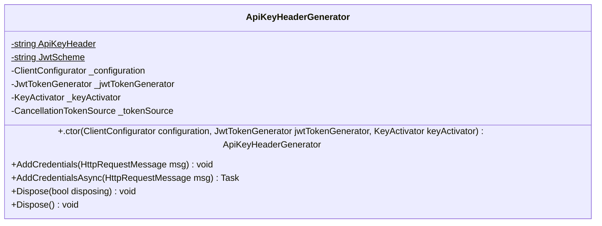

<div id="HexExtensions-class-diagram"></div>

##### `HexExtensions` class diagram

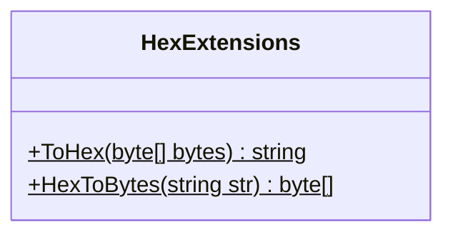

<div id="JwtTokenGenerator-class-diagram"></div>

##### `JwtTokenGenerator` class diagram

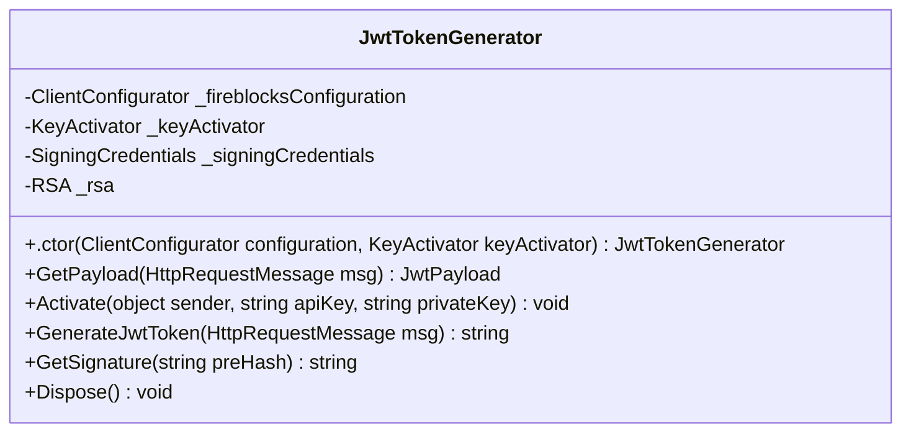

<div id="KeyActivator.KeyActivationEventntHandler-class-diagram"></div>

##### `KeyActivator.KeyActivationEventntHandler` class diagram

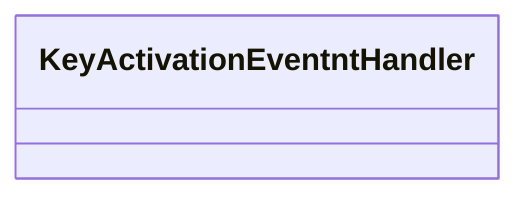

<div id="KeyActivator-class-diagram"></div>

##### `KeyActivator` class diagram

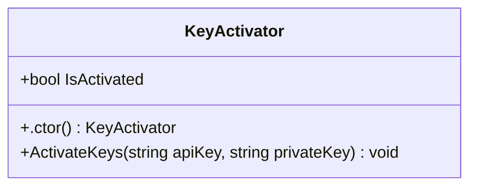

<div id="AutofacHelper-class-diagram"></div>

##### `AutofacHelper` class diagram

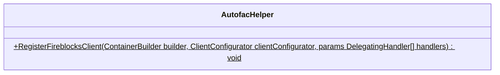

<div id="AccountsClient-class-diagram"></div>

##### `AccountsClient` class diagram

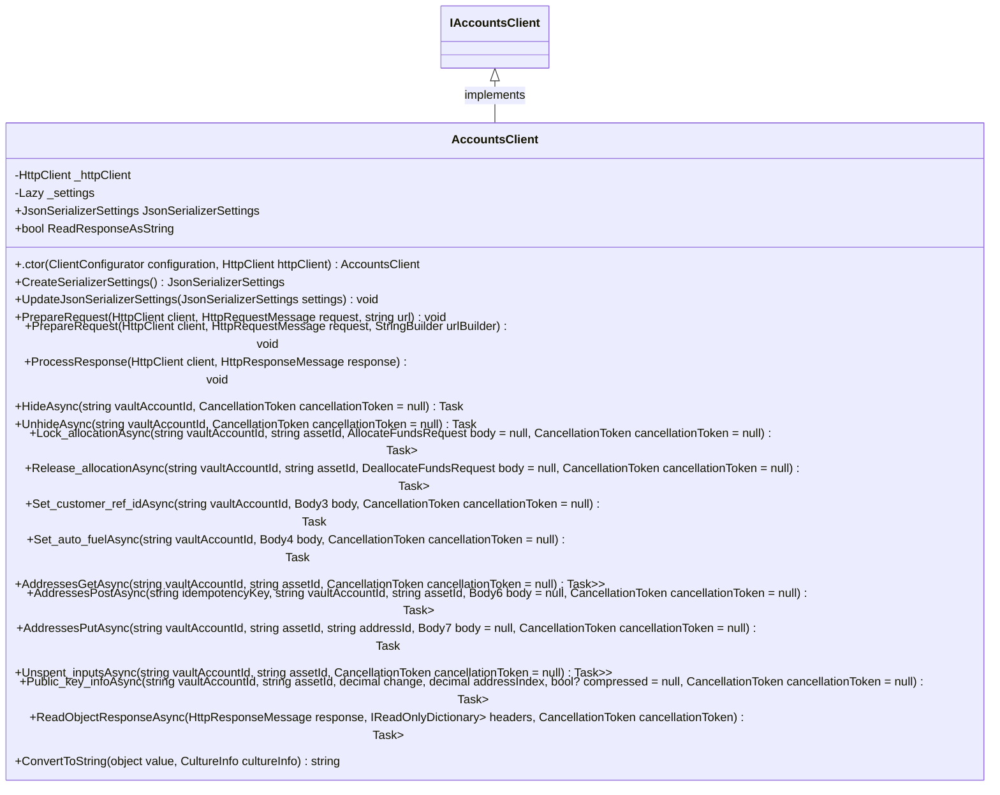

<div id="AddressesClient-class-diagram"></div>

##### `AddressesClient` class diagram

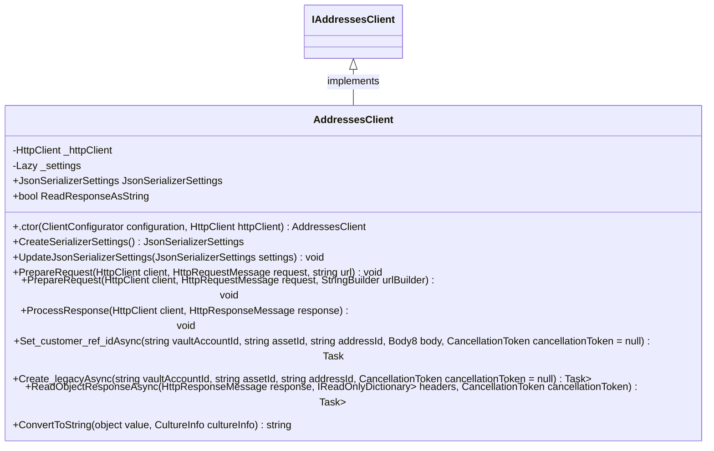

<div id="AllocatedBalance-class-diagram"></div>

##### `AllocatedBalance` class diagram

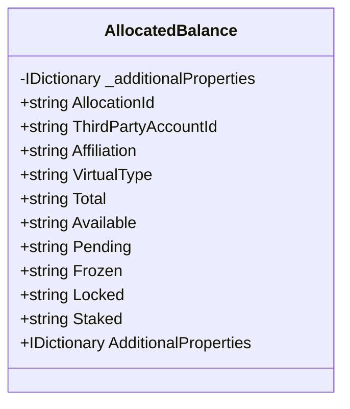

<div id="AllocateFundsRequest-class-diagram"></div>

##### `AllocateFundsRequest` class diagram

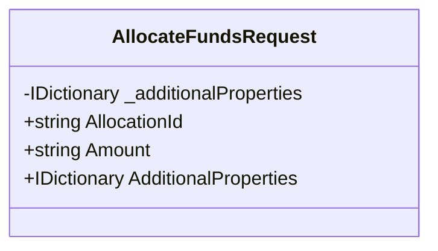

<div id="AmlScreeningResult-class-diagram"></div>

##### `AmlScreeningResult` class diagram

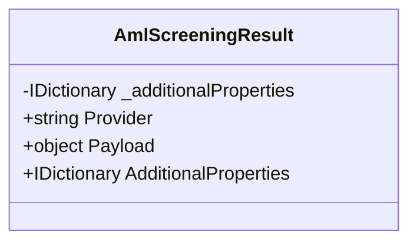

<div id="AmountInfo-class-diagram"></div>

##### `AmountInfo` class diagram

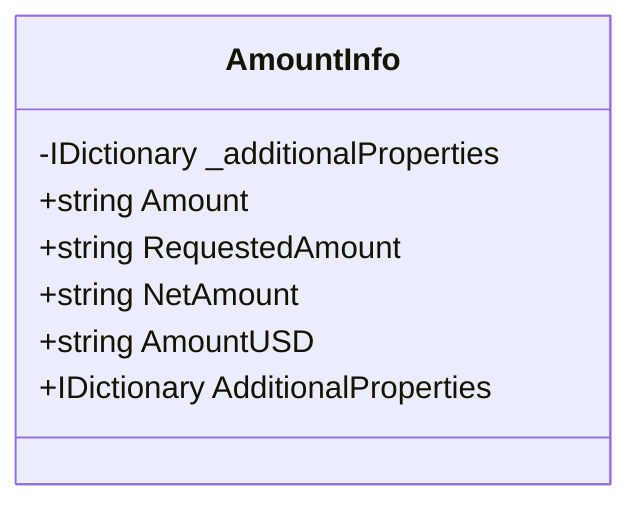

<div id="Anonymous-class-diagram"></div>

##### `Anonymous` class diagram

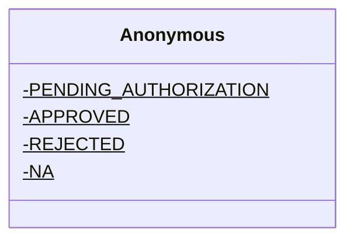

<div id="Anonymous2-class-diagram"></div>

##### `Anonymous2` class diagram

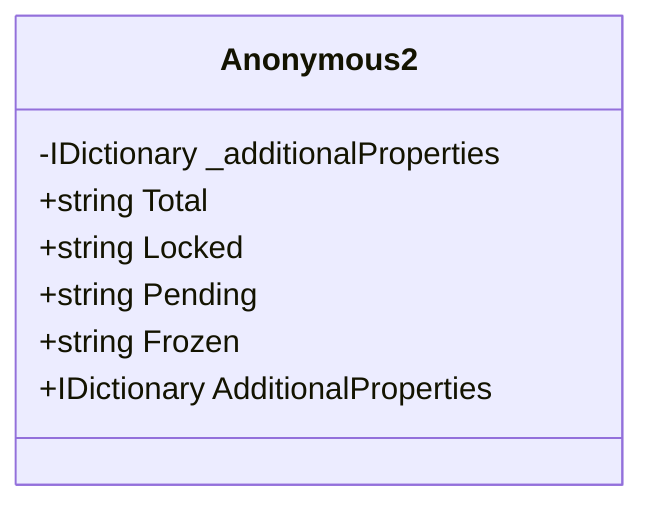

<div id="ApiException-class-diagram"></div>

##### `ApiException` class diagram

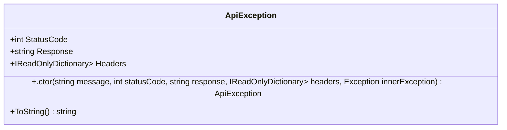

<div id="ApiException&lt;TResult&gt;-class-diagram"></div>

##### `ApiException<TResult>` class diagram

```mermaid
classDiagram
class ApiException<TResult>{
    +TResult Result
    +ception(string message, int statusCode, string response, IReadOnlyDictionary<string, IEnumerable<string>> headers, TResult result, Exception innerException) void
}

```

<div id="AssetTypeResponse-class-diagram"></div>

##### `AssetTypeResponse` class diagram

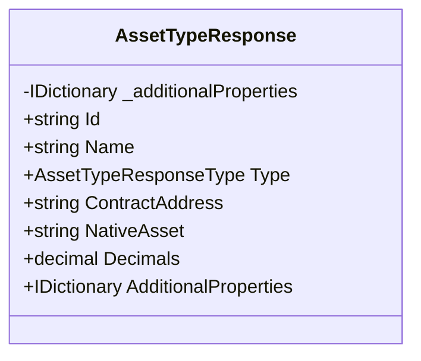

<div id="AssetTypeResponseType-class-diagram"></div>

##### `AssetTypeResponseType` class diagram

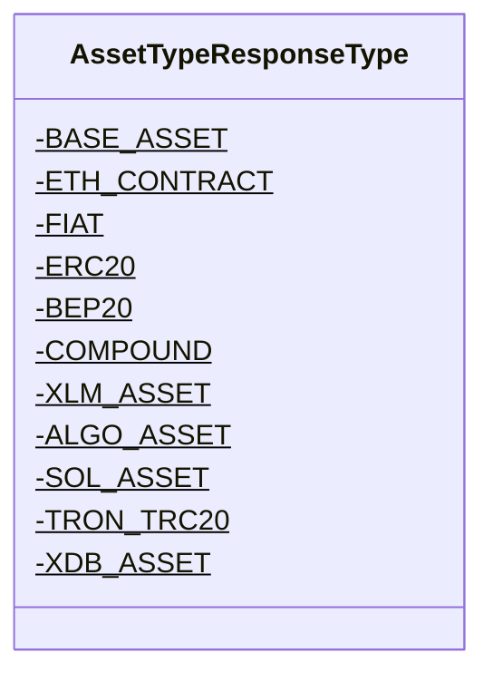

<div id="AuthorizationGroups-class-diagram"></div>

##### `AuthorizationGroups` class diagram

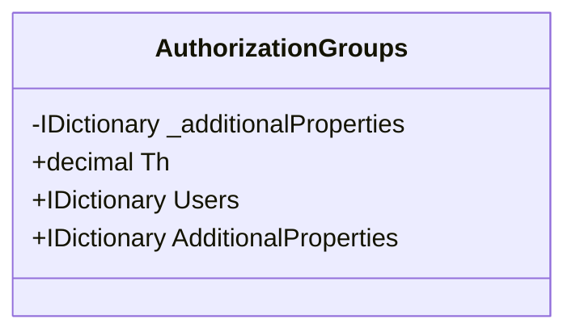

<div id="AuthorizationInfo-class-diagram"></div>

##### `AuthorizationInfo` class diagram

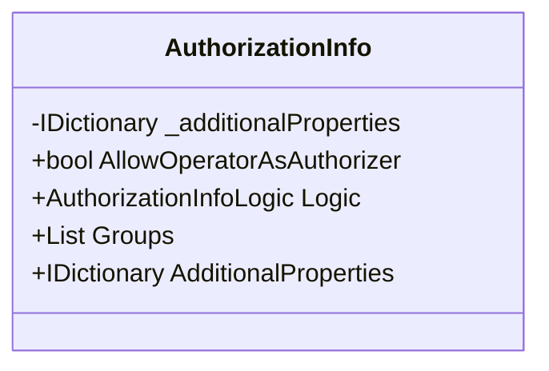

<div id="AuthorizationInfoLogic-class-diagram"></div>

##### `AuthorizationInfoLogic` class diagram

```mermaid
classDiagram
class AuthorizationInfoLogic{
    -AND$
    -OR$
}

```

<div id="BaseClient-class-diagram"></div>

##### `BaseClient` class diagram

```mermaid
classDiagram
class BaseClient{
    -ClientConfigurator _clientConfigurator
    +string BaseUrl
    +.ctor(ClientConfigurator clientConfigurator) BaseClient
}

```

<div id="BlockInfo-class-diagram"></div>

##### `BlockInfo` class diagram

```mermaid
classDiagram
class BlockInfo{
    -IDictionary<string, object> _additionalProperties
    +string BlockHeight
    +string BlockHash
    +IDictionary<string, object> AdditionalProperties
}

```

<div id="Body-class-diagram"></div>

##### `Body` class diagram

```mermaid
classDiagram
class Body{
    -IDictionary<string, object> _additionalProperties
    +string Name
    +bool HiddenOnUI
    +string CustomerRefId
    +bool AutoFuel
    +IDictionary<string, object> AdditionalProperties
}

```

<div id="Body10-class-diagram"></div>

##### `Body10` class diagram

```mermaid
classDiagram
class Body10{
    -IDictionary<string, object> _additionalProperties
    +string CustomerRefId
    +IDictionary<string, object> AdditionalProperties
}

```

<div id="Body11-class-diagram"></div>

##### `Body11` class diagram

```mermaid
classDiagram
class Body11{
    -IDictionary<string, object> _additionalProperties
    +string Address
    +string Tag
    +IDictionary<string, object> AdditionalProperties
}

```

<div id="Body12-class-diagram"></div>

##### `Body12` class diagram

```mermaid
classDiagram
class Body12{
    -IDictionary<string, object> _additionalProperties
    +string Name
    +string CustomerRefId
    +IDictionary<string, object> AdditionalProperties
}

```

<div id="Body13-class-diagram"></div>

##### `Body13` class diagram

```mermaid
classDiagram
class Body13{
    -IDictionary<string, object> _additionalProperties
    +string CustomerRefId
    +IDictionary<string, object> AdditionalProperties
}

```

<div id="Body14-class-diagram"></div>

##### `Body14` class diagram

```mermaid
classDiagram
class Body14{
    -IDictionary<string, object> _additionalProperties
    +string Address
    +string Tag
    +IDictionary<string, object> AdditionalProperties
}

```

<div id="Body15-class-diagram"></div>

##### `Body15` class diagram

```mermaid
classDiagram
class Body15{
    -IDictionary<string, object> _additionalProperties
    +string Asset
    +string Amount
    +TradingAccountType SourceType
    +TradingAccountType DestType
    +IDictionary<string, object> AdditionalProperties
}

```

<div id="Body16-class-diagram"></div>

##### `Body16` class diagram

```mermaid
classDiagram
class Body16{
    -IDictionary<string, object> _additionalProperties
    +decimal Amount
    +IDictionary<string, object> AdditionalProperties
}

```

<div id="Body17-class-diagram"></div>

##### `Body17` class diagram

```mermaid
classDiagram
class Body17{
    -IDictionary<string, object> _additionalProperties
    +decimal Amount
    +IDictionary<string, object> AdditionalProperties
}

```

<div id="Body18-class-diagram"></div>

##### `Body18` class diagram

```mermaid
classDiagram
class Body18{
    -IDictionary<string, object> _additionalProperties
    +List<Term> Terms
    +string ExternalTicketId
    +string Description
    +IDictionary<string, object> AdditionalProperties
}

```

<div id="Body19-class-diagram"></div>

##### `Body19` class diagram

```mermaid
classDiagram
class Body19{
    -IDictionary<string, object> _additionalProperties
    +TransferPeerPath Source
    +IDictionary<string, object> AdditionalProperties
}

```

<div id="Body2-class-diagram"></div>

##### `Body2` class diagram

```mermaid
classDiagram
class Body2{
    -IDictionary<string, object> _additionalProperties
    +string Name
    +IDictionary<string, object> AdditionalProperties
}

```

<div id="Body3-class-diagram"></div>

##### `Body3` class diagram

```mermaid
classDiagram
class Body3{
    -IDictionary<string, object> _additionalProperties
    +string CustomerRefId
    +IDictionary<string, object> AdditionalProperties
}

```

<div id="Body4-class-diagram"></div>

##### `Body4` class diagram

```mermaid
classDiagram
class Body4{
    -IDictionary<string, object> _additionalProperties
    +bool AutoFuel
    +IDictionary<string, object> AdditionalProperties
}

```

<div id="Body5-class-diagram"></div>

##### `Body5` class diagram

```mermaid
classDiagram
class Body5{
    -IDictionary<string, object> _additionalProperties
    +string EosAccountName
    +IDictionary<string, object> AdditionalProperties
}

```

<div id="Body6-class-diagram"></div>

##### `Body6` class diagram

```mermaid
classDiagram
class Body6{
    -IDictionary<string, object> _additionalProperties
    +string Description
    +string CustomerRefId
    +IDictionary<string, object> AdditionalProperties
}

```

<div id="Body7-class-diagram"></div>

##### `Body7` class diagram

```mermaid
classDiagram
class Body7{
    -IDictionary<string, object> _additionalProperties
    +string Description
    +IDictionary<string, object> AdditionalProperties
}

```

<div id="Body8-class-diagram"></div>

##### `Body8` class diagram

```mermaid
classDiagram
class Body8{
    -IDictionary<string, object> _additionalProperties
    +string CustomerRefId
    +IDictionary<string, object> AdditionalProperties
}

```

<div id="Body9-class-diagram"></div>

##### `Body9` class diagram

```mermaid
classDiagram
class Body9{
    -IDictionary<string, object> _additionalProperties
    +string Name
    +string CustomerRefId
    +IDictionary<string, object> AdditionalProperties
}

```

<div id="CancelTransactionResponse-class-diagram"></div>

##### `CancelTransactionResponse` class diagram

```mermaid
classDiagram
class CancelTransactionResponse{
    -IDictionary<string, object> _additionalProperties
    +bool Success
    +IDictionary<string, object> AdditionalProperties
}

```

<div id="Channel-class-diagram"></div>

##### `Channel` class diagram

```mermaid
classDiagram
class Channel{
    -IDictionary<string, object> _additionalProperties
    +string NetworkId
    +string Name
    +IDictionary<string, object> AdditionalProperties
}

```

<div id="Client-class-diagram"></div>

##### `Client` class diagram

```mermaid
classDiagram
IClient <|-- Client : implements
class Client{
    -HttpClient _httpClient
    -Lazy<JsonSerializerSettings> _settings
    +JsonSerializerSettings JsonSerializerSettings
    +bool ReadResponseAsString
    +.ctor(ClientConfigurator configuration, HttpClient httpClient) Client
    +CreateSerializerSettings() JsonSerializerSettings
    +UpdateJsonSerializerSettings(JsonSerializerSettings settings) void
    +PrepareRequest(HttpClient client, HttpRequestMessage request, string url) void
    +PrepareRequest(HttpClient client, HttpRequestMessage request, StringBuilder urlBuilder) void
    +ProcessResponse(HttpClient client, HttpResponseMessage response) void
    +Internal_walletsGetAsync(CancellationToken cancellationToken = null) Task<Response<List<UnmanagedWallet>>>
    +Internal_walletsPostAsync(Body9 body = null, CancellationToken cancellationToken = null) Task<Response<UnmanagedWallet>>
    +Internal_walletsGetAsync(string walletId, CancellationToken cancellationToken = null) Task<Response<UnmanagedWallet>>
    +Internal_walletsDeleteAsync(string walletId, CancellationToken cancellationToken = null) Task<Response>
    +Internal_walletsGetAsync(string walletId, string assetId, CancellationToken cancellationToken = null) Task<Response<WalletAsset>>
    +Internal_walletsPostAsync(string walletId, string assetId, Body11 body = null, CancellationToken cancellationToken = null) Task<Response<WalletAsset>>
    +Internal_walletsDeleteAsync(string walletId, string assetId, CancellationToken cancellationToken = null) Task<Response>
    +External_walletsGetAsync(CancellationToken cancellationToken = null) Task<Response<List<UnmanagedWallet>>>
    +External_walletsPostAsync(Body12 body = null, CancellationToken cancellationToken = null) Task<Response<UnmanagedWallet>>
    +External_walletsGetAsync(string walletId, CancellationToken cancellationToken = null) Task<Response<UnmanagedWallet>>
    +External_walletsDeleteAsync(string walletId, CancellationToken cancellationToken = null) Task<Response>
    +External_walletsGetAsync(string walletId, string assetId, CancellationToken cancellationToken = null) Task<Response<ExternalWalletAsset>>
    +External_walletsPostAsync(string walletId, string assetId, Body14 body = null, CancellationToken cancellationToken = null) Task<Response<ExternalWalletAsset>>
    +External_walletsDeleteAsync(string walletId, string assetId, CancellationToken cancellationToken = null) Task<Response>
    +Exchange_accountsGetAsync(CancellationToken cancellationToken = null) Task<Response<List<ExchangeAccount>>>
    +Exchange_accountsGetAsync(string exchangeAccountId, CancellationToken cancellationToken = null) Task<Response<ExchangeAccount>>
    +Exchange_accountsGetAsync(string exchangeAccountId, string assetId, CancellationToken cancellationToken = null) Task<Response<ExchangeAsset>>
    +Fiat_accountsGetAsync(CancellationToken cancellationToken = null) Task<Response<List<FiatAccount>>>
    +Fiat_accountsGetAsync(string accountId, CancellationToken cancellationToken = null) Task<Response<FiatAccount>>
    +TransactionsGetAsync(string before = null, string after = null, string status = null, OrderBy? orderBy = null, int? limit = null, SourceType? sourceType = null, string sourceId = null, DestType? destType = null, string destId = null, string assets = null, string txHash = null, CancellationToken cancellationToken = null) Task<Response<List<TransactionResponse>>>
    +TransactionsPostAsync(string idempotencyKey, TransactionRequest body = null, CancellationToken cancellationToken = null) Task<Response<CreateTransactionResponse>>
    +TransactionsGetAsync(string txId, CancellationToken cancellationToken = null) Task<Response<TransactionResponse>>
    +Supported_assetsAsync(CancellationToken cancellationToken = null) Task<Response<List<AssetTypeResponse>>>
    +Network_connectionsGetAsync(CancellationToken cancellationToken = null) Task<Response<List<NetworkConnectionResponse>>>
    +Network_connectionsGetAsync(string connectionId, CancellationToken cancellationToken = null) Task<Response<NetworkConnectionResponse>>
    +Transfer_ticketsGetAsync(CancellationToken cancellationToken = null) Task<Response<List<TransferTicketResponse>>>
    +Transfer_ticketsPostAsync(Body18 body = null, CancellationToken cancellationToken = null) Task<Response<CreateTransferTicketResponse>>
    +Transfer_ticketsGetAsync(string ticketId, CancellationToken cancellationToken = null) Task<Response<TransferTicketResponse>>
    +Transfer_ticketsGetAsync(string ticketId, string termId, CancellationToken cancellationToken = null) Task<Response<TransferTicketTermResponse>>
    +Estimate_network_feeAsync(string assetId, CancellationToken cancellationToken = null) Task<Response<EstimatedNetworkFeeResponse>>
    +Gas_stationAsync(CancellationToken cancellationToken = null) Task<Response<GasStationPropertiesResponse>>
    +UsersAsync(CancellationToken cancellationToken = null) Task<Response<GetUsersResponse>>
    +Off_exchange_accountsGetAsync(CancellationToken cancellationToken = null) Task<Response<List<OffExchangeEntityResponse>>>
    +Off_exchange_accountsGetAsync(string virtualAccountId, CancellationToken cancellationToken = null) Task<Response<OffExchangeEntityResponse>>
    +ReadObjectResponseAsync<T>(HttpResponseMessage response, IReadOnlyDictionary<string, IEnumerable<string>> headers, CancellationToken cancellationToken) Task<ObjectResponseResult<T>>
    +ConvertToString(object value, CultureInfo cultureInfo) string
}

```

<div id="ClientConfigurator-class-diagram"></div>

##### `ClientConfigurator` class diagram

```mermaid
classDiagram
class ClientConfigurator{
    +string BaseUrl
    +string ApiKey
    +string ApiPrivateKey
}

```

<div id="ConfigChangeRequestStatus-class-diagram"></div>

##### `ConfigChangeRequestStatus` class diagram

```mermaid
classDiagram
class ConfigChangeRequestStatus{
    -WAITING_FOR_APPROVAL$
    -APPROVED$
    -CANCELLED$
    -REJECTED$
    -FAILED$
}

```

<div id="CreateAddressResponse-class-diagram"></div>

##### `CreateAddressResponse` class diagram

```mermaid
classDiagram
class CreateAddressResponse{
    -IDictionary<string, object> _additionalProperties
    +string Address
    +string LegacyAddress
    +string EnterpriseAddress
    +string Tag
    +decimal Bip44AddressIndex
    +IDictionary<string, object> AdditionalProperties
}

```

<div id="CreateTransactionResponse-class-diagram"></div>

##### `CreateTransactionResponse` class diagram

```mermaid
classDiagram
class CreateTransactionResponse{
    -IDictionary<string, object> _additionalProperties
    +string Id
    +string Status
    +IDictionary<string, object> AdditionalProperties
}

```

<div id="CreateTransferTicketResponse-class-diagram"></div>

##### `CreateTransferTicketResponse` class diagram

```mermaid
classDiagram
class CreateTransferTicketResponse{
    -IDictionary<string, object> _additionalProperties
    +string TicketId
    +IDictionary<string, object> AdditionalProperties
}

```

<div id="CreateVaultAssetResponse-class-diagram"></div>

##### `CreateVaultAssetResponse` class diagram

```mermaid
classDiagram
class CreateVaultAssetResponse{
    -IDictionary<string, object> _additionalProperties
    +string Id
    +string Address
    +string LegacyAddress
    +string EnterpriseAddress
    +string Tag
    +string EosAccountName
    +string Status
    +string ActivationTxId
    +IDictionary<string, object> AdditionalProperties
}

```

<div id="DeallocateFundsRequest-class-diagram"></div>

##### `DeallocateFundsRequest` class diagram

```mermaid
classDiagram
class DeallocateFundsRequest{
    -IDictionary<string, object> _additionalProperties
    +string AllocationId
    +string Amount
    +IDictionary<string, object> AdditionalProperties
}

```

<div id="DestinationTransferPeerPath-class-diagram"></div>

##### `DestinationTransferPeerPath` class diagram

```mermaid
classDiagram
class DestinationTransferPeerPath{
    -IDictionary<string, object> _additionalProperties
    +OneTimeAddress OneTimeAddress
    +IDictionary<string, object> AdditionalProperties
}

```

<div id="DestType-class-diagram"></div>

##### `DestType` class diagram

```mermaid
classDiagram
class DestType{
    -VAULT_ACCOUNT$
    -EXCHANGE_ACCOUNT$
    -INTERNAL_WALLET$
    -EXTERNAL_WALLET$
    -FIAT_ACCOUNT$
    -NETWORK_CONNECTION$
    -COMPOUND$
    -ONE_TIME_ADDRESS$
    -OEC_PARTNER$
}

```

<div id="DropTransactionRequest-class-diagram"></div>

##### `DropTransactionRequest` class diagram

```mermaid
classDiagram
class DropTransactionRequest{
    -IDictionary<string, object> _additionalProperties
    +string TxId
    +string FeeLevel
    +string GasPrice
    +IDictionary<string, object> AdditionalProperties
}

```

<div id="DropTransactionResponse-class-diagram"></div>

##### `DropTransactionResponse` class diagram

```mermaid
classDiagram
class DropTransactionResponse{
    -IDictionary<string, object> _additionalProperties
    +bool Success
    +List<string> Transactions
    +IDictionary<string, object> AdditionalProperties
}

```

<div id="Error-class-diagram"></div>

##### `Error` class diagram

```mermaid
classDiagram
class Error{
    -IDictionary<string, object> _additionalProperties
    +string Error1
    +decimal Code
    +string Message
    +IDictionary<string, object> AdditionalProperties
}

```

<div id="EstimatedNetworkFeeResponse-class-diagram"></div>

##### `EstimatedNetworkFeeResponse` class diagram

```mermaid
classDiagram
class EstimatedNetworkFeeResponse{
    -IDictionary<string, object> _additionalProperties
    +NetworkFee Low
    +NetworkFee Medium
    +NetworkFee High
    +IDictionary<string, object> AdditionalProperties
}

```

<div id="EstimatedTransactionFeeResponse-class-diagram"></div>

##### `EstimatedTransactionFeeResponse` class diagram

```mermaid
classDiagram
class EstimatedTransactionFeeResponse{
    -IDictionary<string, object> _additionalProperties
    +TransactionFee Low
    +TransactionFee Medium
    +TransactionFee High
    +IDictionary<string, object> AdditionalProperties
}

```

<div id="Exchange_accountsClient-class-diagram"></div>

##### `Exchange_accountsClient` class diagram

```mermaid
classDiagram
IExchange_accountsClient <|-- Exchange_accountsClient : implements
class Exchange_accountsClient{
    -HttpClient _httpClient
    -Lazy<JsonSerializerSettings> _settings
    +JsonSerializerSettings JsonSerializerSettings
    +bool ReadResponseAsString
    +.ctor(ClientConfigurator configuration, HttpClient httpClient) Exchange_accountsClient
    +CreateSerializerSettings() JsonSerializerSettings
    +UpdateJsonSerializerSettings(JsonSerializerSettings settings) void
    +PrepareRequest(HttpClient client, HttpRequestMessage request, string url) void
    +PrepareRequest(HttpClient client, HttpRequestMessage request, StringBuilder urlBuilder) void
    +ProcessResponse(HttpClient client, HttpResponseMessage response) void
    +Internal_transferAsync(string exchangeAccountId, string idempotencyKey, Body15 body = null, CancellationToken cancellationToken = null) Task<Response>
    +ReadObjectResponseAsync<T>(HttpResponseMessage response, IReadOnlyDictionary<string, IEnumerable<string>> headers, CancellationToken cancellationToken) Task<ObjectResponseResult<T>>
    +ConvertToString(object value, CultureInfo cultureInfo) string
}

```

<div id="ExchangeAccount-class-diagram"></div>

##### `ExchangeAccount` class diagram

```mermaid
classDiagram
class ExchangeAccount{
    -IDictionary<string, object> _additionalProperties
    +string Id
    +ExchangeType Type
    +string Name
    +string Status
    +List<ExchangeAsset> Assets
    +List<ExchangeTradingAccount> TradingAccounts
    +bool IsSubaccount
    +string MainAccountId
    +IDictionary<string, object> AdditionalProperties
}

```

<div id="ExchangeAsset-class-diagram"></div>

##### `ExchangeAsset` class diagram

```mermaid
classDiagram
class ExchangeAsset{
    -IDictionary<string, object> _additionalProperties
    +string Id
    +string Balance
    +string LockedAmount
    +string Total
    +string Available
    +IDictionary<string, object> AdditionalProperties
}

```

<div id="ExchangeTradingAccount-class-diagram"></div>

##### `ExchangeTradingAccount` class diagram

```mermaid
classDiagram
class ExchangeTradingAccount{
    -IDictionary<string, object> _additionalProperties
    +TradingAccountType Type
    +string Name
    +List<ExchangeAsset> Assets
    +IDictionary<string, object> AdditionalProperties
}

```

<div id="ExchangeType-class-diagram"></div>

##### `ExchangeType` class diagram

```mermaid
classDiagram
class ExchangeType{
    -BITTREX$
    -COINBASEPRO$
    -BINANCE$
    -BINANCEUS$
    -BITMEX$
    -KRAKEN$
    -GEMINI$
    -BITFINEX$
    -BITSTAMP$
    -POLONIEX$
    -DERIBIT$
    -LIQUID$
    -HUOBI$
    -BITHUMB$
    -OKEX$
    -OKCOIN$
    -HITBTC$
    -KORBIT$
    -SEEDCX$
    -BITSO$
}

```

<div id="External_walletsClient-class-diagram"></div>

##### `External_walletsClient` class diagram

```mermaid
classDiagram
IExternal_walletsClient <|-- External_walletsClient : implements
class External_walletsClient{
    -HttpClient _httpClient
    -Lazy<JsonSerializerSettings> _settings
    +JsonSerializerSettings JsonSerializerSettings
    +bool ReadResponseAsString
    +.ctor(ClientConfigurator configuration, HttpClient httpClient) External_walletsClient
    +CreateSerializerSettings() JsonSerializerSettings
    +UpdateJsonSerializerSettings(JsonSerializerSettings settings) void
    +PrepareRequest(HttpClient client, HttpRequestMessage request, string url) void
    +PrepareRequest(HttpClient client, HttpRequestMessage request, StringBuilder urlBuilder) void
    +ProcessResponse(HttpClient client, HttpResponseMessage response) void
    +Set_customer_ref_idAsync(string walletId, Body13 body, CancellationToken cancellationToken = null) Task<Response>
    +ReadObjectResponseAsync<T>(HttpResponseMessage response, IReadOnlyDictionary<string, IEnumerable<string>> headers, CancellationToken cancellationToken) Task<ObjectResponseResult<T>>
    +ConvertToString(object value, CultureInfo cultureInfo) string
}

```

<div id="ExternalWalletAsset-class-diagram"></div>

##### `ExternalWalletAsset` class diagram

```mermaid
classDiagram
class ExternalWalletAsset{
    -IDictionary<string, object> _additionalProperties
    +string Id
    +ConfigChangeRequestStatus Status
    +string Address
    +string Tag
    +string ActivationTime
    +IDictionary<string, object> AdditionalProperties
}

```

<div id="FeeInfo-class-diagram"></div>

##### `FeeInfo` class diagram

```mermaid
classDiagram
class FeeInfo{
    -IDictionary<string, object> _additionalProperties
    +string NetworkFee
    +string ServiceFee
    +IDictionary<string, object> AdditionalProperties
}

```

<div id="Fiat_accountsClient-class-diagram"></div>

##### `Fiat_accountsClient` class diagram

```mermaid
classDiagram
IFiat_accountsClient <|-- Fiat_accountsClient : implements
class Fiat_accountsClient{
    -HttpClient _httpClient
    -Lazy<JsonSerializerSettings> _settings
    +JsonSerializerSettings JsonSerializerSettings
    +bool ReadResponseAsString
    +.ctor(ClientConfigurator configuration, HttpClient httpClient) Fiat_accountsClient
    +CreateSerializerSettings() JsonSerializerSettings
    +UpdateJsonSerializerSettings(JsonSerializerSettings settings) void
    +PrepareRequest(HttpClient client, HttpRequestMessage request, string url) void
    +PrepareRequest(HttpClient client, HttpRequestMessage request, StringBuilder urlBuilder) void
    +ProcessResponse(HttpClient client, HttpResponseMessage response) void
    +Redeem_to_linked_ddaAsync(string accountId, Body16 body = null, CancellationToken cancellationToken = null) Task<Response>
    +Deposit_from_linked_ddaAsync(string accountId, Body17 body = null, CancellationToken cancellationToken = null) Task<Response>
    +ReadObjectResponseAsync<T>(HttpResponseMessage response, IReadOnlyDictionary<string, IEnumerable<string>> headers, CancellationToken cancellationToken) Task<ObjectResponseResult<T>>
    +ConvertToString(object value, CultureInfo cultureInfo) string
}

```

<div id="FiatAccount-class-diagram"></div>

##### `FiatAccount` class diagram

```mermaid
classDiagram
class FiatAccount{
    -IDictionary<string, object> _additionalProperties
    +string Id
    +FiatAccountType Type
    +string Name
    +List<FiatAsset> Assets
    +IDictionary<string, object> AdditionalProperties
}

```

<div id="FiatAccountType-class-diagram"></div>

##### `FiatAccountType` class diagram

```mermaid
classDiagram
class FiatAccountType{
    -SIGNET$
}

```

<div id="FiatAsset-class-diagram"></div>

##### `FiatAsset` class diagram

```mermaid
classDiagram
class FiatAsset{
    -IDictionary<string, object> _additionalProperties
    +string Id
    +string Balance
    +IDictionary<string, object> AdditionalProperties
}

```

<div id="FreezeTransactionResponse-class-diagram"></div>

##### `FreezeTransactionResponse` class diagram

```mermaid
classDiagram
class FreezeTransactionResponse{
    -IDictionary<string, object> _additionalProperties
    +bool Success
    +IDictionary<string, object> AdditionalProperties
}

```

<div id="Gas_stationClient-class-diagram"></div>

##### `Gas_stationClient` class diagram

```mermaid
classDiagram
IGas_stationClient <|-- Gas_stationClient : implements
class Gas_stationClient{
    -HttpClient _httpClient
    -Lazy<JsonSerializerSettings> _settings
    +JsonSerializerSettings JsonSerializerSettings
    +bool ReadResponseAsString
    +.ctor(ClientConfigurator configuration, HttpClient httpClient) Gas_stationClient
    +CreateSerializerSettings() JsonSerializerSettings
    +UpdateJsonSerializerSettings(JsonSerializerSettings settings) void
    +PrepareRequest(HttpClient client, HttpRequestMessage request, string url) void
    +PrepareRequest(HttpClient client, HttpRequestMessage request, StringBuilder urlBuilder) void
    +ProcessResponse(HttpClient client, HttpResponseMessage response) void
    +ConfigurationAsync(GasStationConfiguration body, CancellationToken cancellationToken = null) Task<Response>
    +ReadObjectResponseAsync<T>(HttpResponseMessage response, IReadOnlyDictionary<string, IEnumerable<string>> headers, CancellationToken cancellationToken) Task<ObjectResponseResult<T>>
    +ConvertToString(object value, CultureInfo cultureInfo) string
}

```

<div id="GasStationConfiguration-class-diagram"></div>

##### `GasStationConfiguration` class diagram

```mermaid
classDiagram
class GasStationConfiguration{
    -IDictionary<string, object> _additionalProperties
    +string GasThreshold
    +string GasCap
    +string MaxGasPrice
    +IDictionary<string, object> AdditionalProperties
}

```

<div id="GasStationPropertiesResponse-class-diagram"></div>

##### `GasStationPropertiesResponse` class diagram

```mermaid
classDiagram
class GasStationPropertiesResponse{
    -IDictionary<string, object> _additionalProperties
    +Dictionary<string, string> Balance
    +GasStationConfiguration Configuration
    +IDictionary<string, object> AdditionalProperties
}

```

<div id="GetUsersResponse-class-diagram"></div>

##### `GetUsersResponse` class diagram

```mermaid
classDiagram
class GetUsersResponse{
    -IDictionary<string, object> _additionalProperties
    +List<UserResponse> Users
    +IDictionary<string, object> AdditionalProperties
}

```

<div id="IAccountsClient-class-diagram"></div>

##### `IAccountsClient` class diagram

```mermaid
classDiagram
class IAccountsClient{
    +HideAsync(string vaultAccountId, CancellationToken cancellationToken = null)* Task<Response>
    +UnhideAsync(string vaultAccountId, CancellationToken cancellationToken = null)* Task<Response>
    +Lock_allocationAsync(string vaultAccountId, string assetId, AllocateFundsRequest body = null, CancellationToken cancellationToken = null)* Task<Response<CreateTransactionResponse>>
    +Release_allocationAsync(string vaultAccountId, string assetId, DeallocateFundsRequest body = null, CancellationToken cancellationToken = null)* Task<Response<CreateTransactionResponse>>
    +Set_customer_ref_idAsync(string vaultAccountId, Body3 body, CancellationToken cancellationToken = null)* Task<Response>
    +Set_auto_fuelAsync(string vaultAccountId, Body4 body, CancellationToken cancellationToken = null)* Task<Response>
    +AddressesGetAsync(string vaultAccountId, string assetId, CancellationToken cancellationToken = null)* Task<Response<List<VaultWalletAddress>>>
    +AddressesPostAsync(string idempotencyKey, string vaultAccountId, string assetId, Body6 body = null, CancellationToken cancellationToken = null)* Task<Response<CreateAddressResponse>>
    +AddressesPutAsync(string vaultAccountId, string assetId, string addressId, Body7 body = null, CancellationToken cancellationToken = null)* Task<Response>
    +Unspent_inputsAsync(string vaultAccountId, string assetId, CancellationToken cancellationToken = null)* Task<Response<List<UnspentInputsData>>>
    +Public_key_infoAsync(string vaultAccountId, string assetId, decimal change, decimal addressIndex, bool? compressed = null, CancellationToken cancellationToken = null)* Task<Response<PublicKeyInformation>>
}

```

<div id="IAddressesClient-class-diagram"></div>

##### `IAddressesClient` class diagram

```mermaid
classDiagram
class IAddressesClient{
    +Set_customer_ref_idAsync(string vaultAccountId, string assetId, string addressId, Body8 body, CancellationToken cancellationToken = null)* Task<Response>
    +Create_legacyAsync(string vaultAccountId, string assetId, string addressId, CancellationToken cancellationToken = null)* Task<Response<CreateAddressResponse>>
}

```

<div id="IClient-class-diagram"></div>

##### `IClient` class diagram

```mermaid
classDiagram
class IClient{
    +Internal_walletsGetAsync(CancellationToken cancellationToken = null)* Task<Response<List<UnmanagedWallet>>>
    +Internal_walletsPostAsync(Body9 body = null, CancellationToken cancellationToken = null)* Task<Response<UnmanagedWallet>>
    +Internal_walletsGetAsync(string walletId, CancellationToken cancellationToken = null)* Task<Response<UnmanagedWallet>>
    +Internal_walletsDeleteAsync(string walletId, CancellationToken cancellationToken = null)* Task<Response>
    +Internal_walletsGetAsync(string walletId, string assetId, CancellationToken cancellationToken = null)* Task<Response<WalletAsset>>
    +Internal_walletsPostAsync(string walletId, string assetId, Body11 body = null, CancellationToken cancellationToken = null)* Task<Response<WalletAsset>>
    +Internal_walletsDeleteAsync(string walletId, string assetId, CancellationToken cancellationToken = null)* Task<Response>
    +External_walletsGetAsync(CancellationToken cancellationToken = null)* Task<Response<List<UnmanagedWallet>>>
    +External_walletsPostAsync(Body12 body = null, CancellationToken cancellationToken = null)* Task<Response<UnmanagedWallet>>
    +External_walletsGetAsync(string walletId, CancellationToken cancellationToken = null)* Task<Response<UnmanagedWallet>>
    +External_walletsDeleteAsync(string walletId, CancellationToken cancellationToken = null)* Task<Response>
    +External_walletsGetAsync(string walletId, string assetId, CancellationToken cancellationToken = null)* Task<Response<ExternalWalletAsset>>
    +External_walletsPostAsync(string walletId, string assetId, Body14 body = null, CancellationToken cancellationToken = null)* Task<Response<ExternalWalletAsset>>
    +External_walletsDeleteAsync(string walletId, string assetId, CancellationToken cancellationToken = null)* Task<Response>
    +Exchange_accountsGetAsync(CancellationToken cancellationToken = null)* Task<Response<List<ExchangeAccount>>>
    +Exchange_accountsGetAsync(string exchangeAccountId, CancellationToken cancellationToken = null)* Task<Response<ExchangeAccount>>
    +Exchange_accountsGetAsync(string exchangeAccountId, string assetId, CancellationToken cancellationToken = null)* Task<Response<ExchangeAsset>>
    +Fiat_accountsGetAsync(CancellationToken cancellationToken = null)* Task<Response<List<FiatAccount>>>
    +Fiat_accountsGetAsync(string accountId, CancellationToken cancellationToken = null)* Task<Response<FiatAccount>>
    +TransactionsGetAsync(string before = null, string after = null, string status = null, OrderBy? orderBy = null, int? limit = null, SourceType? sourceType = null, string sourceId = null, DestType? destType = null, string destId = null, string assets = null, string txHash = null, CancellationToken cancellationToken = null)* Task<Response<List<TransactionResponse>>>
    +TransactionsPostAsync(string idempotencyKey, TransactionRequest body = null, CancellationToken cancellationToken = null)* Task<Response<CreateTransactionResponse>>
    +TransactionsGetAsync(string txId, CancellationToken cancellationToken = null)* Task<Response<TransactionResponse>>
    +Supported_assetsAsync(CancellationToken cancellationToken = null)* Task<Response<List<AssetTypeResponse>>>
    +Network_connectionsGetAsync(CancellationToken cancellationToken = null)* Task<Response<List<NetworkConnectionResponse>>>
    +Network_connectionsGetAsync(string connectionId, CancellationToken cancellationToken = null)* Task<Response<NetworkConnectionResponse>>
    +Transfer_ticketsGetAsync(CancellationToken cancellationToken = null)* Task<Response<List<TransferTicketResponse>>>
    +Transfer_ticketsPostAsync(Body18 body = null, CancellationToken cancellationToken = null)* Task<Response<CreateTransferTicketResponse>>
    +Transfer_ticketsGetAsync(string ticketId, CancellationToken cancellationToken = null)* Task<Response<TransferTicketResponse>>
    +Transfer_ticketsGetAsync(string ticketId, string termId, CancellationToken cancellationToken = null)* Task<Response<TransferTicketTermResponse>>
    +Estimate_network_feeAsync(string assetId, CancellationToken cancellationToken = null)* Task<Response<EstimatedNetworkFeeResponse>>
    +Gas_stationAsync(CancellationToken cancellationToken = null)* Task<Response<GasStationPropertiesResponse>>
    +UsersAsync(CancellationToken cancellationToken = null)* Task<Response<GetUsersResponse>>
    +Off_exchange_accountsGetAsync(CancellationToken cancellationToken = null)* Task<Response<List<OffExchangeEntityResponse>>>
    +Off_exchange_accountsGetAsync(string virtualAccountId, CancellationToken cancellationToken = null)* Task<Response<OffExchangeEntityResponse>>
}

```

<div id="IExchange_accountsClient-class-diagram"></div>

##### `IExchange_accountsClient` class diagram

```mermaid
classDiagram
class IExchange_accountsClient{
    +Internal_transferAsync(string exchangeAccountId, string idempotencyKey, Body15 body = null, CancellationToken cancellationToken = null)* Task<Response>
}

```

<div id="IExternal_walletsClient-class-diagram"></div>

##### `IExternal_walletsClient` class diagram

```mermaid
classDiagram
class IExternal_walletsClient{
    +Set_customer_ref_idAsync(string walletId, Body13 body, CancellationToken cancellationToken = null)* Task<Response>
}

```

<div id="IFiat_accountsClient-class-diagram"></div>

##### `IFiat_accountsClient` class diagram

```mermaid
classDiagram
class IFiat_accountsClient{
    +Redeem_to_linked_ddaAsync(string accountId, Body16 body = null, CancellationToken cancellationToken = null)* Task<Response>
    +Deposit_from_linked_ddaAsync(string accountId, Body17 body = null, CancellationToken cancellationToken = null)* Task<Response>
}

```

<div id="IGas_stationClient-class-diagram"></div>

##### `IGas_stationClient` class diagram

```mermaid
classDiagram
class IGas_stationClient{
    +ConfigurationAsync(GasStationConfiguration body, CancellationToken cancellationToken = null)* Task<Response>
}

```

<div id="IInternal_walletsClient-class-diagram"></div>

##### `IInternal_walletsClient` class diagram

```mermaid
classDiagram
class IInternal_walletsClient{
    +Set_customer_ref_idAsync(string walletId, Body10 body, CancellationToken cancellationToken = null)* Task<Response>
}

```

<div id="Internal_walletsClient-class-diagram"></div>

##### `Internal_walletsClient` class diagram

```mermaid
classDiagram
IInternal_walletsClient <|-- Internal_walletsClient : implements
class Internal_walletsClient{
    -HttpClient _httpClient
    -Lazy<JsonSerializerSettings> _settings
    +JsonSerializerSettings JsonSerializerSettings
    +bool ReadResponseAsString
    +.ctor(ClientConfigurator configuration, HttpClient httpClient) Internal_walletsClient
    +CreateSerializerSettings() JsonSerializerSettings
    +UpdateJsonSerializerSettings(JsonSerializerSettings settings) void
    +PrepareRequest(HttpClient client, HttpRequestMessage request, string url) void
    +PrepareRequest(HttpClient client, HttpRequestMessage request, StringBuilder urlBuilder) void
    +ProcessResponse(HttpClient client, HttpResponseMessage response) void
    +Set_customer_ref_idAsync(string walletId, Body10 body, CancellationToken cancellationToken = null) Task<Response>
    +ReadObjectResponseAsync<T>(HttpResponseMessage response, IReadOnlyDictionary<string, IEnumerable<string>> headers, CancellationToken cancellationToken) Task<ObjectResponseResult<T>>
    +ConvertToString(object value, CultureInfo cultureInfo) string
}

```

<div id="IOff_exchange_accountsClient-class-diagram"></div>

##### `IOff_exchange_accountsClient` class diagram

```mermaid
classDiagram
class IOff_exchange_accountsClient{
    +SettleAsync(string virtualAccountId, CancellationToken cancellationToken = null)* Task<Response>
}

```

<div id="ITransactionsClient-class-diagram"></div>

##### `ITransactionsClient` class diagram

```mermaid
classDiagram
class ITransactionsClient{
    +Estimate_feeAsync(TransactionRequest body = null, CancellationToken cancellationToken = null)* Task<Response<EstimatedTransactionFeeResponse>>
    +External_tx_idAsync(string externalTxId, CancellationToken cancellationToken = null)* Task<Response<TransactionResponse>>
    +Set_confirmation_thresholdAsync(string txId, SetConfirmationsThresholdRequest body = null, CancellationToken cancellationToken = null)* Task<Response<SetConfirmationsThresholdResponse>>
    +DropAsync(string txId, DropTransactionRequest body = null, CancellationToken cancellationToken = null)* Task<Response<DropTransactionResponse>>
    +CancelAsync(string txId, CancellationToken cancellationToken = null)* Task<Response<CancelTransactionResponse>>
    +FreezeAsync(string txId, CancellationToken cancellationToken = null)* Task<Response<FreezeTransactionResponse>>
    +UnfreezeAsync(string txId, CancellationToken cancellationToken = null)* Task<Response<UnfreezeTransactionResponse>>
    +Validate_addressAsync(string assetId, string address, CancellationToken cancellationToken = null)* Task<Response<ValidateAddressResponse>>
}

```

<div id="ITransfer_ticketsClient-class-diagram"></div>

##### `ITransfer_ticketsClient` class diagram

```mermaid
classDiagram
class ITransfer_ticketsClient{
    +CancelAsync(string ticketId, CancellationToken cancellationToken = null)* Task<Response>
    +TransferAsync(string ticketId, string termId, Body19 body = null, CancellationToken cancellationToken = null)* Task<Response>
}

```

<div id="ITxHashClient-class-diagram"></div>

##### `ITxHashClient` class diagram

```mermaid
classDiagram
class ITxHashClient{
    +Set_confirmation_thresholdAsync(string txHash, SetConfirmationsThresholdRequest body = null, CancellationToken cancellationToken = null)* Task<Response<SetConfirmationsThresholdResponse>>
}

```

<div id="IVaultClient-class-diagram"></div>

##### `IVaultClient` class diagram

```mermaid
classDiagram
class IVaultClient{
    +AccountsGetAsync(string namePrefix = null, string nameSuffix = null, string minAmountThreshold = null, string assetId = null, CancellationToken cancellationToken = null)* Task<Response<List<VaultAccount>>>
    +AccountsPostAsync(string idempotencyKey, Body body, CancellationToken cancellationToken = null)* Task<Response<VaultAccount>>
    +AccountsGetAsync(string vaultAccountId, CancellationToken cancellationToken = null)* Task<Response<VaultAccount>>
    +AccountsPutAsync(string vaultAccountId, Body2 body, CancellationToken cancellationToken = null)* Task<Response>
    +AccountsGetAsync(string vaultAccountId, string assetId, CancellationToken cancellationToken = null)* Task<Response<VaultAsset>>
    +AccountsPostAsync(string idempotencyKey, string vaultAccountId, string assetId, Body5 body = null, CancellationToken cancellationToken = null)* Task<Response<CreateVaultAssetResponse>>
    +Public_key_infoAsync(string derivationPath, string algorithm, bool? compressed = null, CancellationToken cancellationToken = null)* Task<Response<PublicKeyInformation>>
    +AssetsGetAsync(string accountNamePrefix = null, string accountNameSuffix = null, CancellationToken cancellationToken = null)* Task<Response<List<VaultAsset>>>
    +AssetsGetAsync(string assetId, CancellationToken cancellationToken = null)* Task<Response<VaultAsset>>
}

```

<div id="IWebhooksClient-class-diagram"></div>

##### `IWebhooksClient` class diagram

```mermaid
classDiagram
class IWebhooksClient{
    +ResendAsync(CancellationToken cancellationToken = null)* Task<Response<ResendWebhooksResponse>>
}

```

<div id="NetworkConnectionResponse-class-diagram"></div>

##### `NetworkConnectionResponse` class diagram

```mermaid
classDiagram
class NetworkConnectionResponse{
    -IDictionary<string, object> _additionalProperties
    +string Id
    +Channel LocalChannel
    +Channel RemoteChannel
    +IDictionary<string, object> AdditionalProperties
}

```

<div id="NetworkFee-class-diagram"></div>

##### `NetworkFee` class diagram

```mermaid
classDiagram
class NetworkFee{
    -IDictionary<string, object> _additionalProperties
    +string FeePerByte
    +decimal GasPrice
    +string NetworkFee1
    +string PriorityFee
    +string BaseFee
    +IDictionary<string, object> AdditionalProperties
}

```

<div id="NetworkRecord-class-diagram"></div>

##### `NetworkRecord` class diagram

```mermaid
classDiagram
class NetworkRecord{
    -IDictionary<string, object> _additionalProperties
    +TransferPeerPathResponse Source
    +TransferPeerPathResponse Destination
    +string TxHash
    +string NetworkFee
    +string AssetId
    +string NetAmount
    +bool IsDropped
    +string Type
    +string DestinationAddress
    +string SourceAddress
    +string AmountUSD
    +decimal Index
    +IDictionary<string, object> AdditionalProperties
}

```

<div id="AccountsClient.ObjectResponseResult&lt;T&gt;-class-diagram"></div>

##### `AccountsClient.ObjectResponseResult<T>` class diagram

```mermaid
classDiagram
class ObjectResponseResult<T>{
    +T Object
    +string Text
    +tResponseResult(T responseObject, string responseText) void
}

```

<div id="AddressesClient.ObjectResponseResult&lt;T&gt;-class-diagram"></div>

##### `AddressesClient.ObjectResponseResult<T>` class diagram

```mermaid
classDiagram
class ObjectResponseResult<T>{
    +T Object
    +string Text
    +tResponseResult(T responseObject, string responseText) void
}

```

<div id="Client.ObjectResponseResult&lt;T&gt;-class-diagram"></div>

##### `Client.ObjectResponseResult<T>` class diagram

```mermaid
classDiagram
class ObjectResponseResult<T>{
    +T Object
    +string Text
    +tResponseResult(T responseObject, string responseText) void
}

```

<div id="Exchange_accountsClient.ObjectResponseResult&lt;T&gt;-class-diagram"></div>

##### `Exchange_accountsClient.ObjectResponseResult<T>` class diagram

```mermaid
classDiagram
class ObjectResponseResult<T>{
    +T Object
    +string Text
    +tResponseResult(T responseObject, string responseText) void
}

```

<div id="External_walletsClient.ObjectResponseResult&lt;T&gt;-class-diagram"></div>

##### `External_walletsClient.ObjectResponseResult<T>` class diagram

```mermaid
classDiagram
class ObjectResponseResult<T>{
    +T Object
    +string Text
    +tResponseResult(T responseObject, string responseText) void
}

```

<div id="Fiat_accountsClient.ObjectResponseResult&lt;T&gt;-class-diagram"></div>

##### `Fiat_accountsClient.ObjectResponseResult<T>` class diagram

```mermaid
classDiagram
class ObjectResponseResult<T>{
    +T Object
    +string Text
    +tResponseResult(T responseObject, string responseText) void
}

```

<div id="Gas_stationClient.ObjectResponseResult&lt;T&gt;-class-diagram"></div>

##### `Gas_stationClient.ObjectResponseResult<T>` class diagram

```mermaid
classDiagram
class ObjectResponseResult<T>{
    +T Object
    +string Text
    +tResponseResult(T responseObject, string responseText) void
}

```

<div id="Internal_walletsClient.ObjectResponseResult&lt;T&gt;-class-diagram"></div>

##### `Internal_walletsClient.ObjectResponseResult<T>` class diagram

```mermaid
classDiagram
class ObjectResponseResult<T>{
    +T Object
    +string Text
    +tResponseResult(T responseObject, string responseText) void
}

```

<div id="Off_exchange_accountsClient.ObjectResponseResult&lt;T&gt;-class-diagram"></div>

##### `Off_exchange_accountsClient.ObjectResponseResult<T>` class diagram

```mermaid
classDiagram
class ObjectResponseResult<T>{
    +T Object
    +string Text
    +tResponseResult(T responseObject, string responseText) void
}

```

<div id="TransactionsClient.ObjectResponseResult&lt;T&gt;-class-diagram"></div>

##### `TransactionsClient.ObjectResponseResult<T>` class diagram

```mermaid
classDiagram
class ObjectResponseResult<T>{
    +T Object
    +string Text
    +tResponseResult(T responseObject, string responseText) void
}

```

<div id="Transfer_ticketsClient.ObjectResponseResult&lt;T&gt;-class-diagram"></div>

##### `Transfer_ticketsClient.ObjectResponseResult<T>` class diagram

```mermaid
classDiagram
class ObjectResponseResult<T>{
    +T Object
    +string Text
    +tResponseResult(T responseObject, string responseText) void
}

```

<div id="TxHashClient.ObjectResponseResult&lt;T&gt;-class-diagram"></div>

##### `TxHashClient.ObjectResponseResult<T>` class diagram

```mermaid
classDiagram
class ObjectResponseResult<T>{
    +T Object
    +string Text
    +tResponseResult(T responseObject, string responseText) void
}

```

<div id="VaultClient.ObjectResponseResult&lt;T&gt;-class-diagram"></div>

##### `VaultClient.ObjectResponseResult<T>` class diagram

```mermaid
classDiagram
class ObjectResponseResult<T>{
    +T Object
    +string Text
    +tResponseResult(T responseObject, string responseText) void
}

```

<div id="WebhooksClient.ObjectResponseResult&lt;T&gt;-class-diagram"></div>

##### `WebhooksClient.ObjectResponseResult<T>` class diagram

```mermaid
classDiagram
class ObjectResponseResult<T>{
    +T Object
    +string Text
    +tResponseResult(T responseObject, string responseText) void
}

```

<div id="Off_exchange_accountsClient-class-diagram"></div>

##### `Off_exchange_accountsClient` class diagram

```mermaid
classDiagram
IOff_exchange_accountsClient <|-- Off_exchange_accountsClient : implements
class Off_exchange_accountsClient{
    -HttpClient _httpClient
    -Lazy<JsonSerializerSettings> _settings
    +JsonSerializerSettings JsonSerializerSettings
    +bool ReadResponseAsString
    +.ctor(ClientConfigurator configuration, HttpClient httpClient) Off_exchange_accountsClient
    +CreateSerializerSettings() JsonSerializerSettings
    +UpdateJsonSerializerSettings(JsonSerializerSettings settings) void
    +PrepareRequest(HttpClient client, HttpRequestMessage request, string url) void
    +PrepareRequest(HttpClient client, HttpRequestMessage request, StringBuilder urlBuilder) void
    +ProcessResponse(HttpClient client, HttpResponseMessage response) void
    +SettleAsync(string virtualAccountId, CancellationToken cancellationToken = null) Task<Response>
    +ReadObjectResponseAsync<T>(HttpResponseMessage response, IReadOnlyDictionary<string, IEnumerable<string>> headers, CancellationToken cancellationToken) Task<ObjectResponseResult<T>>
    +ConvertToString(object value, CultureInfo cultureInfo) string
}

```

<div id="OffExchangeEntityResponse-class-diagram"></div>

##### `OffExchangeEntityResponse` class diagram

```mermaid
classDiagram
class OffExchangeEntityResponse{
    -IDictionary<string, object> _additionalProperties
    +string Id
    +string VaultAccountId
    +string ThirdPartyAccountId
    +IDictionary<string, Anonymous2> Balance
    +IDictionary<string, object> AdditionalProperties
}

```

<div id="OneTimeAddress-class-diagram"></div>

##### `OneTimeAddress` class diagram

```mermaid
classDiagram
class OneTimeAddress{
    -IDictionary<string, object> _additionalProperties
    +string Address
    +string Tag
    +IDictionary<string, object> AdditionalProperties
}

```

<div id="OrderBy-class-diagram"></div>

##### `OrderBy` class diagram

```mermaid
classDiagram
class OrderBy{
    -CreatedAt$
    -LastUpdated$
}

```

<div id="PublicKeyInformation-class-diagram"></div>

##### `PublicKeyInformation` class diagram

```mermaid
classDiagram
class PublicKeyInformation{
    -IDictionary<string, object> _additionalProperties
    +string Algorithm
    +List<decimal> DerivationPath
    +string PublicKey
    +IDictionary<string, object> AdditionalProperties
}

```

<div id="ResendWebhooksResponse-class-diagram"></div>

##### `ResendWebhooksResponse` class diagram

```mermaid
classDiagram
class ResendWebhooksResponse{
    -IDictionary<string, object> _additionalProperties
    +decimal WebhooksCount
    +IDictionary<string, object> AdditionalProperties
}

```

<div id="Response-class-diagram"></div>

##### `Response` class diagram

```mermaid
classDiagram
class Response{
    +int StatusCode
    +IReadOnlyDictionary<string, IEnumerable<string>> Headers
    +.ctor(int statusCode, IReadOnlyDictionary<string, IEnumerable<string>> headers) Response
}

```

<div id="Response&lt;TResult&gt;-class-diagram"></div>

##### `Response<TResult>` class diagram

```mermaid
classDiagram
class Response<TResult>{
    +TResult Result
    +nse(int statusCode, IReadOnlyDictionary<string, IEnumerable<string>> headers, TResult result) void
}

```

<div id="SetConfirmationsThresholdRequest-class-diagram"></div>

##### `SetConfirmationsThresholdRequest` class diagram

```mermaid
classDiagram
class SetConfirmationsThresholdRequest{
    -IDictionary<string, object> _additionalProperties
    +decimal NumOfConfirmations
    +IDictionary<string, object> AdditionalProperties
}

```

<div id="SetConfirmationsThresholdResponse-class-diagram"></div>

##### `SetConfirmationsThresholdResponse` class diagram

```mermaid
classDiagram
class SetConfirmationsThresholdResponse{
    -IDictionary<string, object> _additionalProperties
    +bool Success
    +List<string> Transactions
    +IDictionary<string, object> AdditionalProperties
}

```

<div id="Signature-class-diagram"></div>

##### `Signature` class diagram

```mermaid
classDiagram
class Signature{
    -IDictionary<string, object> _additionalProperties
    +string FullSig
    +string R
    +string S
    +decimal V
    +IDictionary<string, object> AdditionalProperties
}

```

<div id="SignedMessage-class-diagram"></div>

##### `SignedMessage` class diagram

```mermaid
classDiagram
class SignedMessage{
    -IDictionary<string, object> _additionalProperties
    +string Content
    +SignedMessageAlgorithm Algorithm
    +List<decimal> DerivationPath
    +Signature Signature
    +string PublicKey
    +IDictionary<string, object> AdditionalProperties
}

```

<div id="SignedMessageAlgorithm-class-diagram"></div>

##### `SignedMessageAlgorithm` class diagram

```mermaid
classDiagram
class SignedMessageAlgorithm{
    -MPC_ECDSA_SECP256K1$
    -MPC_ECDSA_SECP256R1$
    -MPC_EDDSA_ED25519$
}

```

<div id="SourceType-class-diagram"></div>

##### `SourceType` class diagram

```mermaid
classDiagram
class SourceType{
    -VAULT_ACCOUNT$
    -EXCHANGE_ACCOUNT$
    -INTERNAL_WALLET$
    -EXTERNAL_WALLET$
    -FIAT_ACCOUNT$
    -NETWORK_CONNECTION$
    -COMPOUND$
    -UNKNOWN$
    -GAS_STATION$
    -OEC_PARTNER$
}

```

<div id="Term-class-diagram"></div>

##### `Term` class diagram

```mermaid
classDiagram
class Term{
    -IDictionary<string, object> _additionalProperties
    +string NetworkConnectionId
    +bool Outgoing
    +string Asset
    +string Amount
    +string Note
    +string Operation
    +IDictionary<string, object> AdditionalProperties
}

```

<div id="TradingAccountType-class-diagram"></div>

##### `TradingAccountType` class diagram

```mermaid
classDiagram
class TradingAccountType{
    -FUNDABLE$
    -SPOT$
    -FUNDING$
    -FUTURES$
    -OPTIONS$
    -MARGIN$
    -MARGIN_CROSS$
    -MARGIN_ISOLATED$
    -EXCHANGE$
    -COIN_MARGINED_SWAP$
    -USDT_MARGINED_SWAP_CROSS$
    -USDT_MARGINED_SWAP_ISOLATED$
    -USDT_FUTURES$
    -COIN_FUTURES$
    -FUTURES_CROSS$
    -UNIFIED$
}

```

<div id="TransactionFee-class-diagram"></div>

##### `TransactionFee` class diagram

```mermaid
classDiagram
class TransactionFee{
    -IDictionary<string, object> _additionalProperties
    +string FeePerByte
    +decimal GasPrice
    +decimal GasLimit
    +string NetworkFee
    +string PriorityFee
    +string BaseFee
    +IDictionary<string, object> AdditionalProperties
}

```

<div id="TransactionOperation-class-diagram"></div>

##### `TransactionOperation` class diagram

```mermaid
classDiagram
class TransactionOperation{
    -TRANSFER$
    -MINT$
    -BURN$
    -SUPPLY_TO_COMPOUND$
    -REDEEM_FROM_COMPOUND$
    -RAW$
    -CONTRACT_CALL$
    -INTERNAL_LEDGER_TRANSFER$
    -TYPED_MESSAGE$
}

```

<div id="TransactionRequest-class-diagram"></div>

##### `TransactionRequest` class diagram

```mermaid
classDiagram
class TransactionRequest{
    -IDictionary<string, object> _additionalProperties
    +string AssetId
    +TransferPeerPath Source
    +DestinationTransferPeerPath Destination
    +decimal Amount
    +decimal? Fee
    +TransactionRequestFeeLevel FeeLevel
    +string PriorityFee
    +bool FailOnLowFee
    +string MaxFee
    +decimal? GasPrice
    +decimal? GasLimit
    +decimal? NetworkFee
    +string Note
    +bool AutoStaking
    +decimal NetworkStaking
    +decimal CpuStaking
    +object ExtraParameters
    +TransactionOperation Operation
    +string CustomerRefId
    +string ExternalTxId
    +List<TransactionRequestDestination> Destinations
    +bool TreatAsGrossAmount
    +bool ForceSweep
    +IDictionary<string, object> AdditionalProperties
}

```

<div id="TransactionRequestDestination-class-diagram"></div>

##### `TransactionRequestDestination` class diagram

```mermaid
classDiagram
class TransactionRequestDestination{
    -IDictionary<string, object> _additionalProperties
    +string Amount
    +DestinationTransferPeerPath Destination
    +IDictionary<string, object> AdditionalProperties
}

```

<div id="TransactionRequestFeeLevel-class-diagram"></div>

##### `TransactionRequestFeeLevel` class diagram

```mermaid
classDiagram
class TransactionRequestFeeLevel{
    -LOW$
    -MEDIUM$
    -HIGH$
}

```

<div id="TransactionResponse-class-diagram"></div>

##### `TransactionResponse` class diagram

```mermaid
classDiagram
class TransactionResponse{
    -IDictionary<string, object> _additionalProperties
    +string Id
    +string AssetId
    +TransferPeerPathResponse Source
    +TransferPeerPathResponse Destination
    +decimal RequestedAmount
    +decimal Amount
    +decimal NetAmount
    +decimal? AmountUSD
    +decimal ServiceFee
    +decimal Fee
    +decimal NetworkFee
    +long CreatedAt
    +long LastUpdated
    +TransactionResponseStatus Status
    +string TxHash
    +string Tag
    +TransactionSubStatus? SubStatus
    +string DestinationAddress
    +string SourceAddress
    +string DestinationAddressDescription
    +string DestinationTag
    +List<string> SignedBy
    +string CreatedBy
    +string RejectedBy
    +string AddressType
    +string Note
    +string ExchangeTxId
    +string FeeCurrency
    +TransactionOperation Operation
    +List<NetworkRecord> NetworkRecords
    +AmlScreeningResult AmlScreeningResult
    +string CustomerRefId
    +decimal NumOfConfirmations
    +AmountInfo AmountInfo
    +FeeInfo FeeInfo
    +List<SignedMessage> SignedMessages
    +object ExtraParameters
    +string ExternalTxId
    +List<TransactionResponseDestination> Destinations
    +BlockInfo BlockInfo
    +AuthorizationInfo AuthorizationInfo
    +decimal Index
    +IDictionary<string, object> AdditionalProperties
}

```

<div id="TransactionResponseDestination-class-diagram"></div>

##### `TransactionResponseDestination` class diagram

```mermaid
classDiagram
class TransactionResponseDestination{
    -IDictionary<string, object> _additionalProperties
    +string Amount
    +string AmountUSD
    +AmlScreeningResult AmlScreeningResult
    +TransferPeerPathResponse Destination
    +AuthorizationInfo AuthorizationInfo
    +IDictionary<string, object> AdditionalProperties
}

```

<div id="TransactionResponseStatus-class-diagram"></div>

##### `TransactionResponseStatus` class diagram

```mermaid
classDiagram
class TransactionResponseStatus{
    -SUBMITTED$
    -PENDING_SIGNATURE$
    -PENDING_AUTHORIZATION$
    -COMPLETED$
    -CONFIRMING$
    -FAILED$
    -REJECTED$
    -CANCELLING$
    -CANCELLED$
    -BROADCASTING$
    -BLOCKED$
    -TIMEOUT$
    -QUEUED$
    -PENDING_3RD_PARTY$
    -PENDING_3RD_PARTY_MANUAL_APPROVAL$
    -PENDING_AML_SCREENING$
    -PARTIALLY_COMPLETED$
    -SIGNING_ERROR$
}

```

<div id="TransactionsClient-class-diagram"></div>

##### `TransactionsClient` class diagram

```mermaid
classDiagram
ITransactionsClient <|-- TransactionsClient : implements
class TransactionsClient{
    -HttpClient _httpClient
    -Lazy<JsonSerializerSettings> _settings
    +JsonSerializerSettings JsonSerializerSettings
    +bool ReadResponseAsString
    +.ctor(ClientConfigurator configuration, HttpClient httpClient) TransactionsClient
    +CreateSerializerSettings() JsonSerializerSettings
    +UpdateJsonSerializerSettings(JsonSerializerSettings settings) void
    +PrepareRequest(HttpClient client, HttpRequestMessage request, string url) void
    +PrepareRequest(HttpClient client, HttpRequestMessage request, StringBuilder urlBuilder) void
    +ProcessResponse(HttpClient client, HttpResponseMessage response) void
    +Estimate_feeAsync(TransactionRequest body = null, CancellationToken cancellationToken = null) Task<Response<EstimatedTransactionFeeResponse>>
    +External_tx_idAsync(string externalTxId, CancellationToken cancellationToken = null) Task<Response<TransactionResponse>>
    +Set_confirmation_thresholdAsync(string txId, SetConfirmationsThresholdRequest body = null, CancellationToken cancellationToken = null) Task<Response<SetConfirmationsThresholdResponse>>
    +DropAsync(string txId, DropTransactionRequest body = null, CancellationToken cancellationToken = null) Task<Response<DropTransactionResponse>>
    +CancelAsync(string txId, CancellationToken cancellationToken = null) Task<Response<CancelTransactionResponse>>
    +FreezeAsync(string txId, CancellationToken cancellationToken = null) Task<Response<FreezeTransactionResponse>>
    +UnfreezeAsync(string txId, CancellationToken cancellationToken = null) Task<Response<UnfreezeTransactionResponse>>
    +Validate_addressAsync(string assetId, string address, CancellationToken cancellationToken = null) Task<Response<ValidateAddressResponse>>
    +ReadObjectResponseAsync<T>(HttpResponseMessage response, IReadOnlyDictionary<string, IEnumerable<string>> headers, CancellationToken cancellationToken) Task<ObjectResponseResult<T>>
    +ConvertToString(object value, CultureInfo cultureInfo) string
}

```

<div id="TransactionSubStatus-class-diagram"></div>

##### `TransactionSubStatus` class diagram

```mermaid
classDiagram
class TransactionSubStatus{
    -INSUFFICIENT_FUNDS$
    -AMOUNT_TOO_SMALL$
    -UNSUPPORTED_ASSET$
    -UNAUTHORISED__MISSING_PERMISSION$
    -INVALID_SIGNATURE$
    -API_INVALID_SIGNATURE$
    -UNAUTHORISED__MISSING_CREDENTIALS$
    -UNAUTHORISED__USER$
    -UNAUTHORISED__DEVICE$
    -INVALID_UNMANAGED_WALLET$
    -INVALID_EXCHANGE_ACCOUNT$
    -INSUFFICIENT_FUNDS_FOR_FEE$
    -INVALID_ADDRESS$
    -WITHDRAW_LIMIT$
    -API_CALL_LIMIT$
    -ADDRESS_NOT_WHITELISTED$
    -TIMEOUT$
    -CONNECTIVITY_ERROR$
    -THIRD_PARTY_INTERNAL_ERROR$
    -CANCELLED_EXTERNALLY$
    -INVALID_THIRD_PARTY_RESPONSE$
    -VAULT_WALLET_NOT_READY$
    -MISSING_DEPOSIT_ADDRESS$
    -INTERNAL_ERROR$
    -UNKNOWN_ERROR$
    -AUTHORIZER_NOT_FOUND$
    -INSUFFICIENT_RESERVED_FUNDING$
    -MANUAL_DEPOSIT_ADDRESS_REQUIRED$
    -INVALID_FEE$
    -ERROR_UNSUPPORTED_TRANSACTION_TYPE$
    -UNSUPPORTED_OPERATION$
    -_3RD_PARTY_PROCESSING$
    -PENDING_BLOCKCHAIN_CONFIRMATIONS$
    -_3RD_PARTY_CONFIRMING$
    -CONFIRMED$
    -_3RD_PARTY_COMPLETED$
    -PENDING_BLOCKCHAIN_CONFIRMATIONSREJECTED_BY_USER$
    -CANCELLED_BY_USER$
    -_3RD_PARTY_CANCELLED$
    -_3RD_PARTY_REJECTED$
    -AML_SCREENING_REJECTED$
    -BLOCKED_BY_POLICY$
    -FAILED_AML_SCREENING$
    -PARTIALLY_FAILED$
    -_3RD_PARTY_FAILED$
    -ZERO_BALANCE_IN_PERMANENT_ADDRESS$
    -INCOMPLETE_USER_SETUP$
    -REJECTED_BY_USER$
    -SIGNING_ERROR$
    -NONCE_ALLOCATION_FAILED$
    -NEED_MORE_TO_CREATE_DESTINATION$
    -_3RD_PARTY_PENDING_SERVICE_MANUAL_APPROVAL$
    -INTEGRATION_SUSPENDED$
    -DROPPED_BY_BLOCKCHAIN$
    -AUTHORIZATION_FAILED$
}

```

<div id="Transfer_ticketsClient-class-diagram"></div>

##### `Transfer_ticketsClient` class diagram

```mermaid
classDiagram
ITransfer_ticketsClient <|-- Transfer_ticketsClient : implements
class Transfer_ticketsClient{
    -HttpClient _httpClient
    -Lazy<JsonSerializerSettings> _settings
    +JsonSerializerSettings JsonSerializerSettings
    +bool ReadResponseAsString
    +.ctor(ClientConfigurator configuration, HttpClient httpClient) Transfer_ticketsClient
    +CreateSerializerSettings() JsonSerializerSettings
    +UpdateJsonSerializerSettings(JsonSerializerSettings settings) void
    +PrepareRequest(HttpClient client, HttpRequestMessage request, string url) void
    +PrepareRequest(HttpClient client, HttpRequestMessage request, StringBuilder urlBuilder) void
    +ProcessResponse(HttpClient client, HttpResponseMessage response) void
    +CancelAsync(string ticketId, CancellationToken cancellationToken = null) Task<Response>
    +TransferAsync(string ticketId, string termId, Body19 body = null, CancellationToken cancellationToken = null) Task<Response>
    +ReadObjectResponseAsync<T>(HttpResponseMessage response, IReadOnlyDictionary<string, IEnumerable<string>> headers, CancellationToken cancellationToken) Task<ObjectResponseResult<T>>
    +ConvertToString(object value, CultureInfo cultureInfo) string
}

```

<div id="TransferPeerPath-class-diagram"></div>

##### `TransferPeerPath` class diagram

```mermaid
classDiagram
class TransferPeerPath{
    -IDictionary<string, object> _additionalProperties
    +TransferPeerPathType Type
    +string Id
    +IDictionary<string, object> AdditionalProperties
}

```

<div id="TransferPeerPathResponse-class-diagram"></div>

##### `TransferPeerPathResponse` class diagram

```mermaid
classDiagram
class TransferPeerPathResponse{
    -IDictionary<string, object> _additionalProperties
    +string Name
    +string SubType
    +TransferPeerPathResponseVirtualType VirtualType
    +string VirtualId
    +IDictionary<string, object> AdditionalProperties
}

```

<div id="TransferPeerPathResponseVirtualType-class-diagram"></div>

##### `TransferPeerPathResponseVirtualType` class diagram

```mermaid
classDiagram
class TransferPeerPathResponseVirtualType{
    -OFF_EXCHANGE$
    -DEFAULT$
    -UNKNOWN$
}

```

<div id="TransferPeerPathType-class-diagram"></div>

##### `TransferPeerPathType` class diagram

```mermaid
classDiagram
class TransferPeerPathType{
    -VAULT_ACCOUNT$
    -EXCHANGE_ACCOUNT$
    -INTERNAL_WALLET$
    -EXTERNAL_WALLET$
    -NETWORK_CONNECTION$
    -FIAT_ACCOUNT$
    -COMPOUND$
    -GAS_STATION$
    -ONE_TIME_ADDRESS$
    -UNKNOWN$
    -CONTRACT$
}

```

<div id="TransferTicketResponse-class-diagram"></div>

##### `TransferTicketResponse` class diagram

```mermaid
classDiagram
class TransferTicketResponse{
    -IDictionary<string, object> _additionalProperties
    +string TicketId
    +string ExternalTicketId
    +string Description
    +TransferTicketResponseStatus Status
    +List<TransferTicketTermResponse> Terms
    +IDictionary<string, object> AdditionalProperties
}

```

<div id="TransferTicketResponseStatus-class-diagram"></div>

##### `TransferTicketResponseStatus` class diagram

```mermaid
classDiagram
class TransferTicketResponseStatus{
    -OPEN$
    -PARTIALLY_FULFILLED$
    -FULFILLED$
    -FAILED$
    -CANCELED$
}

```

<div id="TransferTicketTermResponse-class-diagram"></div>

##### `TransferTicketTermResponse` class diagram

```mermaid
classDiagram
class TransferTicketTermResponse{
    -IDictionary<string, object> _additionalProperties
    +string TermId
    +string NetworkConnectionId
    +bool Outgoing
    +string Asset
    +string Amount
    +List<string> TxIds
    +string Operation
    +TransferTicketTermResponseStatus Status
    +string Note
    +IDictionary<string, object> AdditionalProperties
}

```

<div id="TransferTicketTermResponseStatus-class-diagram"></div>

##### `TransferTicketTermResponseStatus` class diagram

```mermaid
classDiagram
class TransferTicketTermResponseStatus{
    -OPEN$
    -FULFILLED$
}

```

<div id="TxHashClient-class-diagram"></div>

##### `TxHashClient` class diagram

```mermaid
classDiagram
ITxHashClient <|-- TxHashClient : implements
class TxHashClient{
    -HttpClient _httpClient
    -Lazy<JsonSerializerSettings> _settings
    +JsonSerializerSettings JsonSerializerSettings
    +bool ReadResponseAsString
    +.ctor(ClientConfigurator configuration, HttpClient httpClient) TxHashClient
    +CreateSerializerSettings() JsonSerializerSettings
    +UpdateJsonSerializerSettings(JsonSerializerSettings settings) void
    +PrepareRequest(HttpClient client, HttpRequestMessage request, string url) void
    +PrepareRequest(HttpClient client, HttpRequestMessage request, StringBuilder urlBuilder) void
    +ProcessResponse(HttpClient client, HttpResponseMessage response) void
    +Set_confirmation_thresholdAsync(string txHash, SetConfirmationsThresholdRequest body = null, CancellationToken cancellationToken = null) Task<Response<SetConfirmationsThresholdResponse>>
    +ReadObjectResponseAsync<T>(HttpResponseMessage response, IReadOnlyDictionary<string, IEnumerable<string>> headers, CancellationToken cancellationToken) Task<ObjectResponseResult<T>>
    +ConvertToString(object value, CultureInfo cultureInfo) string
}

```

<div id="UnfreezeTransactionResponse-class-diagram"></div>

##### `UnfreezeTransactionResponse` class diagram

```mermaid
classDiagram
class UnfreezeTransactionResponse{
    -IDictionary<string, object> _additionalProperties
    +bool Success
    +IDictionary<string, object> AdditionalProperties
}

```

<div id="UnmanagedWallet-class-diagram"></div>

##### `UnmanagedWallet` class diagram

```mermaid
classDiagram
class UnmanagedWallet{
    -IDictionary<string, object> _additionalProperties
    +string Id
    +string Name
    +string CustomerRefId
    +List<WalletAsset> Assets
    +IDictionary<string, object> AdditionalProperties
}

```

<div id="UnsignedMessage-class-diagram"></div>

##### `UnsignedMessage` class diagram

```mermaid
classDiagram
class UnsignedMessage{
    -IDictionary<string, object> _additionalProperties
    +string Content
    +decimal Bip44addressIndex
    +decimal Bip44change
    +List<decimal> DerivationPath
    +IDictionary<string, object> AdditionalProperties
}

```

<div id="UnspentInputsData-class-diagram"></div>

##### `UnspentInputsData` class diagram

```mermaid
classDiagram
class UnspentInputsData{
    -IDictionary<string, object> _additionalProperties
    +string Input
    +string Address
    +string Amount
    +decimal Confirmations
    +string Status
    +IDictionary<string, object> AdditionalProperties
}

```

<div id="UserResponse-class-diagram"></div>

##### `UserResponse` class diagram

```mermaid
classDiagram
class UserResponse{
    -IDictionary<string, object> _additionalProperties
    +string Id
    +string FirstName
    +string LastName
    +string Role
    +string Email
    +bool Enabled
    +IDictionary<string, object> AdditionalProperties
}

```

<div id="ValidateAddressResponse-class-diagram"></div>

##### `ValidateAddressResponse` class diagram

```mermaid
classDiagram
class ValidateAddressResponse{
    -IDictionary<string, object> _additionalProperties
    +bool IsValid
    +bool IsActive
    +bool RequiresTag
    +IDictionary<string, object> AdditionalProperties
}

```

<div id="VaultAccount-class-diagram"></div>

##### `VaultAccount` class diagram

```mermaid
classDiagram
class VaultAccount{
    -IDictionary<string, object> _additionalProperties
    +string Id
    +string Name
    +List<VaultAsset> Assets
    +bool HiddenOnUI
    +string CustomerRefId
    +bool AutoFuel
    +IDictionary<string, object> AdditionalProperties
}

```

<div id="VaultAsset-class-diagram"></div>

##### `VaultAsset` class diagram

```mermaid
classDiagram
class VaultAsset{
    -IDictionary<string, object> _additionalProperties
    +string Id
    +string Total
    +string Balance
    +string Available
    +string Pending
    +string Frozen
    +string LockedAmount
    +string Staked
    +string TotalStakedCPU
    +string TotalStakedNetwork
    +string SelfStakedCPU
    +string SelfStakedNetwork
    +string PendingRefundCPU
    +string PendingRefundNetwork
    +string BlockHeight
    +string BlockHash
    +List<AllocatedBalance> AllocatedBalances
    +IDictionary<string, object> AdditionalProperties
}

```

<div id="VaultClient-class-diagram"></div>

##### `VaultClient` class diagram

```mermaid
classDiagram
IVaultClient <|-- VaultClient : implements
class VaultClient{
    -HttpClient _httpClient
    -Lazy<JsonSerializerSettings> _settings
    +JsonSerializerSettings JsonSerializerSettings
    +bool ReadResponseAsString
    +.ctor(ClientConfigurator configuration, HttpClient httpClient) VaultClient
    +CreateSerializerSettings() JsonSerializerSettings
    +UpdateJsonSerializerSettings(JsonSerializerSettings settings) void
    +PrepareRequest(HttpClient client, HttpRequestMessage request, string url) void
    +PrepareRequest(HttpClient client, HttpRequestMessage request, StringBuilder urlBuilder) void
    +ProcessResponse(HttpClient client, HttpResponseMessage response) void
    +AccountsGetAsync(string namePrefix = null, string nameSuffix = null, string minAmountThreshold = null, string assetId = null, CancellationToken cancellationToken = null) Task<Response<List<VaultAccount>>>
    +AccountsPostAsync(string idempotencyKey, Body body, CancellationToken cancellationToken = null) Task<Response<VaultAccount>>
    +AccountsGetAsync(string vaultAccountId, CancellationToken cancellationToken = null) Task<Response<VaultAccount>>
    +AccountsPutAsync(string vaultAccountId, Body2 body, CancellationToken cancellationToken = null) Task<Response>
    +AccountsGetAsync(string vaultAccountId, string assetId, CancellationToken cancellationToken = null) Task<Response<VaultAsset>>
    +AccountsPostAsync(string idempotencyKey, string vaultAccountId, string assetId, Body5 body = null, CancellationToken cancellationToken = null) Task<Response<CreateVaultAssetResponse>>
    +Public_key_infoAsync(string derivationPath, string algorithm, bool? compressed = null, CancellationToken cancellationToken = null) Task<Response<PublicKeyInformation>>
    +AssetsGetAsync(string accountNamePrefix = null, string accountNameSuffix = null, CancellationToken cancellationToken = null) Task<Response<List<VaultAsset>>>
    +AssetsGetAsync(string assetId, CancellationToken cancellationToken = null) Task<Response<VaultAsset>>
    +ReadObjectResponseAsync<T>(HttpResponseMessage response, IReadOnlyDictionary<string, IEnumerable<string>> headers, CancellationToken cancellationToken) Task<ObjectResponseResult<T>>
    +ConvertToString(object value, CultureInfo cultureInfo) string
}

```

<div id="VaultWalletAddress-class-diagram"></div>

##### `VaultWalletAddress` class diagram

```mermaid
classDiagram
class VaultWalletAddress{
    -IDictionary<string, object> _additionalProperties
    +string AssetId
    +string Address
    +string Description
    +string Tag
    +string Type
    +string CustomerRefId
    +VaultWalletAddressAddressFormat? AddressFormat
    +string LegacyAddress
    +string EnterpriseAddress
    +decimal Bip44AddressIndex
    +IDictionary<string, object> AdditionalProperties
}

```

<div id="VaultWalletAddressAddressFormat-class-diagram"></div>

##### `VaultWalletAddressAddressFormat` class diagram

```mermaid
classDiagram
class VaultWalletAddressAddressFormat{
    -SEGWIT$
    -LEGACY$
}

```

<div id="WalletAsset-class-diagram"></div>

##### `WalletAsset` class diagram

```mermaid
classDiagram
class WalletAsset{
    -IDictionary<string, object> _additionalProperties
    +string Id
    +string Balance
    +string LockedAmount
    +ConfigChangeRequestStatus Status
    +string Address
    +string Tag
    +string ActivationTime
    +IDictionary<string, object> AdditionalProperties
}

```

<div id="WebhooksClient-class-diagram"></div>

##### `WebhooksClient` class diagram

```mermaid
classDiagram
IWebhooksClient <|-- WebhooksClient : implements
class WebhooksClient{
    -HttpClient _httpClient
    -Lazy<JsonSerializerSettings> _settings
    +JsonSerializerSettings JsonSerializerSettings
    +bool ReadResponseAsString
    +.ctor(ClientConfigurator configuration, HttpClient httpClient) WebhooksClient
    +CreateSerializerSettings() JsonSerializerSettings
    +UpdateJsonSerializerSettings(JsonSerializerSettings settings) void
    +PrepareRequest(HttpClient client, HttpRequestMessage request, string url) void
    +PrepareRequest(HttpClient client, HttpRequestMessage request, StringBuilder urlBuilder) void
    +ProcessResponse(HttpClient client, HttpResponseMessage response) void
    +ResendAsync(CancellationToken cancellationToken = null) Task<Response<ResendWebhooksResponse>>
    +ReadObjectResponseAsync<T>(HttpResponseMessage response, IReadOnlyDictionary<string, IEnumerable<string>> headers, CancellationToken cancellationToken) Task<ObjectResponseResult<T>>
    +ConvertToString(object value, CultureInfo cultureInfo) string
}

```

<div id="ExtraParamsForContractCall-class-diagram"></div>

##### `ExtraParamsForContractCall` class diagram

```mermaid
classDiagram
class ExtraParamsForContractCall{
    +string ContractCallData
}

```

<div id="AuthHandler-class-diagram"></div>

##### `AuthHandler` class diagram

```mermaid
classDiagram
class AuthHandler{
    -ApiKeyHeaderGenerator _apiKeyHeaderGenerator
    +.ctor(ApiKeyHeaderGenerator apiKeyHeaderGenerator) AuthHandler
    +SendAsync(HttpRequestMessage request, CancellationToken cancellationToken) Task<HttpResponseMessage>
    +Dispose(bool disposing) void
}

```

<div id="DelegateHandlerLogger-class-diagram"></div>

##### `DelegateHandlerLogger` class diagram

```mermaid
classDiagram
class DelegateHandlerLogger{
    +.ctor() DelegateHandlerLogger
    +SendAsync(HttpRequestMessage request, CancellationToken cancellationToken) Task<HttpResponseMessage>
    +Dispose(bool disposing) void
}

```

<div id="HttpRequestMessageExtensions-class-diagram"></div>

##### `HttpRequestMessageExtensions` class diagram

```mermaid
classDiagram
class HttpRequestMessageExtensions{
    +AddFireblocksIdempotencyKeyHeader(HttpRequestMessage request, string idempotencyKey)$ void
}

```

<div id="Program-class-diagram"></div>

##### `Program` class diagram

```mermaid
classDiagram
class Program{
    +Main(string[] args)$ Task
}

```

*This file is maintained by a bot.*

<!-- markdownlint-restore -->
